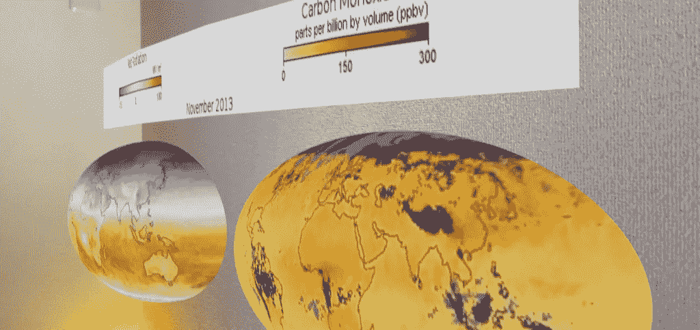
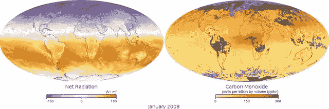
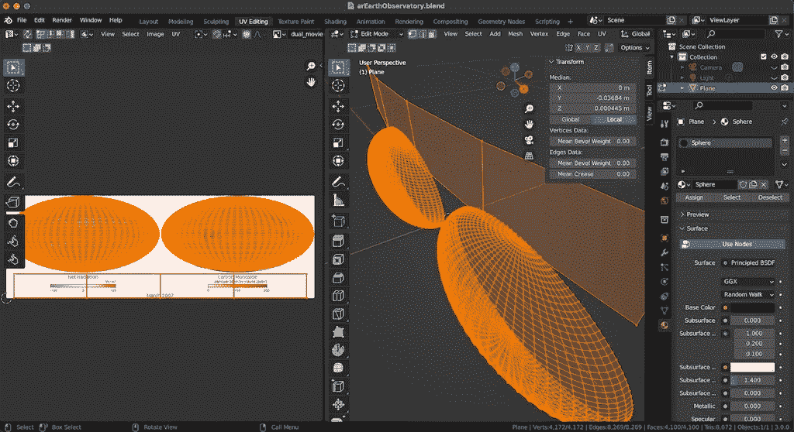
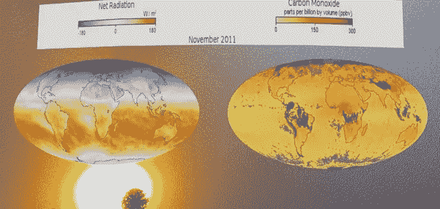
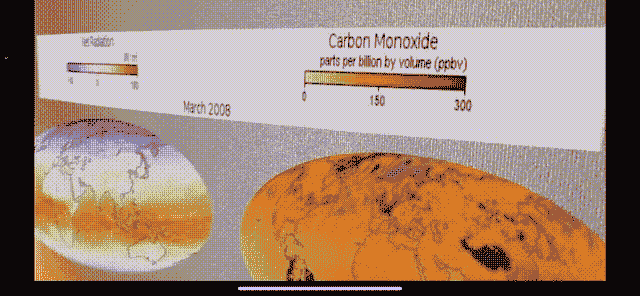
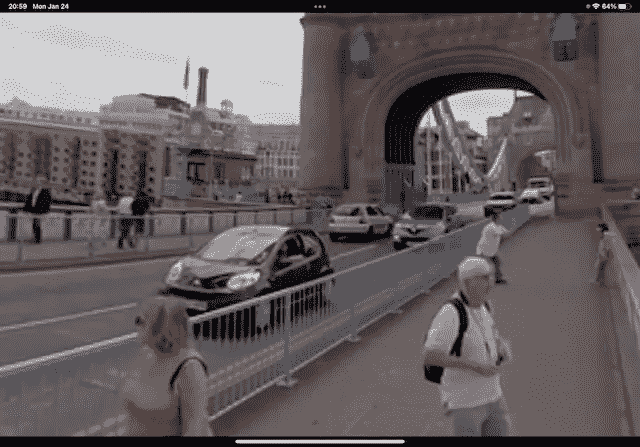
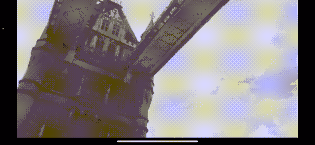

# 使用 RealityKit 的视频材料创建 iOS AR 应用程序

> 原文：<https://levelup.gitconnected.com/creating-an-ios-ar-app-using-realitykits-video-materials-978d49000aad>

在 iOS / iPadOS 设备上运行的增强现实(AR)应用程序中，使用视频图像作为虚拟对象的表面材料可以应用于将移动的场景融入到 AR 体验中，并可视化时间序列数据。使用 iOS SDK 的 ARKit 和 RealityKit，这可以通过几行 Swift 代码来实现。在本文中，我们将以 NASA 地球天文台的视频图像(基于卫星数据的全球环境变化可视化图像)为例，来看看视频在 AR 显示中的应用。

# 机制

使用 RealityKit 的 VideoMaterial 功能，可以将视频图像作为 AR 空间中虚拟对象的素材进行播放。视频材料是在 WWDC20 上推出的 RealityKit 功能。视频播放由 AVFoundation 控制。

# 创建三维模型

NASA 地球观测站允许你下载电影文件(mov 格式),它结合了几种类型的数据。这是两种数据组合的一个例子。

*   NASA 地球天文台，全球地图:[https://earthobservatory.nasa.gov/global-maps](https://earthobservatory.nasa.gov/global-maps)
*   选定数据:**净辐射**和**一氧化碳**

两个世界地图上都出现了数据变化的时间序列。日期和标签也是视频图像的一部分。为了将这些信息投射到虚拟对象上，我们为日期和标签创建了两个半球对象和一个普通对象。我们使用 DCC(数字内容创建)工具，如 Blender 来创建 3D 模型。通过编辑材质的 UV 贴图来指定视频图像中每个对象和区域之间的对应关系。将每个半球对象映射到世界地图，并将每个普通对象映射到日期/标签区域。

从 DCC 工具以 glTF 格式输出，并使用 Apple Reality Converter 转换为 USDZ 格式。

# 创建 AR iOS 应用程序

使用创建的 3D 模型和下载的视频文件创建一个提供 AR 体验的应用程序。

*   iOS 部署目标:14.0
*   Xcode 13.2

可以从 Xcode 中的*目标* - *构建阶段*选项卡- *复制捆绑资源*添加视频文件。可以通过拖放将 3D 模型 USDZ 文件添加到项目中。

AVFoundation 用于播放视频。对于无限循环播放，使用 *AVPlayerItem* 、 *AVQueuePlayer* 和 *AVPlayerLooper* ，并且必须保留一个 *AVPlayerLooper* 的实例。将 *AVQueuePlayer* 实例传递给*VideoMaterial(av player:)*来创建一个 video material。通过将这个 VideoMaterial 设置为从 USDZ 文件加载的 ModelEntity 的材质，视频将被分配给 3D 模型的材质。 *play()* 将播放 3D 模型表面素材的视频。
使用 SwiftUI 时，使用*UIViewControllerRepresentable*。

# 结论

使用 RealityKit 的视频材料，我们可以在任意形状的 3D 物体表面播放视频。要将视频图像的任意区域映射到给定的虚拟对象，请使用 3D 模型材质的 UV 贴图。同样的方法可以用来在多个不同形状的 3D 模型上播放视频。

到目前为止描述的 Xcode 项目可以在 GitHub 上获得。包括视频文件和 3D 模型文件，因此您可以立即试用。你可以尝试自己改变 NASA 数据集和 3D 模型形状。

 [## GitHub-ynagatomo/arearthhobservatory:一个最小的 iOS AR 应用程序，可以可视化…

### 一个最小的 iOS AR 应用程序，基于来自 NASA 卫星的数据可视化全球环境中的时间序列变化…

github.com](https://github.com/ynagatomo/AREarthObservatory) 

通过将视频素材应用到围绕用户的球体的内表面，用户可以在球体内部 360 度体验视频所播放的世界。GitHub 上有一个样本 Xcode 项目。这是伦敦塔桥的景色。也可以听听城市的声音。

 [## GitHub - ynagatomo/ARVideoPortal:一个最小的 iOS AR 应用程序，用于在球体空间中显示 360 /视频。

### 一个最小的 iOS AR 应用程序，可以在球体空间中显示 360 /视频。Xcode 13.2.1 目标:iOS / iPadOS 14.0+ SwiftUI，ARKit…

github.com](https://github.com/ynagatomo/ARVideoPortal) 

参考

1.  苹果 WWDC20 视频，RealityKit 中的新内容:[https://developer.apple.com/videos/play/wwdc2020/10612/](https://developer.apple.com/videos/play/wwdc2020/10612/)
2.  Apple Documentation，Struct video material:[https://developer . apple . com/Documentation/reality kit/video material](https://developer.apple.com/documentation/realitykit/videomaterial)
3.  文章- Max Cobb，RealityKit 入门:视频资料:[https://maxx frazer . medium . com/reality kit-Video Materials-66ad 05 f 396 f 4](https://maxxfrazer.medium.com/realitykit-videomaterials-66ad05f396f4)