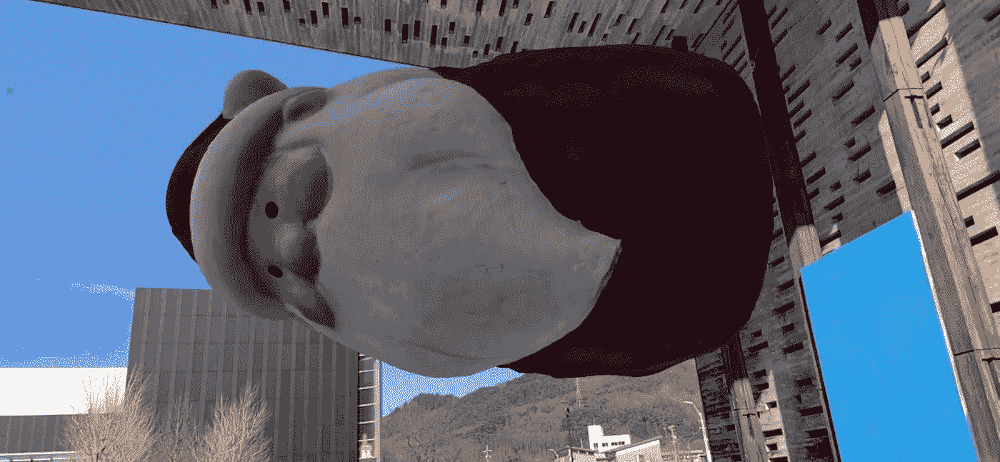
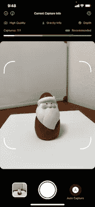
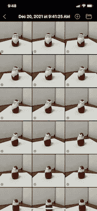
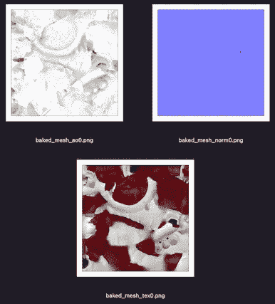
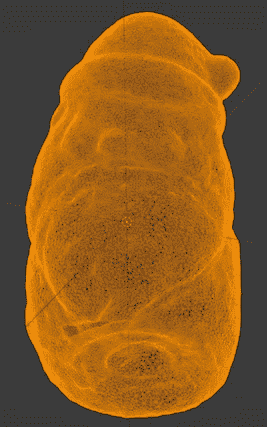
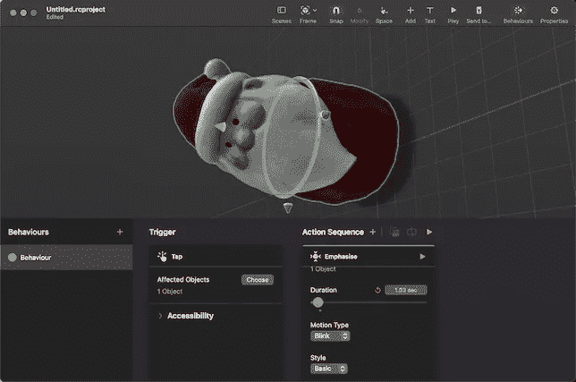
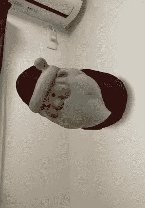
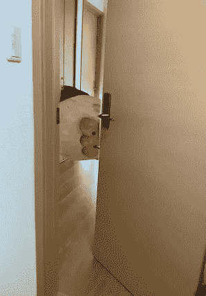
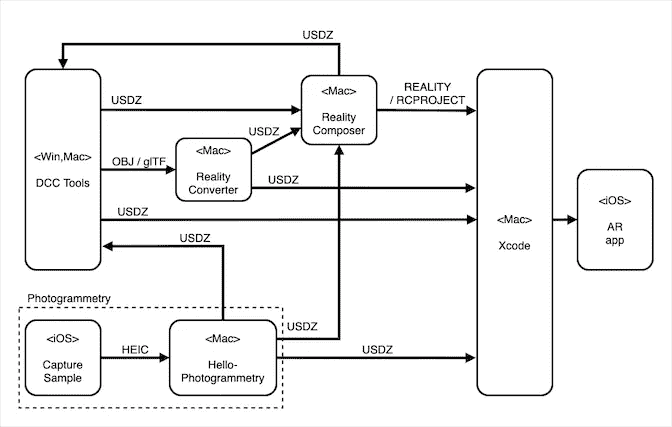

# 使用 AR 快速查看 API 创建 iOS AR 应用程序

> 原文：<https://levelup.gitconnected.com/creating-an-ios-ar-app-using-the-ar-quick-look-api-fe31aede5267>



使用 iOS/iPadOS AR Quick Look API，你可以用很少几行 Swift 代码创建一个 iOS/iPadOS 的 AR 应用。

在本文中，我将带您了解为 AR 准备 3D 数据、创建动画和交互式 AR 场景以及使用 AR Quick Look API 开发 AR 应用程序的过程。

1.  **3D 数据准备**:使用计算机视觉处理(摄影测量)从真实物体的照片生成 3D 数据。
2.  **AR 场景创建**:放置虚拟物体，通过 GUI 直观地创建具有动画和交互性的 AR 场景。
3.  **AR 应用创建**:使用 Swift 代码创建一个 AR 应用，该代码使用 AR Quick Look API。

# AR 快速查看的基础

在解释开发过程之前，我们先来回顾一下 AR Quick Look (ARQL)。
ARQL 是快速查看功能的 AR 版本，在 WWDC18 上宣布用于 iOS 12 和更高版本。它允许你从 Safari、邮件、消息、文件等在 AR 中显示 3D 虚拟模型。此外，ARQL 特性以 API 的形式提供，因此您可以在自己的应用程序中使用它们。

ARQL 的主要特点是

1.  虚拟 3D 模型可以放置在水平面、垂直面、面部或图像上，手势可用于改变位置、大小、旋转和高度(双指滑动)。
2.  支持 USDZ 和 REALITY 文件。如果它们包含动画或交互数据，它将被执行。WWDC18 上展示的 ARQL 3D 数据指南:100k 多边形，一组 2048 x 2048 PBR 纹理，10 秒动画。
3.  基于物理的渲染(PBR ),用于反映虚拟对象表面材质的真实渲染。
    支持的纹理类型:反照率、金属、粗糙、正常、环境遮挡、发射
    纹理数据根据执行设备的能力自动缩减采样。
4.  相机图像和虚拟对象以看起来自然的方式被组合和显示。
    从一开始，环境纹理和接触阴影就被用来创建一个真实的场景。在 WWDC19 上推出的 RealityKit 中添加了光线跟踪阴影、相机噪声、人物遮挡、景深和运动模糊，以使显示器更熟悉相机图像和真实场景。

ARQL 提供的高级 AR 显示功能取决于设备的功能。例如，对象遮挡仅在激光雷达设备上有效，光线跟踪阴影仅在 A12+ SoC 设备上可用。这种设备能力的确定是自动的，并且显示是针对该设备优化的。使用 ARQL API 时也是如此。您根本不需要检查设备功能，您可以将一切交给 ARQL API。

将支持 ARQL 的文件放在网页链接中并在 Safari 或 Web View 组件中显示它，或者在支持 ARQL 的标准应用程序中打开它是非常容易的。另一方面，如果您不想直接显示 3d 数据文件，或者如果 AR 只是应用程序功能的一部分，而主要功能在其他地方，您可以创建一个应用程序，并将数据文件存储在其内部包或本地文件中以保护它们。可以使用 ARQL API 用更少的代码创建 AR app。

# 1 -准备 3D 数据

第一步是准备 3D 数据。通常，3D 数据是使用用于 3DCG 的 DCC(数字内容创建)工具创建的。另一种方法是拍摄真实对象的照片，并通过计算机视觉处理(摄影测量)生成 3D 数据。苹果为 iPhone/iPad 提供了一个样本应用程序来拍照，并为 Mac 提供了一个样本命令行工具来运行摄影测量。

虽然更常见的是使用 DCC 工具来准备 3D 数据，但摄影测量允许您从手头的真实对象生成逼真的 3D 数据，因此它是一种即使您没有 3D 建模技能也可以采用的方法。使用摄影测量的方法并不容易，因为它需要大量的时间和精力来拍照和处理数据，但在重复几次过程后，你会逐渐掌握它的窍门，并能够轻松地做到这一点。

从现在开始，我们将使用 Apple 提供的摄影测量工具来准备 3D 数据。

# 1 - 1 拍摄实物照片

我们拍摄了大约 20 到 200 张真实物体的照片，并将其转换成 3D 数据。这些照片将由计算机视觉处理，以生成 3D 数据。使用苹果公司提供的 iPhone/iPad 示例应用程序拍照很方便。

*   苹果示例代码:[为 3D 物体捕捉拍照](https://developer.apple.com/documentation/realitykit/taking_pictures_for_3d_object_capture)
*   Xcode 13.0+，iOS/iPadOS 15.0+，带双后置摄像头的设备

获取示例代码(一组 Xcode 项目)并用 Xcode 构建它以创建 CaptureSample 应用程序。在兼容的 iPhone/iPad 上运行该应用程序，并连续拍摄真实物体各个方向的许多照片。使用 CaptureSample 应用程序的功能定期拍摄一系列照片非常方便。包含深度信息和相关文件的多个 HEIC 文件存储在 CaptureSample 应用程序的 Document 文件夹中。深度信息可用于生成再现实际物体的大小(尺寸)的数据。将照片存储在文件夹中的操作有点混乱，但如果您通过按文件夹屏幕上的“+”按钮创建一个新会话，您已经拍摄的照片集将会保存在文件夹中。



WWDC21 上介绍了一些如何拍摄真实物体的技巧。(CaptureSample app 的帮助画面里也有说明。)



1.  使用简单的背景。设置照明，使真实物体上没有阴影。
2.  真实的物体应该是不透明的，几乎没有表面反射。
3.  当改变其方向时，注意不要改变真实对象的形状。
4.  从各个角度拍摄大约 20 到 200 张照片，重叠部分超过 70%。

建议拍 100 张以上，效果更好。更多信息，请参考这篇文章。

*   苹果文章:[为 RealityKit 对象捕捉捕捉照片](https://developer.apple.com/documentation/realitykit/capturing_photographs_for_realitykit_object_capture)

由于摄影测量过程是在 Mac 上执行的，请使用“文件”应用程序通过隔空投送或 iCloud 将存储的文件夹拷贝到 Mac 上。

# 1 - 2 利用摄影测量生成 3D 数据

摄影测量是从 2D 图像生成 3D 数据的计算机视觉过程。虽然有专门用于这个目的的软件，但 RealityKit - Object Capture API 从 macOS 12 开始就有了，苹果也提供了样本代码，所以你可以很容易地在你的 Mac 上运行它。

*   苹果示例代码:[创建摄影测量命令行应用](https://developer.apple.com/documentation/realitykit/creating_a_photogrammetry_command-line_app)
*   macOS 12.0+，Xcode 13.0+，全 Apple Silicon Mac 或 AMD GPU(4MB)和 16MB RAM Intel Mac

如果你得到样本代码(一组 Xcode 项目)并用 Xcode 构建，你会有一个命令行工具叫做 HelloPhotogrammetry。将它复制到您的工作文件夹中，使用起来很简单。在工作文件夹中，放入您拍摄的照片所在的文件夹。当您运行命令行工具时，它将以 USDZ 格式输出 3D 数据。

在运行时，指定以下参数:
(照片文件夹)、输出文件名(要输出的 USDZ 文件的名称)、细节(细节级别)、样本排序(照片在空间上是否连续)和特征敏感度(目标的特征敏感度)。

```
% ./**HelloPhotogrammetry** -h
OVERVIEW: Reconstructs 3D USDZ model from a folder of images. USAGE: hello-photogrammetry <input-folder> <output-filename> [--detail <detail>] [--sample-ordering <sample-ordering>] [--feature-sensitivity <feature-sensitivity>] ARGUMENTS:
   <input-folder>          The local input file folder of images.
   <output-filename>       Full path to the USDZ output file. OPTIONS:
   -d, --detail <detail>
       detail {preview, reduced, medium, full, raw}  Detail of
       output model in terms of mesh size and texture size . 
       (default: nil)
   -o, --sample-ordering <sample-ordering>
       sampleOrdering {unordered, sequential} Setting to sequential
       may speed up computation if images are captured in a
       spatially sequential pattern.
   -f, --feature-sensitivity <feature-sensitivity>
       featureSensitivity {normal, high}  Set to high if the scanned
       object does not contain a lot of discernible structures,
       edges or textures.
   -h, --help              Show help information.
```

detail 参数指定要生成的 3D 模型数据的详细程度。详细程度越高，再现性越好，但数据量也越大。完整和原始参数用于需要高质量数据(五种纹理或原始数据)的专业工作流程。对于 ARQL，使用简化或中等。几何网格和纹理(漫射、法线、环境遮挡- AO)以 USDZ 格式输出，大小适合移动应用程序。Reduced 被认为是 web 分发的最佳选择，因为它的数据量较小。中等被认为是复杂对象和应用程序的最佳选择。

如果拍摄的照片在空间上是连续的，添加“-o sequential”将会加快这个过程。如果工具运行结束后没有输出 USDZ 文件，添加或删除`-o sequential '可能会成功。

生成的 USDZ 文件可以在 macOS 上的 Quick Look 中轻松查看。如果质量不够好，例如形状(网格)断裂或纹理不连续，可能会通过增加照片数量或重叠区域来改善。

使用 CaptureSample 应用程序(166 张照片)拍摄了一个圣诞老人装饰品(11 x 7 x 7 cm ),并使用 HelloPhotogrammetry 工具进行了处理，结果预览版的 USDZ 文件大小为 2MB，缩小版为 9.4MB，中版为 28MB。

中等水平的执行示例:

```
% ./HelloPhotogrammetry SantaImages santa_m.usdz -d medium
 -o sequential
```



由 medium 生成的 USDZ 纹理(漫射、正常、AO)的分辨率均为 4096 x 4096 [px]。Reduced 的分辨率为 2048 x 2048 [px]，符合 ARQL 准则。

使用 DCC tool - Blender 3.0 检查网格数，介质的网格为顶点:约 25，000，面:约 50，000。简化的网格是顶点:大约 12，000，面:大约 24，000。

既然我们已经使用摄影测量学准备了 3D 数据，我们将使用 medium 生成的 USDZ 文件来创建 AR 场景。

# 2 -创建一个 AR 场景

虽然您可以简单地使用 ARQL API 在 AR 中显示 USDZ 文件，但您可以使用 Reality Composer 来合成具有多个 USDZ 文件的场景，并指定虚拟对象相对于现实世界的排列方式(平面、垂直等)。).Reality Composer 是在 WWDC19 上与 RealityKit 一起推出的开发工具，可用于 macOS 和 iPadOS。常见的是先在 Mac 上创建一个场景，然后在 iPad 上检查和修改 AR 显示。

Reality Composer 将 AR 场景输出为 Reality 或 rcproject 文件。ARQL 可以打开现实文件进行 AR 展示，所以可以像 USDZ 一样作为交换格式。reality 文件针对 RealityKit 进行了优化，因此文件较小，性能优于 USDZ。在 WWDC20 上，随着从 Reality Composer 导出 USDZ 文件的功能的发布，还可以将 Reality Composer 中创建的内容返回到 DCC 工具，以调整工作流程中的 3D 数据。将在 Reality Composer 中创建的 AR 场景引入 Xcode 时，使用标准的 Reality Composer rcproject 文件格式会更有效。

在使用 ARQL API 的 AR 应用程序中，应用程序将简单地播放和执行在 Reality Composer 中创建的 AR 场景。没有其他编程控制。换句话说，AR 应用程序显示的 AR 场景和交互性都是在 Reality Composer 中创建的，并作为文件嵌入到应用程序中。正因为如此，AR app 程序会非常简单，独立于 AR 场景。

Reality Composer 功能丰富，足以创建具有复杂行为的 AR 场景，但使用起来也足够直观。使用拖放放置虚拟对象，使用 GUI 设计动画和交互等行为。有关如何使用它的详细信息，请查看 WWDC19 上的 Reality Composer 介绍视频。

*   WWDC19 视频:[使用 Reality Composer 构建 AR 体验](https://developer.apple.com/videos/play/wwdc2019/609/)

我们将使用之前准备的圣诞老人的 USDZ 文件创建一个 AR 场景。从 Xcode 中的菜单“打开开发者工具> Reality Composer”启动 Reality Composer。(添加到 Dock，下次启动会更方便。)在“选择锚点”对话框中，选择您希望虚拟对象与现实世界中的哪个位置相关联。按照这个规范，ARQL 会显示 AR。在这种情况下，我们选择“垂直”将圣诞老人放置在垂直表面上，如墙壁。

接下来，将我们之前准备好的圣诞老人的 USDZ 文件(中等大小的文件)拖放到屏幕中央。这将把 USDZ 加载到 Reality Composer 中。旋转圣诞老人来调整他的脸的方向。圣诞老人是一个小的扫描雕像，因此要使它比 AR 显示的默认大小稍大一点，请选择圣诞老人，按属性按钮，并将变换-缩放属性设置为 600 %以将其放大 6 倍。使用箭头移动圣诞老人，使他与原点对齐。

下一步是给圣诞老人添加交互性，当他被点击时，它会以一个简单的动画来响应。单击顶部的行为按钮，打开行为编辑区域。按“+”按钮添加点击和翻转行为。这将设定轻按对象时的行为。(还有各种其他行为可用，如声音播放、定时调整等。)选择触发器面板，点击 Santa，按 Done，将 Santa 设置为 Tap 触发器的目标。接下来，选择动作序列面板，单击 Santa，然后按 Done 将 Santa 设置为动作序列的目标。可以在面板中设置运动模式和时间。在本例中，我们将运动类型更改为眨眼。按下面板右上角的播放按钮，观看动作。如果您按下屏幕顶部的播放按钮，您可以看到从轻敲到动作的动作。点击圣诞老人确认闪烁动画正在播放。



你也可以将在 Mac 上创建的场景发送到 iPad 上，以查看 AR 显示。在 iPad 上安装并启动 Reality Composer，然后在 Mac 上按 Reality Composer 顶部的“发送到…”按钮，将场景数据发送到 iPad 上的 Reality Composer。按下 iPad 上 Reality Composer 上的 AR 按钮，查看 AR 显示。iPad 上 Reality Composer 中的 AR 显示在某些方面可能与 ARQL 显示不匹配，例如对象遮挡不起作用，但它对于检查场景构图很有用。

AR 场景完成后，从 Reality Composer 的“文件”>“保存”…“菜单中将其保存为 santaScene.rcproject。您也可以将场景导出为 USDZ 或 Reality 文件格式，但我们将使用标准的 rcproject 格式将其导入 Xcode。

我们已经使用圣诞老人的 USDZ 数据创建了一个简单的 AR 场景作为示例，但 Reality Composer 的直观 GUI 使其易于理解。你可以创建复杂的动画和交互性，所以我认为看苹果的视频并一点一点习惯它是一个好主意。

# 3 -创建 AR 应用程序

我们将创建一个使用 ARQL API 来显示 AR 的应用程序。它加载并显示与应用程序捆绑在一起的 Reality 或 USDZ 文件。在现实文件中，AR 场景根据放置(水平面、垂直面等)进行显示和回放。)和行为设置。没有放置规范的 USDZ 文件被视为水平面放置，如果 USDZ 文件有动画，它将被播放。

ARQL API 用于显示 AR 场景，并封装了 ARKit / RealityKit 的最新功能，使其易于使用。设备优化功能无需对运行设备的功能进行任何检查(人物遮挡、对象遮挡、光线跟踪阴影等)。).甚至不需要在 Info.plist 中添加密钥来访问摄像机。

另一方面，没有办法在外部配置功能或以编程方式控制行为，AR 场景回放完全交给 ARQL API。因此，作为 AR 应用程序的 AR 体验的丰富性取决于您使用 Reality Composer 创建的 AR 场景。如果要做复杂的编程控制，可以使用 ARKit/reality kit API 而不是 ARQL APIs 完全自己控制，当然这需要复杂的 Swift 代码。

要创建使用 ARQL API 的 AR 应用程序，首先使用 iOS - App 模板创建一个 Xcode 项目。ARQL API 基于 UIKit，所以项目接口可以是 UIKit 或者 SwiftUI。用于配置 ARQL 行为的 ARQuickLookPreviewItem 类与 iOS / iPadOS 13.0+兼容。我们将在这里使用 iOS 14 目标。

*   Xcode 13.2.1
*   iOS 部署目标:14.0

首先，通过将我们之前在 Reality Composer 中创建的 rcproject 文件拖放到项目中来添加它，并选中“如果需要，复制项目”来复制它。rcproject 文件将在构建时转换为现实文件，并捆绑到应用程序中，因此 Swift 代码会将其视为同名的现实文件。

接下来就是写 Swift 代码了，非常简单。这个代码不依赖于 AR 场景文件，所以一旦你创建了它，你就可以在你的 AR 应用中使用它来实现各种 AR 场景。ARQLViewController 类是符合 QLPreviewControllerDataSource 协议的 UIViewController。为了清楚起见，可变部分总结在前四个 let 语句中。

1.  **assetName** : rcproject，USDZ，文件的真实名称
2.  **资产类型** : usdz 或 reality(文件的类型)(rcproject 也应该是 reality)
3.  **allowscontscaling**:如果设置为 false，手势缩放被禁用。
4.  **canonicalWebPageURL** :指定 Share Sheet 要共享的网址。nil 表示 AR 场景文件将被共享。

ARQL 有一个内置的共享特性。点击分享按钮，就可以把 AR 场景文件(USDZ 或者现实文件)给对方了。如果将 canonicalWebPageURL 设置为 Web URL，将会共享该 URL，而不是 AR 场景文件。如果不想分享 AR 场景文件，可以设置相关网址。如果要共享 AR 场景文件，就设置为 nil。

要从 SwiftUI 中使用它，请用 UIViewControllerRepsentable 包装它，使它成为 SwiftUI 视图。



在 Simulator 和 SwiftUI preview 中，您可以构建和运行应用程序，但它显示“不支持的文件格式”,并且不显示 3D 场景。应该在真实设备上检查 3D 场景。

当在真实设备上运行时，由于物体遮挡，圣诞老人将贴在墙上并透过门偷看(在配备激光雷达的设备的情况下)。当点击圣诞老人时，该行为会播放一个幽默的动画。

# 结论

最初，3D 数据创建是一个高度专业化的领域，需要专用的 DCC 工具。在 WWDC21 上发布的对象捕获 API (macOS)使使用摄影测量创建 3D 数据变得更加容易，当与 Reality Composer 结合使用时，您可以使用 GUI 直观地创建 3D 场景，然后使用使用 ARQL API 的简单 AR 应用程序分发和播放 AR 场景。app 代码很简单，但是 AR 表现力是自动配置的，可以通过最新的 ARKit / RealityKit 最大限度地发挥设备的能力。

在 WWDC21 的一个会议上，介绍了使用对象捕捉、Reality Composer 和 AR Quick Look API 的组合来开发 AR 应用程序的框架。如果你喜欢，可以看看 WWDC 的视频。

*   WWDC21 视频: [AR 快看，遇见物体捕捉](https://developer.apple.com/videos/play/wwdc2021/10078/)

本文描述的 Swift 代码和 rcproject 可以在 GitHub 上获得。

*   GitHub: [ARQL 圣诞老人](https://github.com/ynagatomo/ARQLSanta)

最后，这里是本文中描述的生产流程图。文章中没有提到 Reality Converter，但它是苹果公司的一个转换 3D 文件的工具。它的测试版可以从苹果开发者网站获得。



参考:

1.  苹果文章:[用 AR Quick Look 预览模型](https://developer.apple.com/documentation/arkit/previewing_a_model_with_ar_quick_look)
2.  苹果文章:[在 AR Quick Look 和 RealityKit 中添加视觉效果](https://developer.apple.com/documentation/arkit/adding_visual_effects_in_ar_quick_look_and_realitykit)