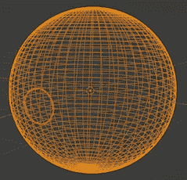

# 使用遮挡材质创建 iOS AR 门户应用程序

> 原文：<https://levelup.gitconnected.com/creating-an-ios-ar-portal-app-using-occlusion-materials-782ee0c58b65>

AR Portal 应用程序使用增强现实(AR)来提供通过门户进入特殊空间(内部空间)的体验，使用 iOS SDK 的 ARKit 和 RealityKit 只需几行代码即可实现。

# 机制

内部空间由一个大盒子或球体包围，世界的风景粘贴在它的内表面。进入内部空间，外部摄像头图像被遮挡，给人一种身临其境的感觉。RealityKit 的遮挡材料可以让内部空间对外界不可见。

# 创造一个内部空间

可以自由地创建内部空间中的虚拟对象。在本文中，我们将创建一个半径为 1.5 米的球体，并使用 DCC(数字内容创建)工具(如 Blender)在其内表面粘贴 HDRI 纹理。

将您的 3D 模型加载到 Reality Composer 中，您可以使用其行为功能来创建交互，如当用户进入内部空间时播放音乐或显示文本。我们将保持简单，只需将内部空间的位置设置到适当的位置。由于内部空间被半径为 1.5m 的球体所包围，因此将球体的中心设置为(0.0，1.5，0.0)，并保存 rcproject 文件。

# 创建 AR 应用程序

创建一个 AR 门户应用程序。
- iOS 部署目标:iOS 14.0
- Xcode 13.2
内部空间从 rcproject 文件加载并显示。隐藏内部空间的框(称为遮挡框)是以编程方式创建的，其材质设置为 OcclusionMaterial。这使得遮挡框及其内部的虚拟对象从外部不可见。

如果将遮挡框的位置调整为与内部空间相交，该区域将看起来像一个剪开的门，您将能够从内部看到外部。
遮挡框外的虚拟对象是可见的，所以代表门户入口的对象被放置在遮挡框外。

在本例中，ARView 包装了一个 UIViewRepresentable，以便与 SwiftUI 一起使用。 *innerSpaceSize* 设置内部空间的大小。 *innerSpaceMargin* 用于计算遮挡框的大小。*内部空间遮挡*用于在 z 方向移动遮挡框，使其一部分与内部空间相交，形成一扇门。0.0 表示没有门。

# 结论

RealityKit 的遮挡材质可以让你将自己的虚拟空间隐藏在外部 AR 空间之外。如果你进入虚拟空间，你就能看到它。这可以用 ARKit 和 RealityKit SDK 中较少的代码行实现。

本文中描述的 Swift 代码可以在 GitHub 上获得，并且包括 rcproject 样本(白天、室内和夜间)，因此您可以立即试用。

-GitHub:[ARSimplePortal](https://github.com/ynagatomo/ARSimplePortal)

您可以通过创建内部空间和替换 rcproject 来创建自己的 AR 门户应用程序，还可以使用 Reality Composer 添加动画和声音。

