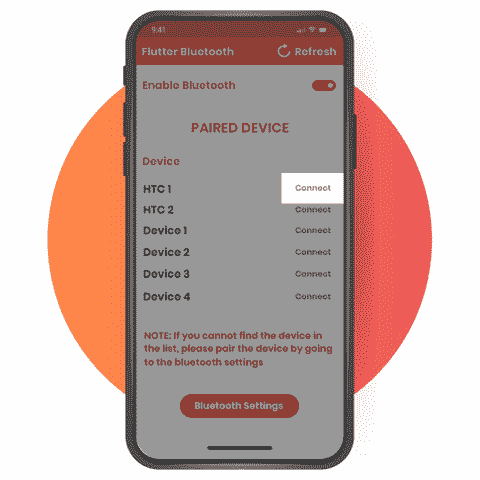
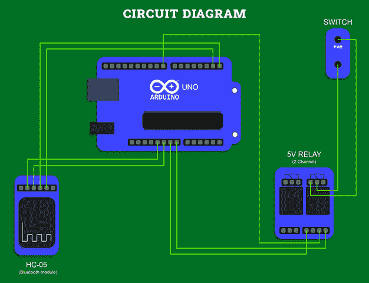

# 使用 Flutter Compatible 创建基于物联网的应用程序，与智能设备进行交互

> 原文：<https://levelup.gitconnected.com/creating-an-iot-based-app-using-flutter-compatible-to-interact-with-smart-devices-df1383ba5a5d>

用智能手机远程控制任何电器设备，而无需靠近智能设备，这是否已经成为你的新游戏？什么事？

> 那叫物联网的神奇触感！

从使用 Google home 到亚马逊 Alexa，许多设备都可以让你在具有蓝牙兼容性的应用程序的帮助下，使用移动设备控制家中的任何电气设备。

谈到物联网，毫无疑问，智能技术正在进入每个企业和消费者领域。从医疗保健到零售，从金融到物流，物联网(IoT)迅速重塑了世界，并为许多商机无限的企业打开了大门。

由于物联网和智能设备已经在提高大多数工作场所的性能指标，预计基于物联网的设备将产生[3440 亿美元的收入](https://www.bbvaopenmind.com/en/technology/digital-world/ten-trends-of-internet-of-things-2020/)并推动 1770 亿美元的成本降低。

物联网将迎来高度的定制化、自动化和无缝连接。说 IoT 迅速成为移动 app 开发公司中的下一件大事不会错。

别把我们的话当真！以下是关于技术创新将如何显著影响不同垂直行业的用户和企业的市场见解。

## **物联网关键统计**

*   据统计，[每秒有 127 个新的物联网设备](https://www.mckinsey.com/industries/semiconductors/our-insights/whats-new-with-the-internet-of-things)连接到互联网，并预测到 2021 年底将有[250 亿个设备](https://www.gartner.com/en/newsroom/press-releases/2018-11-07-gartner-identifies-top-10-strategic-iot-technologies-and-trends)连接到互联网。
*   超过 40%的物联网设备将用于制造业，物联网的一个重要市场是智能家居设备，预计其价值将从 2020 年的 409 亿美元增长到 2022 年的 534.5 亿美元。
*   由于物联网市场巨大，到 2025 年，它可以产生 4 万亿到 11 万亿美元的收入。
*   根据研究，超过 80%的工业制造公司正在使用或计划使用物联网设备。
*   到 2023 年， [70%的汽车](https://www.ibtimes.com/look-investment-self-driving-cars-who-has-spent-most-2848289)将连接到互联网，因为很久以来，仅汽车行业就在自动驾驶汽车的研发上投资了超过 1000 亿美元。

有了这些事实和统计数据，可以有把握地说，物联网应用给现代企业带来了革命性的变化。但是，你们中的许多人仍然想知道物联网是如何从理论概念稳步发展成为许多组织的优先事项的。

但是，在继续讨论之前，我们先来看看通过领先技术可以轻松解决的几个业务挑战:

*   ***设备管理，*监控**
*   ***整合与维护***
*   ***安全的数据存储和访问***

任何物联网移动应用开发公司都可以通过简单地使用物联网定制移动解决方案来帮助公司应对最常见的挑战。

在开发任何产品或推出任何新兴技术的移动应用程序时，许多 [**应用程序开发公司**](https://www.xicom.biz/services/mobile-app-development/) 需要做出大量的工程选择。对于其中的一些，你必须抓住机会，希望它能发挥最大作用。

Flutter 是领先的软件开发工具包(SDK)之一，集成了大量的库和小部件选择。它给了你所有的理由来开发一个基于使用 Flutter 兼容所有智能设备的物联网。

令人高兴的是，它完美地完成了。事实上，在这个阶段，我会说 Flutter 是为物联网设备构建配套应用的完美工具。

但是这并不像你想象的那么简单，有一些潜在的陷阱会让整个应用程序开发过程面临风险。无论你是自费还是预算最低，我们都已经制定了一个教程，来帮助你使用 Flutter 开发一个基于物联网的应用程序，该应用程序可以兼容各种智能设备。

# **扑:到底是什么？**

如果你没有听说过，Flutter 是一个用于开发跨平台应用程序的框架，可以在多个平台上完美运行。它的主要目标是 Android 和 iOS 平台，尽管它也支持一些网络和桌面应用程序。所以当 [**雇佣应用开发者**](https://www.xicom.biz/solutions/hire-developers/) 的时候，你只需要创建一个代码库就可以开发多个应用。

尽管很年轻，但它经常被与 React Native 相比较，但有各种关键差异使 Flutter 在人群中脱颖而出。

Flutter 应用程序是用 Dart 编程语言编写的，编译成本机代码，确保用户拥有漂亮的 UI 体验。除此之外，Flutter 还使用了它的图形渲染引擎。因此，所有 UI 小部件都是由 Flutter 而不是本机小部件呈现的。

通常，当使用任何框架开发一个应用程序时，交付物需要完全不同的技能。当涉及到使用任何最新技术开发您的物联网产品时，您要么寻找大量资金来雇佣应用程序开发人员，要么需要有一家由身兼数职的熟练开发人员支持的软件开发公司。然而，为了克服这两个挑战，Flutter 脱颖而出，让事情变得更容易。

尤其是如果你有 Java、C 或 JavaScript 背景，拥有一个与工具和小部件很好集成的框架，可以快速启动、构建和运行一个项目。

# **使用 Flutter 构建物联网应用**

在直接进入教程之前，有必要了解您的应用程序到底需要什么，以及如何使它与电子设备兼容。

所以无论你是否曾经尝试过将 Google Home 或 Alexa 这样的智能设备设置到你的家中，或者试图给任何普通的电视赋予物联网的神奇触感，那么你都需要知道使它成为物联网伴侣应用程序的一般要求。

> ***要用手机 app 连接任何电器设备，需要连接到附近的设备，与之配对，并进行配置。这可以通过 Wi-Fi 网络或蓝牙连接来实现。***

因此，我们的博客在这方面没有太大的不同。这篇文章将涵盖以下几件事:

> **在 Flutter 应用中配对和设置蓝牙，以便与物联网设备进行更顺畅的通信**
> 
> **-** 了解基本结构
> -启用蓝牙连接并检索配对连接
> -集成蓝牙和连接设备的 UI
> -配对和断开设备与蓝牙的连接
> -连接和断开设备与蓝牙的连接
> -连接和断开按钮的 UI
> 
> **将各种模块连接到 Ardunio**
> 
> **设置 Arduino**

> 让我们直接进入教程，了解如何开发与 Flutter 集成的物联网应用程序:

## **步骤 1: *在 Flutter App 中配对并设置蓝牙，以便与物联网设备进行更流畅的通信***

当谈到在基于物联网的应用程序中集成蓝牙时，只需记住 Flutter 没有蓝牙内置支持。所以要做到这一点，你需要寻找第三方蓝牙插件。当与第三方蓝牙 API 交互时，有许多事情需要注意，正确处理这些 API 很重要。

大多数人选择 flutter_blue，但很快就会遇到一些难以重现的问题。所以 [**flutter app 开发公司**](https://www.xicom.biz/services/flutter-app-development/) 通常会使用一个名为 [Flutter_Bluetooth_serial 的插件。](https://pub.dev/packages/flutter_bluetooth_serial)由于它为您提供了广泛的功能选择，并确保您在与其他设备通信时更好地控制蓝牙连接，因此该插件通常用于蓝牙集成。

[图像来源](https://pub.dev/packages/flutter_bluetooth_serial)

> 现在的问题是如何让它在现实中发挥作用？

*   **了解基础知识**

用 Flutter 发布一个产品总是相对不那么复杂，但是你仍然需要知道它在实践中是如何被处理的。无论您是自己做还是选择 [**雇佣移动应用程序开发人员**](https://www.xicom.biz/offerings/hire-mobile-developers/) ，您都需要在删除所有 Flutter 演示计数器应用程序代码后，将以下内容添加到 main.dart 文件中。

为了开始了解基本结构，您需要为 BluetoothApp 类使用 StatefulWidget，因为您需要在应用程序生命周期的不同时间演化状态。

*   **启用蓝牙连接并检索配对连接**

在删除了所有演示代码并集成了蓝牙类之后，现在您已经有了一个基本的结构，您需要将注意力集中在启用用户设备的蓝牙连接并检索连接设备上。要做到这一点，您需要初始化一些变量，以便在构建应用程序时添加更多的类。

为了启用蓝牙和检索设备，首先，您需要使用 initState()来获取当前的蓝牙状态，它决定并指示蓝牙是打开还是关闭。如果它没有打开，它会向用户发送请求，要求提供蓝牙权限，以便在他们的设备上启用蓝牙。

> 一旦你启用了蓝牙，现在你必须使用这些插件定义两个主要功能:

*   enableBluetooth()用于从用户处获取蓝牙访问权限。
*   getPairedDevices()用于检索配对设备列表。

为了进一步避免任何内存泄漏的风险，有必要定义 dispose()方法来确保连接被关闭并且资源得到保护。

*   **启用蓝牙和配对设备的用户界面**

现在您有了一个应用程序结构，它需要一种方法来将正确的蓝牙连接与设备集成在一起。所以现在你必须设计一些 UI 部件来帮助你定制它。

要开始使用它，您需要添加一个开关小部件，可以操作它来打开/关闭蓝牙连接。开关将根据蓝牙连接是启用还是禁用在开/关之间切换。不管蓝牙是开还是关，getPairedDevices()方法通常用于刷新设备列表。此外，对于配对设备，应用程序开发公司可以使用 DropdownButton 小部件并显示配对设备列表。

*   **连接和断开设备与蓝牙的连接**

要将您的功能变成一个实用的选项，您需要处理相同的 UI，并使其在现实中发挥作用。所以说到应用的核心，设计连接和断开蓝牙设备的 UI。

对于连接，您需要从列表中选择设备并尝试建立连接。您的列表将轻松跟踪设备以建立连接。对于这个 onDone()方法将在从连接中调用 dispose()、finish()或 close()方法时被触发。

您需要在连接的设备上调用 close()方法来断开设备与蓝牙的连接。

*   **连接和断开按钮界面**

在应用程序上找到连接/断开按钮是很普遍的。但是如何将它与正确的编码集成在一起呢？

因此，如果你选择 [**雇佣应用程序开发人员**](https://www.xicom.biz/solutions/hire-developers/) 或者尝试自己集成，这很可能是你添加连接/断开按钮时需要遵循的代码结构。

## **步骤 2: *将各种模块连接到 Ardunio***

到目前为止，您已经构建了用蓝牙连接设备的结构。现在你需要明白如何配对。对于开发人员来说，这可能是一项有点复杂和耗时的任务。所以你可以跳过学习它，选择 [**雇佣软件开发人员**](https://www.xicom.biz/offerings/hire-software-developers/) 来帮助你无缝地完成这个过程。

> **在这两种情况下，开发控制设备都需要一些硬件组件:**

*   Arduino UNO 第 3 版
*   跳线
*   一些电线
*   HC-05 蓝牙收发器模块
*   转换

## **第三步:设置 Arduino**

*   *现在是最后一步，学习如何将其配置到您的应用中！*

要将代码上传到 Arduino Uno 设备，您可以使用 Arduino Web 编辑器。但是在你开始编写和上传代码之前，你需要在你的系统上安装一个插件，帮助你从网络编辑器中检测和连接到 Arduino 设备。

一旦你在你的设备上安装了插件，点击进入网页编辑器开始编写 Arduino 设备的代码，然后点击上传按钮。

*好消息！最后，你成功了，完成了这个漫长的项目！*

# **结论**

物联网已经席卷全球。如果你计划使用 Flutter 开发一个兼容所有电子设备的基于物联网的应用程序，本教程将有望帮助你创建它。

如果您有任何疑问或发现它很难理解，请休息。然后你可以雇佣一个 [**的应用开发公司**](https://www.xicom.biz/services/mobile-app-development/) ，由一个有足够能力向你提出更好的解决方案和建议的熟练的开发团队。