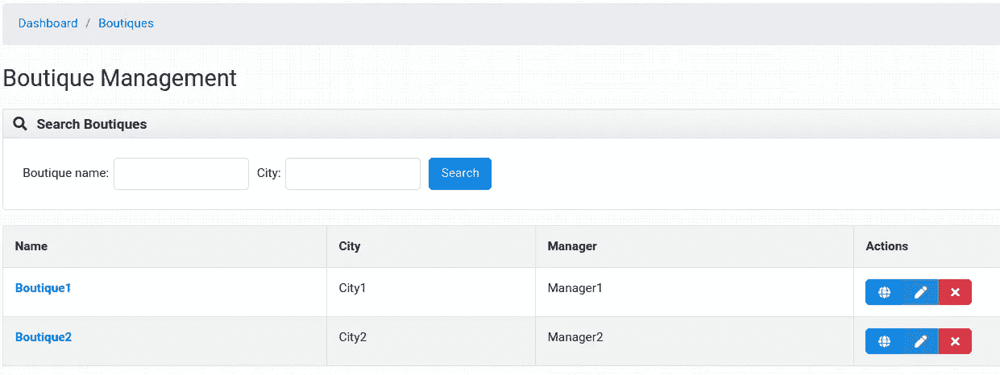
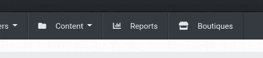

# 用 Dashboard 创建 Django-Oscar 应用程序(第 2 部分)

> 原文：<https://levelup.gitconnected.com/creating-an-oscar-app-with-dashboard-part-2-6283dd24304>

在本教程中，您将学习如何为 *Oscar 的*电子商务框架创建仪表板。本教程从第一部分 结束的地方开始。

# 创建 Django-Oscar 仪表板应用程序来管理精品店

让我们在精品应用程序目录中创建一个名为 dashboard 的新应用程序:

```
mkdir boutique/dashboard
```

然后使用以下命令初始化一个新的 Django 应用程序:

```
python manage.py startapp dashboard boutique/dashboard
```

> *可以删除* `*admin.py*` *、* `*models.py*` *、* `*tests.py*` *，因为奥斯卡的仪表盘 app 不需要这些。*

同样，在创建仪表板应用程序后，需要在`settings.py`的`INSTALLED_APPS`中注册应用程序，如下所示:

```
INSTALLED_APPS = [
    ...
    'boutique.dashboard.apps.DashboardConfig',
]
```

> *如果您此时运行服务器，它将无法工作，因为您需要首先完成应用程序配置。*

在第一部分中，我们在`myoscarproject/urls.py`中有一个注释掉的行。既然已经创建了仪表板应用程序，我们需要取消对它的注释，如下所示:

```
from django.apps import apps
from django.urls import include, path
from django.contrib import adminurlpatterns = [
    ...
    path('dashboard/boutique/', apps.get_app_config('boutique_dashboard').urls),
    ...
]
```

然而，此时标签`boutique_dashboard`不与任何配置相关联。因此，让我们继续，创建精品仪表板 Oscar 应用程序配置。

# 精品店仪表板的应用程序配置

精品仪表板应用程序的配置类似于本教程第一部分的配置。如下所示，添加了一些内容:

```
from django.urls import path
from oscar.core.application import OscarDashboardConfig
from oscar.core.loading import get_classclass DashboardConfig(OscarDashboardConfig):
    name = 'boutique.dashboard'
    label = 'boutique_dashboard'
    namespace = 'boutique-dashboard' default_permissions = ['is_staff'] def ready(self):
        self.boutique_list_view = get_class(
            'boutique.dashboard.views', 'DashboardBoutiqueListView')
        self.boutique_create_view = get_class(
            'boutique.dashboard.views', 'DashboardBoutiqueCreateView')
        self.boutique_update_view = get_class(
            'boutique.dashboard.views', 'DashboardBoutiqueUpdateView')
        self.boutique_delete_view = get_class(
            'boutique.dashboard.views', 'DashboardBoutiqueDeleteView') def get_urls(self):
        urls = [
            path('', self.boutique_list_view.as_view(), name='boutique-list'),
            path('create/', self.boutique_create_view.as_view(),
                 name='boutique-create'),
            path('update/<int:pk>/', self.boutique_update_view.as_view(),
                 name='boutique-update'),
            path('delete/<int:pk>/', self.boutique_delete_view.as_view(),
                 name='boutique-delete'),
        ]
        return self.post_process_urls(urls)
```

该配置中的一个要点是改变`label`参数。Django Oscar 的默认仪表盘应用与精品仪表盘应用`DashboardConfig`冲突。Django 文件表明:

> *“appconfig . label 默认为* `*name*` *的最后一个组件。”*

因此，需要选择不同的标签`boutique_dashboard`，以便“告诉”Django 这个 dashboard 应用不同于 Oscar 内置的 dashboard 应用。

仪表板应用程序配置与主要精品应用程序配置的另一个区别是`default_permissions`参数。此参数为此仪表板应用程序设置 Oscar 的仪表板权限。由于 Oscar 有多个用户权限级别，如有*履行伙伴*的用户权限级别，设置此参数`is_staff`将禁止除 c 用户(如超级用户)之外的任何用户访问此仪表板。

# 精品店仪表板应用程序的表单

首先，有必要为您的自定义仪表板应用程序创建表单。在`boutique/dashboard`目录下创建一个`forms.py`文件，并添加以下代码:

```
from django import forms
from django.db.models import Q
from django.utils.translation import gettext_lazy as _
from oscar.core.loading import get_modelBoutique = get_model('boutique', 'Boutique')class DashboardBoutiqueSearchForm(forms.Form):
    name = forms.CharField(label=_('Boutique name'), required=False)
    city = forms.CharField(label=_('City'), required=False) def is_empty(self):
        d = getattr(self, 'cleaned_data', {})
        def empty(key): return not d.get(key, None)
        return empty('name') and empty('city') def apply_city_filter(self, qs, value):
        words = value.replace(',', ' ').split()
        q = [Q(city__icontains=word) for word in words]
        return qs.filter(*q) def apply_name_filter(self, qs, value):
        return qs.filter(name__icontains=value) def apply_filters(self, qs):
        for key, value in self.cleaned_data.items():
            if value:
                qs = getattr(self, 'apply_%s_filter' % key)(qs, value)
        return qs class DashboardBoutiqueCreateUpdateForm(forms.ModelForm):
    class Meta:
        model = Boutique
        fields = ('name', 'manager', 'city')
```

在上面的代码中`DashboardBoutiqueSearchForm`是一个过滤仪表板中精品实例的表单。我们设计我们的表单，以便它可以通过模型的`city`和`name`字段进行过滤。表单`DashboardBoutiqueCreateUpdateForm`是创建或编辑精品实例所需的创建和更新表单。这个表单继承了 Django 的默认`forms.ModelForm`，所以让它工作起来相对简单。

# 精品店仪表板应用程序的视图

部署自定义 Oscar 控制面板需要四种不同的视图。这些是:

*   查看精品实例列表`DashboardBoutiqueListView`
*   查看创建新的精品实例`DashboardBoutiqueCreateView`
*   查看更新/编辑精品实例`DashboardBoutiqueUpdateView`
*   查看删除精品实例`DashboardBoutiqueDeleteView`

在进入视图之前，将以下代码添加到精品店仪表板应用程序的文件`views.py`的头部:

```
from django.contrib import messages
from django.template.loader import render_to_string
from django.urls import reverse_lazy
from django.utils.translation import gettext
from django.utils.translation import gettext_lazy as _
from django.views import generic
from oscar.core.loading import get_class, get_modelBoutique = get_model('boutique', 'Boutique')
BoutiqueCreateUpdateForm = get_class(
    'boutique.dashboard.forms', 'DashboardBoutiqueCreateUpdateForm')
DashboardBoutiqueSearchForm = get_class(
    'boutique.dashboard.forms', 'DashboardBoutiqueSearchForm')
```

# 在仪表板中列出精品实例

在自定义仪表板应用程序中列出精品实例与任何其他 Django 应用程序没有什么不同。列表视图继承了 Django 的`generic.ListView`,如下面的代码所示:

```
class DashboardBoutiqueListView(generic.ListView):
    model = Boutique
    template_name = "dashboard/boutique/boutique_list.html"
    context_object_name = "boutique_list"
    paginate_by = 20
    filterform_class = DashboardBoutiqueSearchForm def get_title(self):
        data = getattr(self.filterform, 'cleaned_data', {}) name = data.get('name', None)
        city = data.get('city', None) if name and not city:
            return gettext('Boutiques matching "%s"') % (name)
        elif name and city:
            return gettext('Boutiques matching "%s" near "%s"') % (name, city)
        elif city:
            return gettext('Boutiques near "%s"') % (city)
        else:
            return gettext('Boutiques') def get_context_data(self, **kwargs):
        data = super().get_context_data(**kwargs)
        data['filterform'] = self.filterform
        data['queryset_description'] = self.get_title()
        return data def get_queryset(self):
        qs = self.model.objects.all()
        self.filterform = self.filterform_class(self.request.GET)
        if self.filterform.is_valid():
            qs = self.filterform.apply_filters(qs)
        return qs
```

上面代码中唯一重要的部分是附加参数`filterform_class`，它本质上是一个由 Oscar 的模板识别和处理的参数。

# 在仪表板中创建精品实例

类似地，负责创建精品实例的视图继承了`generic.CreateView`，如以下代码所示:

```
class DashboardBoutiqueCreateView(generic.CreateView):
    model = Boutique
    template_name = 'dashboard/boutique/boutique_update.html'
    form_class = BoutiqueCreateUpdateForm
    success_url = reverse_lazy('boutique-dashboard:boutique-list') def get_context_data(self, **kwargs):
        ctx = super().get_context_data(**kwargs)
        ctx['title'] = _('Create new boutique')
        return ctx def forms_invalid(self, form, inlines):
        messages.error(
            self.request,
            "Your submitted data was not valid - please correct the below errors")
        return super().forms_invalid(form, inlines) def forms_valid(self, form, inlines):
        response = super().forms_valid(form, inlines) msg = render_to_string('dashboard/boutique/messages/boutique_saved.html',
                               {'boutique': self.object})
        messages.success(self.request, msg, extra_tags='safe')
        return response
```

在上面的代码中，参数`success_url`被分配给`reverse_lazy`而不是`reverse`，因为 URL 将被延迟求值(或者在需要时)。此外，Oscar 使用 Django 的内置消息框架将成功和失败消息传递给模板。消息以相应的方法`forms_invalid`和`forms_valid`进行处理。

# 更新仪表板中的精品实例

用于更新精品实例的视图与创建视图非常相似，使用相同的模板，但是继承了`generic.UpdateView`。

```
class DashboardBoutiqueUpdateView(generic.UpdateView):
    model = Boutique
    template_name = "dashboard/boutique/boutique_update.html"
    form_class = BoutiqueCreateUpdateForm
    success_url = reverse_lazy('boutique-dashboard:boutique-list') def get_context_data(self, **kwargs):
        ctx = super().get_context_data(**kwargs)
        ctx['title'] = self.object.name
        return ctx def forms_invalid(self, form, inlines):
        messages.error(
            self.request,
            "Your submitted data was not valid - please correct the below errors")
        return super().forms_invalid(form, inlines) def forms_valid(self, form, inlines):
        msg = render_to_string('dashboard/boutique/messages/boutique_saved.html',
                               {'boutique': self.object})
        messages.success(self.request, msg, extrforms_valida_tags='safe')
        return super().forms_valid(form, inlines)
```

# 从仪表板中删除精品实例

与其他视图相比，Delete 视图相当简单，它继承了 Django 的`generic.DeleteView`,如下所示:

```
class DashboardBoutiqueDeleteView(generic.DeleteView):
    model = Boutique
    template_name = "dashboard/boutique/boutique_delete.html"
    success_url = reverse_lazy('boutique-dashboard:boutique-list')
```

最后，既然视图已经完成，我们可以继续学习模板了。

# 精品店仪表板应用程序的模板

对于模板，让我们首先创建一个目录`/src/templates/dashboard`。在这个目录中，我们必须实现三视图模板和一个消息模板:

*   列表视图模板:`/dashboard/boutique/boutique_list.html`
*   更新视图模板:`/dashboard/boutique/boutique_update.html`
*   删除视图的模板:`/dashboard/boutique/boutique_delete.html`
*   消息模板:`/dashboard/boutique/messages/boutique_saved.html`

模板的实现方式与本教程第一部分所描述的相同，只是这些模板必须扩展不同的基本布局。由于模板很长，你可以在本教程的 [Git 库](https://github.com/mmtechslv/tutorial-django-oscar-newapp)中找到它们。模板准备就绪后，当您转到`http://127.0.0.1:8000/dashboard/boutique/` URL 时，将出现以下屏幕:



# 向 Django-Oscar 的仪表板添加“精品店”导航项目

最后，在*精品店*准备就绪后，我们需要在 Oscar 的仪表盘导航中添加一个导航项目。幸运的是，Django-Oscar 提供了一个非常简单的方法来做到这一点。您需要将以下代码添加到设置中，但要确保它是在导入 Oscar 的默认值之后添加的:

```
from django.utils.translation import gettext_lazy as _... # Django's Other Settingsfrom oscar.defaults import *OSCAR_DASHBOARD_NAVIGATION.append({
    'label': _('Boutiques'),
    'icon': 'fas fa-store',
    'url_name': 'boutique-dashboard:boutique-list',
})
```

添加导航项目后，进入 Oscar 仪表板时，您将看到以下屏幕:



# 结论

在本教程结束时，你应该能够创建一个全新的 Django Oscar 应用程序，它有一个工作面板和一切。我希望这篇教程能对读者有所帮助，让读者在学习 Django-Oscar 这样一个令人惊叹的电子商务框架时生活得更轻松。

> *本教程的源代码可以在我的 Git 库* [***这里***](https://github.com/mmtechslv/tutorial-django-oscar-newapp) 找到

*原载于 2021 年 3 月 17 日 https://mmtechslv.com**的* [*。*](https://www.mmtechslv.com/tutorials/django-oscar-new-app-part-2/)