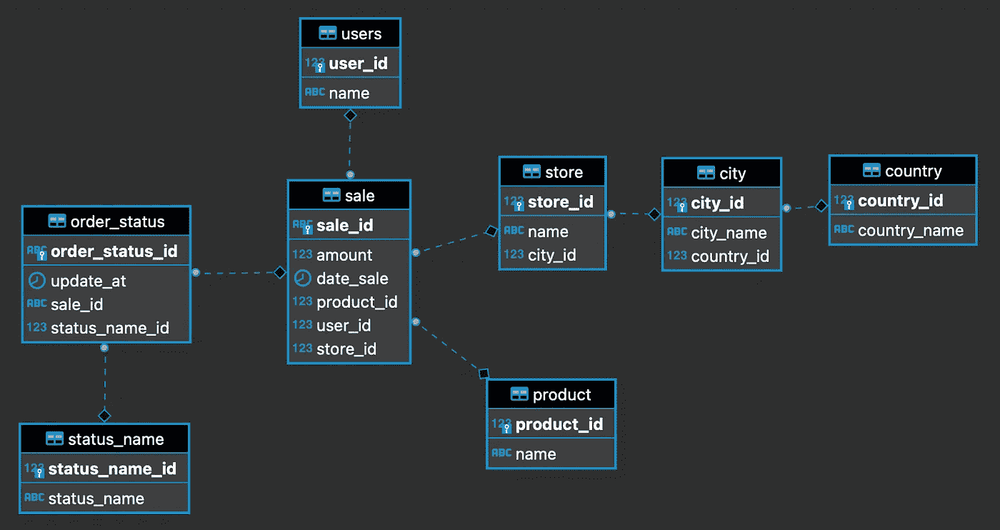

# 用 Docker compose 创建和填充 Postgres 数据库

> 原文：<https://levelup.gitconnected.com/creating-and-filling-a-postgres-db-with-docker-compose-e1607f6f882f>

很多时候，我们需要用虚拟数据填充并最终共享一个数据库，要么测试我们的管道，测试查询，演示新服务的操作，要么作为一种工具对公司的未来成员进行测试。

> Github 回购:https://github.com/jdaarevalo/docker_postgres_with_data

# **简介**

在解决这一需求的各种选择中，我们可以使用或共享 CSV、parquet、s3 等文件，但这些文件在我们要面对的每一项挑战中都有局限性。

这个问题可以通过利用 Docker 提供给我们的功能来轻松解决。

我们这里的目标是用它们各自的外键创建下面的表并填充这些表，同时它们可以很容易地与其他用户共享。



ER 图

# 初始化 Postgres 服务

我们将使用 Docker Compose 通过这个 *docker-compose.yml* 文件管理 Postgres 的实例:

现在，我们可以用一个简单的命令启动 Postgres:

```
$ docker-compose up
```

或者用这个命令在后台运行 Postgres，增加 ***-d*** 分离模式

```
$ docker-compose up -d
```

并停止 Postgres 服务的运行

```
$ docker-compose down
```

在本例中，我们将本地端口 **5438** 映射到容器内的端口 **5432** (Postgres 默认端口)。此外，我们还会将数据保存在我们的机器中，防止在删除容器时丢失数据，为此，我们使用文件夹`postgres-data`作为存储 Postgres 数据的位置来添加卷。

# 创建表格

为了在我们的数据库中创建表格，我们需要将我们的`create_tables.sql`脚本复制到`/docker-entrypoint-initdb.d/`

该脚本包含创建所需的每个表、主键和外键的命令

所有的源代码都在这里[https://github.com/jdaarevalo/docker_postgres_with_data](https://github.com/jdaarevalo/docker_postgres_with_data)

# 为什么在`docker-entrypoint-initdb.d/ ?`

PostgreSQL Docker 官方镜像[https://hub.docker.com/_/postgres/](https://hub.docker.com/_/postgres/)允许我们将 SQL 文件放在`/docker-entrypoint-initb.d`文件夹中，服务第一次启动时，它会导入并执行那些 SQL 文件。

在我们的 Postgres 容器中，我们将找到这个 bash 脚本`/usr/local/bin/docker-entrypoint.sh`，其中每个*。嘘，**。sql 和*。*sql.gz 文件将被执行

# 用数据填充表格

现在我们想使用脚本 sql/filling_tables.sql 来填充这些表

首先，我们将变量定义为销售数量、国家数量和销售的开始日期……和结束日期，我们将使用会话变量来完成

> *SET<会话变量>语句接受两个参数:变量名和用于修改变量的值。变量名不区分大小写。*
> 
> 更多详情请点击[https://www.postgresql.org/docs/10/sql-set.html](https://www.postgresql.org/docs/10/sql-set.html)

定义变量后，继续创建 SQL 脚本来填充数据

参数 current_setting 获取第一部分中定义的变量，GENERATE_SERIES 是一个 Postgres 函数，如果未定义，它会生成一系列值，从`start`到`stop`的值，步长为 1

因此，我们填充了表 country、city、store、users、product、status_name。对于 order_status 和 sale 表，我们需要几个 Postgres 函数或额外的逻辑步骤

**Sale ID** :这里我们想要一个列 [sale.id](http://sale.id/) 的 UUID，幸运的是，Postgres 通过 UUID 支持通用唯一标识符(uuid)作为列数据类型，我们将使用它来创建 sale_id，为此我们在当前会话数据库/模式中加载 pgcrypto 扩展

**Dates** :这里我们将使用 PostgreSQL TO_TIMESTAMP()函数根据给定的格式将字符串转换为时间戳，另外我们将使用 random()函数在创建的范围内生成随机日期

**随机 id:**请注意，每笔销售都需要一个产品 id、用户 id 和商店 id。这里，我们使用函数 floor 来返回对随机函数生成的值进行舍入后的值

为了填充 order_status 表，我们将使用 sale 表

order_status 中的更新日期是在销售日期加 5 天之间创建的，以防止在销售前更新订单。

最后，我们添加所有脚本来填充脚本 sql/fill_tables.sql 中的表

在运行`docker-compose up`之后，我们会看到类似这样的东西


现在，您可以生成并使用包含表和值的数据库来测试模型、管道或评估候选人的 SQL、git、docker 技能。

要连接到 Postgres，您可以使用类似于 **DBeaver** 的数据库工具，或者从命令行运行以下命令:

```
$ docker ps -f "name=postgres"

    -f: Filter output based on conditions provided
```

获取正在运行的容器的 **CONTAINER_ID** ，并执行

```
$ docker exec -it <CONTAINER_ID> /bin/bash
```

并像这样运行查询


> **Github 回购:**https://github.com/jdaarevalo/docker_postgres_with_data T21

请随意分享、使用或贡献给知识库。如果你有任何意见或建议，我会很感激

问候

# 分级编码

感谢您成为我们社区的一员！升级正在改变技术招聘。 [**在最好的公司**找到你最理想的工作](https://jobs.levelup.dev/talent) **。**

[](https://jobs.levelup.dev/talent) [## 提升——改变招聘流程

### 🔥让软件工程师找到他们热爱的完美角色🧠寻找人才是最痛苦的部分…

作业. levelup.dev](https://jobs.levelup.dev/talent)