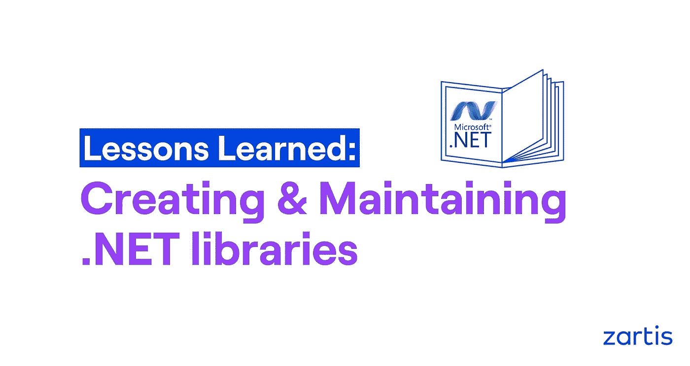
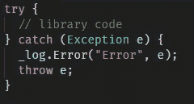

# 创造和维护。网络图书馆:经验教训

> 原文：<https://levelup.gitconnected.com/creating-and-maintaining-net-libraries-lessons-learned-c081c295adcc>

## 创作时需要注意什么？NET 库和包

你曾经创建过你的组织使用的. NET 库或 nuGet 包吗？它符合你的期望吗？有你当初想象的那么好用吗？当组织的需求发生变化时(比如从 XML 转移到 JSON)，会发生什么？你的标准库有多少依赖项，你多久更新一次？

在本文中，我们将尝试向您展示开发人员在创建他们的库时最常犯的错误，并提出一些解决方案来避免在未来的软件项目中出现这样的错误。

# 库接口

在项目中安装一个新的依赖项后，您首先注意到的是它的接口。如何与项目或应用程序中引入的类型进行交互。

你有没有后悔过安装一个库，因为它的界面很快变得过于复杂？你可以在这里停下来想一想。为什么会这样？

类型或属性名称有意义吗？类的配置是一致的还是混合的(基于类的设置，[构建器模式](https://pradeeploganathan.com/dotnet/configuration-in-a-net-core-console-application/)，[动作< T >基于配置](https://docs.microsoft.com/en-us/aspnet/core/tutorials/getting-started-with-swashbuckle?view=aspnetcore-5.0&tabs=visual-studio))？您是否必须手动安装对等依赖项才能使其工作？你第一次编译和运行你的程序时，它工作了吗？

你如何避免这种情况？我的建议是……自己用就好。你可以遵循 [TDD 原则](https://fullstackmark.com/post/8/beginning-test-driven-development-in-net-core)。或者更好——把它给一个同事，不做任何解释。如果他们在没有给出如何使事情工作的描述的情况下使用它是舒适的，你得到了它。一个简单、清晰、可读的库接口的完美指示器。

# 公共类型

你应该对你在图书馆公开的内容深思熟虑。如今，几乎每个开发人员都在使用[智能感知](https://code.visualstudio.com/docs/editor/intellisense)或 [ReSharper](https://www.jetbrains.com/resharper/) 作为编程辅助。这些工具可以扫描库，并向您展示它们提供的类型和/或扩展方法。

假设您创建了一个库，它将 string 作为参数，并且您创建了自己的 string Trim 扩展方法来帮助您管理输入参数。你真的希望每个安装了你的软件包的人都使用这种扩展方法吗？当你在那个方法中犯了一个错误，但是修复这个错误会破坏依赖于当前实现的服务时，你是否考虑过这种情况？

怎么才能避免这个错误呢？使用访问修饰符。使用[私有](https://docs.microsoft.com/en-us/dotnet/csharp/language-reference/keywords/private)、[内部](https://docs.microsoft.com/en-us/dotnet/csharp/language-reference/keywords/internal)或[受保护](https://docs.microsoft.com/en-us/dotnet/csharp/language-reference/keywords/protected)访问修饰符将公共类公开，并隐藏其他所有内容。不要共享太多，因为将私有类变成公共类，然后将公共类型变成私有类型总是更容易。

# 记录

在将任何类型的日志框架安装到您的库中之前，您应该问自己一个问题:为什么我需要在您的包中进行日志记录？我——开发人员——可以帮助我诊断潜在的问题吗？还是为了潜在用户帮助他们了解内部状态？或者您可能使用日志记录来显示潜在的用户验证错误？

为什么在添加像登录到包中这样简单的依赖项之前回答这些问题如此重要？

最大的担忧之一是[依赖性](https://docs.google.com/document/d/1utNOb9IOIKz4w-1FQ4umcxzMh7S5yOOCNU5051qzvS4/edit?ts=6050eeff#heading=h.3kdf9fgphjcy)。将日志库添加到您的包中会强制该包的用户在使用它之前配置该日志框架。当您在设计库时意识到日志记录可能没有配置，或者提供默认实现来记录标准输出将会改善用户体验，但是您仍然增加了依赖性。您如何确定使用您的包的服务将使用相同的日志框架？您如何确定别人不会使用不同的日志框架将您的库安装在另一个库中？开发人员将不得不配置多个日志框架来使用这两个库。

解决这个问题的方法很少。没有一个比另一个更好。作为设计师，您应该决定使用哪种方法:

*   沟日志记录和使用自定义异常——这个解决方案可能看起来是现成的，但是它非常强大。您表示某些操作出错了，并且您将决定权交给了软件包用户。
*   为日志记录实现您自己的抽象——提供一个定制的 ILog 界面非常好，因为您没有添加任何依赖项。您还可以为最常见的日志框架提供您的实现(参见[可扩展性](https://docs.google.com/document/d/1utNOb9IOIKz4w-1FQ4umcxzMh7S5yOOCNU5051qzvS4/edit?ts=6050eeff#heading=h.ev1i0m1ptysn))。
*   使用[。NET 核心日志方法](https://docs.microsoft.com/en-us/dotnet/api/microsoft.extensions.logging.iloggerfactory?view=dotnet-plat-ext-5.0) —微软在他们的。当有人已经考虑过并测试过它时，为什么不使用它呢？使用你的包的服务可以[配置 ILoggerFactory](https://docs.microsoft.com/en-us/aspnet/core/fundamentals/logging/?view=aspnetcore-5.0#logging-providers) 来满足他们的需求。
*   使用 F#技术——F #提供了很好的类型( )，可以用来返回关于方法误用的信息。不一定要用 F#，或者自己实现那些类型。你可以使用 [language-ext](https://github.com/louthy/language-ext) ，它会为你实现。记住拉这个库会增加一个依赖，所以你自己实现那个概念可能更好。

# 例外

您是否正在向库中添加自定义异常类型？您是否在库中捕捉异常，以便记录并再次抛出它们？您要从异常中移除堆栈跟踪吗？你在图书馆内部使用过这种模式吗？

你可能会问，这有什么问题。你必须明白，你的库的运行时是由使用它的服务提供的。这意味着所有异常(捕获的和未捕获的)都将由您的服务来处理。如何在服务中调用库代码？你的代码完全一样吗？

如果您打算在库中捕获一个异常并记录下来，请不要这样做。尤其不要用“扔 e；”—它将删除堆栈跟踪，并将在调试过程中导致问题。

让您的服务捕获库异常并记录它们。

对于库抛出的任何异常，你都应该非常谨慎。记住那个[系统。异常](https://docs.microsoft.com/en-us/dotnet/api/system.exception?view=net-5.0)类包含[一个消息属性](https://docs.microsoft.com/en-us/dotnet/api/system.exception.message?view=net-5.0#System_Exception_Message)，您可以利用它来获得优势。如果你花一些时间为你的异常创建有意义的消息，你的用户会很高兴。在我看来，您应该创建一个包含抛出原因和如何避免该异常的信息的消息。你可以在这里阅读最佳实践。如果你根本不喜欢异常，你可以考虑使用[面向铁路的编程](https://naveenkumarmuguda.medium.com/railway-oriented-programming-a-powerful-functional-programming-pattern-ab454e467f31)。

# 属国

您应该非常小心在库中安装的软件包，尤其是当软件包将在整个公司范围内使用时。请记住，每个依赖项将来都需要更新。你可能会问，我为什么要在乎？

对依赖关系的更新会给依赖关系带来重要的变化。从界面或性能的微小改进开始，到安全补丁结束。但是你准备好了吗？或者你宁愿生活在[依赖地狱](https://michaelscodingspot.com/dotnet-dll-hell/)？

创建库时，最好尽可能避免依赖关系。通常可以将您想要使用的依赖项中的实用程序类型复制到您的库中，并使它们成为内部的。下一次，请想一想:将 [EntityFramework](https://docs.microsoft.com/en-us/ef/) 安装到您的库中以从数据库中获取单个值值得吗？还是应该用。NET 内置 [IDbConnection](https://docs.microsoft.com/en-us/dotnet/api/system.data.idbconnection?view=net-5.0) ？

如果你决定你需要依赖，考虑在[扩展性](https://docs.google.com/document/d/1utNOb9IOIKz4w-1FQ4umcxzMh7S5yOOCNU5051qzvS4/edit?ts=6050eeff#heading=h.ev1i0m1ptysn)中提出的模式。

# 可调试性

当您为您的组织创建库时，您应该允许其他人调试您的代码，即使您是代码的所有者。你的同事可以为你解决简单的问题，你所要做的就是批准一个拉取请求。

除了在[异常](https://docs.google.com/document/d/1utNOb9IOIKz4w-1FQ4umcxzMh7S5yOOCNU5051qzvS4/edit?ts=6050eeff#heading=h.7cr0v3wkmaci)部分已经提到的有意义的消息，不要隐藏你的库产生的堆栈跟踪。这是在调试过程中非常有用的重要信息。

此外，您应该考虑启用[调试符号](https://docs.microsoft.com/en-us/visualstudio/debugger/specify-symbol-dot-pdb-and-source-files-in-the-visual-studio-debugger?view=vs-2019)来构建您的包。这些符号可以作为[单独的包](https://docs.microsoft.com/en-us/nuget/create-packages/symbol-packages-snupkg)发布到您的包提要中。这样，您的生产代码不包含任何调试信息，但开发人员可以从包提要中提取这些信息，从而获得更好的调试体验。

# 展开性

抽象一切，让库用户决定实现。这应该是每一个好的库实现背后的思想。在您的库中有多个您应该抽象的关注点:

*   记录
*   序列化
*   通信飞机
*   查询数据
*   存储数据
*   国际奥委会
*   等等。

## 抽象出上面提到的关注点会给你和你的图书馆带来很多好处:

*   您正在减少依赖性的数量，减轻依赖性的痛苦
*   您包的用户可以决定使用哪个实现
*   当您组织决定 log4net 或 Castle 时。Windsor 是被禁止的，你所要做的就是创建小的 dll 来实现具体的框架
*   当您想要实现依赖项的滚动更新时，粒度方法是有益的

## 这种方法有很多例子:

*   [系列](https://www.nuget.org/packages?q=serilog)，
*   [微软扩展配置](https://www.nuget.org/packages?q=microsoft.extensions.configuration)，
*   [追加筹码](https://www.nuget.org/packages?q=rebus)

# 图书馆文献

库文档是非常棘手的。很多时候，时间压力迫使我们一起放弃文档。我鼓励你问自己一个问题:为什么我的库需要文档？我可以重构库接口[来消除对文档的需求吗？](https://docs.google.com/document/d/1utNOb9IOIKz4w-1FQ4umcxzMh7S5yOOCNU5051qzvS4/edit?ts=6050eeff#heading=h.hw5rmserf673)

在我看来，最有价值的文档展示了应该如何使用这个库的例子。它还展示了库的创建者的观点——背后的思想。展示本库的局限性以避免不当使用或令人讨厌的代码攻击是非常重要的。你能做的最简单的事情就是使用 [codedoc](https://docs.microsoft.com/en-us/dotnet/csharp/codedoc) 。使用[例子](https://docs.microsoft.com/en-us/dotnet/csharp/codedoc#example)、[例外](https://docs.microsoft.com/en-us/dotnet/csharp/codedoc#exception)、[参见](https://docs.microsoft.com/en-us/dotnet/csharp/codedoc#seealso)。

请记住，如果您选择记录您的代码，您必须非常小心。不编译或检查文档。如果您更改了实现，您也必须对文档进行更正。另外，不要过度记录你的代码。文件应该给你的包裹增加质量。不要用过多的项目文件迷惑他人，为用户提供高效的体验是我们的责任。

# 摘要:。网络图书馆

实现库似乎是一项简单的任务，但是正确地实现它需要一些时间来思考设计。不要创建一次性使用的包，需要考虑多种因素。以下是每个部分的快速总结:

*   **库接口** —保持清晰、简单、一致、易用。请你的同事帮助你。
*   **公共类型** —仔细选择你共享的类型。将类型设为公共总是比设为私有更容易。
*   **记录** —尽量避免在库内记录。你不知道用户会选择哪个日志框架库。如果您需要日志记录—将其抽象化。
*   **异常** —使用异常与用户交流。使异常消息有意义，避免删除堆栈跟踪，这将使调试过程变得困难。
*   **依赖** —尽可能避免库依赖。如果你需要依赖，试着抽象它。
*   **可调试性** —让您的库用户能够帮助您。随包发布调试符号。
*   可扩展性 —允许你的用户选择他们自己的运行时间。让他们决定应该使用什么实现。
*   文档化 —负责任，不要过度文档化你的代码。试着解释你的图书馆的局限性。

幸运的是，有许多好的例子可以让我们受益。我们祝愿您在未来的工作中取得巨大成功！

-

这篇博客的作者是 Zartis 的软件开发工程师 awomir Pawluk。如果您有任何问题或需要关于该主题的更多信息，请随时与[联系](https://www.zartis.com/contact/)。