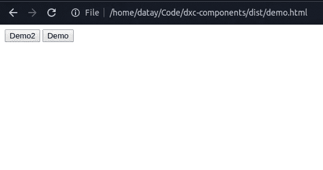

# 创建和发布多个 Vue Web 和库组件

> 原文：<https://levelup.gitconnected.com/creating-and-publishing-multiple-vue-web-and-library-components-448451838ccf>


我一直在阅读关于创建 vue web/lib 组件的文章。然而，我找不到一个处理多个组件的。还有一点强调产生不同的目标构建——库和 Web 组件。因此，在这里，我尝试分享我使用 vue 设置多个 web 和库组件的经验。

在这次阅读中，我们将涵盖以下部分:

*   配置两个目标版本:Web 版本和库版本
*   处理多个组件
*   将 vue 组件作为作用域包发布到 npm
*   奖励—使用新发布的包
*   额外收获——如何使用新组件并看到它的实际效果

我知道大多数开发人员都想马上抓住要点，所以让我们开始吧。

# **初始设置**

**先决条件**

首先确保 vue cli 和 vue cli-service-global 已全局安装。它们将用于构建包和服务组件

```
npm install -g @vue/cli @vue/cli-service-global
```

**创建一个 vue 项目**

```
vue create dxc-components
```

它会提示你一些设置选项，你应该只选择“默认”并按下回车键。

# **建立目标**

我们必须指定我们的构建配置，为此，我们需要在`package.json`上进行更改。在`scripts`中，更新该部分，如下所示—

```
"scripts": {
     "serve": "vue-cli-service serve",
     "build": "npm run build:wc & npm run build:lib",
     "lint": "vue-cli-service lint",
     "build:lib": "vue-cli-service build --target lib --name dxc-components 'src/main.js'",
     "build:wc": "vue-cli-service build --target wc --name dxc-components 'src/components/*.vue'"
   },
```

`build:lib`将构建我们为库使用而设计的包。例子

```
import MyComponent from 'my-component'; export default {
   components: {
       MyComponent,   
   },
  // rest of the component 
}
```

`build:wc`将允许在浏览器中通过`<script>`标签直接使用。例子

```
<script src="https://unpkg.com/vue"></script> <script src="https://unpkg.com/my-component"></script>
... 
<my-component></my-component> 
...
```

`'src/components/*.vue'`是将注册在`src/components`目录中找到的多个组件的条目。在我们的配置中，`--name`被设置为`dxc-components`，这样，捆绑的结果将被注册为`<dxc-components-my-component>`。也就是说，如果我们在`src/components`中有一个名为`MyComponent.vue`的组件。

**注意！**当`src/components`中只有一个组件时，`--name`将被用作标签元素名称。因此，结果元素将是`<dxc-components />`而不是`<dxc-components-my-component />`

脚本命令上的`build`将允许我们轻松地构建 lib 和 web 组件。

# 创建我们的组件

为了简单起见，让我们创建两个裸组件。同样，让我们删除`HelloWorld.vue`,因为我们想专注于为这个项目添加简单的组件。

Button.vue

```
<template>
   <button>{{label}}</button>
</template><script>
export default {
   data() {
      return {
        label: 'Demo'
      }
   }
}
</script>
```

另一个按钮. vue

```
<template>
   <button>{{label}}</button>
</template><script>
export default {
   data() {
      return {
        label: 'Demo2'
      }
   }
}
</script>
```

现在我们有了两个新的组件`Button.vue`和`AnotherButton.vue`，我们需要注册这些组件，以便将它们包含在我们的构建中。首先，让我们也删除`src/App.vue`，因为我们正在构建供客户端使用的组件。然后让我们更新`src/main.js`，让它看起来像这样。

```
 // import components here
 import Button from "./components/Button.vue";
 import AnotherButton from "./components/AnotherButton.vue";

 // export components for this library
 export default {
   Button,
   AnotherButton
 };
```

这将允许我们成功地构建库组件。我们不需要担心 web 组件的构建，因为正如我前面提到的，组件会自动添加。

# 建筑构件

现在我们的组件已经准备好了，让我们开始构建。

```
npm run build
```

结果应该是这样的—

```
DONE  Compiled successfully in 3559ms File                          Size                   Gzippeddist/dxc-components.min.js    7.38 KiB               3.15 KiB
dist/dxc-components.js        26.69 KiB              7.59 KiBImages and other types of assets omitted.File                              Size                 Gzippeddist/dxc-components.umd.min.js    3.66 KiB             1.58 KiB
dist/dxc-components.umd.js        14.66 KiB            4.08 KiB
dist/dxc-components.common.js     14.26 KiB            3.98 KiBImages and other types of assets omitted.
```

之后，我们将需要更新`package.json`来添加包入口点。入口点将告诉`npm`哪个版本服务于浏览器或构建过程。我们将添加`main`和`unpkg`配置。它应该看起来像这样—

```
"scripts": {
  ...
},
"main": "dist/dxc-components.common.js",
"unpkg": "dist/dxc-components.min.js",
```

遗留应用程序将使用`main`版本，而`unpkg`版本可以直接在浏览器中使用。

# 设置新的回购协议并发布到 NPM

现在您已经有了一个可以发布的包，我们必须首先为我们的项目创建一个 git 存储库。

**注意！**您应该根据您自己的名称偏好更改我的项目名称`dxc-components`,并且在继续此步骤之前，您应该在 github 中创建新的 repo。

在您创建了一个新的回购之后，让我们在`package.json`中进行一些更改，并更新/添加以下配置。 ***您应该将存储库源更改为您自己的。***

```
"name": "@datay/dxc-components",
...
"private": false,
...
"repository": "github.com:<your-gb-username>/dxc-components",
```

*将* `*package.json*` *中的* `*name*` *改为* `*@datay/dxc-components*` *使得包的作用域在* `*npm*` *中。将* `*private*` *选项设置为 false 将允许我们公开发布这个包。新的配置* `*repository*` *会告诉* `*npm*` *这个包应该链接到哪个 git 库。所有这些都将在以后解决。*

现在，我们需要更新我们的`README.md`文件。我们应该添加一些关于如何使用我们的组件的文档。我建议使用一个 readme 生成器来帮助你快速开始。

一旦你完成更新你的`README.md`文件，我们就可以开始创建我们的回购。您可以遵循下面的命令来这样做: ***您应该将存储库源更改为您自己的。***

```
git init
git add .
git commit -m "Vue Component Project"
git remote add origin git@github.com:<your-gb-username>/dxc-components.git
git push -u origin master
```

**出版包到 NPM**

我们现在可以将我们的包发布到 npm。在这一次，我将按范围发布包。因此，如果您没有 npm 帐户或现有的 npm 组织，您必须创建一个，并按照此[https://docs . NPM js . com/converting-your-user-account-to-an-org](https://docs.npmjs.com/converting-your-user-account-to-an-org)将其转换为组织。之后，让我们开始发布您的包。

```
npm adduser
```

会有一些提示询问您的凭证。对于用户名，您必须使用您转换的组织。成功登录后，运行以下命令正式发布包。

```
npm publish --access public
```

完成后，你现在有一个发布的 NPM 包！

# 新发布包的使用

在节点环境或 vue 项目中

`npm install — save @datay/dxc-components`

```
<script>
import { Button, AnotherButton } from "@datay/dxc-components"

export default {
    components: {
        Button,
        AnotherButton
    }    
}
</script>

<template>
    <div>
        <Button />
        <AnotherBUtton />
    </div>
</template>
```

或基于现有的非 vue 项目

```
<script src="https://unpkg.com/vue"></script>
<script src="https://unpkg.com/@datay/dxc-components"></script>
<div id="app">
    <dxc-components-button />
    <dxc-components-another-button/>
</div>
```

# 处理组件

在处理组件时，有太多的方法可以查看输出:

*   通过脚本标签-> wc
*   通过服务 vue 组件-> lib

**网页组件**

*   在反映更改之前，请确保构建您的更改。

```
npm run build:wc
```

*   将`./dist/demo.html`中的演示 html 加载到浏览器中

**Lib 组件**

*   服务 vue 组件

```
vue serve src/components/Button.vue
// or
vue serve src/components/AnotherButton.vue
```

*   在 [http://localhost:8080](http://localhost:8080/) 上查看组件运行情况

您应该会看到类似这样的内容:



我想，就是这样！唷，这是我的第一篇技术文章。如果有不清楚的陈述，请原谅。我希望，在某种程度上，这已经帮助了一些人。此外，如果你正在寻找回购，它是在 https://github.com/dxc04/dxc-components

*来源—*[https://CLI . vue js . org/guide/build-targets . html # vue-vs-js-ts-entry-files](https://cli.vuejs.org/guide/build-targets.html#vue-vs-js-ts-entry-files)

*精选照片由*[*Leone Venter*](https://unsplash.com/@fempreneurstyledstock?utm_source=unsplash&utm_medium=referral&utm_content=creditCopyText)*上*[*Unsplash*](https://unsplash.com/s/photos/package?utm_source=unsplash&utm_medium=referral&utm_content=creditCopyText)

*如果你喜欢这篇文章，并想表达爱意，那就太棒了，如果你能……*

[](https://www.buymeacoffee.com/dxcgrl)[](https://skilled.dev) [## 编写面试问题

### 掌握编码面试的过程

熟练的](https://skilled.dev)