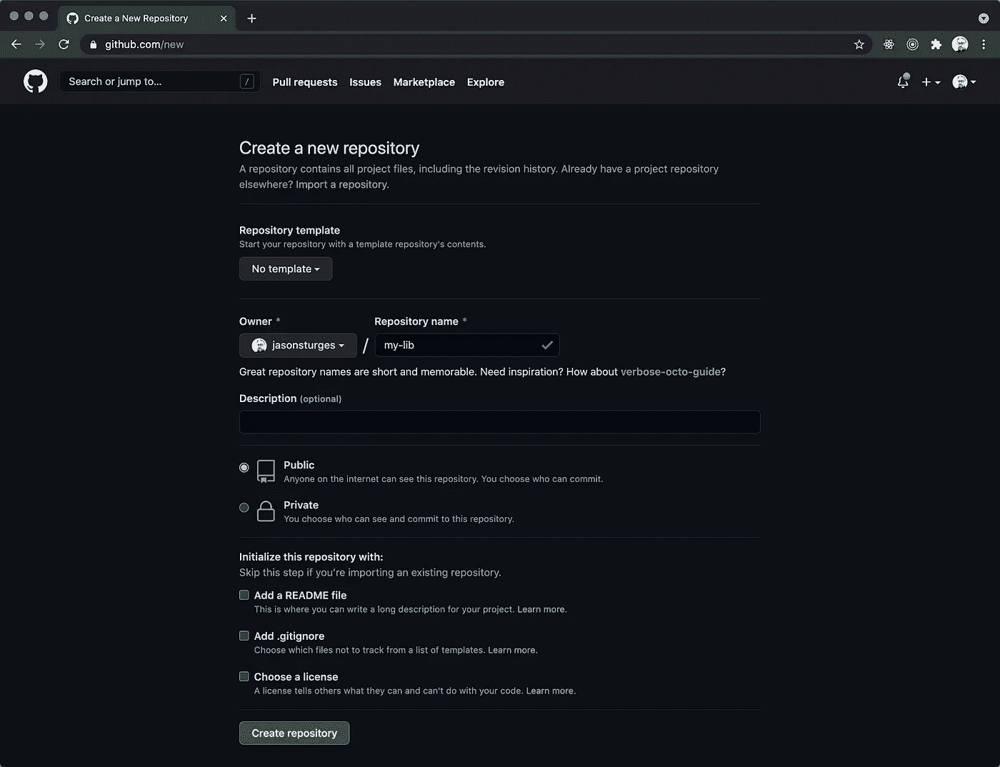
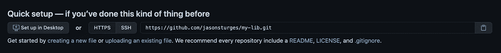
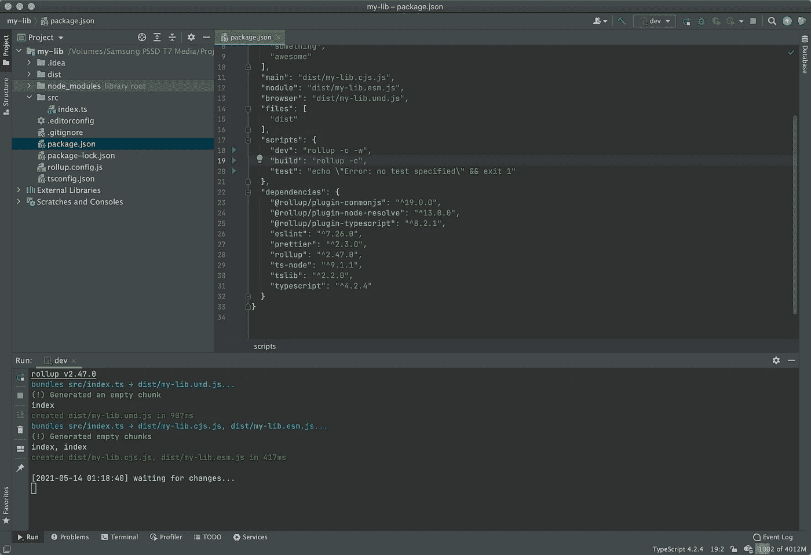
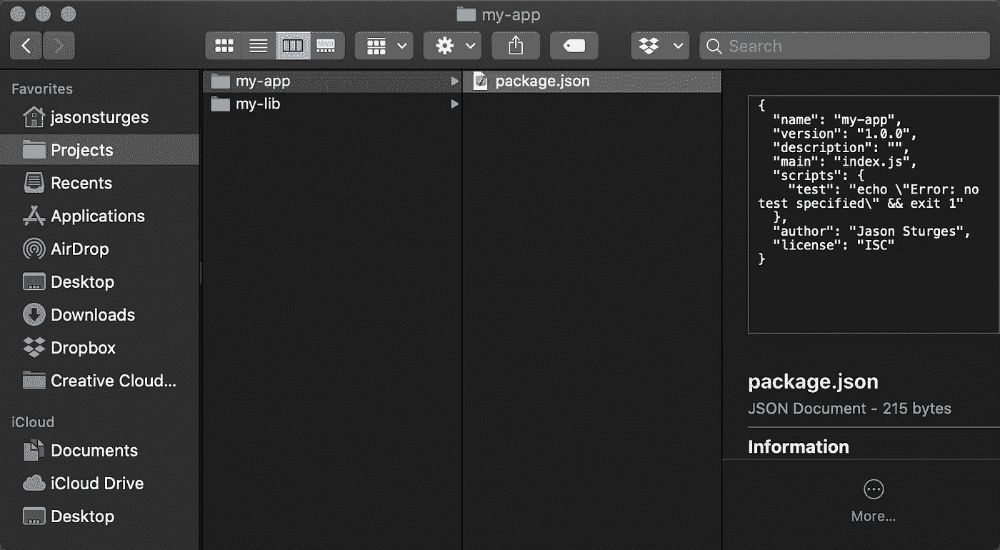
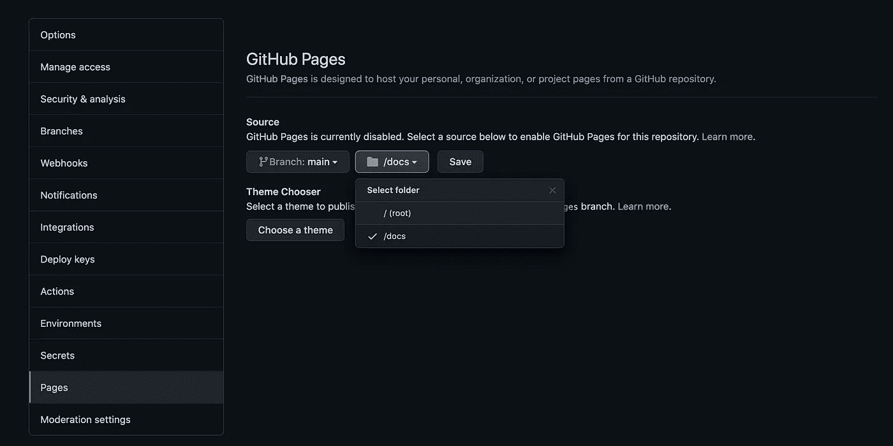

# 创建令人惊叹的打字稿 NPM 软件包

> 原文：<https://levelup.gitconnected.com/creating-awesome-typescript-npm-packages-5d97ac342361>


由[凯利·西克玛](https://unsplash.com/@kellysikkema?utm_source=medium&utm_medium=referral)在 [Unsplash](https://unsplash.com?utm_source=medium&utm_medium=referral) 上拍摄的照片

***更新:自从这篇文章发布以来，我现在推荐使用 Vite——请看这里的更新示例:***[***https://github.com/jasonsturges/vite-typescript-npm-package***](https://github.com/jasonsturges/vite-typescript-npm-package)

创建、测试、记录和发布 TypeScript 包到 NPM 注册中心的综合指南。

创建库有多种方式，比如使用 [TSDX](https://github.com/formium/tsdx) ，一个用于 TypeScript 包开发的零配置 CLI 或者，使用具有[类型脚本分支](https://github.com/rollup/rollup-starter-lib/tree/typescript)的[汇总启动库](https://github.com/rollup/rollup-starter-lib)库。

那里也有很多样板项目，我们可以使用 [degit](https://github.com/Rich-Harris/degit) 或 [GitHub CLI](https://cli.github.com/) to `gh repo create <name> --template="<repo-path>"`，但是我们将从头开始引导我们最初的脚手架。

在 GitHub 查看最终创建的项目:

[](https://github.com/jasonsturges/typescript-npm-package) [## jasonsturges/typescript-NPM-package

### 类型脚本库 npm 包样板文件。通过创建……为 jasonsturges/typescript-NPM-package 开发做出贡献

github.com](https://github.com/jasonsturges/typescript-npm-package) 

## 入门指南

在努力创建您的包之前，最好考虑一下它的用法——特性、API、可用性以及与现有库的重叠。

当发布一个包时，npm 在名称上强制一个唯一性，这在你创建了你的 GitHub repo、相应的文档和网站之后可能会令人沮丧。

在进行任何开发之前，使用`npm search`命令，它会告诉您是否已经创建了类似的库，以及您选择的名称是否已经被占用。


如果没有显示结果，您的库名应该可以发布，而不用担心与另一个包名冲突。

```
$ npm search something-really-unique
No matches found for "something-really-unique"
```

## 搭建项目

使用所需的 npm 软件包名称创建一个新文件夹。在本例中，我们将使用“my-lib”作为包名:

```
mkdir my-lib && cd my-lib
```

当现在提示时，初始化一个新的 npm 包，采用默认值—我们稍后将配置 package.json。

```
npm init
```

创建一个”。gitignore”文件来排除对节点模块、构建、可分发版本和文档的跟踪:

初始化新的 git 存储库:

```
git init
```

添加所有现有文件:

```
git add -A
```

在存储库中创建我们的第一个提交:

```
git commit -m "Initial commit"
```

现在我们可以添加我们的遥控器并推送到 GitHub。

如果您还没有这样做，请在 GitHub 上创建一个新的存储库，不要选中所有初始化——没有 README、gitignore 或 license:



然后，从快速设置中复制 URL:



使用该 URL 添加遥控器并推送:

```
git remote add origin [https://github.com/<username>/my-lib.git](https://github.com/jasonsturges/my-lib.git)
git push
```

## 程序包设置

让我们从更新包的一些属性开始。打开 package.json 文件，并设置以下值:

*   名称:新包的名称
*   版本:您将要发布的初始版本，可能是 1.0.0，除非您从测试版开始
*   描述:概述您的包将做什么
*   作者:您的姓名、网站和(可选)电子邮件
*   主页:你的软件包的网站——一旦我们在 GitHub 上建立并托管了 gh-pages，我们将会更新它
*   关键词:用户可能通过 npm 搜索或浏览的术语

现在，安装最新的 ESLint、TypeScript、Rollup 和插件作为开发依赖项。

```
npm install --save-dev \
            eslint \
            typescript \
            tslib \
            ts-node \
            rollup \
            @rollup/plugin-commonjs \
            @rollup/plugin-node-resolve \
            @rollup/plugin-typescript
```

对于我们的脚本，我们想要添加开发和构建:

*   dev:在监视模式(`-w`)下运行 Rollup，以检测开发期间对文件的更改
*   构建:运行 Rollup 来构建可分发的产品版本

这两个脚本都将使用`-c`配置标志来加载一个汇总配置文件，我们将在后面介绍。

对于我们的可分发文件，我们需要定义我们的输出文件:

*   main: CommonJS (CJS)输出文件
*   模块:ES 模块(ESM)输出文件
*   浏览器:通用模块定义(UMD)输出文件
*   文件:我们的文件将被建立到一个“dist”文件夹中

我们应该以这样的方式结束:

## 类型脚本配置

我们需要通过创建一个包含以下内容的“tsconfig.json”文件来配置我们的 TypeScript 编译器:

## 汇总配置

我们的汇总配置将构建 CJS、ESM 和 UMD 版本的库。创建一个包含以下内容的“rollup.config.js”文件，并确保输入一个`name`和条目`input`:

最后，在“src”文件夹中创建一个“index.ts”文件作为我们的主入口点。



我们的设置已经完成，现在我们可以开始开发我们的库了。

## 设置开发环境

几乎立刻你就需要一种方法来试验你的库。虽然测试驱动开发(TDD)是一个好方法，但是让我们看看在实际的应用程序中使用`npm link`从我们的库中调用函数。

对于这个例子，我假设我们有两个项目:

*   “我的图书馆”——我们正在开发的图书馆
*   “我的应用”——从库中调用函数的原型应用

**从“my-lib”库项目**中，发出`npm link`命令:

```
npm link
```

在监视模式下开始汇总:

```
npm run dev
```

现在，让我们创建一个原型应用程序。

**创建一个新的“我的应用程序”应用程序项目—**在终端中，将 cd 放入您要创建应用程序的文件夹，并执行`npm init`来初始化我们的新应用程序:

```
mkdir my-app && cd my-app
npm init
```

使用`npm init`中的所有默认值来创建我们简单的原型应用程序。

完成后，我们应该有两个文件夹:一个用于库项目，一个用于应用程序项目。



因为我们的应用程序也是打字稿，我们需要设置一些东西。

通过执行以下命令在我们的应用程序中安装 TypeScript:

```
npm install typescript --save-dev
```

在“package.json”中，我们需要添加两件东西:

*   将我们包的`type`设置为`module`
*   添加一个`start`脚本来执行我们的应用程序

```
"type": "module",
"scripts": {
  "start": "tsc && node index.js"
},
```

通过添加库的 package.json 中的名称来链接要包含的库(我们的示例是:“my-lib”):

```
npm link my-lib
```

现在，在我们的应用程序的 package.json 中，我们应该链接到我们正在开发的库:

```
"dependencies": {
  "my-lib": "file:../my-lib"
}
```

将“tsconfig.json”文件从库复制到应用程序，并为应用程序添加以下编译器选项以引用库源代码:

```
"baseUrl": ".",
"paths": {
  "my-lib": ["node_modules/my-lib/src"],
  "my-lib/*": ["node_modules/my-lib/src/*"]
}
```

现在，当我们通过`npm run start`运行应用程序时，我们可以从我们的库项目中调用函数。让我们试一试。

在 my-lib 库项目中，将以下代码添加到“index.ts”中:

```
export const sayHi = () => {
  console.log("Hi");
};
```

在 my-app 项目中，导入并调用函数:

```
import { sayHi } from "my-lib";

sayHi();
```

通过执行以下命令运行我的应用程序:

`npm run start`

在控制台中，您应该看到控制台日志输出“Hi”。

## 通过 API 提取器的类型

微软的 [API 提取器](https://api-extractor.com/)使我们能够将类型声明汇总到一个文件中，我们可以用我们的库来分发这个文件。

将以下 npm 软件包添加到库中:

```
npm install @microsoft/api-extractor
```

创建一个“api-extractor.json”配置文件，其中包含:

在我们的 package.json 脚本中创建一个新任务来生成声明:

```
"scripts": {
  "build:types": "tsc -p ./tsconfig.json --outDir build --declaration true && api-extractor run",
```

现在执行`build:types`任务，在可分发的“dist”文件夹中生成一个“index.d.ts ”:

```
npm run build:types
```

## 证明文件

为了让用户理解这个库的 API，最好创建和托管文档。类似于 JSDoc，我们将利用 [TypeDoc](https://typedoc.org/) 来创建文档。

通过执行以下命令将`typedoc`添加到我们的 package.json 中:

```
npm install typedoc
```

在我们的 package.json 脚本中创建一个新任务来生成文档:

```
"scripts": {
  "docs": "typedoc src --out docs",
```

现在执行`docs`任务，在“docs”文件夹下生成文档:

```
npm run docs
```

要托管文档，您可以将“docs”文件夹的内容推送到“gh-pages”分支，然后推送到 GitHub 托管；或者，从主分支的文件夹中提交用于将 GitHub 设置为主机的“docs”文件夹:



## 最终考虑

最后，有一个好的自述文件，许可证，或任何其他信息和宣传网站将有助于促进你的图书馆和相应的财产。

## 出版

时间终于到了！

首先，确保您登录到正确的 npm 帐户:

```
npm login
```

通过以下方式向 npm 提交您的包裹:

```
npm publish --access public
```