# 在 CSS 中创建基本和高级形状

> 原文：<https://levelup.gitconnected.com/creating-basic-and-more-advanced-shapes-in-css-d8c539693af>

## CSS 给了我们创造多种形状的机会。

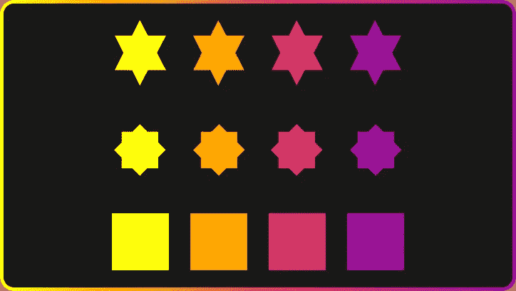

在 CSS 中制作各种形状很容易。正方形和长方形是 web 开发中最常见、最自然的形状。你需要加上宽度和高度，就这样。然后加上边界半径，你就有了圆形和椭圆形。

更复杂的形状需要使用`:before`和`:after`伪元素或更多的 HTML。这给了我们另外两种形状来创造复杂的东西。在创造不同的形状方面，你最好的朋友是`transform`和`position`。

设计师下面的大多数形状会导出为图像，但正如我们所知，我们应该用 CSS 替换简单的图像来加速我们的网站。

请记住:所有的形状都是由身体上的`box-sizing: border-box;`构成的！

让我们从基本形状开始。

# 正方形

```
<div class="square"></div>.square {
  width: 80px;
  height: 80px;
  background: orange;
}
```

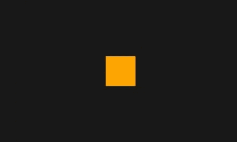

平方

# 矩形形状

```
<div class="rectangle"></div>.rectangle {
  width: 200px;
  height: 80px;
  background: orange;
}
```


矩形

# 圆形

```
<div class="circle"></div>Elipse shape.circle {
  width: 80px;
  height: 80px;
  border-radius: 50%;
  background: orange;
}
```

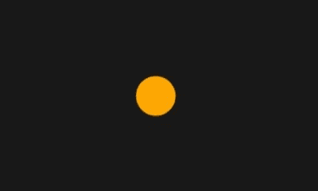

圆

# 椭圆形状

```
<div class="elipse"></div>.elipse {
  width: 160px;
  height: 80px;
  border-radius: 50%;
  background: orange;
}
```

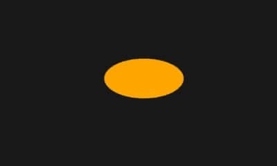

埃利普塞

# 等腰三角形

```
<div class="isosceles_triangle"></div>.isosceles_triangle {
  width: 0;
  height: 0;
  border-style: solid;
  border-width: 0 100px 100px 100px;
  border-color: transparent transparent orange transparent;
}
```

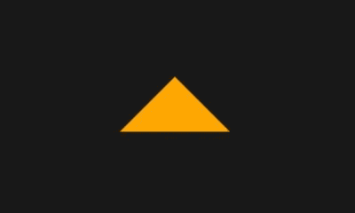

等腰三角形

# 三角形向上形状

```
<div class="triangle_up"></div>.triangle_up {
  width: 0;
  height: 0;
  border-style: solid;
  border-width: 0 50px 86.6px 50px;
  border-color: transparent transparent orange transparent;
}
```


三角形向上

# 三角形向下形状

```
<div class="triangle_down"></div>.triangle_down {
  width: 0;
  height: 0;
  border-style: solid;
  border-width: 86.6px 50px 0 50px;
  border-color: orange transparent transparent transparent;
}
```

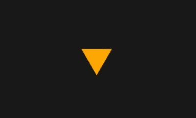

三角形向下

# 三角形左侧形状

```
<div class="triangle_left"></div>.triangle_left {
  width: 0;
  height: 0;
  border-style: solid;
  border-width: 50px 86.6px 50px 0;
  border-color: transparent orange transparent transparent;
}
```


向左三角形

# 三角形直角形状

```
<div class="triangle_right"></div>.triangle_right {
  width: 0;
  height: 0;
  border-style: solid;
  border-width: 50px 0 50px 86.6px;
  border-color: transparent transparent transparent orange;
}
```


三角形右

# 三角形左上形状

```
<div class="triangle_top_left"></div>.triangle_top_left {
  width: 0;
  height: 0;
  border-style: solid;
  border-width: 100px 100px 0 0;
  border-color: orange transparent transparent transparent;
}
```


左上三角形

# 三角形右上形状

```
<div class="triangle_top_right"></div>.triangle_top_right {
  width: 0;
  height: 0;
  border-style: solid;
  border-width: 0 100px 100px 0;
  border-color: transparent orange transparent transparent;
}
```


右上三角形

# 三角形右下角形状

```
<div class="triangle_bottom_right"></div>.triangle_bottom_left {
  width: 0;
  height: 0;
  border-style: solid;
  border-width: 100px 0 0 100px;
  border-color: transparent transparent transparent orange;
}
```

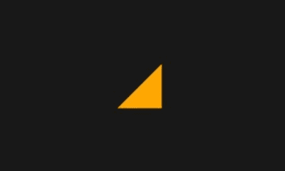

右下三角形

# 三角形左下角形状

```
<div class="triangle_bottom_left"></div>.triangle_bottom_left {
  width: 0;
  height: 0;
  border-style: solid;
  border-width: 100px 0 0 100px;
  border-color: transparent transparent transparent orange;
}
```


左下三角形

# 梯形形状

```
<div class="trapezoid"></div>.trapezoid {
  border-bottom: 100px solid orange;
  border-left: 25px solid transparent;
  border-right: 25px solid transparent;
  height: 0;
  width: 100px;
}
```


梯形

# 平行四边形形状

```
<div class="parallelogram"></div>.parallelogram {
  width: 160px;
  height: 80px;
  transform: skew(20deg);
  background: orange;
}
```


平行四边形

# 星形— 5 分

```
<div class="star_5"></div>.star_5 {
  position: relative;
  width: 0px;
  height: 0px;
  display: block;
  border-right: 100px solid transparent;
  border-bottom: 70px solid orange;
  border-left: 100px solid transparent;
  transform: rotate(35deg);
}

.star_5:before {
  content: '';
  position: absolute;
  display: block;
  top: -45px;
  left: -65px;
  border-bottom: 80px solid orange;
  border-left: 30px solid transparent;
  border-right: 30px solid transparent;
  height: 0;
  width: 0;
  transform: rotate(-35deg);
}
.star_5:after {
  content: '';
  position: absolute;
  display: block;
  top: 3px;
  left: -105px;
  width: 0px;
  height: 0px;
  border-right: 100px solid transparent;
  border-bottom: 70px solid orange;
  border-left: 100px solid transparent;
  transform: rotate(-70deg);
}
```


星级— 5 分

# 星形— 6 分

```
<div class="star_6"></div>.star_6 {
  width: 0;
  height: 0;
  border-left: 50px solid transparent;
  border-right: 50px solid transparent;
  border-bottom: 100px solid orange;
  position: relative;
}

.star_6:before {
  content: "";
  position: absolute;
  top: 30px;
  left: -50px;
  width: 0;
  height: 0;
  border-left: 50px solid transparent;
  border-right: 50px solid transparent;
  border-top: 100px solid orange;
}
```


星级—6 分

# 星形— 8 分

```
<div class="star_8"></div>.star_8 {
  background: orange;
  width: 80px;
  height: 80px;
  position: relative;
  transform: rotate(20deg);
}

.star_8:before {
  content: "";
  position: absolute;
  top: 0;
  left: 0;
  height: 80px;
  width: 80px;
  background: orange;
  transform: rotate(135deg);
}
```

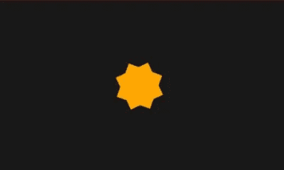

星级—8 分

# 星级 12 分

```
<div class="star_12"></div>.star_12 {
  background: orange;
  width: 80px;
  height: 80px;
  position: relative;
}

.star_12:before,
.star_12:after {
  content: "";
  position: absolute;
  top: 0;
  left: 0;
  height: 80px;
  width: 80px;
  background: orange;
}

.star_12:before {
  transform: rotate(60deg);
}
.star_12:after {
  transform: rotate(30deg);
}
```


星级—12 分

# 五边形

```
<div class="pentagon"></div>.pentagon {
  position: relative;
  width: 90px;
  border-width: 50px 18px 0;
  border-style: solid;
  border-color: orange transparent;
}

.pentagon:before {
  content: "";
  position: absolute;
  height: 0;
  width: 0;
  top: -85px;
  left: -18px;
  border-width: 0 45px 35px;
  border-style: solid;
  border-color: transparent transparent orange;
}
```


五边形

# 六边形

```
<div class="hexagon"></div>.hexagon {
  width: 100px;
  height: 55px;
  background: orange;
  position: relative;
}

.hexagon:before {
  content: "";
  position: absolute;
  top: -25px;
  left: 0;
  width: 0;
  height: 0;
  border-left: 50px solid transparent;
  border-right: 50px solid transparent;
  border-bottom: 25px solid orange;
}
.hexagon:after {
  content: "";
  position: absolute;
  bottom: -25px; left: 0;
  width: 0;
  height: 0;
  border-left: 50px solid transparent;
  border-right: 50px solid transparent;
  border-top: 25px solid orange;
}
```

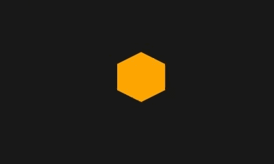

六边形

# 八角形

```
<div class="octagon"></div>.octagon {
  width: 100px;
  height: 100px;
  background: orange;
  position: relative;
}

.octagon:before {
   content: "";
  position: absolute;
  top: 0;
  left: 0;
  border-bottom: 29px solid orange;
  border-left: 29px solid rgb(24,24,24);
  border-right: 29px solid rgb(24,24,24);
  width: 42px;
  height: 0;
}
.octagon:after {
  content: "";
  position: absolute;
  bottom: 0;
  left: 0;
  border-top: 29px solid orange;
  border-left: 29px solid rgb(24,24,24);
  border-right: 29px solid rgb(24,24,24);
  width: 42px;
  height: 0;
}
```


八角形

# 菱形

```
<div class="diamond"></div>.diamond {
 width: 0;
  height: 0;
  border: 50px solid transparent;
  border-bottom: 70px solid orange;
  position: relative;
  top: -50px;
}

.diamond:before {
  content: '';
  position: absolute;
  left: -50px;
  top: 70px;
  width: 0;
  height: 0;
  border: 50px solid transparent;
  border-top: 70px solid orange;
}
```

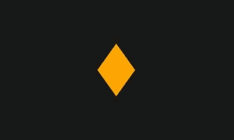

钻石

好的，上面所有的形状都非常简单和普通。让我们创造一些不常见但又简单的东西。

# 切割钻石形状

```
<div class="diamond"></div>.diamond {
  border-style: solid;
  border-color: transparent transparent orange transparent;
  border-width: 0 25px 25px 25px;
  height: 0;
  width: 50px;
  position: relative;
}

.diamond:before {
  content: "";
  position: absolute;
  top: 25px;
  left: -25px;
  width: 0;
  height: 0;
  border-style: solid;
  border-color: orange transparent transparent transparent;
  border-width: 70px 50px 0 50px;
}
```


切割钻石

# 加号形状

```
<div class="plus"></div>.plus {
  width: 30px;
  height: 100px;
  background: orange;
  position: relative;
}

.plus:before {
  content: '';
  position: absolute;
  top: 50%;
  transform: translateY(-50%);
  left: 0;
  width: 100px;
  height: 30px;
  background: orange;
}
```


加

# 三叶草形状

```
<div class="clover">
  <span class="t_left"></span>
  <span class="t_right"></span>
  <span class="b_left"></span>
  <span class="b_right"></span>
</div>.clover {
  position: relative;
}

.clover span {
   width: 90px;
  height: 90px;
  background: orange;
  position: absolute;
}
.t_left {
  border-radius: 50% 50% 0 50%;
  left: -90px;
  top: 0px;
}

.t_right {
  border-radius: 50% 50% 50% 0%;
  right: -90px;
  top: 0px;
}

.b_left {
  border-radius: 50% 0% 50% 50%;
  left: -90px;
  top: 90px;
}

.b_right {
  border-radius: 0% 50% 50% 50%;
  right: -90px;
  top: 90px;
}
```


三叶草

# 心形

```
<div class="heart"></div>.heart {
  background: orange;
  width: 100px;
  height: 100px;
  transform: rotate(-45deg);
  position: relative;
}
.heart:before,
.heart:after {
  content: '';
  position: absolute;
  background: orange;
  width: 100px;
  height: 100px;
  border-radius: 50%;

}
.heart:after {
  top: -50px;
  left: 0;
}
.heart:before {
  left: 50px;
  top: 0;
}
```

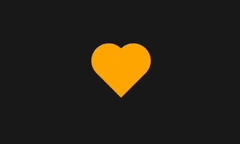

心

# 新月形

```
<div class="crescent"></div>.crescent {
  position: relative;
  width: 100px;
  height: 100px;
  background-color: transparent;
  box-shadow: inset -12px 5px 0 3px orange;
  border-radius: 50%;
}
```

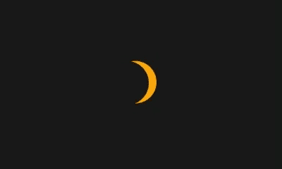

新月

# 半圆形状

```
<div class="half_circle"></div>.half_circle {
  background: orange;
  height: 90px;
  width: 45px;
  border-bottom-right-radius: 90px;
  border-top-right-radius: 90px;
}
```

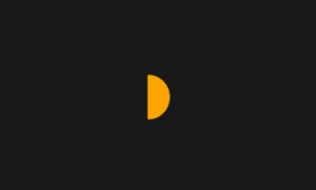

半圆

# 水滴形状

```
<div class="drop"></div>.drop {
  background: orange;
  width: 100px;
  height: 100px;
  border-radius: 50%;
  position: relative;
}

.drop:before {
  content: "";
  position: absolute;
  top: -10%;
  left: 50%;
  border: 42px solid transparent;
  border-bottom: 62px solid orange;
  transform: translateX(-50%);
}
```

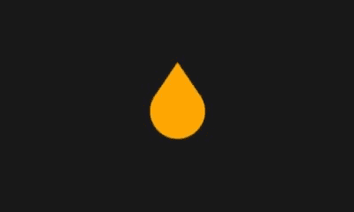

滴

# 欢迎来到 CSS-图像世界！

我希望你能熟悉 CSS 形状。如你所见，CSS 形状既有趣又简单。为了测试你自己，试着不看 CSS 代码自己画出来。

在下一篇文章中，我们将讨论如何创造泡沫演讲😎。感谢阅读！

*最初发表于*[*https://www.albertwalicki.com*](https://www.albertwalicki.com/creating-shapes-in-css)*。*