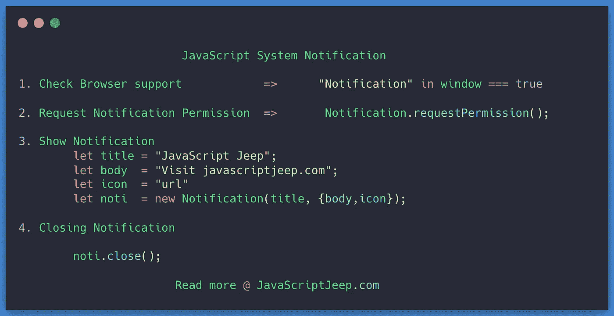

# 用 JavaScript 创建浏览器通知

> 原文：<https://levelup.gitconnected.com/creating-browser-notification-in-javascript-79e91bfb76c8>

了解如何在 JavaScript 中创建浏览器通知。



使用`Notification API`按钮，您可以在网站上显示通知。

显示系统通知的三个简单步骤

*   检查浏览器是否支持通知
*   向用户请求显示通知的权限。
*   一旦用户授予权限，创建`Notification`对象
*   显示带有自定义消息的通知

# 检查浏览器支持

```
 typeof Notification !== "undefined"
```

# 询问用户权限

在请求许可之前，让我们检查一下许可是否已经被授予。要获取通知权限，您可以使用:

```
Notification.permission
```

它可以有 3 个值

*   `denied` →许可
*   `granted` →许可授予
*   `default`→用户选择未知，因此浏览器会表现得好像该值被拒绝一样。

认为`Notification.permission`就是`default`。现在，您需要请求用户允许显示通知。

`Notification`中的`requestPermission`方法用于向用户提出请求。这将返回`promise`，解析为三个权限之一。

```
Notification.requestPermission().then(function (permission) { console.log(permission);});
```

# 显示通知

要显示通知，我们需要两件事:

*   标题→要在通知中显示的标题
*   消息→通知的正文，显示在标题下方。

或者，我们可以包括

*   图标→要在通知中显示的图标的 URL。

以上选项是最常用的，在这里可以看到完整的列表。

```
var title = "JavaScript Jeep";icon = '[https://homepages.cae.wisc.edu/~ece533/images/airplane.png](https://homepages.cae.wisc.edu/~ece533/images/airplane.png)';var body = "It's Your boarding time";var notification = new Notification(title, { body, icon });
```

仅当用户不在当前选项卡中时显示通知。要检查当前标签是否可以用户`document.visibilityState`。

如果`visiblityState`！= `visible`则显示通知

```
let showNotification = document.visibilityState !== "visible";if(showNotification) { 
   // Notification code
}
```

## 关闭通知

如果用户回到触发通知的浏览器标签，需要使用`close`关闭通知。

```
var notification = new Notification('Travel');notification.close();
```

# 通知时的事件

*   `click` →用户点击通知。
*   `close` →通知关闭。
*   `error` →通知因某种原因无法显示。
*   `show` →向用户显示通知。

# 焦点选项卡点击通知。

您可以使用`window.parent.focus()`将当前标签更改为显示通知的标签

```
var notification = new Notification('Travel');notification.onclick = function(){
                         window.parent.focus();
                         notification.close();
                        }
```

把这一切放在一起

```
let permission = Notification.permission;if(permission === "granted") { showNotification();} else if(permission === "default"){ requestAndShowPermission();} else { alert("Use normal alert");}function showNotification() { if(document.visibilityState === "visible) {
       return;
   } var title = "JavaScript Jeep"; icon = "image-url" var body = "Message to be displayed"; var notification = new Notification('Title', { body, icon }); notification.onclick = () => { 
          notification.close();
          window.parent.focus();
   }}function requestAndShowPermission() {
   Notification.requestPermission(function (permission) {
      if (permission === "granted") {
            showNotification();
      }
   });
}
```

项目理念。

*   待办事项→显示待办事项通知
*   番茄钟→显示时间到通知。

[](https://www.buymeacoffee.com/Jagathish) [## Jagathish Saravanan

### 你好👋。我是 Jagathish。爱写关于 JavaScript 的文章。你的支持就像夏天吃冰淇淋一样。我…

www.buymeacoffee.com](https://www.buymeacoffee.com/Jagathish) 

# 分级编码

感谢您成为我们社区的一员！ [**订阅我们的 YouTube 频道**](https://www.youtube.com/channel/UC3v9kBR_ab4UHXXdknz8Fbg?sub_confirmation=1) 或者加入 [**Skilled.dev 编码面试课程**](https://skilled.dev/) 。

[](https://skilled.dev) [## 编写面试问题+获得开发工作

### 掌握编码面试的过程

技术开发](https://skilled.dev)