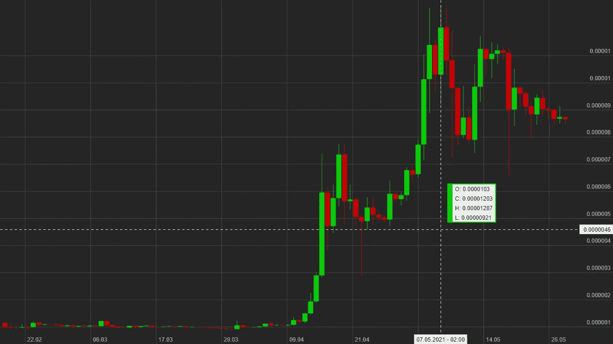

# 在 JavaScript 中创建蜡烛图

> 原文：<https://levelup.gitconnected.com/creating-candlestick-charts-in-javascript-116ea2d6f7dd>

## 使用 HTML 画布元素和普通 JavaScript 的交互式烛台图表

过去 200 天的 BTC-欧元蜡烛图，图片由作者提供。

随着比特币和[其他加密货币](https://www.cnbc.com/2021/05/10/ethereum-eth-price-soars-above-4000-for-the-first-time.html)最近的一些[价格记录，以及](https://www.cnbc.com/2021/03/13/bitcoin-surpasses-60000-in-record-high-as-rally-accelerates-.html) [GameStop 和 AMC Reddit 空头挤压](https://www.wsj.com/articles/how-gamestops-reddit-and-options-fueled-stock-rally-happened-11611743400)，价格图表已经遍布新闻。尤其是在查看实时市场数据时，显示信息的常见方式是蜡烛图。

烛台图表总是让我看起来很困惑，因为我从来没有费心去理解它们。然而，当我最终这样做时，我意识到它们实际上很容易读懂。

最近我一直在用 NiceHash 做一些[随意挖掘，因为我喜欢图表，我决定用 JavaScript 创建自己的烛台图表解决方案，这样我就可以创建自定义的比特币价格图表。](/you-can-earn-money-selling-your-gpus-cryptocurrency-mining-power-9bda92c46dc8)

# 什么是蜡烛图？

我假设，你们大多数人都知道什么是[蜡烛图](https://www.investopedia.com/trading/candlestick-charting-what-is-it/)以及如何阅读它们，但这里有一个快速概述:一根蜡烛总结了股票/加密货币价格在固定时间间隔内发生的变化，如 1 天、1 小时或 5 分钟。

蜡烛的主体显示开盘价和收盘价(时间间隔开始时的价格和结束时的价格)。如果收盘价高于开盘价，即价格上涨，蜡烛线将为绿色，如果价格下跌，蜡烛线将为红色。

“灯芯”(伸出蜡烛的小棒)描绘了区间内的最高价和最低价，例如，在时间段中间的短暂价格峰值。

蜡烛图中蜡烛编码信息的分解，图片由作者提供。

# 履行

我决定从头开始实现自己的解决方案，而不是使用第三方解决方案来绘制烛台图表(例如， [Google charts 可以绘制烛台图表](https://developers.google.com/chart/interactive/docs/gallery/candlestickchart))。虽然自定义实现的功能比大型库少，但它避免了向项目添加另一个依赖项。此外，您可以更大程度地定制您自己的解决方案，使其完美地适合您的项目。

交互式网站元素的最佳选择是[画布](https://developer.mozilla.org/en-US/docs/Web/API/Canvas_API)。你可以很容易地画出简单的 2D 形状和文字，这就是我们需要的烛台图表。

创建图表的难点在于坐标转换。我们需要从时间和价格值转换到 x 和 y 坐标，反之亦然。要将价格值转换为其 y 坐标，我们需要减去最低的全局价格，然后按画布的高度除以全局价格范围进行缩放，最后反转该值，因为我们的蜡烛图有一个 y 轴向上，而画布的 y 坐标向下。完整的等式还包括边缘的边距，如下所示:`return this.canvasHeight — this.marginBottom — (priceValue-this.lowestPriceValue) * this.usableCanvasHeight/this.globalPriceRange;`。转换其他值看起来非常相似，见下面的完整代码。

在画布上画画并不复杂，我们只需要知道如何画一条线和一个矩形来画蜡烛。我们可以为此创建两个小的助手函数:

用于在画布上绘制直线和矩形的辅助函数，完整代码如下。

在这两种情况下，我们开始一条路径，设置一种颜色，然后或者使用`[moveTo](https://developer.mozilla.org/en-US/docs/Web/API/CanvasRenderingContext2D/moveTo)`和`[lineTo](https://developer.mozilla.org/en-US/docs/Web/API/CanvasRenderingContext2D/lineTo)`画一条线，或者使用`[rect](https://developer.mozilla.org/en-US/docs/Web/API/CanvasRenderingContext2D/rect)`画一个矩形，然后使用`[stroke](https://developer.mozilla.org/en-US/docs/Web/API/CanvasRenderingContext2D/stroke)`或`[fill](https://developer.mozilla.org/en-US/docs/Web/API/CanvasRenderingContext2D/fill)`完成绘制。画 1 像素宽的线有一个很好的技巧:我们需要在坐标上加 0.5，这样线就在中间对齐，不会溢出到相邻的像素，这样会产生更干净的结果。现在，我们需要知道的是如何绘制文本，这可以使用`[fillText](https://developer.mozilla.org/en-US/docs/Web/API/CanvasRenderingContext2D/fillText)`函数来完成，我们已经拥有了绘制完整的蜡烛图所需的一切。

主烛台绘制功能，完整代码如下。

因为较长时期的蜡烛图可以包含很大的价格范围，所以将鼠标悬停在图表上可以获得更多的细节。因此，我添加了鼠标悬停效果。当你移动鼠标时，一个十字准线跟随它的位置，并在边缘突出显示准确的时间和价格值。它还会与时间轴上的蜡烛线对齐，并且悬停的蜡烛线会改变颜色。最后，旁边会出现一个小弹出窗口，显示悬停蜡烛的准确开盘价、收盘价、最高价和最低价。

过去 100 天 BTC 的 DOGE 价格，悬停的蜡烛稍微亮一点，弹出窗口显示蜡烛的确切价格信息，图片由作者提供。

# 使用

使用烛台图表类很简单。事实上，创建一个易于使用的解决方案是我的主要目标。它只需要一个 HTML canvas 元素，然后创建一个新的烛台图表类，添加数据，并调用 draw 函数。

在开发过程中，我用随机数据测试这个类，但是使用真实的市场数据更有意义。幸运的是，有很多 API 可以用来获取实时和历史烛台数据。为此我使用了[币安 API](https://binance-docs.github.io/apidocs/spot/en/#introduction) ,但是还有很多其他的加密货币和股票的 API 选项。

我的烛台图表类的使用示例，数据来自币安 API，完整代码如下。

我还没有测试的一个特性是使用烛台图表类来获取实时市场数据。币安提供了一个 [WebSocket API](https://binance-docs.github.io/apidocs/spot/en/#websocket-market-streams) 来获得 live 烛台更新，我希望在未来用它来构建我自己的比特币价格报价器。通过一点额外的逻辑来处理实时更新，烛台图表类将在这方面派上用场。

用 JavaScript 创建蜡烛图既简单又方便，HTML 画布是网站上小型互动元素的绝佳解决方案。

我喜欢各种数据、图表和图表，因此拥有自己的烛台图表解决方案将有利于未来的项目。

# 资源

*   [全烛台类](https://gist.github.com/pingpoli/ea558dd154fa9668b8e924c2a4d32faf)
*   [画布 API](https://developer.mozilla.org/en-US/docs/Web/API/Canvas_API)
*   [币安 API](https://binance-docs.github.io/apidocs/spot/en/#introduction)

你喜欢这样的内容吗？[加入 Medium](https://pingpoli.medium.com/membership) 可以无限制访问所有故事，支持我和其他作者。如果你通过此链接注册，你的一部分会员费将归我所有。