# 为股票创建蜡烛图

> 原文：<https://levelup.gitconnected.com/creating-candlestick-plots-for-stocks-50c35b1573aa>

## 了解如何使用 matplotlib、Plotly、Cufflinks 和 bqplot 创建烛台图


马克西姆·霍普曼在 [Unsplash](https://unsplash.com?utm_source=medium&utm_medium=referral) 上的照片

在我之前的文章中，我谈到了如何绘制时间序列箱线图。另一个涉及时间序列的相似类型的情节是**烛台**情节。

[](https://towardsdatascience.com/plotting-time-series-boxplots-5a21f2b76cfe) [## 绘制时间序列箱线图

### 了解如何使用 matplotlib 和 Seaborn 绘制时间序列箱线图

towardsdatascience.com](https://towardsdatascience.com/plotting-time-series-boxplots-5a21f2b76cfe) 

蜡烛图是一种金融图表，用于描述证券、衍生品或货币的价格变动。顾名思义，烛台图的中心组件是*烛台*，它类似于一根蜡烛。

烛台有以下部件:

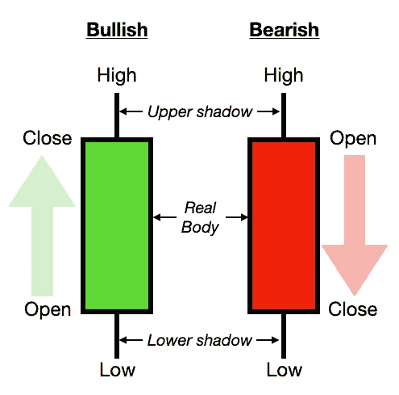

作者图片

*   **实体** —显示价格从开盘价到收盘价变动的矩形。通常绿色用来代表价格的上升(看涨)，红色用来代表价格的下降(看跌)。
*   **灯芯** —开盘价和收盘价上方和下方的灯芯。这些棒代表股票在特定交易日的最高价和最低价。棍子的长度称为**上影**和**下影**。

烛台是一个很好的方式来分析和可视化的股票价格运动。例如，如果*真实体*具有异常宽的范围，它代表价格运动方向的非常强的偏向。另一方面，如果*实体*的区间很窄，就暗示着不确定性，买卖双方都在纠结。

在本文中，我将向您展示如何使用 Python 中的各种库来构建烛台图。

# 加载股票数据

人们总是问的一个常见问题是:我在哪里可以找到历史股票数据，以便我可以使用它来实践数据可视化？简单的回答是**雅虎财经**。下面的代码片段允许您指定一个日期范围，并获取一家公司的历史价格(例如以下示例中的 Google(股票代码 **GOOG** )):

```
import time
from datetime import datetime
import pandas as pddt = datetime(2020, 1, 1)
start_date = int(round(dt.timestamp()))dt = datetime(2020, 3, 31)
end_date = int(round(dt.timestamp()))stock = 'GOOG'df = \
 pd.read_csv(f"[https://query1.finance.yahoo.com/v7/finance/download/{stock}?period1={start_date}&period2={end_date}&interval=1d&events=history&includeAdjustedClose=true](https://query1.finance.yahoo.com/v7/finance/download/{stock}?period1={start_date}&period2={end_date}&interval=1d&events=history&includeAdjustedClose=true)",
    parse_dates = ['Date'], index_col='Date')df
```

数据帧看起来像这样:

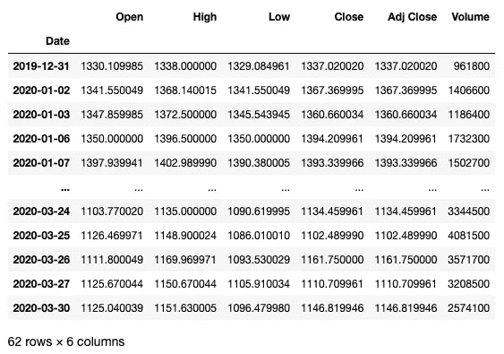

请注意，在数据帧加载期间，使用**日期**列设置索引。

# 使用 matplotlib 绘制收盘价

您可能希望使用数据框创建的第一个图是显示收盘价的折线图:

```
import matplotlib.pyplot as pltfig, ax = plt.subplots(figsize=(15,10))
ax.plot(df.index, df['Close'], 'o-')
ax.grid(True)
```

你有这样一个情节:

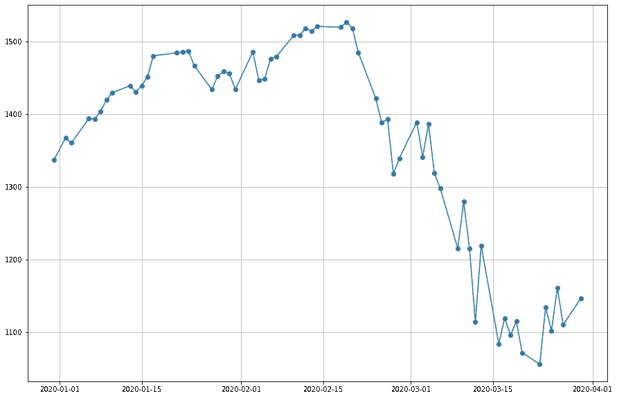

作者图片

如果您注意上面的输出，您可能还会观察到一些东西—注意网格的宽度不一致。这是因为股票只在工作日交易——周一到周五，在上面的图中，不均匀的宽度是因为在绘制图表时考虑到了周末。这是在绘制涉及周末缺失数据的时间序列图表时的一个常见问题。有一种方法可以解决这个问题:

```
import matplotlib.pyplot as plt
**from matplotlib.ticker import Formatter
from matplotlib.dates import num2date
import numpy as np****rows = len(df)
indices = np.arange(rows)****def format_date(x, pos = None):
    i = np.clip(int(x + 0.5), 0, rows - 1)
    return df.index[i].strftime('%Y-%m-%d')**fig, ax = plt.subplots(figsize=(15,10))
ax.plot(**indices**, df['Close'], 'o-') **ax.xaxis.set_major_formatter(format_date)** ax.grid(True)
```

不是使用日期来绘制 x 轴，而是使用其索引来绘制。之后，创建一个索引格式化函数(`format_date`)，用正确的日期格式化 x 轴。最终结果看起来要好得多:

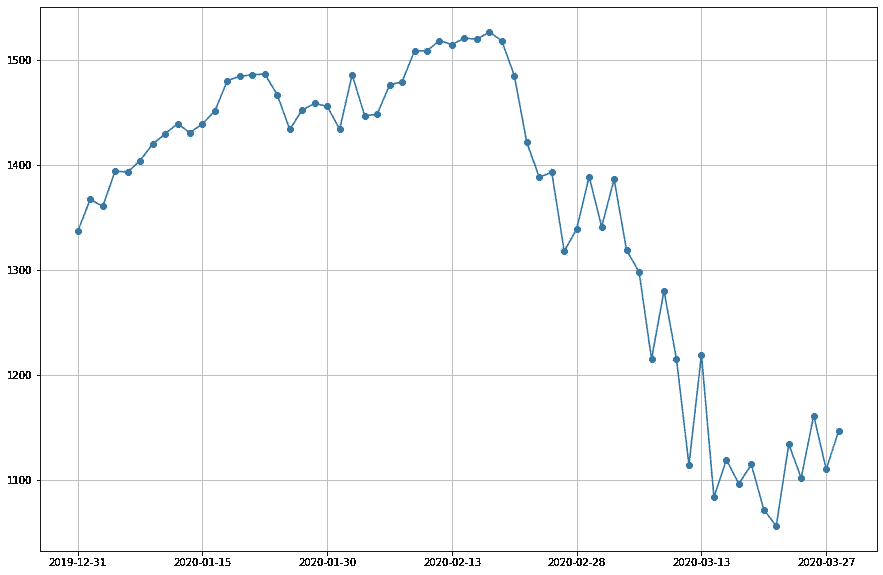

作者图片

然而，显示收盘价的图并不能显示交易日内价格变动的太多信息。因此，更好的选择是创建一个烛台阴谋。

# 用 matplotlib 绘制蜡烛图

有许多库可以用来绘制蜡烛图。但是让我们从基础开始——使用 matplotlib 绘制一个。以下是步骤:

*   从数据框架中，得到所有看涨的行(它们的收盘价大于或等于开盘价)
*   获取所有看跌的行(它们的收盘价低于开盘价)
*   画出看涨和看跌行的真实主体
*   画出看涨和看跌的线索

下面的代码片段执行上述步骤:

```
import matplotlib.pyplot as pltwidth  = 0.9   # width of real body
width2 = 0.05  # width of shadowfig, ax = plt.subplots(figsize=(15,10))**# find the rows that are bullish**
dfup = df[df.Close >= df.Open]**# find the rows that are bearish**
dfdown = df[df.Close < df.Open]**# plot the bullish candle stick**
ax.bar(dfup.index, dfup.Close - dfup.Open, width, 
       bottom = dfup.Open, edgecolor='g', color='green')
ax.bar(dfup.index, dfup.High - dfup.Close, width2, 
       bottom = dfup.Close, edgecolor='g', color='green')
ax.bar(dfup.index, dfup.Low - dfup.Open, width2, 
       bottom = dfup.Open, edgecolor='g', color='green')**# plot the bearish candle stick**
ax.bar(dfdown.index, dfdown.Close - dfdown.Open, width, 
       bottom = dfdown.Open, edgecolor='r', color='red')
ax.bar(dfdown.index, dfdown.High - dfdown.Open, width2, 
       bottom = dfdown.Open, edgecolor='r', color='red')
ax.bar(dfdown.index, dfdown.Low - dfdown.Close, width2, 
       bottom = dfdown.Close, edgecolor='r', color='red')ax.grid(color='gray')
```

结果如下所示:

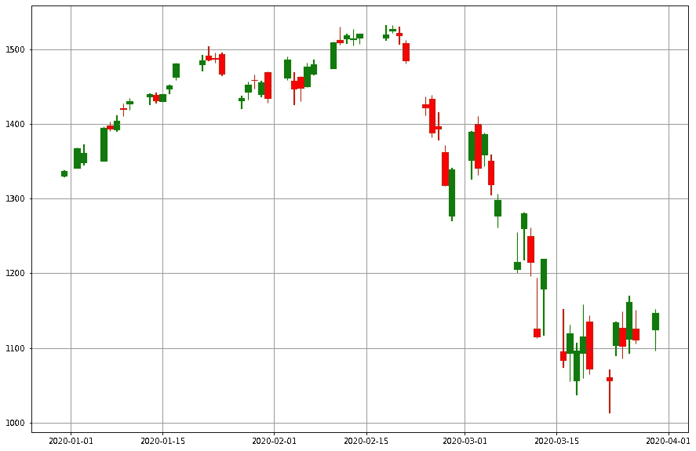

作者图片

如果您喜欢黑色背景，请使用`plt.style.use()`功能:

```
import matplotlib.pyplot as plt
**plt.style.use("dark_background")** # plt.style.use("default")          # reset to white background
```

图表现在看起来是这样的:

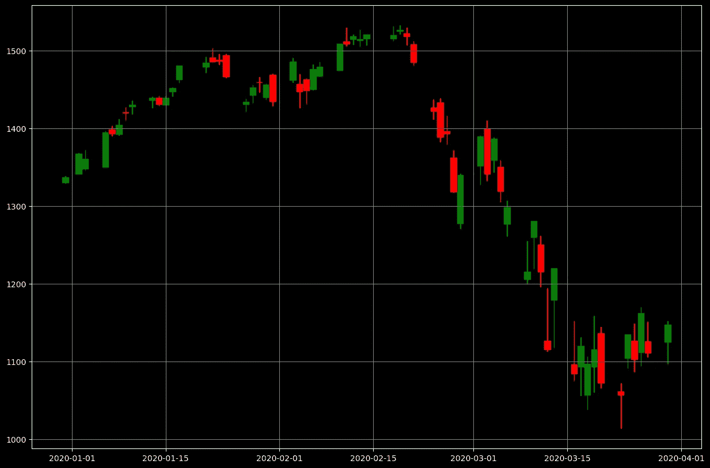

作者图片

同样，您需要注意省略周末，所以下面是我们修改后的代码:

```
import matplotlib.pyplot as plt
plt.style.use("dark_background")
# plt.style.use("default")width  = 0.9   # width of real body
width2 = 0.05  # width of shadow**# add a row containing the indices of each row
df['indices'] = range(len(df))**fig, ax = plt.subplots(figsize=(15,10))# find the rows that are bullish
dfup = df[df.Close >= df.Open]# find the rows that are bearish
dfdown = df[df.Close < df.Open]# plot the bullish candle stick
ax.bar(**dfup['indices']**, dfup.Close - dfup.Open, width,
       bottom = dfup.Open, edgecolor='g', color='green')
ax.bar(**dfup['indices']**, dfup.High - dfup.Close, width2, 
       bottom = dfup.Close, edgecolor='g', color='green')
ax.bar(**dfup['indices']**, dfup.Low - dfup.Open, width2, 
       bottom = dfup.Open, edgecolor='g', color='green')# plot the bearish candle stick
ax.bar(**dfdown['indices']**, dfdown.Close - dfdown.Open, width, 
       bottom = dfdown.Open, edgecolor='r', color='red')
ax.bar(**dfdown['indices']**, dfdown.High - dfdown.Open, width2, 
       bottom = dfdown.Open, edgecolor='r', color='red')
ax.bar(**dfdown['indices']**, dfdown.Low - dfdown.Close, width2, 
       bottom = dfdown.Close, edgecolor='r', color='red')ax.grid(color='gray')**# set the ticks on the x-axis
ax.set_xticks(df[::5]['indices'])****# display the date for each x-tick
_ = ax.set_xticklabels(labels = 
        df[::5].index.strftime('%Y-%b-%d'), 
        rotation=45, ha='right')**
```

以下是更新后的烛台图:

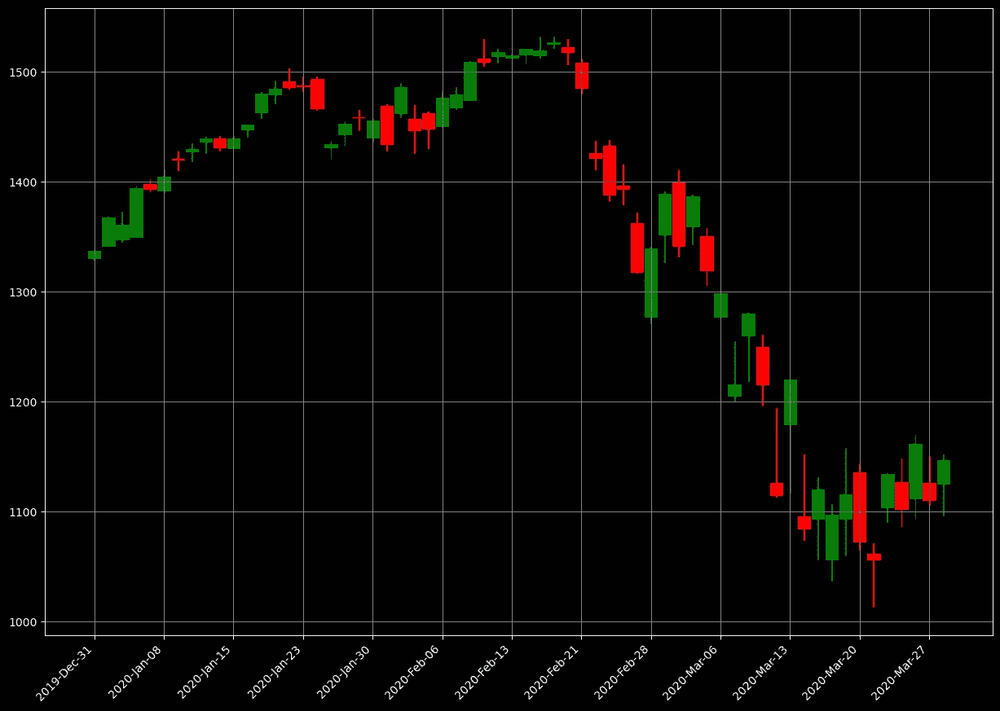

作者图片

如果要将收盘价图叠加到烛台图上，请添加以下粗体语句:

```
import matplotlib.pyplot as plt
plt.style.use("dark_background")
# plt.style.use("default")...
ax.bar(dfdown['indices'], dfdown.Low - dfdown.Close, width2, 
       bottom = dfdown.Close, edgecolor='r', color='red')**# plot the closing price plot
ax.plot(df['indices'], df.Close, color='yellow')  ** ax.grid(color='gray')...
```

这是更新后的收盘价图:

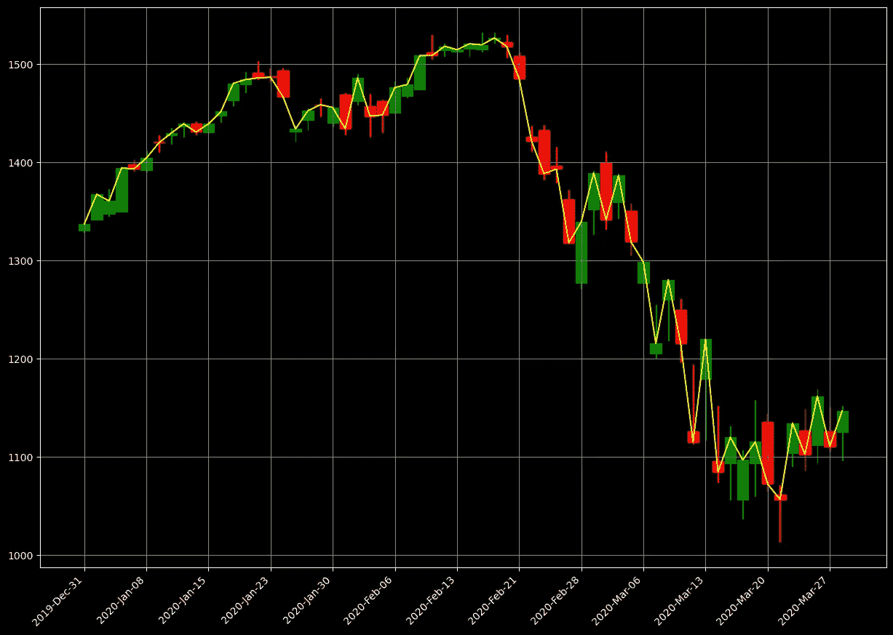

作者图片

# 用 Plotly 绘制蜡烛图

正如您在上一节中看到的，使用 matplotlib 绘制蜡烛图需要做大量的工作。我将使用的下一个库是 **Plotly** 。

> Plotly 是 Python 中的一个高级绘图库，用于创建交互式绘图。我在另一篇关于如何使用它绘制 choropleth 地图的文章中谈到了 Plotly。请点击这里查看:

[](/plotting-choropleth-maps-in-python-b74c53b8d0a6) [## 用 Python 绘制 Choropleth 地图

### 学习如何使用 Plotly 绘制 choropleth 地图

levelup.gitconnected.com](/plotting-choropleth-maps-in-python-b74c53b8d0a6) 

您需要首先安装 Plotly:

```
!pip install plotly
```

要创建烛台图，创建一个`go.Candlestick`对象，然后将其传递给`go.Figure`类:

```
import numpy as np
import pandas as pd
import plotly.graph_objects as gofig = **go.Figure**(data=
    [**go.Candlestick**(x = df.index,
                    open  = df["Open"],
                    high  = df["High"],
                    low   = df["Low"],
                    close = df["Close"])]
)fig.update_layout(
    title='GOOG Stock Price',
    yaxis_title="Price ($)"
)fig.show()
```

你会看到这样的情节:

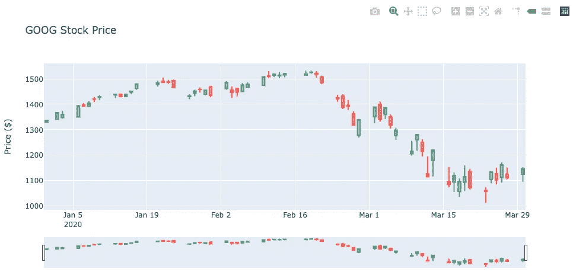

作者图片

图表底部是滑块，您可以在其中选择日期范围，并放大您想要更详细检查的图表部分:

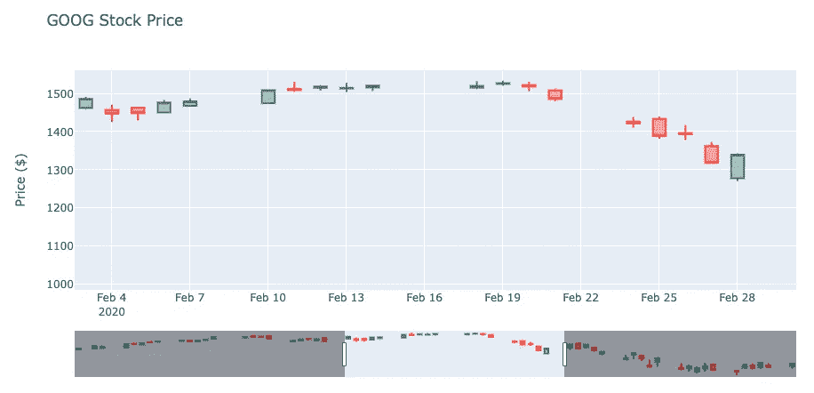

作者图片

您可以将鼠标悬停在特定烛台上，查看当天的交易详情:

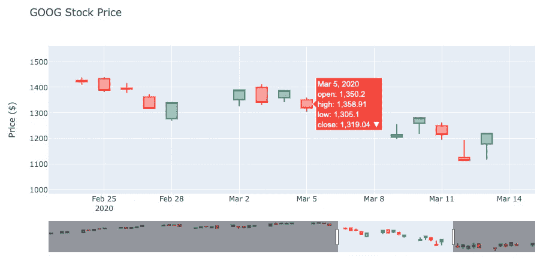

作者图片

您可以通过将`x-axis_rangeslider_visible`参数设置为`False`来隐藏范围滑块:

```
fig.update_layout(
    title='GOOG Stock Price',
    yaxis_title="Price ($)",
 **xaxis_rangeslider_visible=False**
)
```

# 使用袖扣绘制烛台图表

你可以用来绘制烛台图的下一个库是**袖扣**。

> **Cufflinks** 是一个 Python 库，直接与 Pandas 连接，这样你就可以直接从 Pandas 数据帧中绘图。

要安装袖扣，请使用以下命令:

```
$ **pip install cufflinks**
```

袖扣可以很容易地创建一个蜡烛图，加上能够添加额外的图表到当前的情节非常容易。

要绘制一个蜡烛图，使用`QuantFig`类并传递给它包含你的股票数据的 dataframe。然后，调用`QuantFig`对象的`iplot()`函数:

```
import cufflinks as cf
cf.go_offline()qf = cf.QuantFig(df, title='GOOG (2020)', name='GOOG')qf.iplot()
```

> 由于 Plotly 是一个在线平台，如果您在在线模式下使用它，您需要提供登录凭证。因此，当我们使用 Jupyter 笔记本电脑时，我们将使用离线模式。

袖扣创造的烛台情节看起来是这样的:

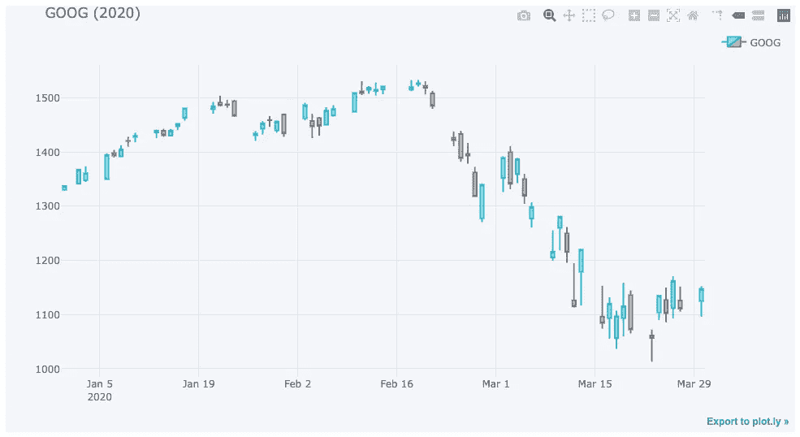

作者图片

与 Plotly 一样，Cufflinks 创建的情节是交互式的，您可以放大想要关注的情节部分，并将鼠标悬停在特定烛台上，将显示交易细节:

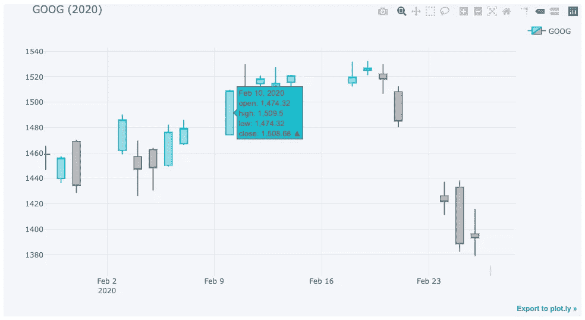

作者图片

您可以使用`up_color`和`down_color`参数配置烛台的颜色:

```
qf = cf.QuantFig(df, name='GOOG', title='GOOG (2020)', 
                 **up_color='green',
                 down_color='red'**)
```

看涨烛台现在显示为绿色，而看跌烛台现在显示为红色:

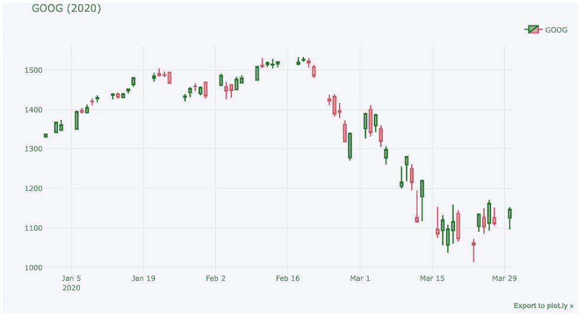

作者图片

您还可以轻松地向当前绘图添加附加图表。例如，假设您想要添加一个使用 14 天收盘价的 **SMA** ( **简单移动平均线**)图。使用`add_sma()`功能可以很容易地做到这一点:

```
qf = cf.QuantFig(df, name='GOOG', title='GOOG (2020)', 
                 up_color='green',
                 down_color='red')
**qf.add_sma(periods=14, column='Close', color='blue')**
```

> **简单移动平均线** (SMA)计算所选价格范围的平均值，通常是收盘价，乘以该范围内的周期数。

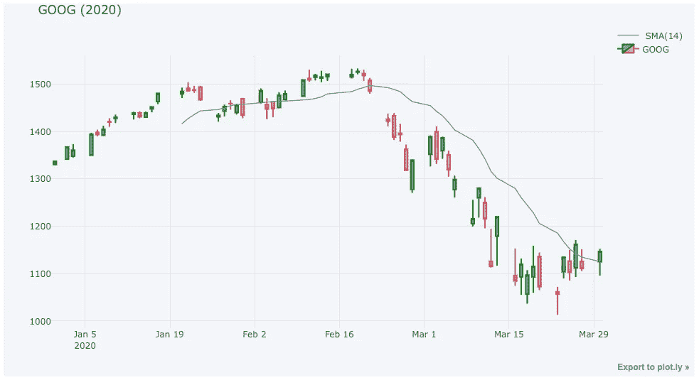

作者图片

如果您想要 SMA 的不同周期，您可以传入一个`periods`和`color`参数列表:

```
qf.add_sma(periods=**[14,20]**, column='Close', color=**['blue','green']**)
```

现在你会有两个 14 天和 20 天的 SMA 图:

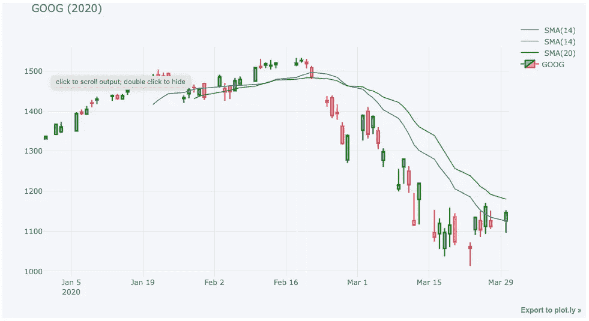

作者图片

除了 SMA，你还可以绘制一个**均线** ( **指数移动平均线**)图:

```
**qf.add_ema(periods=14, column='Close', color='magenta')**
```

> **指数移动平均线** (EMA)是一种移动平均线，它对最近的数据点赋予更大的权重和重要性。

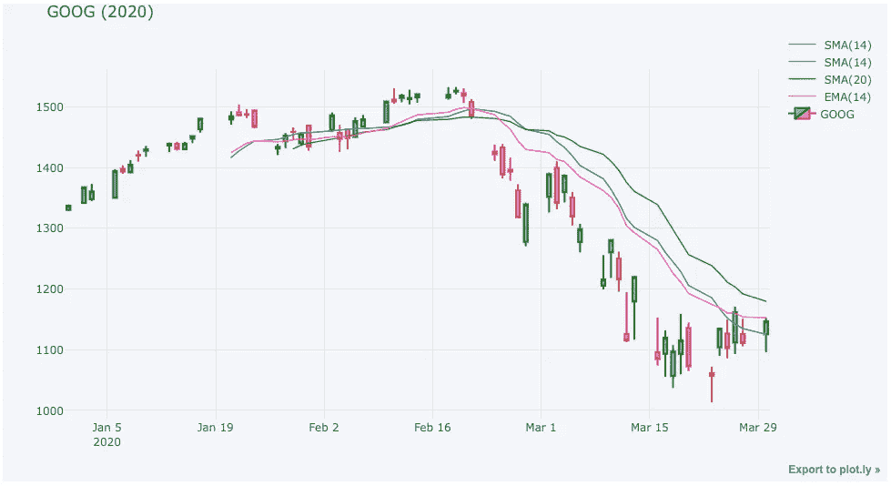

作者图片

您也可以将趋势线添加到当前图中:

```
**qf.add_trendline('2Jan20','17Jan20', on='close')  # '%d%b%y'**
```

注意现在有一条从 2020 年 1 月 2 日到 2020 年 1 月 17 日的趋势线:

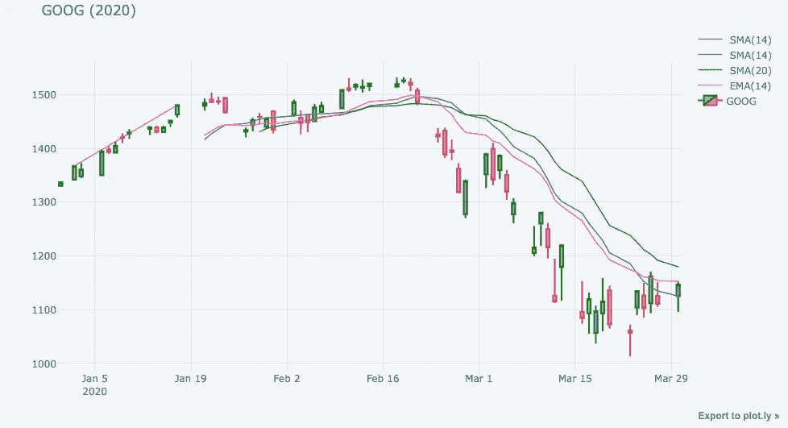

作者图片

你也可以在图上添加一个 **RSI** 图:

```
**qf.add_rsi(periods=14, color='red')**
```

**相对强弱指数** (RSI)是金融分析中使用的动量指标。RSI 计算最近价格运动的变化，以检查它是超买还是抛售:

*   RSI 值范围从 0 到 100
*   传统上，任何高于 70 的价值都被高估，任何低于 30 的价值都被低估

RSI 图被添加到蜡烛图的下方:

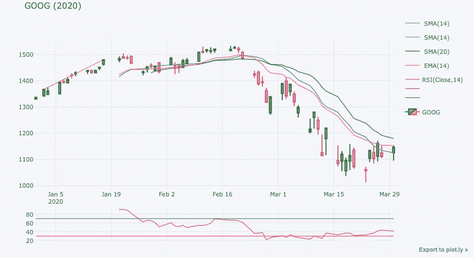

作者图片

绿线代表 70%的标志，而红线代表 30%的标志。

最后，您还可以添加一个体积条形图:

```
**qf.add_volume()**
```

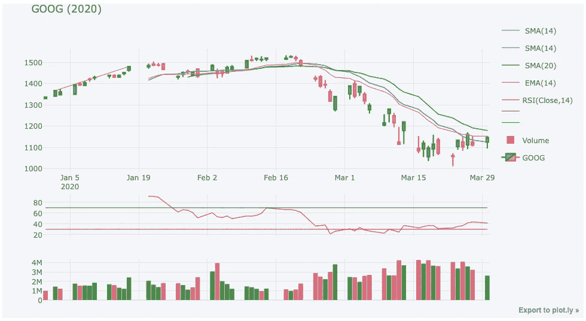

作者图片

如你所见，袖扣让你很容易在一个图中绘制所有不同的图表。

# 使用 bqplot 绘制蜡烛图

我要讨论的最后一个库是 **bqplot** 。

> **Bqplot** 是由彭博开发团队开发的 python 库。

您需要使用以下命令安装 **bqplot** :

```
!pip install bqplot
```

安装后，关闭 Jupyter 笔记本，然后重新启动。如果 **bqplot** 无法显示图表(使用下面的例子)，执行以下步骤(记得关闭并重启 Jupyter 笔记本):

```
$ **jupyter labextension install** [**@jupyter**](http://twitter.com/jupyter)**-widgets/jupyterlab-manager**
$ **jupyter labextension install bqplot**
```

以下代码片段使用 **bqplot** 库创建烛台图:

```
from bqplot import pyplot as pltfig = plt.figure(title = "GOOG 2020")
fig.layout.width = "750px"ohlc = plt.ohlc(x = df.index, 
                y = df[["Open","High","Low","Close"]],
                marker = "candle", 
                stroke = "black")
ohlc.colors=["lightgreen", "red"]plt.show()
```

这里是由 **bqplot** 创建的图:

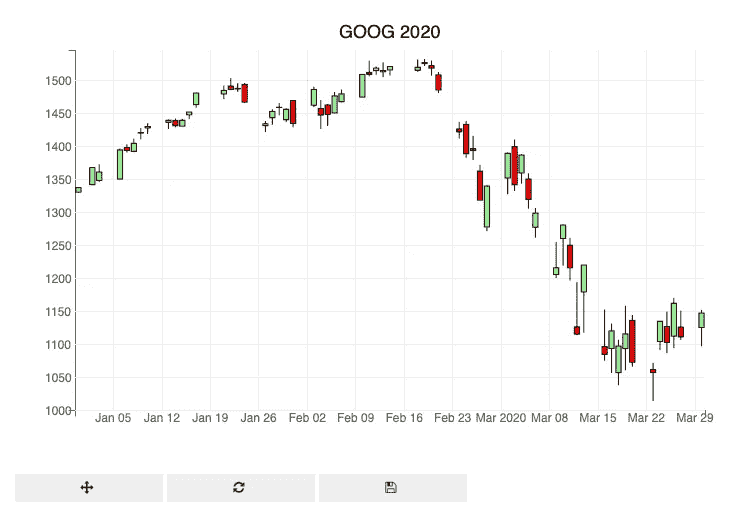

作者图片

像 matplotlib 一样，您也可以添加显示收盘价的折线图:

```
from bqplot import pyplot as pltfig = plt.figure(title = "GOOG 2020")
fig.layout.width = "750px"ohlc = plt.ohlc(x = df.index, 
                y = df[["Open","High","Low","Close"]],
                marker = "candle", 
                stroke = "black")
ohlc.colors=["lightgreen", "red"]**plt.plot(x = df.index, y = df['Close'])
plt.xlabel("Date")**
plt.show()
```

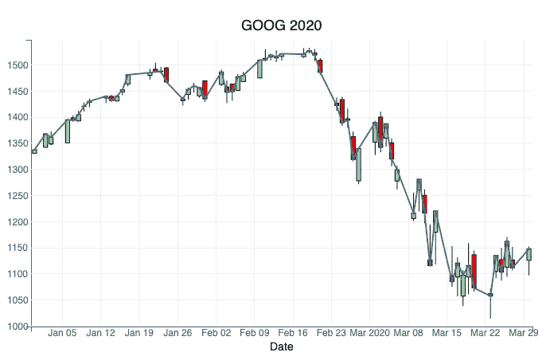

作者图片

要放大地图，您需要点击**全景缩放**按钮(左侧按钮)，然后使用鼠标滚轮放大/缩小地图:

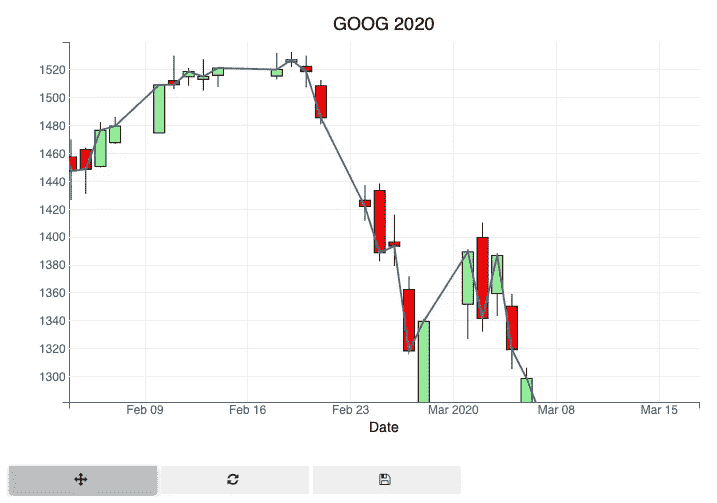

作者图片

要在将鼠标悬停在烛台上时显示工具提示，请添加以下粗体语句:

```
from bqplot import pyplot as plt
**from bqplot import Tooltip**fig = plt.figure(title = "GOOG 2020")
fig.layout.width = "750px"**tool_tip = Tooltip(fields=['open','high','low','close'],
                   show_labels = True)**ohlc = plt.ohlc(x = df.index, 
                y = df[["Open","High","Low","Close"]],
                marker = "candle", 
                stroke = "black",
                **tooltip = tool_tip**)ohlc.colors=["lightgreen", "red"]plt.plot(x = df.index, y = df['Close'])
plt.xlabel("Date")
plt.show()
```

> 注意，对于传递到`Tooltip`类的`fields`参数中的项目，它们必须是小写的。

当你悬停在烛台上时，工具提示会弹出:

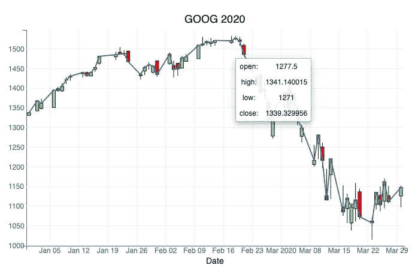

作者图片

# 摘要

我希望这篇文章为您提供了一些显示股票数据的蜡烛图的选项。就我个人而言，我最喜欢的是袖扣，因为它可以很容易地为你的情节添加额外的图表。然而，如果您想要更好地控制绘图的外观，matplotlib 仍然是一个不错的选择，尽管需要更多的工作。

[](https://weimenglee.medium.com/membership) [## 加入媒介与我的介绍链接-李伟孟

### 作为一个媒体会员，你的会员费的一部分会给你阅读的作家，你可以完全接触到每一个故事…

weimenglee.medium.com](https://weimenglee.medium.com/membership)