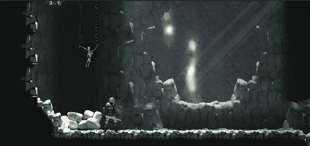

# 制造敌人的战利品

> 原文：<https://levelup.gitconnected.com/creating-collectables-in-unity-2-0-bad17a229399>

## 初级游戏开发

## //敌人丢下一些战利品！



给我们一些应得的战利品

在之前的一篇文章中，我讨论了如何创建一个可以被游戏中的玩家收集的对象。今天我们会让我们的敌人掉落一些他们应得的战利品，让这变得更有趣一点。

在 Unity 中创建收藏。抓住金子！|作者詹姆斯·韦斯特|技术书呆子|媒体

现在我们知道了如何创建一个收藏品，我们需要让死去的敌人扔掉它，并根据我们杀死的敌人的类型给它赋值。

这将在 3 个不同的脚本中完成。一个新的收藏脚本，并更新了玩家和敌人的脚本。

**新收藏的剧本**

钻石收藏的脚本将处理与玩家的冲突，并更新告诉玩家增加多少价值。

```
public class **Diamond** : MonoBehaviour
{
    *// Start is called before the first frame update* private int _gemValue = 1;
    private bool collected;

    public void SetValue(int value)
    {
        _gemValue = value;
    }

    private void **OnTriggerEnter2D**(Collider2D other)
    {
        if (collected) return;
        if (!other.CompareTag("PlayerController")) return;
        var player = other.gameObject.GetComponent<Player>();
        if (player == null) return;
        player.AddGems(_gemValue);
        collected = true;
        Destroy(gameObject);
    }
}
```

我们首先设置变量来保存 gem 的值，并将其初始化为 1。这将是默认值，除非我们从敌人那里覆盖它。为当前 gem 和冲突检测方法设置 gem 值的公共方法。我们使用收集的布尔值**来防止钻石被多次收集。**

**敌方脚本角色**

敌人的脚本将处理战利品的实例化并给它赋值。我们将会看到掉落战利品的代码细节。如果你想查看完整的敌方脚本，你可以在 GitHub 上查看

[](https://github.com/Valdarix/AndroidDungeonCert/blob/master/Assets/Scripts/Enemy.meta) [## AndroidDungeonCert/enemy . meta at master Valdarix/AndroidDungeonCert

### 在 GitHub 上创建一个帐户，为 Valdarix/AndroidDungeonCert 的开发做出贡献。

github.com](https://github.com/Valdarix/AndroidDungeonCert/blob/master/Assets/Scripts/Enemy.meta) 

```
[SerializeField] private GameObject **_gemObject**;
[SerializeField] protected int **gemValue**;
```

我们添加的第一件事是一个变量来保存对可收集的预置的引用。它也有一个变量来保存分配给敌人战利品的值。

在处理敌人死亡的 **Damage()** 方法中，我们添加了下面的代码。

```
var instantiationPoint = sprite.transform;
var gem = Instantiate(_gemObject, instantiationPoint.position, Quaternion.identity);
gem.gameObject.GetComponent<Diamond>().SetValue(gemValue);
```

这段代码在他死后实例化 gem，然后将敌方脚本的 gemValue 赋给新创建的 gem。这是当玩家收集到它时将会增加的价值。

**玩家脚本角色**

玩家有最简单的工作，它更新玩家拥有的宝石总数。

```
public void AddGems(int value)
{
    _gems += value;
}
```

这是通过播放器脚本中的一个新方法完成的。当玩家收集到一个宝石时，它调用 **AddGems()** 从敌人那里获得指定值。

**结论**

有了这个，我们现在可以有一个战利品系统，敌人可以掉落一个物品让玩家收集。我们可以通过在一个更复杂的系统中创建战利品表来进一步扩展。