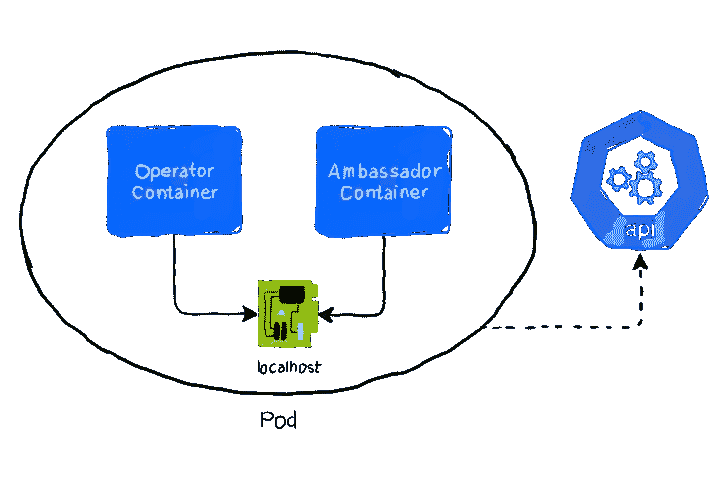

# 创建自定义 Kubernetes 运算符

> 原文：<https://levelup.gitconnected.com/creating-custom-kubernetes-operators-f15ec1dadff2>

*本文原载于*[https://www . magalix . com/blog/creating-custom-kubernetes-operators](https://www.magalix.com/blog/creating-custom-kubernetes-operators)

# 操作员还是自定义控制器？

当我第一次接触这个话题时，我对一个对象有些困惑，即[扩展了 Kubernetes](https://www.magalix.com/blog/extending-the-kubernetes-controller) 的功能应该被称为操作符还是自定义控制器。深入挖掘这个主题，我了解到这两个术语广义上指的是同一个概念；使用 [Kubernetes](https://www.magalix.com/blog/kubernetes-101-concepts-and-why-it-matters) 的模块化和原子性来创建一个控制器，该控制器响应特定事件并执行定制动作。在另一篇文章中，我们创建了一个我们自己的控制器，它响应配置图中的变化，并重启任何正在使用这个[配置图](https://www.magalix.com/blog/the-configmap-pattern)的 pod。

自定义控制器通过检查包含 Pod 标签的配置图的注释部分来确定重新启动哪些 Pod。在更高级的情况下，我们需要控制器响应非 Kubernetes 本地的定制资源。因此，当定制控制器在本地 [Kubernetes 资源](https://www.magalix.com/blog/kubernetes-resource-requests-and-limits-101)和事件上操作和监听时，操作员使用定制资源定义(CRD)，用户创建的资源来解决复杂的业务问题。操作员可以被认为是人类操作员的替代品。知道应用程序的技术细节，也知道业务需求并据此行动的人。

# 一个经营者能带来什么？

操作员是一个运行在 [Pod](https://www.magalix.com/blog/kubernetes-pods-101-the-cluster-sailors) 上的程序，并保持与 API 服务器的持续连接。如前所述，运营商处理 CRDs。那么，一个典型的操作员是如何工作的，什么时候应该使用他来代替[定制控制器](https://www.magalix.com/blog/extending-the-kubernetes-controller)？让我们举个简单的例子。

假设您作为 Kubernetes 管理员的工作需要创建多个 MySQL 数据库集群。自然，一个集群和另一个集群之间存在细微的差异，比如节点数量、[存储](https://www.magalix.com/blog/kubernetes-storage-101)容量，甚至是 MySQL 镜像版本。但是最终，你仍然需要创建像 [StatefulSets](https://www.magalix.com/blog/kubernetes-statefulsets-101-state-of-the-pods) 和服务这样的本地资源，并且仍然以“大致”相同的方式配置它们。

现在，如果您有一个名为 MySQLCluster 的资源会怎么样呢？它使用自己的定义文件，可能如下所示:

```
apiVersion: cr.mysqloperator.grtl.github.com/v1
kind: MySQLCluster
metadata:
  name: "my-cluster"
spec:
  secret: "my-secret"
  fromBackup: "my-backup-2017-12-14-01-22"
  port: 3306
  replicas: 2
  storage: "1Gi"
  image: "mysql:latest"
```

现在，Kubernetes 如何知道如何处理 MySQLCluster？它不是像部署、服务或 Pod 那样的本地资源。为了指导 Kubernetes 如何解释和使用这个资源，我们需要部署一个扩展 API 的操作符。继续上面的示例，可以使用以下命令部署操作员:

```
kubectl run mysql-operator --image=grtl/mysql-operator:latest
```

。是的，它只是一个在吊舱中运行的程序。但是，当它运行时，它会自动向 API 服务器注册一个自定义资源定义(CRD)。这就是 Kubernetes 识别和知道如何处理 MySQLCluster 资源的方式。

当您应用上面的定义时，尽管没有名为 MySQLCluster 的本地 Kubernetes 资源，它仍然有效。但是，资源将被创建，因为有一个定制控制器(Operator)正在监视 MySQLCluster 类型对象的 API。一旦它接收到感兴趣的事件，它就触发适当的动作作为响应。值得注意的是，上面的例子取自 GRTL mysql-operator。读完这篇文章后，我强烈推荐你看看这个操作符是如何在 https://github.com/grtl/mysql-operator[上构建的。](https://github.com/grtl/mysql-operator)

因此，在我们的例子中，一旦应用了这个定义，操作者就创建了几个本地 Kubernetes 资源，比如 StatefulSet、服务、sidecar 容器、健康和就绪探测器等等。也许现在，你会问:

# 舵轮图不就是这样吗？

另一个混淆的来源是什么时候使用 [Helm](https://www.magalix.com/blog/the-best-kubernetes-tutorials) 图表，什么时候使用操作符，因为它们都是自动创建 Kubernetes 对象的。事实上，操作符和掌舵图并不是相互替代的。它们是相辅相成的。回到我们的 MySQL 集群示例，组成集群的定制控制器和 CRD 可以作为 Helm 图表的一部分进行部署。

一个操作者不仅仅构建本地的 Kubernetes 资源，他还拥有必要的特定领域的知识来以一种使应用程序正常工作的方式操作这些资源。因此，如果我们要通过舵图(不涉及操作员)部署我们的 MySQL 集群，我们将部署一个[statefullset](https://www.magalix.com/blog/kubernetes-statefulsets-101-state-of-the-pods)、一个[持久卷](https://www.magalix.com/blog/kubernetes-storage-101)、一个 [Secret](https://www.magalix.com/blog/kubernetes-secrets-101) 、一个 [Service](https://www.magalix.com/blog/kubernetes-services-101-the-pods-interfaces) 等等。仅此而已。

Helm 不知道(也无法处理)这些组件如何相互交互以形成一个正常运行的数据库集群。运算符用于有状态的应用程序。有状态应用程序(如数据库、消息队列系统、缓存系统等。)需要一种特定的方式来处理它们如何启动、如何扩展以及如何关闭。操作员取代了手动执行这些任务的人类操作员，而舵轮图更容易将操作员部署为其他组件的一部分。让我们来看看下图:


这里，使用了一个舵图来部署环境。它利用了 Kubernetes 的本地资源，如部署、工作、Docker 图像和秘密。假设这是应用程序的前端部分，后端需要一个具有紧密耦合资源的数据库集群，这些资源作为一个单元一起工作。操作员负责创建和管理这个自定义资源。它还可以创建这个定制资源的多个实例(想想彼此交互的多个数据库集群)。这里的运营商是整个基础设施的一部分，它是通过舵图部署的。

# 实验:构建自定义 Kubernetes 操作符

在本实验中，我们将构建一种特殊类型的 ConfigMap，其中包含在其定义中使用它的 pod 的标签。因此，我们正在创建一个自定义资源定义(CRD)。值得注意的是，我们在本文中创建了一个使用定制控制器的类似示例，扩展了 Kubernetes 控制器。然而，在我们使用定制控制器实现这一功能和我们当前使用操作符实现这一功能之间有一些微妙的区别。让我们暂停一下，解释一下这两种方法有什么不同。


从上图中可以看出，定制控制器持续监视 API 服务器，查看特定配置图中的变化。一旦检测到一个，它就从配置图的注释部分提取窗格选择器，并使用它来重新启动与选择相匹配的窗格，以反映更改。

另一方面，当使用操作符时，您可以创建一个自定义资源定义(CRD ),该定义引用一个配置映射以及受影响的 Pod 的 Pod 选择器。通过这种方式，您可以将配置图与其窗格分离，因为您不再需要将标签添加到其注释中。因此，您可以对不同的应用程序使用不同的配置图。这可以用下面的例子来说明:


因为这是一个相当长的实验，所以让我们把它分成几个阶段，从架构开始。

# 建筑

我们的操作员需要连接到 API 服务器来观察 CRD 的变化，从而决定应该采取哪种行动。有两种主要的方法可以连接到 Kubernetes API 服务器；通过客户端库和 Kubectl 代理。许多现代编程语言都提供了用于连接和处理 Kubernetes 的 SDK。其中一些是 Kubernetes 官方支持的(不用说，Golang 拥有最丰富的库)，还有许多是 T2 社区支持的。

如果您的需求不复杂，那么使用 [kubectl 代理](https://kubernetes.io/docs/tasks/access-kubernetes-api/http-proxy-access-api/)方法可能会更好。使用一个简单的 kubectl 命令，您可以打开一个反向代理，监听您选择的端口。任何到达该端口的 HTTP 请求都会被自动转发到 API 服务器。虽然您使用 kubectl 的控制力较弱，但是您可以节省自己编写连接到 API 的代码的时间。

在本实验中，我们将使用 kubectl 代理方法。因为我们通过常规部署来部署操作符(最终，操作符只是一个程序)，所以我们将有一个包含两个容器的 Pod:

*   操作者容器:它包含监视 API 和检测感兴趣的变化的程序。
*   大使容器:它只是运行 kubectl 代理。操作员容器使用它来连接 API 服务器。有关大使模式的更多信息，请参考我们的文章，大使模式。

下图描述了这种架构:



# 自定义资源定义(CRD)

CRD 是使用自己的定义文件创建的，就像任何其他 Kubernetes 资源一样。现实世界中的运营商可能会在运营商的代码中捆绑创建和注册 CRD。例如，前面描述的 [mysql-operator](https://github.com/grtl/mysql-operator) 在启动时注册它的 CRD。让操作员来处理 CRD 创建，可以节省时间并抽象流程，以便您可以专注于业务需求。在本实验中，我们将手动创建 CRD，以了解其工作原理。我们的 CRD 的定义文件可能如下所示:

```
---
apiVersion: apiextensions.k8s.io/v1beta1
kind: CustomResourceDefinition
metadata:
  name: configmonitors.magalix.com
spec:
  scope: Namespaced
  group: magalix.com
  version: v1
  names:
    kind: ConfigMonitor
    singular: configmonitor
    plural: configmonitors
  validation:
    openAPIV3Schema:
      properties:
        spec:
          properties:
            configMap:
              type: string
              description: "Name of the ConfigMap to watch for changes"
            podSelector:
              type: object
              description: "Label selector used for selecting Pods"
              additionalProperties:
                type: string
---
apiVersion: rbac.authorization.k8s.io/v1
kind: Role
metadata:
  name: config-monitor-crd
rules:
- apiGroups:
  - magalix.com
  resources:
  - configmonitor
  - configmonitor/finalizers
  verbs: [ get, list, create, update, delete, deletecollection, watch ]
```

注意，上面的代码片段包含两个定义:CRD 和 RBAC 角色，它需要能够扩展 API 服务器。让我们强调一下 CRD 定义的重要方面:

**第 2 行和第 3 行:**允许您添加 CRD 的 API 版本。CRD 通过自己的资源添加到集群中。资源类型为 CustomResourceDefinitinon。

**第 7 行:**范围定义了这个资源是对整个集群可用还是对它所在的名称空间可用。如果一个名称空间被删除，与之相关的所有 CRD 也会被删除。

**第 8 行和第 9 行:**组和版本定义了如何调用 REST 端点。在我们的示例中，这是/apis/magalix.com/v1。

**第 10 到 13 行:**指定我们将如何调用我们的新资源。资源在三个地方被调用:

*   API 端点中使用了复数名称。在我们的示例中，应该是/APIs/magalix . com/v1/config minotors。
*   单数名称是在 CLI 上使用的名称，例如在使用 kubectl 子命令时。它也用于显示结果。

**第 14 行到第 26 行:**文件中剩余的行用于验证将使用这个 CRD 创建的资源。它使用 [OpenAPI 规范](https://github.com/OAI/OpenAPI-Specification/blob/master/versions/3.0.0.md#schemaObject)版本 3。验证用于确保使用正确的字段类型和值。例如，Pod 定义的容器参数需要一个容器对象数组。添加单个字符串值会造成问题，因此验证可以确保如果输入了不正确的值，API 会拒绝定义，并且不会创建资源。在我们的例子中，我们期望:

*   **配置映射参数**:指定配置映射资源名称的字符串。
*   **pod selector 参数:**这是用于选择 pod 的标签的占位符。标签本身是一个字符串，因此通过指定 additionalProperties 参数，允许对象具有一个或多个字符串值。

文件的第二部分包含我们在 CRD 中使用的角色的定义。该角色允许 CRD 访问定义资源的 API 组以及终结器部分上的谓词。当您需要在删除资源之前执行一个或多个操作时，可以使用终结器。在我们的例子中，我们没有为资源指定任何终结器逻辑。

让我们使用 kubectl 应用上面的定义:

```
$ kubectl apply -f crd.yml
customresourcedefinition.apiextensions.k8s.io/configmonitors.magalix.com created
role.rbac.authorization.k8s.io/config-monitor-crd created
```

# 配置监视器资源

现在，我们的集群识别 ConfigMonitor 类型的资源，让我们创建一个。该资源的定义文件如下所示:

```
apiVersion: magalix.com/v1
kind: ConfigMonitor
metadata:
  name: flakapp-config-monitor
spec:
  configmap: flaskapp-config
  podSelector:
    app: frontend
```

如您所见，该定义使用了我们在 CRD 中指定的字段。我们有 configmap 名称和标签，我们将使用它们来选择 podSelector 部分中的 pod。

# 演示应用程序

我们的演示应用程序只是一个 Python flask API，它用一条消息来响应 HTTP 请求。该消息来自稍后将存储在 configmap 中的配置文件。应用程序代码如下所示:

app/main.py:

```
from flask import Flask
app = Flask(__name__)
[@app](http://twitter.com/app).route("/")
def hello():
    app.config.from_pyfile('/config/config.cfg')
    return app.config['MSG']if __name__ == "__main__":
    # Only for debugging while developing
    app.run(host='0.0.0.0', debug=True, port=80)
```

让我们构建并推送应用程序，以便以后使用:

```
docker build -t magalixcorp/flask:cusop
docker push magalixcorp/flask:cusop
```

# 配置图

我们的应用程序是一个简单的 Python Flask API 应用程序，当其端点被点击时显示一条消息。该消息是从我们存储在 ConfigMap 中的配置文件中读取的。配置映射定义如下所示:

```
apiVersion: v1
kind: ConfigMap
metadata:
  name: flaskapp-config
data:
  config.cfg: 
    MSG="Welcome to Kubernetes!"
```

使用 kubectl apply 命令将上述定义应用到集群中。

kubectl apply -f configmap.yml

到目前为止，我们已经准备好了所有的组件。让我们创建一个将它们联系在一起的操作符。

# 接线员

操作符只是一个程序(如前所述)。它可以用你选择的任何编程语言编写。Python，Ruby，Go，JavaScript，Java，甚至 bash 都可以。Go 之所以在编写操作符时被广泛使用，是因为它为 Kubernetes 提供了丰富的客户端库，而不是因为它是构建操作符的唯一方式。在我们的实验室中，我们将使用 Python。应用程序打开与 API 服务器的持续连接，并观察配置图的变化。一旦检测到更改，它将在 configmonitors 类型的资源中搜索匹配的 ConfigMap 名称。找到后，configmonitor 会提供必要的标签，操作员可以通过这些标签通过 podSelector 参数搜索 pod。我们的运算符的代码文件如下所示:

```
import requests
import os
import json
import logging
import syslog = logging.getLogger(__name__)
out_hdlr = logging.StreamHandler(sys.stdout)
out_hdlr.setFormatter(logging.Formatter('%(asctime)s %(message)s'))
out_hdlr.setLevel(logging.INFO)
log.addHandler(out_hdlr)
log.setLevel(logging.INFO)base_url = "[http://127.0.0.1:8001](http://127.0.0.1:8001)"namespace = os.getenv("res_namespace", "default")# This is the function that searches for and kills Pods by searching for them by labeldef kill_pods(labels):
    # We receive labels in the form of a list
    for label in labels:
        url = "{}/api/v1/namespaces/{}/pods?labelSelector={}".format(
            base_url, namespace, label)
        r = requests.get(url)
        # Make the request to the endpoint to retreive the Pods
        response = r.json()
        # Extract the Pod name from the list
        pods = [p['metadata']['name'] for p in response['items']]
        # For each Pod, issue an HTTP DELETE request
        for p in pods:
            url = "{}/api/v1/namespaces/{}/pods/{}".format(
                base_url, namespace, p)
            r = requests.delete(url)
            if r.status_code == 200:
                log.info("{} was deleted successfully".format(p))
            else:
                log.error("Could not delete {}".format(p))# This function is used to extract the Pod labels from the configmonitor resource.
# It takes the configmap name as the argument and uses it to search for configmonitors
# that have the configmap name in its spec
def getPodLabels(configmap):
    url = "{}/apis/magalix.com/v1/namespaces/{}/configmonitors".format(
        base_url, namespace)
    r = requests.get(url)
    # Issue the HTTP request to the appropriate endpoint
    response = r.json()
    # Extract the podSelector part from each object in the response
    pod_labels_json = [i['spec']['podSelector']
                       for i in response['items'] if i['spec']['configmap'] == "flaskapp-config"]
    result = [list(l.keys())[0] + "=" + l[list(l.keys())[0]]
              for l in pod_labels_json]
    # The result is a list of labels
    return result# This is the main function that watches the API for changesdef event_loop():
    log.info("Starting the service")
    url = '{}/api/v1/namespaces/{}/configmaps?watch=true"'.format(
        base_url, namespace)
    r = requests.get(url, stream=True)
    # We issue the request to the API endpoint and keep the conenction open
    for line in r.iter_lines():
        obj = json.loads(line)
        # We examine the type part of the object to see if it is MODIFIED
        event_type = obj['type']
        # and we extract the configmap name because we'll need it later
        configmap_name = obj["object"]["metadata"]["name"]
        if event_type == "MODIFIED":
            log.info("Modification detected")
            # If the type is MODIFIED then we extract the pod labels by using the getPodLabels function
            # passing the configmap name as a parameter
            labels = getPodLabels(configmap_name)
            # Once we have the labels, we can use them to find and kill the Pods by calling the
            # kill_pods function
            kill_pods(labels)event_loop()
```

# 操作员部署

正如您在代码文件中看到的，我们的操作符只是一个 Python 程序。我们将通过将它添加到 Docker 容器并将其推送到注册表来将其部署到集群。我们还需要另一个容器作为[大使容器](https://www.magalix.com/blog/tag/ambassador)。

# 操作员应用程序容器

应用程序容器的 docker 文件如下所示:

```
FROM python:latest
RUN pip install requests
COPY main.py /main.py
ENTRYPOINT [ "python", "/main.py" ]
```

我们需要建立并推广这个 Dockerfile 文件:

```
docker build -t magalixcorp/operator .
docker push magalixcorp/operator
```

# 部署文件

sidecar 或大使容器只是一个包含 kubectl 的图像。我们将使用它来运行 kubectl 代理命令。将两个容器组合在一个[部署](https://www.magalix.com/blog/kubernetes-deployments-101)中，如下所示:

```
apiVersion: apps/v1
kind: Deployment
metadata:
  name: operator
  labels:
    app: operator
spec:
  selector:
    matchLabels:
      app: operator
  template:
    metadata:
      labels:
        app: operator
    spec:
      containers:
      - name: proxycontainer
        image: lachlanevenson/k8s-kubectl
        command: ["kubectl","proxy","--port=8001"]
      - name: app
        image: magalixcorp/operator
        env:
          - name: res_namespace
            valueFrom:
              fieldRef:
                fieldPath: metadata.namespace
```

注意，我们将名称空间作为环境变量注入到操作应用程序中。名称空间本身来自向下 API，这是 Kubernetes 的一个特性，允许您获取关于当前对象设置的信息。关于这个模式以及如何使用它的更多信息，请参考我们的文章‘反射模式’。

到目前为止，我们已经构建并部署了许多组件。在继续测试我们的实验室之前，让我们快速回顾一下我们所做的工作:

*   应用程序映像:应用程序部署窗格使用它来启动应用程序容器。
*   ConfigMap:它包含应用程序容器使用的配置文件。
*   自定义资源定义:这是扩展 API 的资源，使 Kubernetes 能够接受和使用 configmonitors。ConfigMonitor 是一种自定义资源，它具有配置映射的名称以及使用此配置映射的 pod 的标签。
*   ConfigMonitor:基于 CRD，我们创建一个具有 configmap 名称和 pod 标签的 configmonitor 对象。
*   操作符应用程序图像:这是一个包含操作符逻辑的 Python 应用程序。
*   操作员部署:这是运行操作员映像的部署资源。这个部署运行的 Pod 有两个容器:操作员容器和大使(边车)容器。第二个运行 kubectl 代理命令，该命令将命令从操作符容器中继到集群的 API 服务器。

# 启动实验室并测试结果

让我们为我们的演示应用程序创建一个部署。该部署确保当我们的操作员由于配置图更改而删除应用程序窗格时，该应用程序窗格将重新启动。我们的演示应用程序的部署定义如下所示:

```
apiVersion: apps/v1
kind: Deployment
metadata:
  name: frontend
  labels:
    app: frontend
spec:
  selector:
    matchLabels:
      app: frontend
  template:
    metadata:
      labels:
        app: frontend
    spec:
      containers:
      - name: app
        image: magalixcorp/flask:operator
        volumeMounts:
        - name: config-vol
          mountPath: /config
      volumes:
      - name: config-vol
        configMap:
          name: flaskapp-config
```

让我们应用这个部署:

```
kubectl apply -f deployment.yml                                                                                                                                              
deployment.apps/frontend created
```

在开始实验之前，我们需要确保应用程序运行正常。在真实的场景中，您将创建一个服务，并可能创建一个入口来允许您的应用程序接收流量。在我们的例子中，由于我们已经有了很多组件，让我们登录到应用程序容器并对 localhost 发出 curl 命令:

```
kubectl get pods                                                                                                                                                             
NAME                        READY   STATUS    RESTARTS   AGE
frontend-7f8d89fb68-77qv4   1/1     Running   0          25s
operator-6d8464b567-v7sh4   2/2     Running   0          34m
$ kubectl exec -it frontend-7f8d89fb68-77qv4 -- bash                                                                                                                           
root@frontend-7f8d89fb68-77qv4:/app# curl localhost && echo
Welcome to Kubernetes!
```

好了，我们的应用程序用配置图中定义的消息进行响应。让我们更改消息，看看我们的操作员是否会接受更改并做出相应的响应:

让我们更改配置图，使其如下所示:

```
apiVersion: v1
kind: ConfigMap
metadata:
  name: flaskapp-config
data:
  config.cfg: 
    MSG="Welcome to Operators!"
```

让我们应用配置图，看看我们的应用程序窗格会发生什么:

```
$ kubectl apply -f configmap.yml                                                                                                                                               
configmap/flaskapp-config configured
$ kubectl get pods 
```

很明显，前端 pod(演示应用程序)已经重新启动。它只有 4 秒钟。但是让我们通过点击 API 查看消息来仔细检查一下:

```
kubectl exec -it frontend-7f8d89fb68-jgzbz -- bash                                                                                                                          
root@frontend-7f8d89fb68-jgzbz:/app# curl localhost && echo
Welcome to Operators!
```

因此，会显示正确的消息。最后，让我们看看我们的操作员生成的日志消息:

```
$ kubectl logs operator-6d8464b567-v7sh4 -c app                                                                                                                                
2019-09-27 19:44:08,958 Starting the service
2019-09-27 20:22:02,610 Modification detected
2019-09-27 20:22:02,648 frontend-7f8d89fb68-77qv4 was deleted successfully
```

# TL；速度三角形定位法(dead reckoning)

*   尽管 Kubernetes 带来了开箱即用的强大功能，但它的设计方式使其具有高度的模块化和可扩展性。
*   如果您需要与本地 Kubernetes 资源进行交互，比如 pod、服务、配置图等。那么使用定制控制器就没问题了。
*   自定义控制器只不过是一个订阅和监听 API 服务器的程序。当它检测到感兴趣的事件时，它会采取相应的措施，可能会使用事件数据中的信息。
*   如果您的需求更加复杂，您可以决定创建多个本地 Kubernetes 资源的组合。这种组合被称为自定义资源定义(CRD)。
*   使用 CRD，您可以创建一个全功能的 MySQL 集群，它接受节点数量、监听端口等配置参数。您可以像处理其他本地资源一样处理这个集群。
*   CRD 需要一个自己的定制控制器才能正常工作。只是这一次，它被称为一个操作员。操作员是使用 CRDs 的自定义控制器。
*   操作员可以作为掌舵图的一部分进行部署。
*   运算符可以用任何现代编程语言编写。然而，你会发现大多数操作符都是用 Go 编写的，因为它有丰富的客户端库。

*原载于*[https://www . magalix . com/blog/creating-custom-kubernetes-operators](https://www.magalix.com/blog/creating-custom-kubernetes-operators)*2019 年 12 月 9 日。*