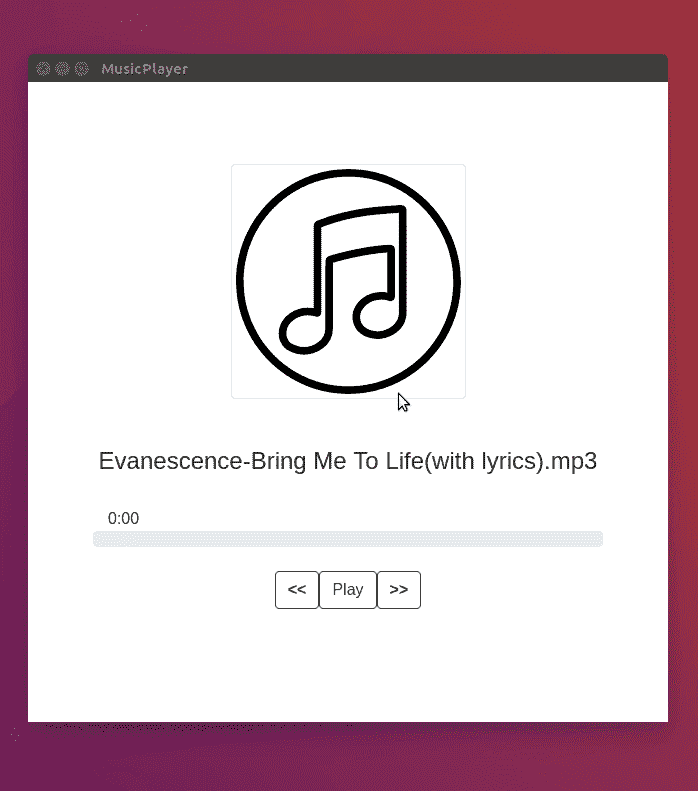

# 使用 Angular 和 ElectronJS 创建自定义音乐播放器桌面应用程序

> 原文：<https://levelup.gitconnected.com/creating-custom-music-player-desktop-app-with-angular-and-electronjs-596d30e8dd9>


在这篇文章中，我将向你展示如何使用 Angular 和 electronic 构建一个音乐播放器原生桌面应用程序。该播放器将与 Windows、Linux 和 MacOS 兼容。

# **什么是电子**

> Electron 是 GitHub 开发的一个开源库，用于使用 HTML、CSS 和 JavaScript 构建跨平台的桌面应用程序。Electron 通过将 Chromium 和 Node.js 合并到一个运行时中来实现这一点，并且可以为 Mac、Windows 和 Linux 打包应用程序。

# **设置角度应用**

首先，我们将使用 Angular CLI 生成新的角度项目:

```
ng new music-player
```

项目创建成功后，`cd`进入目录，使用以下 npm 命令安装电子版:

```
npm install --save-dev electron@latest
```

在项目的根目录下，创建文件`main.js`:

```
touch main.js
```

让我们放一些代码进去。下面的代码将简单地创建一个 GUI 窗口，并加载`index.html`文件，在我们构建好 Angular 应用程序后，该文件应该在`dist`文件夹下。

现在添加`main`键将`main.js`文件设置为`package.json`中的入口点。

还将`**"start:electron"**`脚本添加到脚本中:

```
"name": "music-player",
"version": "0.0.0",
"main": "main.js",
"scripts": {
  "ng": "ng",
  "start": "ng serve",
  "build": "ng build",
  "test": "ng test",
  "lint": "ng lint",
  "e2e": "ng e2e",
 **"start:electron": "ng build --base-href ./ && electron ."**
},
```

现在打开`angular.json`并确保`outputPath`的值为`dist`:

```
"architect": {
  "build": {
    "builder": "@angular-devkit/build-angular:browser",
    "options": {
      "outputPath": "dist",
```

我们将为 UI 使用引导程序。因此，让我们安装它及其依赖项:

```
nenad@hp:~/playground/music-player$ npm install --save bootstrap jquery popper
```

打开`index.html`，加载库(这也可以通过 angular.json 来完成):

我将在资产文件夹中添加几首 mp3 歌曲。

```
./music-player/src/assets$ tree
.
├── Evanescence-Bring Me To Life(with lyrics).mp3
├── logo.png
├── Numb (Official Video) - Linkin Park.mp3
└── System Of A Down - Toxicity (Official Video).mp3
```

创建`model.ts` 文件并导出歌曲界面:

```
export interface ISong {
  id: number;
  title: string;
  path: string;
}
```

现在给`app.component.ts`添加逻辑:

还将代码添加到`app.component.html`:

现在让我们运行命令来启动电子

```
npm run start:electron
```

结果:



你现在有一个本地桌面音乐播放器！剩下的步骤就是为你想要支持的平台(Windows，Mac，Linux)构建它。

如果有人想玩这个或者增加一些功能，github 链接:
[https://github.com/nenadb97/angular-electron-music-player](https://github.com/nenadb97/angular-electron-music-player)

**感谢阅读:)**