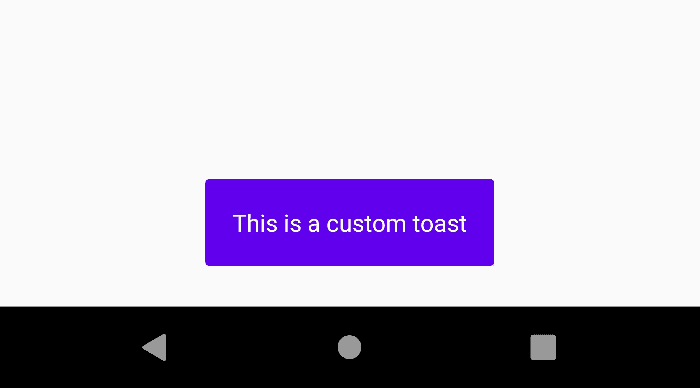
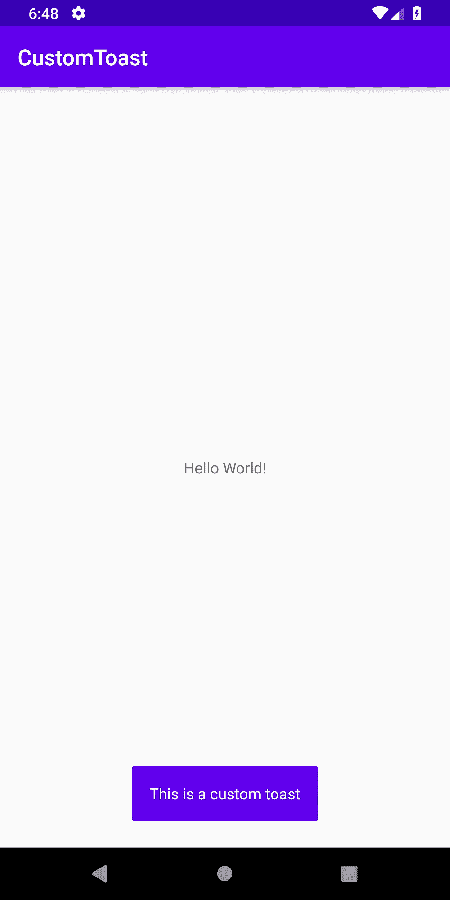

# 在 Android 中创建自定义吐司🌈

> 原文：<https://levelup.gitconnected.com/creating-custom-toast-in-android-4f7fbcb14bf0>



oast 是应用程序开发中经常使用的 UI 元素，用于以温和的方式向用户显示或提示一些消息。提高祝酒词的质量可以大大改善应用程序的用户体验。我们只能通过创建自定义吐司来做到这一点，因为只有这样我们才能完全控制它的外观。

在本文中，我将向您展示一个如何在您的应用程序中创建自定义`Toast`的示例。

为了创建定制的 toast，简单的过程(我们马上会看到细节)是我们创建一个定制的布局，展开这个布局，将视图设置为我们的`Toast`对象，并最终显示它。所以让我们一步一步来:

## 步骤 1:创建我们的自定义吐司布局

*   在 **res/layout** 文件夹中创建一个新的布局资源文件。将布局文件命名为`toast_layout.xml`。
*   因此，我们的布局基本上是一个彩色背景和白色文本的祝酒词(你可以根据自己的要求定制，也许会放一个图标)。所以相同的代码如下:

## 步骤 2:膨胀创建的布局

*   为了放大我们创建的布局，即`toast_layout.xml`，我们将利用`LayoutInflater`类来放大我们的布局，并获得相同的视图。
*   在您的活动中，创建一个名为`showToast(String message)`的方法，它将包含所有的 toast 创建代码。

```
*void* **showToast**(String **message**) {

}
```

*   现在将布局膨胀代码放入这个方法中，如下所示:

```
*void* **showToast**(String **message**) {
       **View** view = **LayoutInflater**.*from*(MainActivity.*this*)
              .inflate(R.layout.**toast_layout**, *null*);
}
```

## 步骤 3:创建 Toast 对象并显示它

*   这是最后一步，我们将视图绑定到 toast 对象，设置它的上下文并最终显示它。所以让我们用和下面一样的方法创建一个`Toast`对象，并给它传递一个上下文。

```
**Toast** toast = *new* **Toast**(**MainActivity**.*this*);
```

*   在我们最终将视图设置为 Toast 并显示它之前，我们需要实际设置我们的消息到我们的`TextView`

```
**TextView** tvMessage = view.**findViewById**(R.id.**tvMessage**);
tvMessage.**setText**(message);
```

*   最后为我们的祝酒词设置视图并展示它！

```
toast.**setView**(view);
toast.**show**();
```

*   您的方法应该如下所示:

在任何你想的地方调用这个方法，屏幕应该显示一个如下的`Toast`:



你当然可以通过使用`gravity`、`duration`、`layout`等自定义`Toast`，以上只是一个例子。

我能够完成的一些祝酒词如下:


所有这些都是完全可以实现的，你只需要相应地设计布局。但是如果你不想做这些冗长的工作，我有东西给你。

我创建了这个名为“TastyToasty”的库，它可以帮助你创建你自己的定制吐司，也可以使用简单的命令行创建如上的吐司:

[](https://github.com/usman18/TastyToasty) [## usman18/TastyToasty

### 一个易于使用的库来创建美味😋各种口味的祝酒🌈它还提供了轻松的方法来…

github.com](https://github.com/usman18/TastyToasty) 

> 感谢您阅读我的文章。如果你真的喜欢，留下一些掌声。更多文章请关注我的媒体。

我的其他个人资料:

*   [推特](https://twitter.com/khan_usman_18)
*   [领英](https://www.linkedin.com/in/usmankhan18/)
*   [Github](https://github.com/usman18)
*   [Instagram](https://www.instagram.com/usman__khan18/)