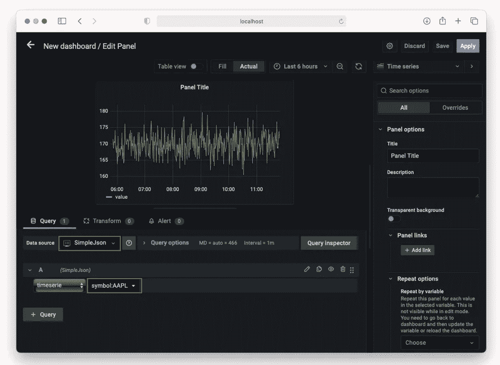

# 使用 Grafana 创建动态自动更新的时间序列

> 原文：<https://levelup.gitconnected.com/creating-dynamic-auto-updated-time-series-using-grafana-6891e1641c05>

## 了解如何使用 SimpleJson 数据源从 REST API 后端获取数据


斯蒂芬·菲利普斯-Hostreviews.co.uk 在 [Unsplash](https://unsplash.com?utm_source=medium&utm_medium=referral) 上的照片

Grafana 的大多数用户都熟悉使用 MySQL 或 CSV 等数据源来构建他们的仪表板。然而，最近我开始了一个项目，需要我从 REST API 后端获取数据。虽然这看起来很简单，但实际上比我最初想象的要复杂得多。这篇文章总结了我所学到的东西，希望能让其他人容易理解。


来源:[https://upload . wikimedia . org/Wikipedia/commons/9/9d/Grafana _ logo . png](https://upload.wikimedia.org/wikipedia/commons/9/9d/Grafana_logo.png)

> rafana 是一个多平台开源分析和交互式可视化网络应用。当连接到支持的数据源时，它为 web 提供图表、图形和警报。

我将讨论如何:

*   构建 REST API 后端，以便 Grafana 的 **SimpleJson** 数据源可以使用它。
*   使用 Grafana 构建前端。我将构建的图表将显示 AAPL 或谷歌(从支持的 REST API 获取)的股价，并将每 5 秒自动更新一次。

# 服务器端

首先，让我们从服务器端开始。在本文中，我将构建一个 REST API，允许客户机根据指定的日期范围检索 AAPL 或谷歌的股票价格。

## 创建示例数据

对于股票价格，我将通过随机生成价格并将其保存在 CSV 文件中来模拟价格。

> 在现实世界中，你的股票数据更可能来自动态更新的数据库。

但是对于本文，我将预先生成 4 天的价格—从当天的前一天到今天之后的 3 天。

首先，为 GOOG 生成模拟股票价格:

```
from datetime import timedelta, timezone
import datetime
import numpy as np
import pandas as pddate_today = datetime.datetime.now()
days = pd.date_range(date_today - timedelta(1), 
                     date_today + timedelta(3), freq = '5s', 
                     tz = timezone.utc)
df = pd.DataFrame(
    {
        'value':np.random.uniform(2500,3200,len(days))        
    }, index = days)
display(df)
df.to_csv('stocks_goog.csv')
```

模拟的股票价格保存为**stokes _ goog . CSV**。接下来，生成 AAPL 的价格:

```
from datetime import timedelta, timezone
import datetime
import numpy as np
import pandas as pddate_today = datetime.datetime.now()
days = pd.date_range(date_today - timedelta(1), 
                     date_today + timedelta(3), freq = '5s', 
                     tz = timezone.utc)
df = pd.DataFrame(
    {
        'value':np.random.uniform(**150**,**190**,len(days))        
    }, index = days)
display(df)
df.to_csv('**stocks_aapl.csv**')
```

模拟的股价保存为 **stocks_aapl.csv** 。以下是 **stocks_aapl.csv** 文件的示例输出:

```
,value
2022-03-16 11:19:56.209523+00:00,184.55338767944096
2022-03-16 11:20:01.209523+00:00,168.76885410294773
2022-03-16 11:20:06.209523+00:00,188.02816186918278
2022-03-16 11:20:11.209523+00:00,164.63482117646518
2022-03-16 11:20:16.209523+00:00,161.33806737466773
2022-03-16 11:20:21.209523+00:00,169.10779687119663
2022-03-16 11:20:26.209523+00:00,169.90405158220707
2022-03-16 11:20:31.209523+00:00,189.30501099950166
...
```

## 创建 REST API

现在让我们把注意力集中在创建 REST API 上，这是这个项目中更具挑战性的方面。

如前所述，您可以使用 Grafana 上的 **SimpleJson** 数据源来连接 REST API。但是它需要 REST API 来实现特定的 URL(详见[https://grafana . com/grafana/plugins/grafana-simple-JSON-data source/](https://grafana.com/grafana/plugins/grafana-simple-json-datasource/))。这意味着您的 REST API 必须专门为 **SimpleJson** 数据源编写。

为了让我的生活更简单，我决定使用**Grafana pandas data source**模块([https://github.com/panodata/grafana-pandas-datasource](https://github.com/panodata/grafana-pandas-datasource))来创建我的 REST API。这个模块运行一个基于 Flask 的 HTTP API，它将 Pandas dataframes 返回给 Grafana，这就是 **SimpleJson** 数据源可以处理的。本模块还提供了一些示例，您可以从中了解如何实现自己的 REST API。

> 我已经改编了提供的一个样本([正弦波-午夜](https://github.com/panodata/grafana-pandas-datasource/tree/main/examples/sinewave-midnights))并为我的目的进行了修改。

创建一个新的文本文件，命名为 **demo.py** 。用以下语句填充它:

```
import numpy as np
import pandas as pdfrom grafana_pandas_datasource import create_app
from grafana_pandas_datasource.registry import data_generators 
    as dg
from grafana_pandas_datasource.service import pandas_componentfrom datetime import datetime, timedelta
from pytz import timezone def define_and_register_data():    
    def get_stock(stock_symbol, ts_range):
        if stock_symbol == 'AAPL':
            df = pd.read_csv('stocks_aapl.csv', 
                parse_dates=True, index_col=0)
        if stock_symbol == 'GOOG':
            df = pd.read_csv('stocks_goog.csv', 
                parse_dates=True, index_col=0) # return the rows that falls within the specified dates
        return df[(df.index > ts_range['$gt']) &
                  (df.index < ts_range['$lte'])] # Register data generators
    dg.add_metric_reader("symbol", get_stock)def main():
    # Define and register data generators.
    define_and_register_data() # Create Flask application.
    app = create_app() # Register pandas component.
    app.register_blueprint(pandas_component, url_prefix="/") # Invoke Flask application.
    app.run(host="127.0.0.1", port=3003, debug=True)if __name__ == "__main__":
    main()
```

请注意以下几点:

*   `define_and_register_data()`函数包含另一个名为`get_stock()`的函数。
*   `add_metric_reader()`函数将 Grafana 发送的查询与处理该查询的函数链接起来。在这种情况下，它将把“**符号**查询与`get_stock()`函数链接起来。
*   Grafana 发送的查询将包含一个值。例如，您可以配置 Grafana 发送一个查询“ **symbol:AAPL** ”。“ **AAPL** 的值将被传递给`get_stock()`函数的第一个参数:


*   `get_stock()`函数的第二个参数`ts_range`，将从 Grafana 中获取其值。稍后你会看到这一点。
*   在`get_stock()`函数中，我加载了所需的 CSV 文件，然后执行过滤，只返回与 Grafana 传入的时间范围(`ts_range`)匹配的行。在现实生活中，您应该从数据库服务器加载数据。
*   REST API 监听本地机器上的端口 3003。

在运行 REST API 之前，您需要安装**grafana-pandas-data source**模块:

```
$ **pip install grafana-pandas-datasource**
```

您现在可以运行 REST API 了:

```
$ **python demo.py**
```

> 如果您看到类似“导入错误:无法从‘markup safe’导入名称‘soft _ unicode’”的错误，请执行以下操作:`pip install markupsafe==2.0.1`

您应该看到以下内容:

```
* Serving Flask app "grafana_pandas_datasource" (lazy loading)
* Environment: production
WARNING: This is a development server. Do not use it in a production deployment.Use a production WSGI server instead.
* Debug mode: on
2022-03-17 13:37:38,454.454 [werkzeug                 ] INFO   :  * Running on http://127.0.0.1:3003/ (Press CTRL+C to quit)
2022-03-17 13:37:38,455.455 [werkzeug                 ] INFO   :  * Restarting with stat
2022-03-17 13:37:38,895.895 [werkzeug                 ] WARNING:  * Debugger is active!
2022-03-17 13:37:38,902.902 [werkzeug                 ] INFO   :  * Debugger PIN: 301-215-354
```

## 测试 REST API

现在可以测试 REST API 了。您可以使用 **curl** 实用程序发出以下命令:

```
$ **curl -H “Content-Type: application/json” -X POST** [**http://127.0.0.1:3003/query**](http://127.0.0.1:3003/query) **-d ‘{“targets”: [{“target”: “symbol:GOOG”}], “range”: {“from”: “2022–03–17 03:00:49.110000+00:00”, “to”: “2022–03–17 03:05:49.110000+00:00”}}’**
```

结果看起来像这样:

```
[
  {
    "datapoints": [
      [
        3169.441653300435, 
        1647486052594
      ], 
      [
        2748.501265212758, 
        1647486057594
      ], 
      [
        3195.3559754568632, 
        1647486062594
      ], 
      ... 
      [
        2744.0582066482057, 
        1647486342594
      ], 
      [
        3098.521949302881, 
        1647486347594
      ]
    ], 
    "target": "value"
  }
]
```

> `datapoint`数组中的每个值都包含股票价格和纪元时间。您可以使用 https://www.epochconverter.com[的纪元时间转换器](https://www.epochconverter.com)来转换 **1647486052594** 的值，从而得出**日期 2022 年 3 月 17 日星期四 03:00:52.594 (GMT)** 。

# 格拉夫纳侧

既然 REST API 已经启动并运行，接下来的事情就是在 Grafana 端工作。

## 添加 SimpleJson 数据源

在 Grafana 中，首先添加一个新的数据源:


点击**添加数据源**按钮:


搜索 **SimpleJson** 并双击它:


对于**网址**，输入[**http://localhost:3003**](http://localhost:3003)点击**保存&测试**:


## 创建仪表板

在 Grafana 中创建新的仪表板。然后，添加新面板，点击**添加新面板**:


使用默认的**时间序列**可视化，配置数据源如下。另外，输入**符号:AAPL** 进行**时间序列**查询。现在，您应该可以看到绘制的图表:



> 还记得我之前提到 Grafana 会向 REST API 发送一个查询吗？这是查询— **符号:AAPL** 。

您可以通过选择日期范围来控制 Grafana 获取数据的频率:


例如，如果当前日期和时间是**2022 年 3 月 17 日，5.53am** (UTC 时间)，那么如果您选择**最后 5 分钟**选项，Grafana 将向后端 REST API 发送以下时间范围:

```
{
  '$gt': datetime.datetime(2022, 3, 17, 5, 48, 18, 555000, 
         tzinfo=<UTC>), 
  '$lte': datetime.datetime(2022, 3, 17, 5, 53, 18, 555000, 
         tzinfo=<UTC>)
}
```

图表将使用最近 5 分钟的数据进行更新:


点击右上角的**保存**按钮，命名并保存仪表盘:


现在，您将返回到仪表板。

## 配置变量

您可以为仪表板配置一个变量，以允许用户显示不同股票代码的图表。

点击当前仪表板的**设置**按钮:


点击左边的**变量**部分，然后点击**添加变量**:


输入变量的以下信息，然后点击**更新**:


回到仪表板，选择面板的**编辑**:


将面板标题设置为**公司:$股票**，并将查询更新为**符号:$股票**:


点击**应用**。在股票变量旁边的文本框中，输入 **AAPL** 。您现在应该可以看到 AAPL 的图表:


在股票变量旁边的文本框中，输入 **GOOG** 。您现在应该可以看到 GOOG 的图表:


## 自动更新图表

要自动更新图表，选择**刷新**按钮旁边的下拉列表，并选择刷新图表的频率:


如果您选择 **5s** ，图表将每 5 秒更新一次。

# 摘要

如果您正在尝试使用 **SimpleJson** 数据源，我希望这篇文章对您有用。当我第一次开始从事这项工作时，我有很多挫折，因为网上没有很多可用的信息。希望这能帮助那些正在奋斗的人！

[](https://weimenglee.medium.com/membership) [## 加入媒介与我的介绍链接-李伟孟

### 作为一个媒体会员，你的会员费的一部分会给你阅读的作家，你可以完全接触到每一个故事…

weimenglee.medium.com](https://weimenglee.medium.com/membership)