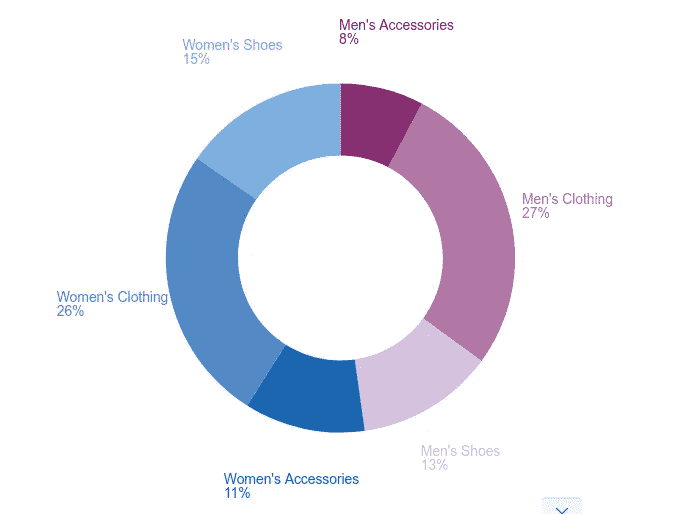

# 使用 Kibana 画布创建动态演示

> 原文：<https://levelup.gitconnected.com/creating-dynamic-presentations-using-kibana-canvas-b8f3b7e7d65f>


Kibana Canvas 是一个数据展示工具，我们可以在其中创建实时展示，直接展示来自 Elasticsearch 的数据。这样，它消除了演示幻灯片中的手动数据更新。让我们来看一个用例，我们需要展示来自数据源的一些 KPI 的一些数字和图表。在这种情况下，最传统的方法是获取这些值、图表等，并将其粘贴到 PPT/Google 幻灯片中，然后呈现给管理团队。现在，如果下周有一个会议，那么再把数据复制粘贴到幻灯片上。因此，每次获取信息并将其放入幻灯片并使其看起来更好是一项非常乏味的任务。

Canvas 帮助我们解决了这个问题，因为我们可以使用来自 Elasticsearch 的实时数据来展示实时数据和图表，因此如果有任何变化，我们可以在演示中获得最新的数据。唯一的限制是我们的数据应该在 Elasticsearch 中。因此，如果是在 RDBMS、NoSQL 或 CSV 中，那么我们需要首先在 Elasticsearch 中推送数据。如果你想知道如何做到这一点，你可以参考我以前在 BQStack 上的博客。

## **获取演示数据:**

对于这个博客，我将使用 Kibana 示例电子商务数据，我们可以从 Kibana 主页导入这些数据。请参考下面的截图:


导入数据后，我们可以转到 Kibana 的“Discover”选项卡来浏览数据。下面的 JSON 文档显示了索引模式“kibana_sample_data_ecommerce”中的一个文档:

```
{
 "_index": "kibana_sample_data_ecommerce",
 "_type": "_doc",
 "_id": "u3QdZHEBN4mC-_91Ho9J",
 "_version": 1,
 "_score": null,
 "_source": {
  "category": [
   "Women's Clothing"
  ],
  "currency": "EUR",
  "customer_first_name": "Elyssa",
  "customer_full_name": "Elyssa Tran",
  "customer_gender": "FEMALE",
  "customer_id": 27,
  "customer_last_name": "Tran",
  "customer_phone": "",
  "day_of_week": "Friday",
  "day_of_week_i": 4,
  "email": "elyssa@tran-family.zzz",
  "manufacturer": [
   "Oceanavigations"
  ],
  "order_date": "2020-04-10T12:11:31+00:00",
  "order_id": 713114,
  "products": [{
   "base_price": 74.99,
   "discount_percentage": 20,
   "quantity": 1,
   "manufacturer": "Oceanavigations",
   "tax_amount": 0,
   "product_id": 16965,
   "category": "Women's Clothing",
   "sku": "ZO0261902619",
   "taxless_price": 59.99,
   "unit_discount_amount": 14.998,
   "min_price": 40.49,
   "_id": "sold_product_713114_16965",
   "discount_amount": 14.998,
   "created_on": "2016-12-16T12:11:31+00:00",
   "product_name": "Maxi dress - black",
   "price": 59.992,
   "taxful_price": 59.99,
   "base_unit_price": 74.99
  }],
  "sku": [
   "ZO0261902619"
  ],
  "taxful_total_price": 59.99,
  "taxless_total_price": 59.99,
  "total_quantity": 1,
  "total_unique_products": 1,
  "type": "order",
  "user": "elyssa",
  "geoip": {
   "country_iso_code": "US",
   "location": {
    "lon": -74,
    "lat": 40.8
   },
   "region_name": "New York",
   "continent_name": "North America",
   "city_name": "New York"
  }
 },
 "fields": {
  "order_date": [
   "2020-04-10T12:11:31.000Z"
  ],
  "products.created_on": [
   "2016-12-16T12:11:31.000Z"
  ]
 },
 "sort": [
  1586520691000
 ]
}
```

上面的 JSON 显示了“kibana_sample_data_ecommerce”索引模式的单个文档，在这里我们可以看到客户详细信息以及产品。

## **创建画布演示:**

现在让我们看看如何使用上面的索引模式数据在 Canvas 中创建一个演示。为此，我们需要做到以下几点:

*   我们需要打开基巴纳网址，登录后点击左侧菜单中的“画布”链接。
*   这将打开画布页面，现在单击“创建工作区”按钮。这将打开一个黑色的工作面板。
*   现在，单击“添加元素”,这将打开一个弹出屏幕来选择元素类型。现在单击“Text”元素，因为我们可以创建第一个工作区来展示简介。
*   我们可以使用右侧的标记文本区域来编辑文本。在这里我们还可以修改文本样式等。请参考下面的截图:


上图显示了一个工作面板，我们已经使用文本元素类型在其上创建了标题和副标题。

*   将标题和副标题添加到工作区后，我们可以添加另一个工作区来表示下一张演示幻灯片。为此，我们需要单击底部的“第 1 页”链接，打开幻灯片视图，现在单击页面右下方的加号图标。这将创建一个新的空白工作区。
*   在这个空白的工作板上，我们可以显示我们为演示目的导入的实时电子商务数据，但我们可以使用任何 Elasticsearch 索引数据在画布上创建演示。
*   现在举个例子，假设我们想要显示一个环形图来显示不同产品的销售情况。因此，我们需要再次单击“添加元素”按钮，这一次我们必须选择“圆环图”。
*   这将在工作面板上显示一个圆环图，只需单击该图表，然后单击右侧窗格中的“数据”链接。
*   点击默认选择的“演示数据”，现在点击“Elasticsearch SQL”框下的“选择”选项。
*   在查询文本区下我们可以放置以下查询:

```
SELECT category, COUNT(category) AS count FROM “kibana_sample_data_ecommerce” GROUP BY category
```

应用查询后，点击“保存”按钮。

*   现在，单击“显示”链接打开显示窗格。在切片标签下选择值作为类别，并在切片角度下选择值作为计数。
*   我们还可以在图表样式下更改图例位置和内径等。请参考下面的截图:



上图显示了一个圆环图，其中显示了我们从电子商务数据中获得的不同类别的百分比。

同样，我们可以添加更多的工作区，并可以添加不同的其他可视化、图像、表格或文本等。完成工作 pad 修改后，我们可以通过在页面右侧的工作 pad 设置窗格中更改名称来保存 Kibana 工作 pad。

**显示画布演示:**
现在我们可以点击页面左上方的“全屏”图标，也可以点击“ **alt+F** 快捷键，以全屏模式打开工作面板。现在，使用键盘的左右键，我们可以导航到上一张和下一张幻灯片。

只要数据有任何变化，它就会自动反映在画布工作区中。通过这种方式，使用 Kibana 画布，我们可以创建一个演示，并将实时数据呈现给管理层。如有任何疑问，请留下您的意见。

[学习基巴纳 7](https://www.amazon.com/Learning-Kibana-dashboards-visualization-capabilities-ebook/dp/B07V4SQR6T) 成为最佳新弹性搜索书籍


*如果你觉得这篇文章很有意思，那么你可以探索“* [*【掌握基巴纳 6.0】*](https://www.amazon.com/Mastering-Kibana-6-x-Visualize-histograms/dp/1788831039/ref=olp_product_details?_encoding=UTF8&me=)*”、“* [*基巴纳 7 快速入门指南*](https://www.amazon.com/Kibana-Quick-Start-Guide-Elasticsearch/dp/1789804035) *”、“* [*学习基巴纳 7*](https://www.amazon.com/Learning-Kibana-dashboards-visualization-capabilities-ebook/dp/B07V4SQR6T) *”、“* [*Elasticsearch 7 快速入门指南*](https://www.amazon.com/gp/product/1789803322?pf_rd_p=2d1ab404-3b11-4c97-b3db-48081e145e35) *”等书籍，了解更多*

**关于 Elastic stack 的其他博客:** [Elastic Search 简介](https://bqstack.com/b/detail/31/Introduction-to-Elasticsearch)
[Elasticsearch 在 Ubuntu 14.04 上的安装和配置](http://bqstack.com/b/detail/52/Elasticsearch-Installation-and-Configuration-on-Ubuntu-14.04)
[使用 Elastic Stack 的日志分析](http://bqstack.com/b/detail/1/Log-analysis-with-Elastic-stack) [Elastic Search Rest API](https://bqstack.com/b/detail/83/Elasticsearch-Rest-API)
[Elastic Search 中数据搜索的基础知识](https://bqstack.com/b/detail/84/Basics-of-Data-Search-in-Elasticsearch)
[Elastic Search Rest API](https://bqstack.com/b/detail/83/Elasticsearch-Rest-API)
[Elastic Search](https://bqstack.com/b/detail/87/Wildcard-and-Boolean-Search-in-Elasticsearch)通配符和布尔搜索

如有任何疑问，请留下您的意见。你也可以在推特上关注我:[https://twitter.com/anu4udilse](https://twitter.com/anu4udilse)

*最初发表于*[*https://bqstack.com*](https://bqstack.com/b/detail/119/Creating-dynamic-presentations-using-Kibana-Canvas)T43。