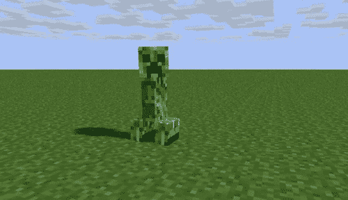
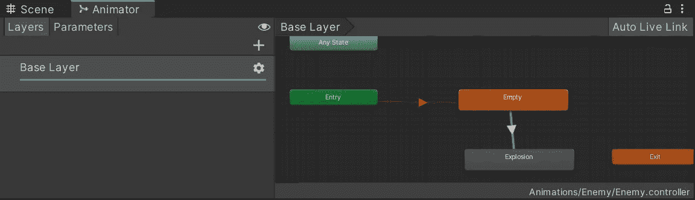
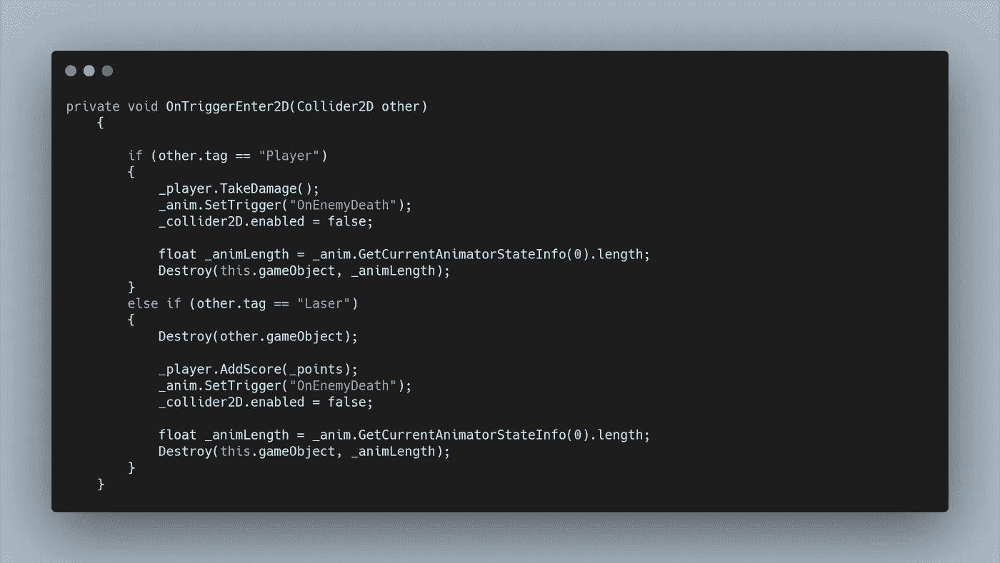
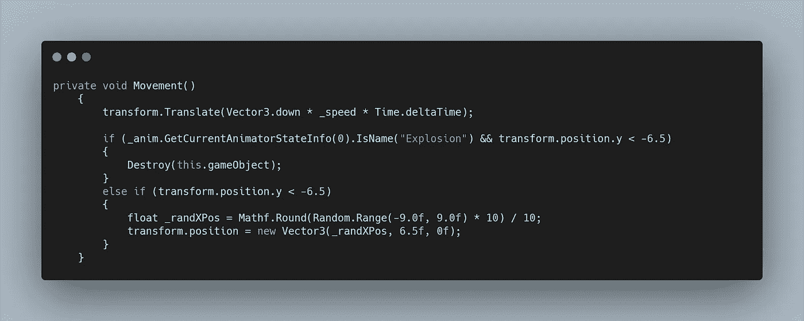
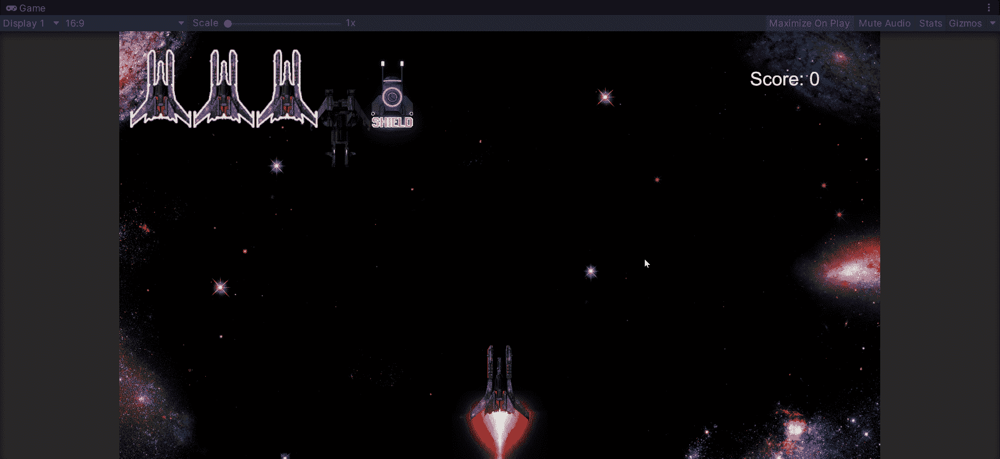

# 制造敌人的爆炸

> 原文：<https://levelup.gitconnected.com/creating-enemy-explosions-69392ce71cf1>

让我们来看看给我们的游戏添加一些视觉效果(VFX)，从敌人被消灭时引发的爆炸开始。

为了做到这一点，我们将要触发一个关于敌人死亡的动画。

像我们以前的动画一样，我们可以简单地为我们的敌人创建一个新的动画，然后拖放所有的精灵。但是，如果我们现在运行我们的游戏，敌人会通过爆炸循环，我们只希望这发生在敌人被摧毁的时候。

如果我们进入我们的动画窗口，我们会看到我们的进入状态自动进入我们刚刚创建的新状态。相反，让我们添加一个空的状态作为我们默认的敌人动画，这样我们就有了一个静态的敌人精灵。从这里开始，适当地重命名我们的爆炸状态，我们希望我们的转换看起来像下面这样。

同样，这仍然会自动循环。所以我们想给我们的转换增加一个参数。如果我们添加一个触发器并将其命名为 OnEnemyDeath，我们可以从我们的脚本中调用它。然后，在我们的转换箭头上，我们可以选择条件“死亡”。现在我们的爆炸动画必须被触发才能工作。

在我们的敌人脚本中，我们想要创建一个变量来存储我们的动画组件。我们可以使用 GetComponent 函数，并记住要进行空值检查。

现在在我们的 OnTriggerEnter2D 方法中，当敌人同时击中播放器和激光时，我们可以设置我们的动画师触发器。这是通过使用。SetTrigger("OnEnemyDeath ")

如果我们运行我们的游戏，我们的敌人仍然只是消失。这是因为我们直接破坏了游戏对象，因此也破坏了动画制作人。

为了解决这个问题，我们可以创建一个变量来存储动画的长度，并将我们的销毁函数延迟适当的时间。设置我们的动画触发器后，我们可以使用。GetCurrentAnimatorStateInfo(0)。长度

还有一点要注意的是，一旦爆炸序列开始，我们就要关闭对撞机。这是为了让我们的玩家在敌人爆炸时不会继续受到伤害。我做了实验，让爆炸的飞溅伤害有一些时间，但不能让它感觉正确。我决定，基本的机制应该只是一个简单的街机风格的射击和摧毁，爆炸只是为了视觉效果。

你可能还记得，当我们的敌人离开底部边界时，他们会在屏幕的顶部重生。由于我们的敌人直到动画完成才被消灭，有时我们的爆炸动画的结尾出现在顶部，这看起来有点荒谬。为了解决这个问题，我们可以改变我们的运动方式。

我们可以检查爆炸动画当前是否是活动的，如果是，当它低于我们的屏幕界限时，消灭敌人。否则我们会像平常一样重生。

