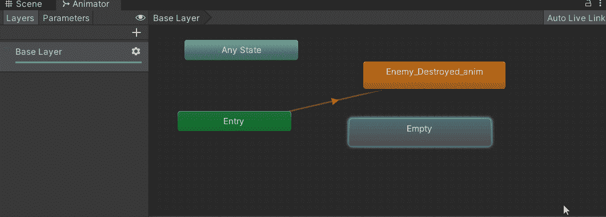
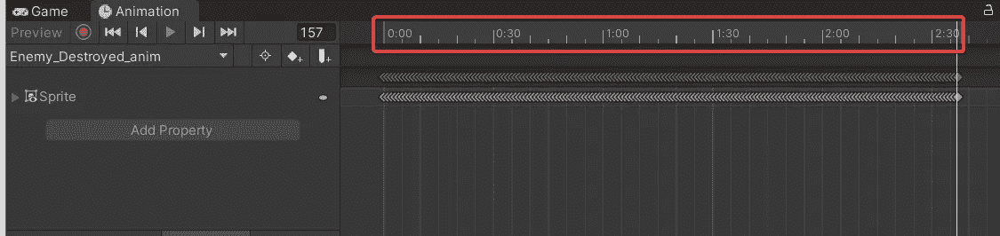

# 制造敌人爆炸！

> 原文：<https://levelup.gitconnected.com/creating-enemy-explosions-e2404cd45833>

视频游戏使用响应游戏序列或动作的动画作为一种形式，在视觉上加强它们的执行。它不仅鼓励沉浸感，而且为玩家和游戏之间的反馈和互动增加了深度和真实感。当满足特定的**条件**时，这些动画会变为**活动**，并且它们通常很短。

例如，塞尔达传说游戏以其标志性的动画而闻名，当敌人甚至老板被击败时。条件是消灭敌人，激活动画让他们的战败更明显，更有收获。

塞尔达传说:天空之剑(科洛托斯 Boss 战败)

在本文中，您将学习如何创建一个专门播放的动画来响应被摧毁的敌人。

# 毁灭时使物体爆炸

1.  打开动画窗口。 [**动画窗口**](https://docs.unity3d.com/Manual/AnimationEditorGuide.html) 允许您制作和编辑动画剪辑，无需使用第三方软件。

2.选择要制作动画的对象，并使用适当的名称创建动画。使用下划线后跟单词“anim”是使其作为动画突出的最佳实践。

> **注意**:这个对象应该在层次结构中，否则创建新动画的选项将不可用。

3.在本教程中，我使用了一个由几个精灵组成的动画序列，整个序列可以通过简单地将它们拖放到动画窗口的时间轴中来录制。无论播放头(时间线中的白线)放在哪里，动画总是开始播放。

> **注意**:尽管这种特殊形式的动画不需要记录按钮来注册，但最好在添加动画之前一直按下它。

4.单击项目文件夹中的动画剪辑，并确保取消调整循环时间。因为这种类型的动画是作为特定的响应播放的，所以它不应该重复循环/播放。

现在，是时候开始具体了。我们想让这个动画在敌人被消灭时播放，这可以通过代码和使用**动画制作师**来实现。动画师负责处理动画从一种状态过渡到另一种状态的方式。

5.选择**动画控制器**，点击打开进入其动画器。

在 Animator 中，你会看到用于多层动画的布局，以及我们稍后会用到的参数。现在，我们将关注屏幕上的节点。每个节点代表一个动画状态，橙色节点是您创建的动画的名称。

6.创建一个**新的空状态**，这将帮助我们添加一个**转换**，我们可以用一个**条件**来控制它。因此，不是动画在这些状态之间不间断地循环，而是新状态可以在它和爆炸动画(当前是橙色节点)之间有一个条件。

> **注**:橙色表示默认状态

7.将**空状态**设置为**默认**。空状态是我们的默认状态，因为我们不需要任何动画，除非条件被触发。

8.添加一个**类型触发器的**参数**。**此参数是将通过代码**触发**以响应敌人被击败的**条件，这将允许空状态过渡到动画。**

8.添加空状态和动画之间的过渡。

9.单击新添加的转换，并将参数添加到条件中。这里，您还应该确保**的退出时间**未被调整，并将 T **转换持续时间减少到零**，因为我们将通过代码触发此操作。

1.  为动画制作人制作一个句柄，这样我们以后就可以访问这个参数了。

2.将 _animator 变量设置为

3.有了这些，你现在就可以在你的代码中访问动画了。您可以使用[**set trigger**](https://docs.unity3d.com/ScriptReference/Animator.SetTrigger.html)**，**并传入我们之前创建的参数的**字符串名称。这就是**动画触发的原因。**在我这种情况下，触发是敌人物体与玩家物体碰撞时设置的。**

> **注意**:敌人的速度降低到 0，这样物体一旦被消灭就停止移动。由于敌人的行为，这在我的代码中是必要的。

4.您可能需要**延迟对象破坏**以匹配动画剪辑的**持续时间。否则，对象可能会在动画有机会播放之前被破坏。你可以通过查看**动画时间线**来验证你的动画长度。**

我还添加了玩家的激光与敌人碰撞时的动画。

**结果:**

在下一篇文章中，我将介绍如何为玩家添加[伤害 VFX！](https://dennisse-pd.medium.com/damage-vfx-using-animated-sprites-in-unity-c13e2dbb68bb)