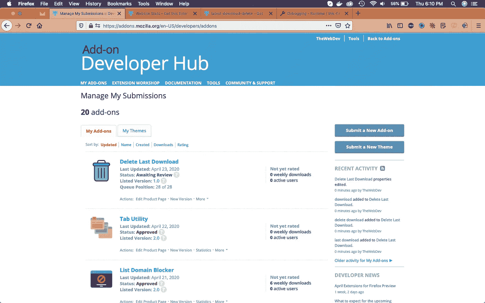

# 创建 Firefox 浏览器扩展-19

> 原文：<https://levelup.gitconnected.com/creating-firefox-browser-extensions-19-94aeed525382>

贾斯汀·维内玛在 [Unsplash](https://unsplash.com/s/photos/motivational?utm_source=unsplash&utm_medium=referral&utm_content=creditCopyText) 上的照片

欢迎来到本系列的第 19 部分。你可以在这里找到第 18 部。

在这一部分，我们将创建一个名为**删除上次下载**的新插件。这个插件显示最后下载的项目，并让你打开或删除它。如果用户按下 delete，文件将从磁盘和浏览器的下载历史记录中删除。

因此，继续创建一个文件夹 **DeleteLastDownload** 并在其中创建另一个文件夹 **icons** 。文件夹内放置了三个图标。你可以从本文末尾的 github 链接获得它们。

删除最后下载

现在，在文件夹 **DeleteLastDownload** 中创建一个文件 **manifest.json** ，并将以下内容放入其中。

它正在使用 **downloads** 和 **downloads.open** 的权限，我们很快就会用到。

manifest.json

现在，创建一个文件夹**弹出**和一个文件**download.html**在里面。这是一个简单的 html 文件，它将显示上次下载的图像和 url。它还将有一个**打开**和**移除**可点击的 div。

download.html

要创建样式，在同一个文件夹中创建一个文件 **download.css** 。

下载. css

为了检查样式，我临时加载了插件，如下图所示。

目前的

现在来补充一些逻辑。在同一个文件夹中创建一个文件 **download.js** ，并在其中添加以下代码。

现在，程序从第 26 行开始，使用 [downloads.search()](https://developer.mozilla.org/en-US/docs/Mozilla/Add-ons/WebExtensions/API/downloads/search) 获取最新的下载。

之后，它运行函数**initializeLatestDownload**()。这里，我们将把下载链接添加到 id 为 url 的 div 中。在第 14 行的 if 语句中，我们使用了另一个 firefox 函数[downloads . getfileicon()](https://developer.mozilla.org/en-US/docs/Mozilla/Add-ons/WebExtensions/API/downloads/getFileIcon)来获取文件图标。

在第 15 行，我们使用一个助手函数 **updateIconUrl** ()，将图标设置为 id 为 icon 的 div。

在 if 语句中，当有一些下载时运行，我们从 **open** 中移除了 **disabled** 类，并且**移除了** divs。

在 else 部分，我们从 **open** 和 **remove** divs 中添加了 **disabled** 类。

下载. js

接下来，让我们打开逻辑，去掉 div。我们为打开和删除 div 添加了两个事件监听器，它们有各自的功能。

在 **openItem** ()中，我们使用 [downloads.open()](https://developer.mozilla.org/en-US/docs/Mozilla/Add-ons/WebExtensions/API/downloads/open) 打开下载的文件。

类似地，在 **removeItem** ()，我们首先使用 [downloads.removeFile()](https://developer.mozilla.org/en-US/docs/Mozilla/Add-ons/WebExtensions/API/downloads/removeFile) 从磁盘中删除一个下载的文件。然后 downloads.erase()从浏览器的下载历史记录中删除该文件。

下载. js

所以，我们的代码是完整的。我已经通过测试临时插件检查过了，它工作得很好。

可交换的图像格式

所以，是时候在 mozilla addon 商店发布了。我将按照这个系列的另一篇博客中的步骤来做。这里的链接是[这里的](https://medium.com/@nabendu82/creating-firefox-browser-extensions-2-ddf1f236f401)。

等待审查

这是这个系列的第 19 部分。你可以从[这里](https://addons.mozilla.org/en-US/firefox/addon/delete-last-download/)在你的火狐浏览器中安装这部分的插件。

你可以在这里找到 part-20。

你可以在我的 github 账户[中找到相同的代码。](https://github.com/nabendu82/Addons)