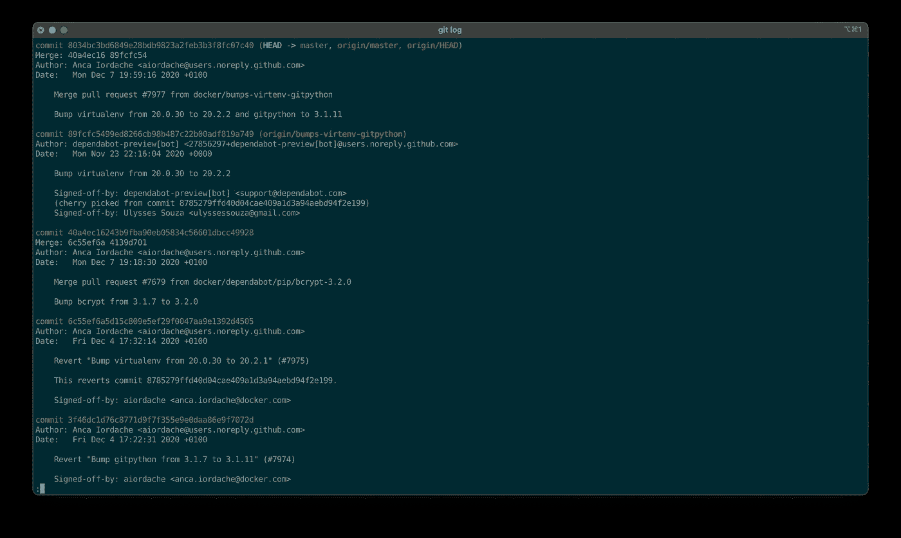
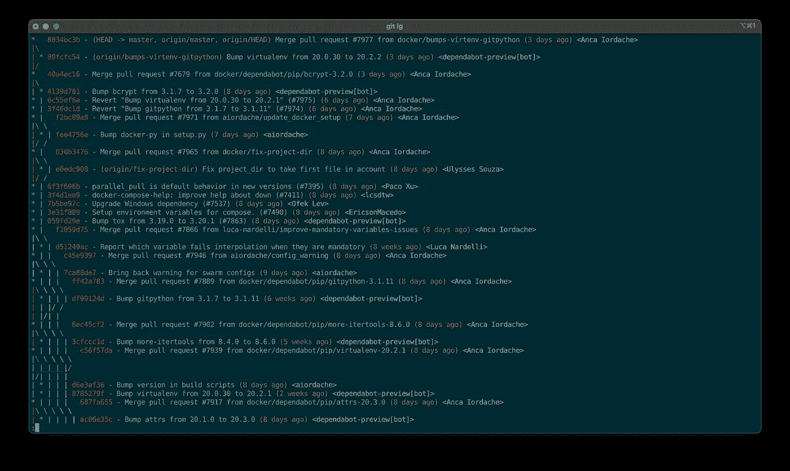

# 创建 Git 别名来提高您的生产力

> 原文：<https://levelup.gitconnected.com/creating-git-aliases-to-boost-your-productivity-a9916b64d41b>


照片由 [Yancy Min](https://unsplash.com/@yancymin?utm_source=medium&utm_medium=referral) 在 [Unsplash](https://unsplash.com?utm_source=medium&utm_medium=referral) 上拍摄

# 什么是 Git 别名？

Git 别名是一种为 Git 命令提供您选择的昵称的方式。使用 Git 别名的好方法是使用以下命令:

1.  漫长的
2.  很难记住
3.  缺少直观的名称
4.  用户的母语不是英语

我偶然发现的 Git 别名的一个缺点是，当你用 Git 帮助其他人时，他们没有和你一样的别名集。您会发现自己陷入了一个难题:试图记住底层命令，或者必须引用自己计算机上的 Git 别名。在使用一些别名多年后，您会很自然地忘记它是一个别名，并认为它是一个内置的 Git 命令。

# 如何创建别名

创建别名很容易，只需运行如下命令，用您自己的值替换别名和要运行的命令的名称:

`git config --global alias.[alias name] [command to alias]`

这将把别名写入您的`~/.gitconfig`文件(或等效文件)。如果你愿意，你也可以使用`vim`或其他文本编辑器来批量查看和编辑别名。

# 一些例子

## 一根漂亮的木头

能够查看提交历史是非常重要的，原因有很多，比如重定基数、跟踪一个中断的提交，或者找到一个提交进行挑选。默认命令`git log` *可以*对此有所帮助，但是这个命令还是停留在过去。参见下面运行`git log`对 [Docker Compose](https://github.com/docker/compose) 的输出截图。



运行“git log”的输出

所有相关信息都在那里，但我目前只能看到四个提交。我通常需要看到更多。以下命令将使我们能够增强提交历史的可视化，同时保留提交散列、分支名称、描述、日期和作者等相关细节。

```
git log --graph --pretty=format:'%Cred%h%Creset -%C(yellow)%d%Creset %s %Cgreen(%cr) %C(bold blue)<%an>%Creset' --abbrev-commit --date=relative
```

哇，这是一个很长的命令，但是如下图所示的输出看起来*更好看。这个 Git 命令非常适合包装在 Git 别名中。*



git 日志的漂亮版本

要用前面提到的本机 Git 命令创建一个 Git 别名，请运行以下命令。

```
git config --global alias.lg 'log --graph --pretty=format:'%Cred%h%Creset -%C(yellow)%d%Creset %s %Cgreen(%cr) %C(bold blue)<%an>%Creset' --abbrev-commit --date=relative'
```

这样做是创建一个名为`git lg`的全局 Git 别名，它将打印日志的漂亮版本。你可以随意给 Git 取任何你想要的别名——除了它所依赖的`log`之外——它不必被称为`lg`。在创建了 Git 别名后，您需要做的就是运行`git lg`，瞧，漂亮的 Git 日志已经打印到屏幕上了！

## 新的起点

有时您需要将您的 Git 库中的所有*和*更改都烧掉！事情不太对劲，你需要一个新的开始。将您当前的分支重置为`HEAD`并移除所有更改就可以了。

```
git reset --hard HEAD && git clean -dfx
```

每次打字都很公平，让我们为它创建一个全局别名`git raze`。

```
git config --global alias.raze '!git reset --hard HEAD && git clean -dfx'
```

这个别名的不同之处在于它以`!git`开头。这是必要的，因为我们通过`&&` ( `reset`和`clean`)将两个 Git 命令复合在一起。如果你只是*运行一个 Git 子命令，那么`!git`就没有必要了。`!git`前缀允许您在 g it 之外运行命令，这意味着可以使用 Git 别名来运行非 Git 命令。这里有一个人为的例子:*

```
git config --global alias.showme '!git status && ls -la'
```

运行`git showme`将使用非 Git 命令`ls -la`打印本地更改以及当前文件夹结构。

## 其他一些例子

1.  `git config --global alias.undo 'reset HEAD~1 --mixed'`撤销最后一次提交，并在本地保存该提交中的更改。它可以连续运行多次以继续撤消提交。
2.  `git config --global alias.wip '!git add -u && git commit -m “WIP”'`使用所有本地更改快速创建进行中的提交。
3.  `git config --global alias.cob 'checkout -b'`新建分支机构。当运行这个 Git 别名时，它采用了与`git checkout -b`正常情况下相同的一组参数，比如新分支的名称`git cob MyNewFeature`。

互联网上有无数其他有用的 Git 别名的例子。这些只是一些额外的例子，以证明本文中强调的观点，并希望能提供一些启示。

# 结束语

我希望你觉得这篇文章有用。你学到了什么新东西吗？我忘了什么重要的事吗？你最喜欢的 Git 别名是什么？我总是在寻找新的想法！请在评论中告诉我。

快乐编码！🧑🏻‍💻

[GitHub](https://bit.ly/dbudwin-github)|[LinkedIn](https://bit.ly/dbudwin-linkedin)|[中型](https://bit.ly/dbudwin-medium) | [Budw.in](https://bit.ly/budw_dot_in)