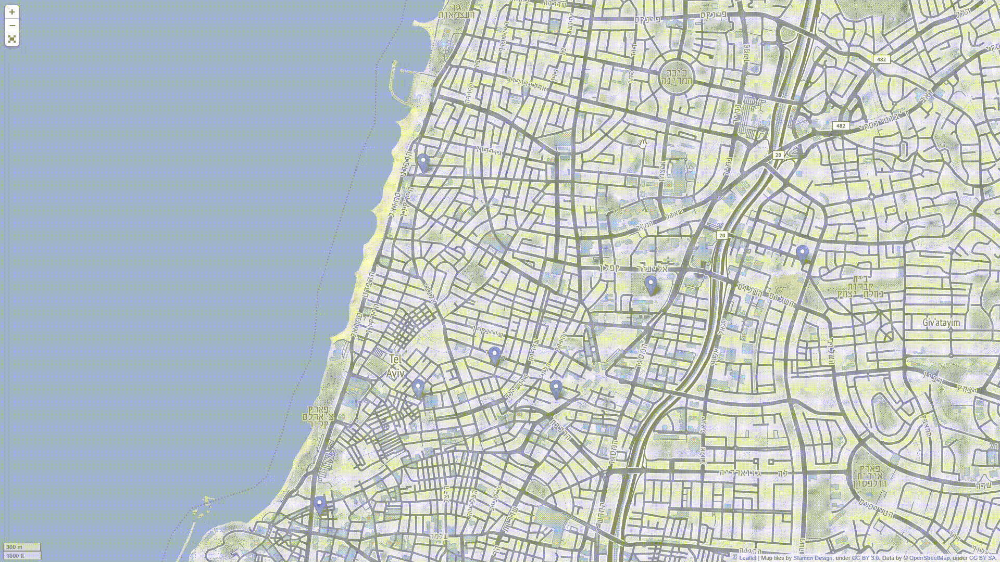
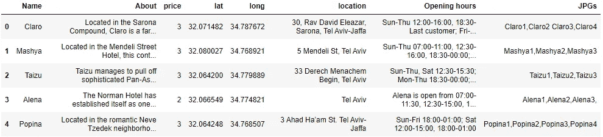
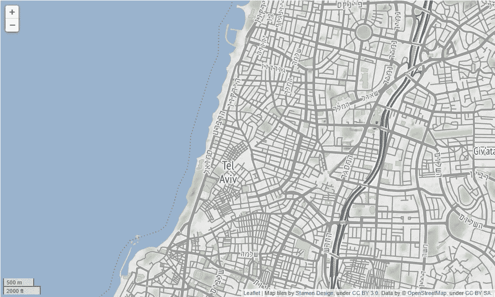
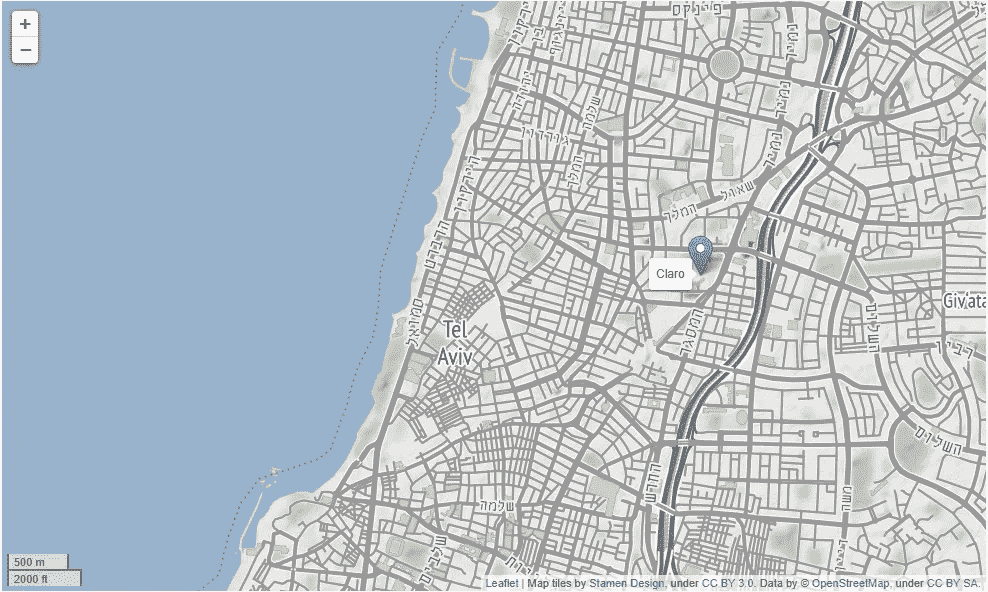
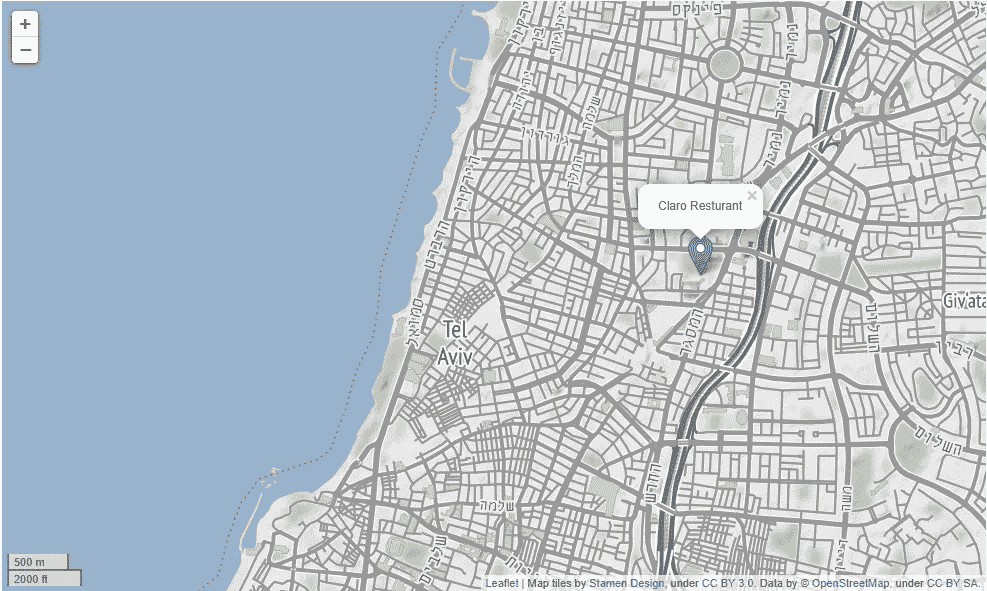
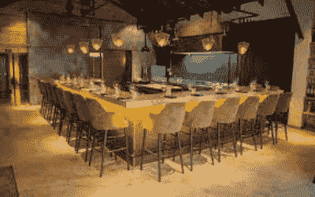

# 使用 Python、Folium 和一些 HTML 创建交互式地图

> 原文：<https://levelup.gitconnected.com/creating-interactive-maps-with-python-folium-and-some-html-f8ac716966f>

让我们创建一个这样的

## 了解如何使用 Python 的 Learn 库和一些 HTML 创建漂亮的交互式地图，以获得出色的样式。

F 在我的研究项目中，有一个项目需要制作一个交互式地图，作为一名 Python 程序员，我知道几种方法来完成这项任务。为了完成这项工作，我选择使用 leav 库，但是可以设计的弹出标记是基本的，所以为了改进弹出窗口的设计，我将 HTML 集成到代码中。在本文中，我将给出一个简单但漂亮的例子。

## 我们开始吧

当使用 Python 创建交互式地图时，follow 库做得很好，因为您不需要了解太多 Python 知识就可以完成这项工作并生成合适的地图。因此，让我们继续导入 let 和我们将需要的其他依赖项(这些将在我们遇到它们时解释)。

在这个例子中，我们将使用特拉维夫顶级餐馆的数据。该数据包含几家餐馆的名称、位置、经度和纬度、营业时间、价格(一到四)和一些图像。所以让我们继续阅读熊猫的数据。

特拉维夫顶级餐厅的数据

现在让我们创建一个地图——一个简单明了的底图。

“位置”参数采用地图中心的坐标。Folium 附带了一些内置的地图 tiles et，您可以使用“tiles”参数轻松指定它们。默认情况下是 OpenStreetMap (OSM) tileset，但是 leav 也支持使用提供者公开提供的地图切片，例如 [*【雄蕊】*](http://maps.stamen.com/#terrain/12/37.7706/-122.3782) 、 [*雷森林*](https://www.thunderforest.com/maps/) 、 [*视距*](https://stadiamaps.com/) *、* [*卡图*](https://carto.com/basemaps/) 等。点击[链接](https://leaflet-extras.github.io/leaflet-providers/preview/)查看其中一些的对比。“zoom_start”定义地图的初始缩放,“control_scale”添加比例尺。Folium 以 HTML 格式保存与地图相关的所有内容，因此这意味着您可以通过在浏览器中打开`.html`文件来快速查看地图的外观:

Folium 的特拉维夫街道底图

就是这样！一行 Python，我们已经有了一个明亮的，丰富多彩的底图。

## 接下来，向地图添加标记

让我们开始在地图上放一个标记。我们想按照它的坐标来放置，放在十进制坐标里为【纬度，经度】。当我们将鼠标移到光标上时，follow 还允许我们轻松地添加带有标题的标签。这是通过“工具提示”参数完成的。

带有标记的 follow 底图。添加 tooltip 参数可以在光标位于短文本上时共享短文本。

下一步是使标记可点击，只需再添加一行代码并向标记方法添加另一个参数即可完成:

Popup 方法使我们能够添加文本并使用其他语言，如 HTML。最大宽度和最大高度参数允许我们设置弹出窗口的大小限制，而 Marker 方法中的“popup”参数指定使用该弹出窗口的标记:

带有可点击标记的 follow 底图

因为我们希望我们的交互式地图是功能性的和有吸引力的，我们不会仅仅把细节作为文本和结束。取而代之的是，我们将在折叠按钮下排列文本，并使用一些餐馆及其菜肴的图片。最好的方法是使用 HTML。HTML 通常用于设计网站，但在这种情况下，它允许我们设计更好的标记。所以首先:

## 让我们为展示安排图片

有几种方法可以在弹出窗口中显示图像，如幻灯片、视频等。，但是我们将使用一种简单的方法将这些图像打包成 GIF。为此，我们将使用 [Imageio](https://imageio.readthedocs.io/en/stable/) Python 包和 [cv2](https://docs.opencv.org/4.x/d6/d00/tutorial_py_root.html) 包，前者提供了一个简单的接口来读写各种图像数据，后者有许多用途，但我们将用它来生成 GIF。

我们首先通过 JPEG 名称对每个餐馆进行循环，并将 JPEG 本身附加到帧列表中。通过 imageio.get_writer 方法，我们编写了一个新的。gif 文件，将显示每一帧的持续时间为 2 秒。最后，我们读取所有图像，并将其调整到相同的比例，然后将它们附加到 writer 中。这不是展示图像的最佳方法，但我发现这是最简单的方法:

## 现在，让我们设计这些弹出窗口

这里我们使用一个简单的 for 循环来遍历所有我们想要为它们创建标记的餐馆。请不要不知所措，因为我们会经历这一点。

folio 有一个内置的方法将 HTML 集成到弹出窗口中。“Html ”,它将 HTML 代码作为其输入。为了允许我们灵活地将循环中每个餐馆的特征输入到适当的字段中，我们将使用 f-string 方法。

我们将为每个弹出窗口设置一个带有餐馆名称的标题。在这个例子中，我们将它居中对齐，使用 Calibri 字体，将其涂成白色，并设置为粗体(**):**

下面两行将我们的 HTML 页面链接到(1)字体 awesome 的图标，这样我们就可以在文本中使用它们，以及(2) bootstrap 的 CSS 用于折叠按钮。下一个代码块表示一个折叠按钮，在本例中使用了四次:

大部分是按钮的定义和它们之间的关系(点击一个关闭其他的)。要设置按钮文本的样式，您可以在`<h4 class="panel-title"`行中更改或添加“样式”。通过将`<i class="fa-light fa-newspaper"></i>`改变为[字体网站](https://fontawesome.com/icons/)中许多其他图标中的一个。`<div class="panel-body"`负责按钮下的文字。在这种情况下，我们只是将它设置为“justify”对齐，但这也可以用颜色、字体系列、字体大小等进行样式化。HTML 代码的最后一部分是上传我们的 GIF:

这部分比较直接。“src”获取图像/gif 位置，而“width”设置其大小。此外，为了给它一个更好的风格，我们将“边框半径”设置为 50px，以获得更好的外观。

每个标记的最后两步是:( 1)定义包含 HTML 代码的弹出窗口，并像我们之前做的那样设置标记,( 2)设置一个漂亮的背景。在我们的例子中，我使用 HTML 定义了一个从顶部的蓝色到白色的线性渐变背景，在页面的 25%之后完成过渡(弹出)。不过，你也可以用同样的方法来使用图像或 gif——用我们用来呈现 gif 的行的相同结构来替换“背景:”后面的内容。所以我们得到的最终产品是:

最后的结果

## 真的是这样！

我就说到这里，不过你可以在这里找到完成的[地图](https://waeara.github.io/Creating-interactive-maps-with-Python-Folium-and-some-HTML/Tel%20Aviv%20Resturants.html)。如果你有任何想法或问题，请随时留下评论🙂

感谢阅读！🍔

# 分级编码

感谢您成为我们社区的一员！在你离开之前:

*   👏为故事鼓掌，跟着作者走👉
*   📰查看[升级编码出版物](https://levelup.gitconnected.com/?utm_source=pub&utm_medium=post)中的更多内容
*   🔔关注我们:[Twitter](https://twitter.com/gitconnected)|[LinkedIn](https://www.linkedin.com/company/gitconnected)|[时事通讯](https://newsletter.levelup.dev)

🚀👉 [**加入升级人才集体，找到一份神奇的工作**](https://jobs.levelup.dev/talent/welcome?referral=true)