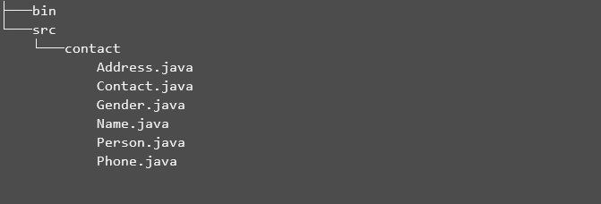
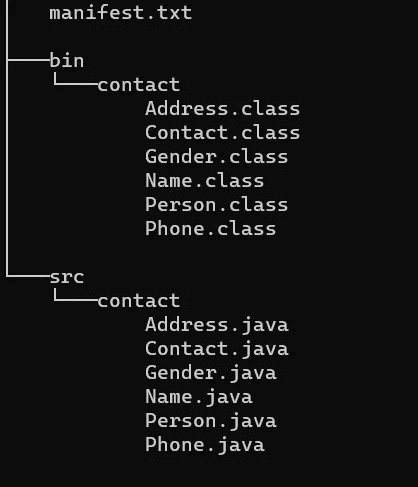
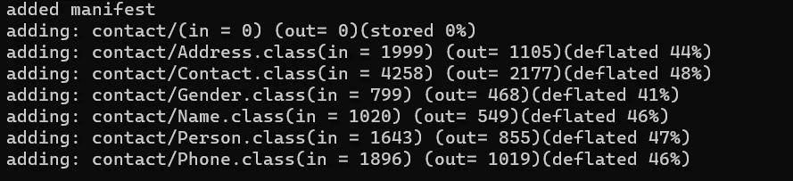

# 用 Java 创建 jar

> 原文：<https://levelup.gitconnected.com/creating-jars-in-java-7427f94fe128>

## 从命令行制作 jar


Ricky _ artigas 的《陶罐》由 2.0 的 [CC 授权](https://creativecommons.org/licenses/by/2.0/?ref=ccsearch&atype=rich)

罐子。**JAva a**R韭菜。这是一种允许您将 Java 代码打包成单一文件格式的文件格式。这种文件格式可以用于存储，也可以是*。Runnable 的意思是，点击一个按钮，它就会启动你的应用程序(就像你桌面上的那些图标一样)。*****

*拥有一个 ***JAR*** 文件为我们打包代码提供了一个简单的方法。它内置了压缩功能，以减少代码的大小，并且由于文件是一个更小的单一文件，因此更容易跨介质传输代码。*

****JARs*** 也可以存储你的 Java 代码中使用的图像和其他文件，或者它只能存储编译后的 Java 代码(`.class` /字节码)本身，这些代码将用于执行你的程序。*

*在本文中，我们将向您展示用 Java 创建一个 ***JAR*** 文件是多么容易。*

***注意:这将在 windows 机器上完成。***

# *我们开始吧！*

*这是我们将要使用的代码结构。*

**

*我们有两个文件夹`src`和`bin`。`src`将包含我们的源代码。在我们的`src`文件夹中有一个名为`contact`的包。*

*代码可以在下面的 Github 存储库中找到:*

*[](https://github.com/jordan-medium/jar-project/tree/master/src/contact) [## 约旦-中型/jar-项目

### 通过在 GitHub 上创建一个帐户，为 jordan-medium/jar 项目开发做出贡献。

github.com](https://github.com/jordan-medium/jar-project/tree/master/src/contact) 

在这个项目的根目录中，我们将编译并运行我们的代码，使用下面的命令测试它是否运行:

```
javac -d bin src\contact\*.javajava -cp bin contact.Contact
```

输出:

```
Age: 10
Name: Brown,John
enty number: 1Email list:
[[email@email.com](mailto:email@email.com), [jordan@email.com](mailto:jordan@email.com)]Address list:
[1 Any Street, Any Town, Jamaica]Phone list:
[(876) 524-5788, (876) 690-8731]
```

上面显示了我们脚本的输出。

如果您不熟悉如何在终端中运行 Java 程序，请查看我以前的文章*“终端中的 Java:学习如何仅使用命令行运行 Java”*。

[](/java-in-the-terminal-8888310a16ae) [## 终端中的 Java

### 学习如何仅使用命令行运行 Java

levelup.gitconnected.com](/java-in-the-terminal-8888310a16ae) 

我们的程序已经确认运行。现在让我们创建我们的 ***JAR*** 文件。

创建 ***JAR*** 文件的过程将包括打包我们编译的`.class`并指定入口点。 ***入口点*** 是运行我们的应用程序的主类。要指定我们的主类，我们必须将它添加到所谓的 ***清单*** 文件中。

一个 ***清单*** 文件包含关于打包在 ***JAR*** 文件中的文件的信息。一旦 ***JAR*** 文件被创建，该文件总是被创建。

我们将在创建 ***JAR*** 期间指定将进入清单文件的信息。

在我们项目代码的根目录中，创建一个`manifest.txt`文件。这将包含我们想要添加到我们的 ***JAR*** 文件内的 ***清单*** 文件中的信息。



我们的`manifest.txt`文件应该类似于下面的代码片段:

```
Main-Class: contact.Contact 
```

这指定了我们的主类的位置。我们的主类是`Contact`类，它在我们的`contact`包中。

在 ***清单*** 文件中定义了`Main-Class`之后，注意空行的存在是非常重要的。我们必须用新的一行结束我们的 ***清单*** 文件，否则我们的`manifest.txt`文件将在 ***JAR*** 创建期间被完全忽略。

**注意:我们不必将文件命名为** `**manifest.txt**` **。我们可以给它取任何名字，只要在创建 JAR 时使用这个名字。**

现在，使用下面的命令实际创建我们的 ***JAR*** 文件:

```
jar cvfm app.jar manifest.txt -C bin .
```

让我们分解这个命令，好吗？

`jar`命令负责所有 ***JAR*** 操作。`cvfm`是我们想要指定我们想要进行的操作类型的地方。`cvfm`的细分如下:

*   `c` —这指定您想要创建一个 ***JAR*** 文件。
*   `f` —指定创建的 ***JAR*** 将是一个文件。默认情况下，它会简单地将 ***JAR*** 输出到终端中。`app.jar`是该文件的名称。
*   `v`——这个意思是 ***啰嗦*** 。它给出了在终端中创建的 ***JAR*** 的信息。没有必要。
*   `m` —指来自我们`manifest.txt`的将被添加到我们***JAR******manifest***文件中的信息。

这些命令的顺序很重要，因为它们决定了字段的输入顺序。

*   `-C` —将目录更改为指定的文件夹。在这种情况下，那就是`bin`文件夹。然后我们需要指定`bin`文件夹中需要什么文件。这就是为什么我们之后使用`".”`来指定该目录中的所有文件。

输出:

```
added manifest
adding: contact/(in = 0) (out= 0)(stored 0%)
adding: contact/Address.class(in = 1999) (out= 1105)(deflated 44%)
adding: contact/Contact.class(in = 4258) (out= 2177)(deflated 48%)
adding: contact/Gender.class(in = 799) (out= 468)(deflated 41%)
adding: contact/Name.class(in = 1020) (out= 549)(deflated 46%)
adding: contact/Person.class(in = 1643) (out= 855)(deflated 47%)
adding: contact/Phone.class(in = 1896) (out= 1019)(deflated 46%)
```



我们的 ***JAR*** 文件现在创建好了。

## 现在，让我们试着运行它！

```
java -jar app.jar
```

输出:

```
Age: 10
Name: Brown,John
enty number: 1Email list:
[[email@email.com](mailto:email@email.com), [jordan@email.com](mailto:jordan@email.com)]Address list:
[1 Any Street, Any Town, Jamaica]Phone list:
[(876) 524-5788, (876) 690-8731]
```

# 总结:

> 现在不难了吧？

我们使用 Java 创建了自己的 ***JAR*** 文件。记住我们的 ***JAR*** 文件是我们的 Java 代码的简单压缩，分成两个文件夹，即我们的`src`和我们的`bin`文件夹。我们的源代码，即扩展名为`.java`的代码文件存储在`src`文件夹中，而扩展名为`.class`的类文件存储在`bin`文件夹中。

`jar cvfm <file/foler name> manifest.txt -C bin .`用于实际创建我们的 ***JAR*** 文件。JAR 通过运行单个文件，可以使你的项目更具可移植性。如果使用 GUI 库，只需点击 jar 就可以打开。*