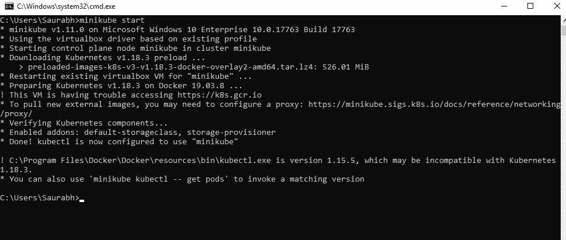
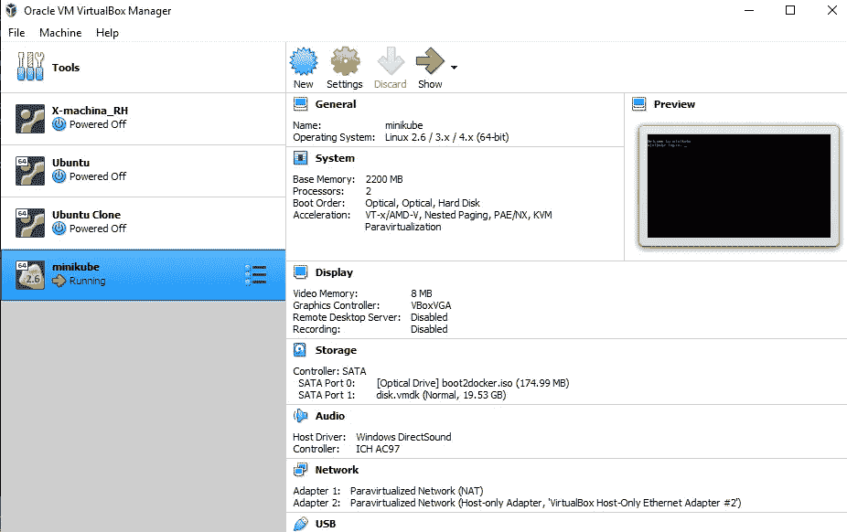
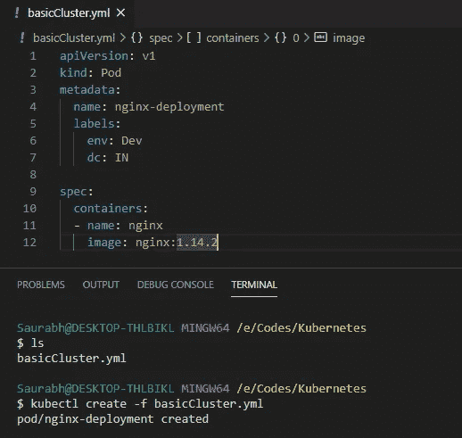
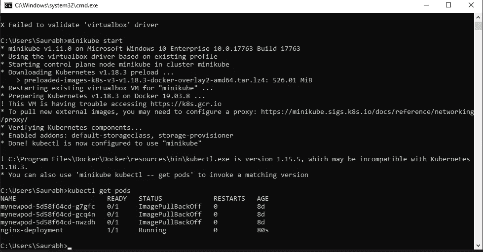

# 创建 K8s 脚本—深入了解集群流程编排

> 原文：<https://levelup.gitconnected.com/creating-k8s-scripts-deep-dive-to-cluster-orchestration-f0ca70c02c63>

N 现在，我们已经知道了如何管理和加速基本的 kubernetes 集群，让我们继续更动态地管理集群，并学习业务所需的集群和应用程序部署概念。

## Kubernetes 集群管理的安装和基础:

> [https://medium . com/@ dimrisaurabh 06/getting-started-with-kubernetes-and-container-orchestration-8a 579232 e40 b](https://medium.com/@dimrisaurabh06/getting-started-with-kubernetes-and-container-orchestration-8a579232e40b)

T 这里有几种方法来启动集群并将其置于 kubernetes 的管理之下，但在现实世界的部署场景中，我们作为一家公司，通常需要在实际部署之前在 pod 上进行多种配置，而不是在集群上部署单个容器。甚至有几个选项在现实世界中经常使用的 kubernetes cli 命令中是不可用的，此外，我们希望我们的可部署基础设施是可记录的、易于移植的，并且在几个系统之间高度共享。

为了实现所有这些用例，K8s 支持一种声明性语言来执行任务，这就是 YAML(另一种标记语言)。对于 K8s 工具，YAML 或 yml 是由 HasiCorp 自己开发的 DSL(领域特定语言)。YAML 提供的主要优势是语言是用户友好的，易于理解，阅读和灵活性(我们也可以使用列表和数组)

## 让我们执行之前已经执行过的任务，但这次使用 YAML 脚本。

T 任务是创建 POD，并在其下运行 nginx 集群映像。我们还将向 pod 添加一些标签，以便更容易管理 pod，这也是一个很好的做法，因为通过向 pod 添加标签，它们的管理变得更容易，k8 在后台保持健康检查，甚至通过仅向它们提供标签来管理 pod。

让我们使用以下命令启动 k8s 集群:

> minikube 启动

正在初始化 minikube 集群

现在我们已经启动了 minikube 集群，我们可以看到存储在虚拟机中的 minikube 映像正在运行

运行虚拟映像

## YAML 文件基础

在您想要创建的 Kubernetes 对象的`.yaml`文件中，您需要为以下字段设置值:

*   `apiVersion` -您正在使用哪个版本的 Kubernetes API 来创建这个对象
*   `kind`——你想创造什么样的物体
*   `metadata` -帮助唯一识别对象的数据，包括`name`字符串、`UID`和可选的`namespace`
*   `spec`——你渴望的对象是什么状态

对象`spec`的精确格式对于每个 Kubernetes 对象都是不同的，并且包含特定于该对象的嵌套字段。Kubernetes API 参考可以帮助您找到使用 Kubernetes 创建的所有对象的规范格式。例如，Pod 的`spec`格式可以在 PodSpec v1 核心中找到，而部署的`spec`格式可以在 Deployment Spec v1 应用程序中找到。

因为我们现在知道了 HCL (HashiCorp 语言)的基础知识，所以让我们继续我们的用例。我们用例的`.yaml` 文件看起来像这样:

根据外部用例的 YML 文件

这里使用的图像是 nginx 的。要运行该文件并启动集群，我们必须使用命令:

> kubectl create -f<filename.yml></filename.yml>

正如我们所看到的，我们的 pod 成功创建，nginx 容器在其中运行。

## 下一步做什么

现在，我们已经了解了 K8s 的基础知识、使用情形、基本脚本和 cli 知识，让我们继续学习 K8s 的一些典型而强大的概念，即副本集、复制控制器和 PVC(永久卷声明),它们通常是确保群集正常运行时间和平稳运行所必需的。

## 上一个—[K8s 集群的基础](https://medium.com/@dimrisaurabh06/getting-started-with-kubernetes-and-container-orchestration-8a579232e40b)

## 接下来— [复制集、控制器](https://medium.com/@dimrisaurabh06/advance-concepts-of-k8s-replica-set-and-controllers-1269fc8e8188) K8s 强大的概念

> 今天，大多数软件的存在，不是为了解决一个问题，而是为了与其他软件接口。
> *— IO Angell*