# 通过加入谷歌云平台(GCP)虚拟机创建 Kubernetes (k8s)集群

> 原文：<https://levelup.gitconnected.com/creating-kubernetes-k8s-cluster-by-joining-google-cloud-platform-gcp-virtual-machines-e1f52c465a1c>

ubernetes (k8s)是一项了不起的技术，我很喜欢它。


Kubernetes 有各种形式，从普通的 Kubernetes 到 RedHat OpenShift 这样的交钥匙解决方案。事实上，您可以在本地机器上使用 Minikube 提供一个单节点 Kubernetes(k8s)集群。

在本文中，我将向您展示我们如何利用由**谷歌云**提供的**虚拟机**来构建一个 **Kubernetes 集群**。


谷歌云平台

我们将在**谷歌云平台(GCP)** 上启动 3 个虚拟机，然后通过 bash 终端运行一些脚本，使其中一个虚拟机成为 Kubernetes 的**主节点**或**控制平面节点**，其余 2 个节点成为**工作节点**，从而形成一个 Kubernetes 集群。最后，我们将在新创建的 Kubernetes 集群上安排一个 **NGINX** pod。

在我们继续之前，我假设你已经注册了谷歌云平台(谷歌为 1 年的使用提供 300 美元的免费信用),否则就在[https://console.cloud.google.com](https://console.cloud.google.com/)注册。

接下来前往您的 GCP 帐户并登录。通过浏览控制台上的左侧菜单，转到虚拟机部分。

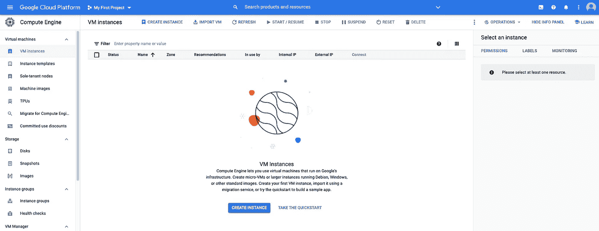

GCP —虚拟机控制台

您可以使用控制台启动新的虚拟机，也可以使用本地系统的终端。

我讨厌网络控制台，更喜欢总是终端来减少时间。

*注意，你需要在你的机器上安装 Google Cloud SDK。点击这个链接，按照你的特定操作系统(macOS，Windows，Linux 等)的步骤操作:-*

[](https://cloud.google.com/sdk/docs/quickstart) [## 快速入门:云 SDK 入门|云 SDK 文档

### " type": "thumb-down "，" id": "hardToUnderstand "，" label ":"难以理解" }，{ "type": "thumb-down "，" id"…

cloud.google.com](https://cloud.google.com/sdk/docs/quickstart) 

如果您像我一样，那么在您的终端(在 Mac 上)或命令提示符(在 Windows 上)上执行以下命令，在 GCP 上配置虚拟机:-

```
gcloud compute instances create k8s-master — zone=europe-west3-c
 — machine-type=e2-medium
 — image=ubuntu-1804-bionic-v20201014
 — image-project=ubuntu-os-cloud
 — boot-disk-size=50GBgcloud compute instances create k8s-worker-1  — zone=europe-west3-c
 — machine-type=e2-medium
 — image=ubuntu-1804-bionic-v20201014
 — image-project=ubuntu-os-cloud
 — boot-disk-size=50GBgcloud compute instances create k8s-worker-2  — zone=europe-west3-c
 — machine-type=e2-medium
 — image=ubuntu-1804-bionic-v20201014
 — image-project=ubuntu-os-cloud
 — boot-disk-size=50GB
```

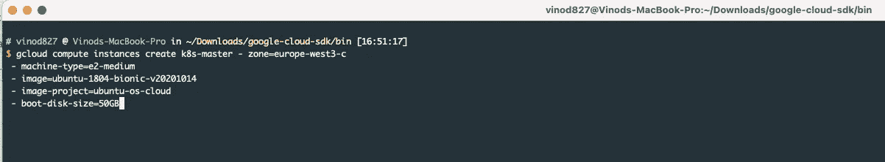

虚拟机 1(我们称之为 k8s-master)

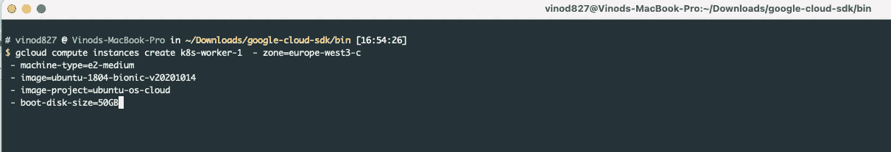

虚拟机 2 (k8s-worker-1)

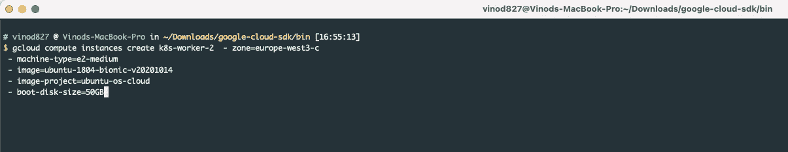

虚拟机 3 (k8s-worker-2)

*顺便提一下，我在这里用 OS Ubuntu bionic 版本和 50 GB 的磁盘空间启动了虚拟机。*

**在您的本地终端上运行这个命令来验证所有正在运行的实例的状态:-**

```
gcloud compute instances list
```

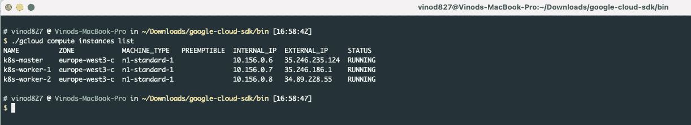

**在您的本地终端上运行此命令，使用所需的端口范围打开防火墙:-**

```
gcloud compute firewall-rules create nodeports — allow tcp:30000–40000
```

现在，使用 **gcloud** ssh 命令从本地终端 ssh 到主节点:-

```
gcloud compute ssh k8s-master
```

然后运行以下命令，使该虚拟机成为 Kubernetes (k8s)主节点:-

```
sudo -i
bash <(curl -s [https://raw.githubusercontent.com/vinod827/k8s-nest/main/iac/k8s/cluster-gcp/install_master.sh](https://raw.githubusercontent.com/vinod827/k8s-nest/main/iac/k8s/cluster-gcp/install_master.sh))
```

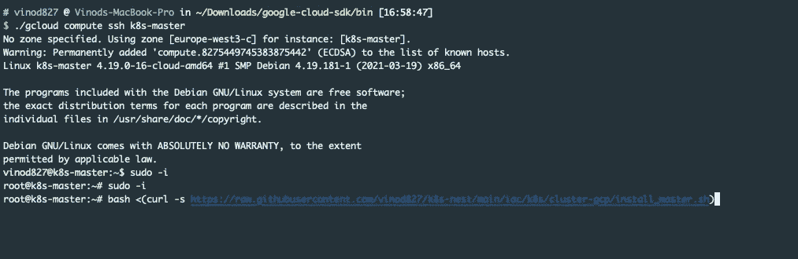

主网点

```
Note down the generated token below, this is important as it will be used to join the worker nodes:-Then you can join any number of worker nodes by running the following on each as root:kubeadm join 10.156.0.6:6443 — token <value withheld> \
 — discovery-token-ca-cert-hash sha256:b8f250d499f443311a745ed9b92a7eac1723850a120d53f7c71f2aac347b301b
serviceaccount/weave-net created
clusterrole.rbac.authorization.k8s.io/weave-net created
clusterrolebinding.rbac.authorization.k8s.io/weave-net created
role.rbac.authorization.k8s.io/weave-net created
rolebinding.rbac.authorization.k8s.io/weave-net created
daemonset.apps/weave-net created### COMMAND TO ADD A WORKER NODE ###
kubeadm join 10.156.0.6:6443 — token lglinc.htskyjdchamfi581 — discovery-token-ca-cert-hash sha256:b8f250d499f443311a745ed9b92a7eac1723850a120d53f7c71f2aac347b301bsudo -i
bash <(curl -s [https://raw.githubusercontent.com/vinod827/k8s-nest/main/iac/k8s/cluster-gcp/install_worker.sh](https://raw.githubusercontent.com/vinod827/k8s-nest/main/iac/k8s/cluster-gcp/install_worker.sh))
```

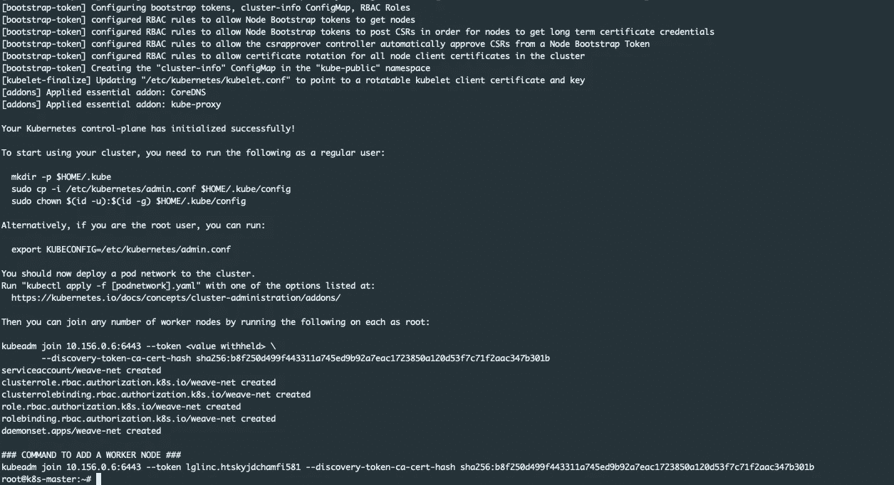

主节点—带令牌的输出

我这里是令牌**b 8f 250d 499 f 443311 a 745 ed 9 b 92 a 7 EAC 1723850 a 120d 53 f 7 c 71 F2 AAC 347 b 301 b**

类似地，首先使用 **gcloud** SSH 命令进入每个 worker 节点，然后执行以下命令:-

```
gcloud compute ssh k8s-worker-1sudo -i
bash <(curl -s [https://raw.githubusercontent.com/vinod827/k8s-nest/main/iac/k8s/cluster-gcp/install_worker.sh](https://raw.githubusercontent.com/vinod827/k8s-nest/main/iac/k8s/cluster-gcp/install_worker.sh))
```

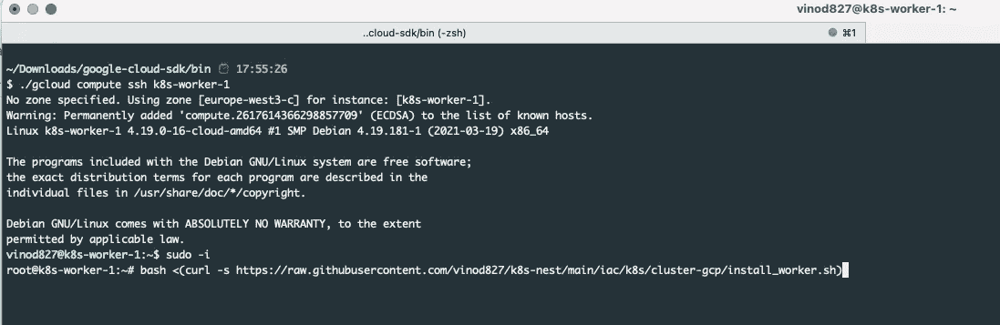

工作节点— 1

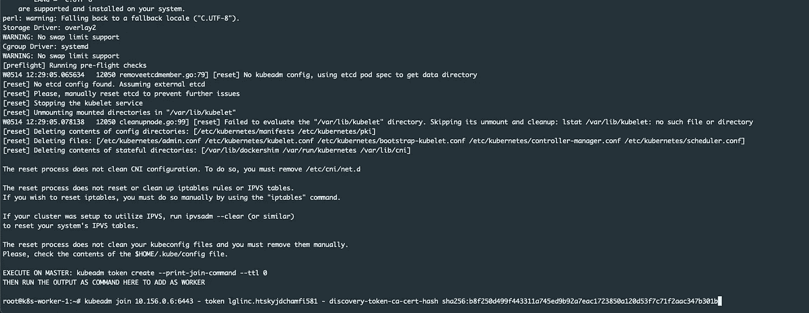

最后，在作为 Kubernetes 集群一部分的每个 worker 节点上运行下面的命令【T4:-

```
kubeadm join 10.156.0.6:6443 — token lglinc.htskyjdchamfi581 — discovery-token-ca-cert-hash sha256:b8f250d499f443311a745ed9b92a7eac1723850a120d53f7c71f2aac347b301b
```

(*注意:在您的情况下，令牌会有所不同，因此相应地进行更改)*

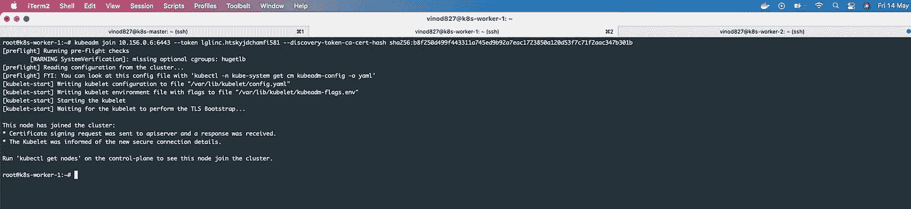

**瞧！！！你的 Kubernetes (k8s)集群已经准备好了**

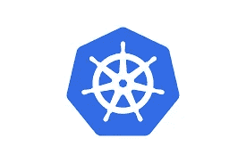

库伯内特斯

**测试您的 Kubernetes 集群**

在主节点上运行下面的命令，您应该会看到 Kubernetes (k8s)集群的节点数

```
kubectl get nodes -o wide
```

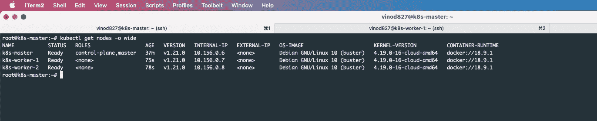

我们可爱的 Kubernetes 星团

让我们在集群中运行第一个 NGINX pod

```
kubectl run mynginx — image nginx
```

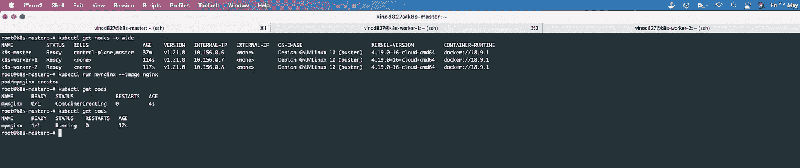

Kubernetes 集群上的 NGINX Pod

希望你喜欢这篇文章:)

和往常一样，GitHub 资源库中提供了完整的源代码。请随意派生这个库，并在这里贡献您的 IaC(基础设施代码)

[](https://github.com/vinod827/k8s-nest/tree/main/iac/k8s/cluster-gcp) [## vinod827/k8s-nest

### 所有 k8s 都住在这里。通过在 GitHub 上创建帐户，为 vinod827/k8s-nest 开发做出贡献。

github.com](https://github.com/vinod827/k8s-nest/tree/main/iac/k8s/cluster-gcp)