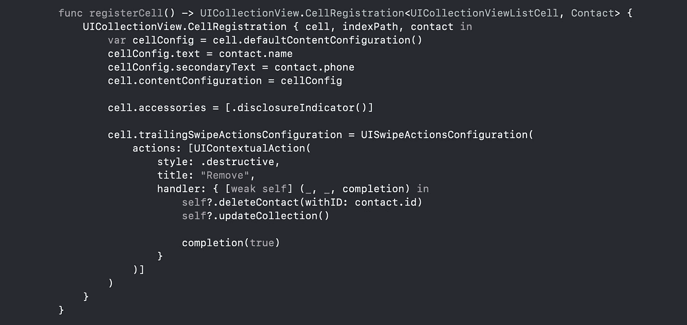

# 在 iOS 14 中使用 UICollectionView 创建列表

> 原文：<https://levelup.gitconnected.com/creating-lists-with-uicollectionview-in-ios-14-89d5fdc880af>

[自由股票](https://unsplash.com/@freestocks?utm_source=medium&utm_medium=referral)在 [Unsplash](https://unsplash.com?utm_source=medium&utm_medium=referral) 上拍摄的照片

去年，像可区分数据源和组合布局这样的大规模改进被推到了`UICollectionView`。`UICollectionView`在今年的 WWDC 上并没有进入 SwiftUI，但这并没有阻止`UICollectionView`收到一些强大的新更新。随着`UICollectionViewCompositionalLayout.list`和`UICollectionViewListCofiguration`的推出，`UICollectionView`变得更加强大，使用起来更加个性化。

当与`UICollectionViewListCell`配对时，`UICollectionView`现在支持以前只有`UITableView`才有的功能。例如，现在你可以添加滑动动作，并像显示指示器一样在单元格上设置附件。

在接下来的几节中，我们将看到在新的 iOS 14 中如何在`UICollectionView`中构建布局和单元格。

# 设置事物

假设我们正在处理一个视图来呈现联系人列表。将显示在列表中的联系人被建模为具有三个属性的`struct`:

集合视图的截面使用`enum`截面建模:

在视图控制器 ContactsViewController 中，创建三个属性——包含数据的视图模型、呈现数据的`UICollectionView`和`UICollectionViewDataSource`。

# uicollectionlayoutlist configuration

在 WWDC 2019 上，苹果推出了新的组合布局 API，这是一种可组合和灵活的 API，可以通过组合或合成更小的积木来构建各种布局。可以很容易地为常见的列表变体创建布局，例如`plain`、`grouped`和`insetGrouped`，这使我们能够快速配置类似列表的集合视图。

# 小区配置和注册

iOS 14 引入了全新的单元格配置 API，`UICollectionView.CellRegistration`来配置 UICollectionView 和 UITableView 单元格。

单元格注册提供了一种新的、更加类型安全的方式来告诉 UIKit 使用哪个`UICollectionViewCell`子类来呈现给定的单元格，并且使用单元格的`defaultContentConfiguration`，我们可以将数据绑定到它，而不必知道它的确切子视图。

下面是我们如何结合这两个新的 API 来创建一个`CellRegistration`，它使用新的`UICollectionViewListCell`来呈现联系人列表的各种单元格:

除了增加类型安全性之外，上述新 API 的另一个主要好处是，我们可以在一个闭包内的一个地方执行所有的单元格配置以及滑动动作事件处理。

# 构建和更新不同的数据源

为了构建我们列表的数据源，我们将使用去年引入的内置 Diffable 数据源 API，结合我们上面构建的`CellRegistration`实例，如下所示:

为了填充联系人列表数据，我们将首先创建一个`Section`枚举来描述列表的两个部分，然后我们将使用`NSDiffableDataSourceSnapshot` API 将来自`viewModel`的数据插入这两个部分:

有了以上内容，我们现在已经建立了一个简单的分组联系人列表，包含两个部分，支持滑动动作和显示指示器——都使用`UICollectionView`。

ContactsViewController 类应该是这样的:

# 结论

自平台的第一个版本以来，表视图一直是 iOS 用户界面的核心部分，而集合视图是很久以后才添加的。在最近几个 iOS 版本中，收藏视图的功能越来越强大——在 iOS14 中，`UICollectionView`不仅在列表渲染方面与`UITableView`不相上下，甚至还超过了它。

因此，虽然仍然可能有只有`UITableView`涵盖的边缘情况，但我认为公平地说`UICollectionView`现在是在 iOS 上建立列表的首选方式(至少一旦我们能够将 iOS 14 用作应用程序的最低部署目标)。