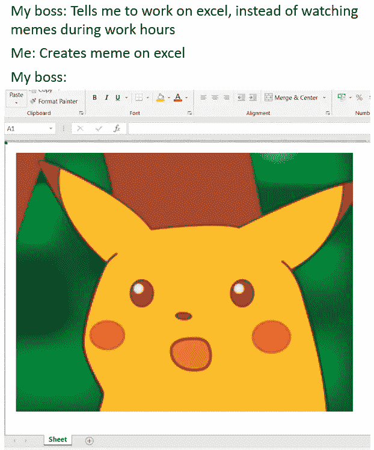
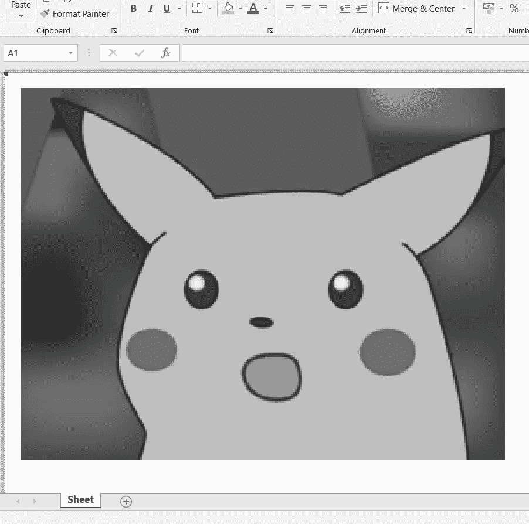
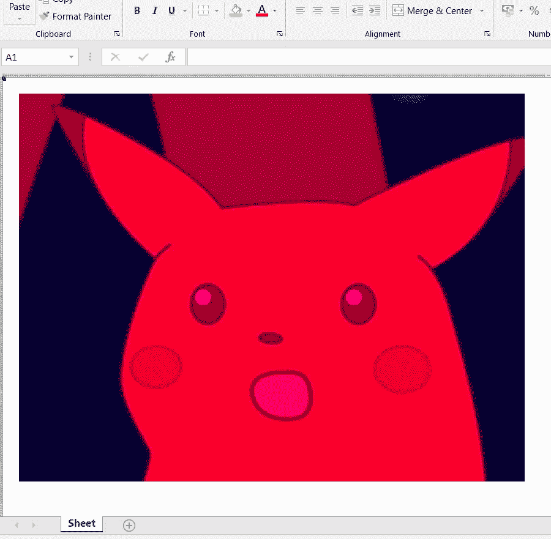

# 使用 python 在 excel 中创建迷因

> 原文：<https://levelup.gitconnected.com/creating-memes-in-excel-using-python-3922b25f12d6>



是的，你没看错！这是一个在 excel 上绘制的真实的迷因。excel 表格中的每个单元格都按照原始图像进行了颜色格式化，再现了著名的“惊奇皮卡丘”迷因。

那么，我们如何在 excel 上绘制迷因(或者任何图像)？不用说，手动编辑每个单元格是不可能的任务。因此，我们将编写一个 python 脚本来完成这项工作。这个脚本执行四个简单的任务:

1.  阅读原始图像，并根据需要调整其大小。记下图像中每个像素的 RGB 值。
2.  创建一个空白 excel 文件，并适当调整工作表中单元格的大小。调整大小很重要，因为图像中的像素是方形的，而 excel 单元格默认是矩形的。
3.  进行任何可选的调整，例如提供边距和背景色、转换为黑白或设置 excel 工作表的缩放级别。
4.  对于每个像素，用 RGB 值填充相应的单元格。

我们使用了两个 python 库: **PIL** 用于图像处理，以及 **openpyxl** 用于 excel 操作。这两个库都预安装在 anaconda 包中。

我们首先导入必要的库并读取(和调整)原始图像:

```
from PIL import Image
import openpyxlim = Image.open('meme.jpg', 'r')
width = max_width
height = int(width*(im.size[1]/im.size[0]))
im = im.resize((width, height))
px = im.load()
```

*‘max _ width’*是我根据笔记本电脑的屏幕大小设置的可调参数。代码有几个这样的参数，它们的值在代码的开头声明:

```
max_width = 350
sheet_zoom = 15        # Zeem level of the excel sheet
column_size = 2
row_size = 10
img_left_margin = 10
img_top_margin = 10
img_right_margin = 10
img_bottom_margin = 10
bg_col = 'FFFFFF'      # Background colour - default is white
black_and_white = 0    # Set to 1 if you want black and white image
```

读取图像后，我们创建一个空白的 excel 文件，并调整单元格的大小:

```
wb = openpyxl.Workbook()
ws = wb.activefor i in range(0, height+img_top_margin+img_bottom_margin):
    t = ws.cell(row = i+1, column = 1)
    ws.row_dimensions[t.row].height = row_size
for j in range(0, width+img_left_margin+img_right_margin):
    t = ws.cell(row = 1, column = j+1)
    ws.column_dimensions[t.coordinate.replace(str(t.row),'')].width = column_size
```

我们也可以改变背景颜色:

```
for i in range(0, width+img_left_margin+img_right_margin):
    for j in range(0, height+img_top_margin+img_bottom_margin):
        a = ws.cell(row = j+1, column = i+1)
        a.fill = openpyxl.styles.PatternFill(fill_type = 'solid', start_color = bg_col, end_color = bg_col)
```

最后，我们取一个大小与图像分辨率相等的单元格数组，并用相应像素的 RGB 值给数组中的每个单元格着色。

```
for i in range(0, width):
    for j in range(0, height):
        a = ws.cell(row = j+img_top_margin, column = i+img_left_margin)
        col = px[i, j]
        c1 = col[0]
        c2 = col[1]
        c3 = col[2]

        if black_and_white == 1:
            bw = int(0.2126*c1 + 0.7152*c2 + 0.0722*c3)
            val = '{:02X}'.format(bw)
            c = val + val + val
        else:
            c = '{:02X}{:02X}{:02X}'.format(c1, c2, c3) c_fill = openpyxl.styles.PatternFill(fill_type = 'solid', start_color = c, end_color = c)
        a.fill = c_fillws.sheet_view.zoomScale = sheet_zoom
wb.save(filename = 'meme_pic.xlsx')
```

***PatternFill*** 以十六进制格式接收颜色，而 ***px[i，j]*** 以 RGB 格式输出颜色。因此，我们将 RGB 颜色值转换为十六进制。为此，我们取每个颜色分量，将其转换为十六进制，然后将三个转换后的十六进制值并排放在一起，得到十六进制的颜色。例如，假设 RGB 值为(200，187，83)。我们分别计算十六进制值:十六进制(200) = C8，十六进制(187) = BB，十六进制(83) = 53。因此，十六进制的颜色将是 C8BB53。Python 使用 ***'{:02X} '进行这种转换。格式()。***‘X’表示括号中的数字要转换成十六进制，而‘02’给出输出的最小长度(例如，如果十六进制输出是 *E* ，‘02’使其成为 *0E* ) *。*

以下是完整的脚本:

那么，这一切有什么实际效用吗？说实话，找一个我都不知所措。我想不出现实生活中需要我从 excel 单元格中绘制图像的情况。然而，这是一个 excel 操作和图像处理的好例子。例如，该脚本允许您从原始图片创建自定义的黑白图像。黑白图像具有相同的 R、G 和 B 分量值。因此，需要一个函数，对于每个像素，它接受三个输入(彩色图像中的 R、G 和 B 分量),并计算该像素的单个输出值。我使用了一个线性函数，为三个成分分配不同的权重(大约 21%红色+ 72%绿色+ 7%蓝色)。人们可以通过修改权重或探索非线性函数来探索图像的黑白版本是如何变化的。



黑白图像，对红色、绿色和蓝色使用权重为 0.22、0.71 和 0.07 的线性函数

此外，由于您可以在像素级别控制图像，因此在进行更改时有很大的灵活性。例如，我尝试关闭绿色(在第 47 行设置 ***c2 = 0*** )，结果图像看起来很酷:



绿色关闭的图像

因此，尽管从实用的角度来看完全没有用，我确实认为这是一个有趣的工作！

# 分级编码

感谢您成为我们社区的一员！ [**订阅我们的 YouTube 频道**](https://www.youtube.com/channel/UC3v9kBR_ab4UHXXdknz8Fbg?sub_confirmation=1) 或者加入 [**Skilled.dev 编码面试课程**](https://skilled.dev) 。

[](https://skilled.dev) [## 编写面试问题

### 掌握编码面试的过程

技术开发](https://skilled.dev)