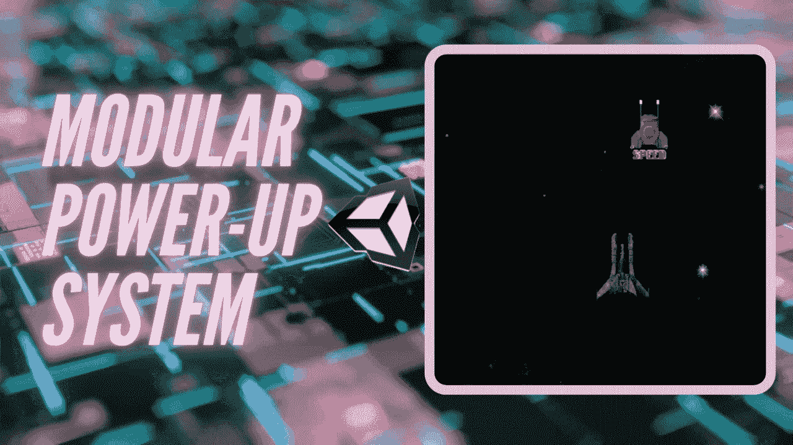
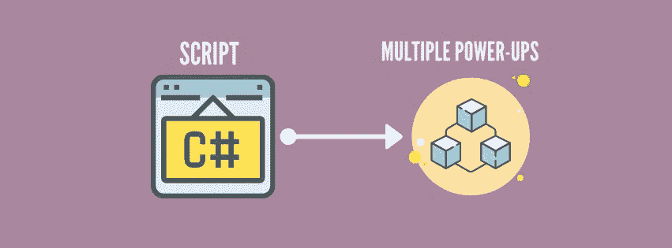
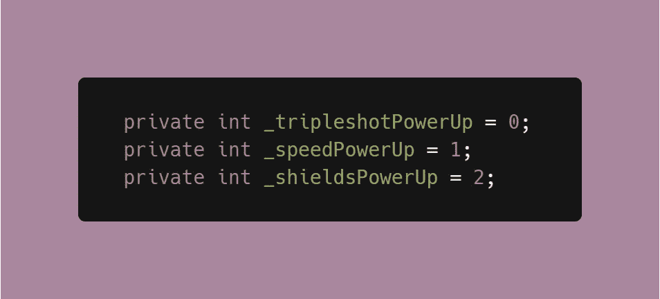
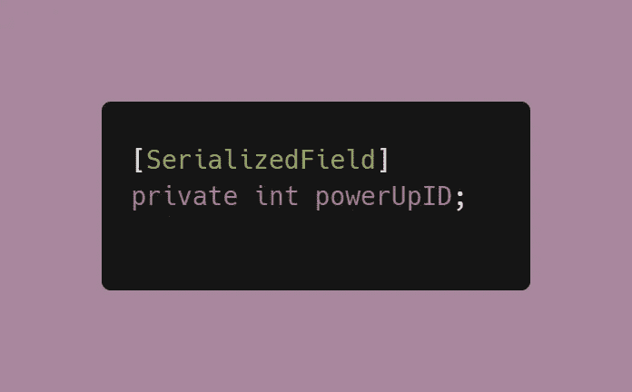
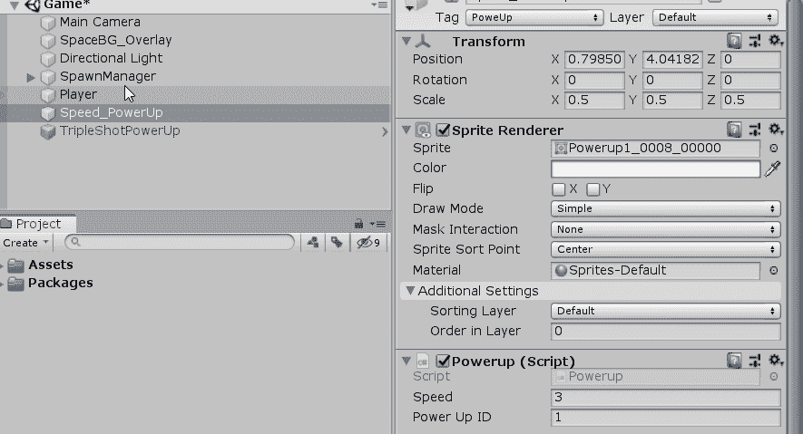
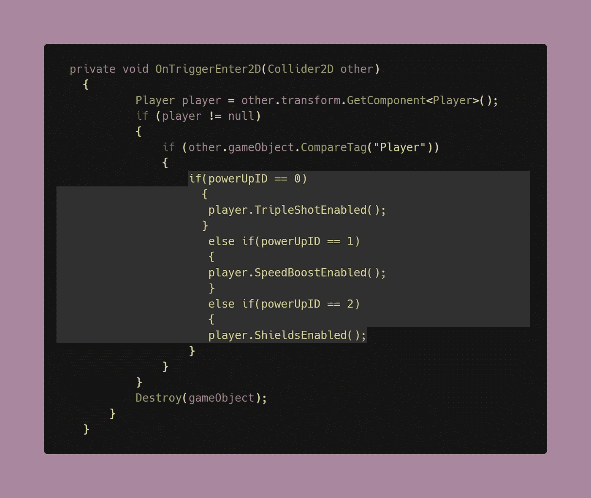

# 在 Unity 中创建模块化加电系统

> 原文：<https://levelup.gitconnected.com/creating-modular-power-up-systems-bcf349e0020>

当我们谈论某个东西*模块化时，*我们指的是由不同的部分或片段组合在一起形成一个单一实体的东西。说到编程，你可以用一个**单个脚本**处理**多个对象**，每个对象都有自己独特的行为。在本文中，我们将探索如何有效地创建一个模块化的加电系统！

## 如何在 Unity 中创建模块化加电系统

如果你有一个游戏有多个电源，而不是每个对象都有一个脚本来激活它们，你可以简单地编程一个模块化系统来处理它们，不管它们的行为如何不同。

1.  您需要分配全局变量来跟踪加电。在这个例子中，我使用 int 类型变量来标识我的加电。

2.创建一个全局 int 变量来跟踪当前的加电 ID。这将是一个 SerializeField，这样我们可以在 Inspector 中调整它的值，这对调试和测试也很有用。

3.在检查器中，为您的加电对象分配各自的值，这是代码稍后区分它们的方式。

4.既然有了跟踪加电的变量，就可以在碰撞代码中编写比较逻辑了。

> **注意:**如有任何关于碰撞代码和加电行为的问题，点击[此处](/adding-power-ups-e4af4ccbd7cb)。

有了这个代码，你可以注册哪个加电与玩家对象冲突，并相应地激活它的效果。在我的 2D 太空射手[代码](/adding-power-ups-e4af4ccbd7cb?source=your_stories_page-------------------------------------)中，我使用[脚本通信](https://medium.com/codex/script-communication-in-unity-using-getcomponent-ca4444bfec6)来访问玩家脚本中的函数。由于加电会修改播放器的行为，所有的效果功能都在播放器脚本中，然而，它们是通过**模块化系统**激活的，这取决于所收集的加电。

但是如果你有不止三个电源呢？说实话，上面的代码虽然可以用，但已经很乱了。想象一下，必须将 10 次加电写入其中！这就是为什么在我的下一篇文章中，我将讨论 [**Switch 语句！**](https://dennisse-pd.medium.com/switch-statements-to-the-rescue-277cb924c312)