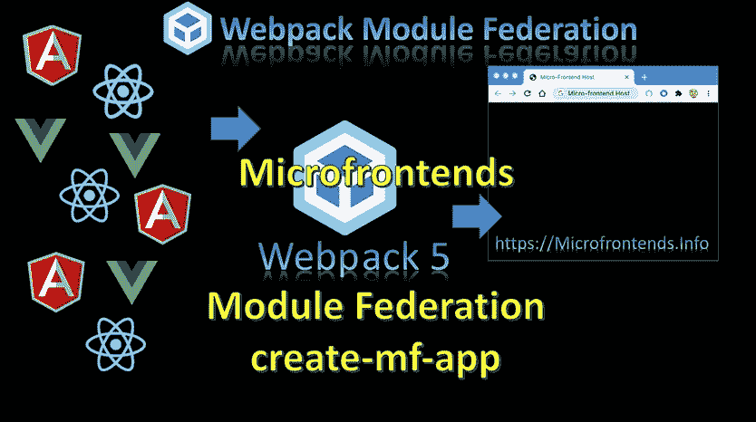
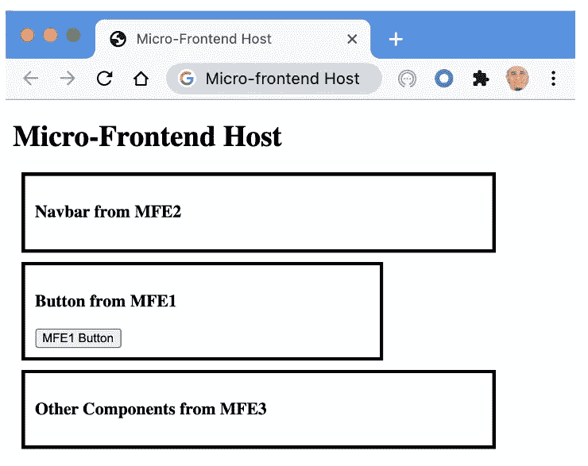
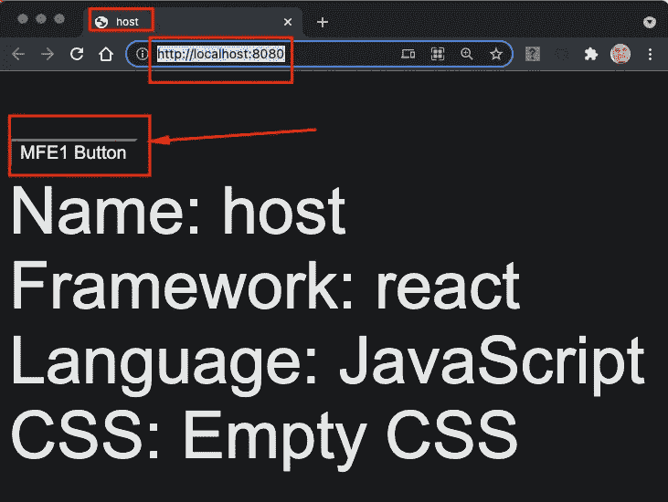
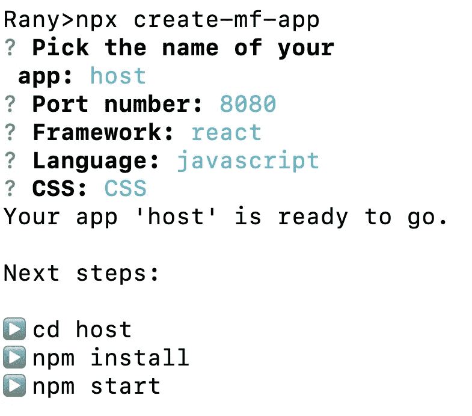
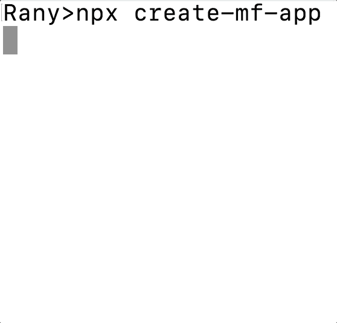
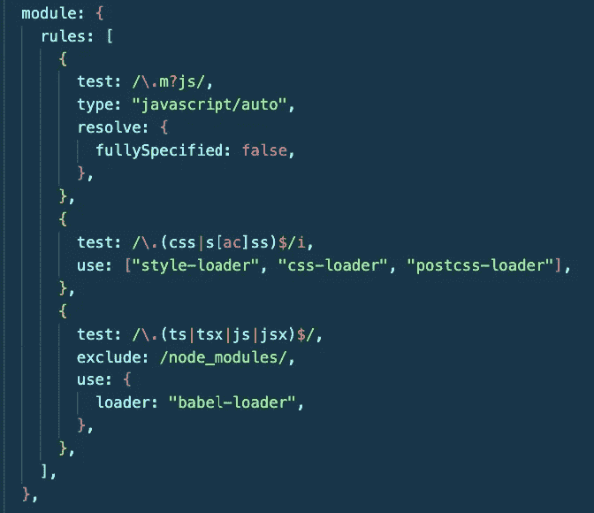
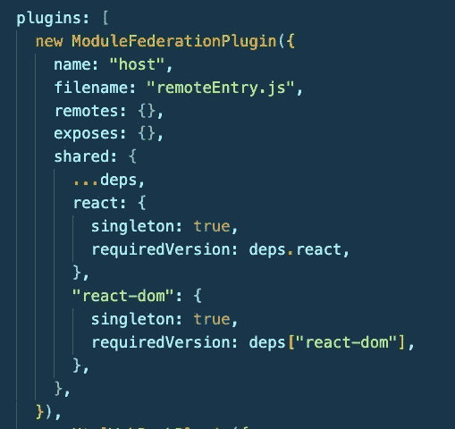
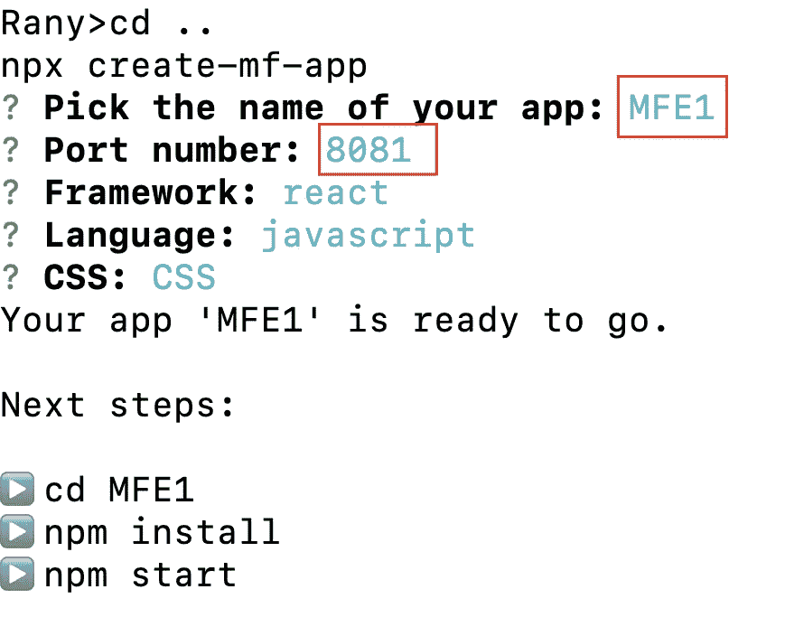
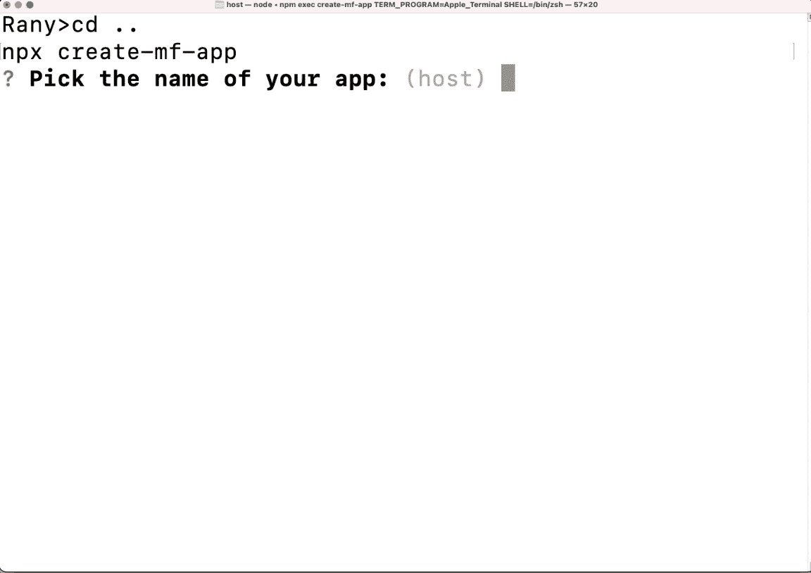

# 使用 create-mf-app 创建模块联合微前端

> 原文：<https://levelup.gitconnected.com/creating-module-federation-microfrontends-with-create-mf-app-33c819b4c461>



创建-mf-app

现在，我们有一个简单的方法来创建一个微前端应用程序，不需要使用 ***create-mf-app*** 的所有 webpack 配置。我将在本文中使用它来解释带有模块联邦的微前端

如果您是微前端的新手，可以从下面的文章开始

[](https://www.linkedin.com/pulse/micro-frontends-what-why-how-rany-elhousieny-phd%E1%B4%AC%E1%B4%AE%E1%B4%B0) [## 微前端:什么、为什么和如何

### 在我以前的文章(本文末尾和这里的链接)中，我亲自展示了什么是微前端以及如何…

www.linkedin.com](https://www.linkedin.com/pulse/micro-frontends-what-why-how-rany-elhousieny-phd%E1%B4%AC%E1%B4%AE%E1%B4%B0) [](https://www.linkedin.com/pulse/microfrontends-module-federation-what-why-how-elhousieny-phd%E1%B4%AC%E1%B4%AE%E1%B4%B0) [## 具有模块联邦的微前端:什么、为什么和如何

### "模块联合给了我们一种在前端应用程序间共享代码的新方法. "前一句是…

www.linkedin.com](https://www.linkedin.com/pulse/microfrontends-module-federation-what-why-how-elhousieny-phd%E1%B4%AC%E1%B4%AE%E1%B4%B0) 

微前端由一台主机和多个微前端组成。正如我们将看到的，主机可以托管组件。这是我们将在以后的文章中创建的内容，如下所示:



# 创建和共享按钮

这是理解模块联合如何工作的一个很好的开始练习。请按照这篇[文章](https://www.linkedin.com/pulse/microfrontends-module-federation-create-mf-app-button-rany)获得以下结果

[https://www . LinkedIn . com/pulse/micro frontends-module-Federation-create-MF-app-button-rany](https://www.linkedin.com/pulse/microfrontends-module-federation-create-mf-app-button-rany)



# 传递道具并在其上添加动作

在这篇[文章](https://www.linkedin.com/pulse/microfrontends-module-federation-pass-props-add-them-rany)中，我将解释如何传递道具并给它们添加动作

[https://www . LinkedIn . com/pulse/micro frontends-module-Federation-pass-props-add-them-rany](https://www.linkedin.com/pulse/microfrontends-module-federation-pass-props-add-them-rany)


============================

# 创建微前端主机

让我们使用 create-mf-app 创建一个主机，在终端上运行以下命令

```
 npx create-mf-app
```

它会问你关于名称、端口、框架、语言和 CSS 的问题。我将在这里选择默认值



进入文件夹“host”并运行`yarn install or npm install`来获取所有的依赖项。

让我们看看为我们实现了什么:

打开 visual studio 代码`code .`

在 webpack.config.js 中

它增加了所有的装载机



添加了共享模块和模块联合的样板文件



我们需要做的就是构建组件并公开/远程控制它们

=========================

# 正在创建 MF1

让我们在文件夹中向上一步，在端口 8081 上创建另一个名为 MFE1 的 MFE

```
cd ..npx create-mf-app
```

