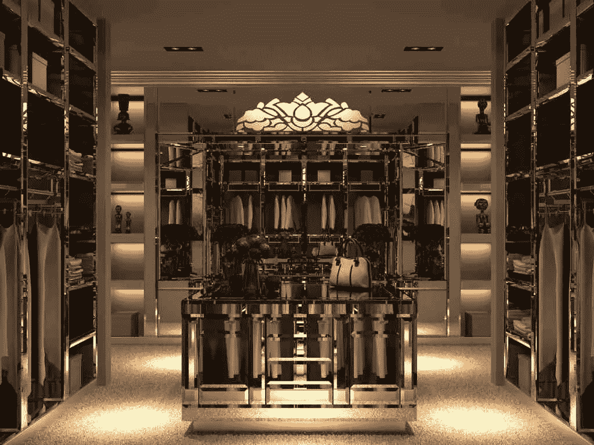
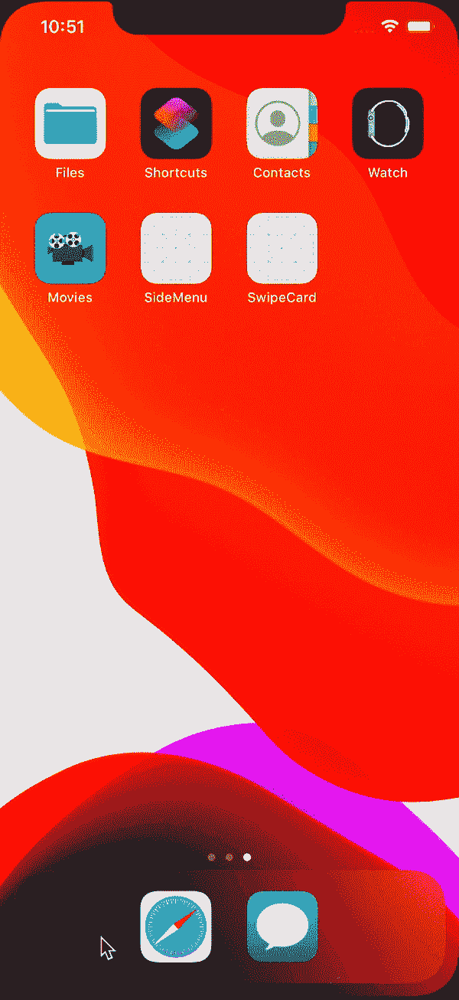
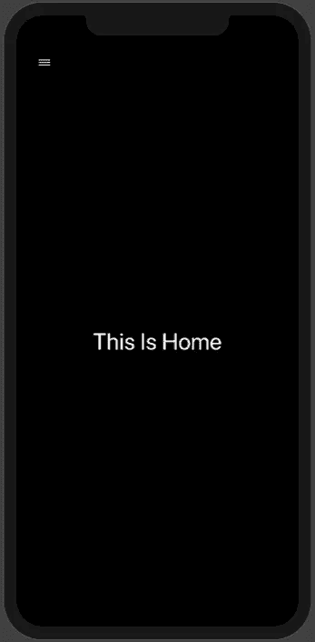
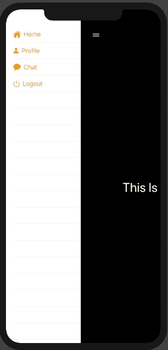
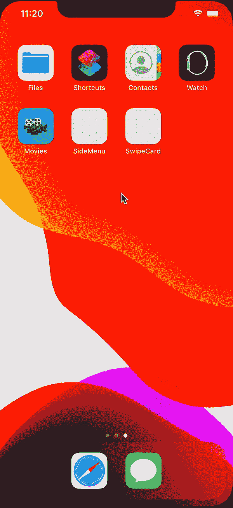
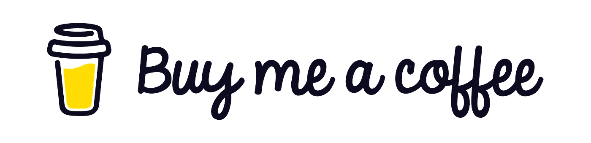

# 使用 SwiftUI 创建导航抽屉

> 原文：<https://levelup.gitconnected.com/creating-navigation-drawer-with-swiftui-891663dd32d2>



一切都是为了秩序！

当设计要求在他们的 iOS 应用程序中加入导航抽屉时，大多数 iOS 开发者绝对会对此感到恐惧。简单来说，就是没有直接从 iOS 实现的方法。我不喜欢这个设计，因为它太不像 iOS 了。话虽如此，当需要出现时，我们必须搁置分歧，完成工作。

到目前为止，我一直依赖于像`SWRevealViewController`这样的库。我尝试子类化`Segues`来使这个工作不太依赖`CocoaPods`，但是这太难了。随着我开始学习`SwiftUI`，这种情况最近发生了变化。

这是我的代码，使用`SwiftUI`实现了一个定制的导航抽屉

让我们从创建菜单项的模型开始

```
class MenuContent: Identifiable, ObservableObject {var id = UUID()
var name: String = ""
    var image: String = ""init(name: String, image: String) {
self.name = name
        self.image = image
    }}
```

这是一个非常简单的模型定义。我们给菜单一个标题(`name`)和一个图标(`image`)。

> 我们将我们的类`MenuContent`与`Identifiable`和`ObservableObject`相一致，这样从这个类创建的列表保持不同(用标识符表示的唯一元素由`UUID`表示),并且我们可以分别观察类对象上的变化。

接下来，我们可以创建一个 menuContents 列表作为 testData。

```
let menuHome = MenuContent(name: "Home", image: **"house.fill"**)let menuProfile = MenuContent(name: "Profile", image: **"person.fill"**)let menuChat = MenuContent(name: "Chat", image: **"message.fill"**)let menuLogout = MenuContent(name: "Logout", image: **"power"**)let menuContents = [menuHome, menuProfile, menuChat, menuLogout]
```

在 2019 年的 WWDC，苹果推出了 **SF 符号**，它非常漂亮。一个可以在我们的应用程序中使用的矢量 T21 图像库。因为它们是矢量图像，所以它们是可缩放的，并且很容易定制。`image`变量接受与 **SF 符号中可用图像标题相匹配的字符串名称。**

有关 SF 符号的更多信息，请查看以下官方文档-

 [## SF 符号. SF 符号.人机界面指南.苹果开发者

### SF 符号提供了一组超过 1，500 个一致的、高度可配置的符号，您可以在您的应用程序中使用。苹果设计了…

developer.apple.com](https://developer.apple.com/design/human-interface-guidelines/sf-symbols/overview/) 

现在，让我们设计我们的主屏幕-

```
struct ContentView: View {
    var menu: [MenuContent] = menuContents
    var body: some View {
        **List(menu)** { menuItem in **MenuCell(menuItem: menuItem)**.onTapGesture {}
        }
    }
}struct **MenuCell**: View {var menuItem: MenuContent = menuContents[0]
    var body: some View {
        **HStack** {
            **Image**(systemName: menuItem.image)
                .foregroundColor(
                    .orange)
            **Text**(menuItem.name)
                .foregroundColor(
                    .orange)
        }
    }
 }
```

主屏(`ContentView`)现在在数组`menu`上渲染一个单独的`List`。我们还创建了一个单独的视图来呈现 MenuCell(来自`UITableView`的旧习惯)。

这段代码将给出以下输出



菜单

现在让我们为菜单项添加一个目标视图

```
struct **HomeView**: View {
    var body: some View {
        **ZStack** {
            Color.black.edgesIgnoringSafeArea(
                .all)
            **VStack**(alignment: .leading) {
                **Button**(action: {}) {
                    Image(systemName: "line.horizontal.3")
                        .foregroundColor(.white)
                }
                .frame(width: 50.0, height: 50.0)
                **Spacer()**
                **Text**("This Is Home")
                    .font(
                        .largeTitle)
                    .foregroundColor(
                        .white)
                    .frame(maxWidth: .infinity)
                **Spacer()**
            }.padding(.horizontal) .frame(maxWidth: .infinity)
        }
    }
}
```

我们可以将这个视图添加到现有菜单列表之上的`ContentView`中，作为`ZStack`中的下一个元素

```
struct ContentView: View {
    var menu: [MenuContent] = menuContents
    var body: some View {
        ZStack {
            **List(menu)** { menuItem in
                MenuCell(menuItem: menuItem).onTapGesture {
                    self.menuItemSelected = menuItem
                }
            }
            **HomeView()**
        }
    }
}
```

添加`HomeView()`后，我们将看不到现有的菜单列表，因为`HomeView`将自己绘制在菜单的顶部。



如果我们在我们的`HomeView`中添加一个`offset`属性，会发生什么？

```
struct HomeView: View {
    var body: some View {
        ZStack {
            Color.black.edgesIgnoringSafeArea(
                .all)
            VStack(alignment: .leading) {
                Button(action: {}) {
                    Image(systemName: "line.horizontal.3")
                        .foregroundColor(.white)
                }
                .frame(width: 50.0, height: 50.0)
                Spacer()
                Text("This Is Home")
                    .font(
                        .largeTitle)
                    .foregroundColor(
                        .white)
                    .frame(maxWidth: .infinity)
                Spacer()
            }.padding(.horizontal) .frame(maxWidth: .infinity)
        }
        **.offset(x: 200.0, y: 0)**
    }
}
```



从 ContentView 呈现的 HomeView

这不是很有趣吗？现在，`ZStack`上渲染的视图被推开了。这给了它一个导航抽屉的外观。现在让我们在`HomeView`中添加一个`@State var`属性，在这个属性上我们可以动态地切换 MenuShowing 属性

```
struct HomeView: View {
    [**@State**](http://twitter.com/State) **private var showingMenu = false**
    var body: some View {
        ZStack {
            Color.black.edgesIgnoringSafeArea(
                .all)
            VStack(alignment: .leading) {
                Button(action: {**self.showingMenu.toggle()**}) {
                    Image(systemName: "line.horizontal.3")
                        .foregroundColor(.white)
                }
                .frame(width: 50.0, height: 50.0)
                Spacer()
                Text("This Is Home")
                    .font(
                        .largeTitle)
                    .foregroundColor(
                        .white)
                    .frame(maxWidth: .infinity)
                Spacer()
            }.padding(.horizontal) .frame(maxWidth: .infinity)
        }
        .offset(x: **showingMenu** ? 200.0 : 0.0, y: 0)
    }
}
```

`showingMenu`是一个布尔值，偏移量取决于它。正如您所看到的，当用户单击菜单按钮时，这个值被切换，它可以显示和隐藏菜单。

我将继续添加一小段代码来给这个过渡添加一个动画-

`.animation(.easeOut)`

让我们只添加其余的视图来连接菜单。

```
struct HomeView: View {
    [@State](http://twitter.com/State) private var showingMenu = true
    var body: some View {
        ZStack {
            Color.black.edgesIgnoringSafeArea(
                .all)
            VStack(alignment: .leading) {
                Button(action: {self.showingMenu.toggle()}) {
                    Image(systemName: "line.horizontal.3")
                        .foregroundColor(.white)
                }
                .frame(width: 50.0, height: 50.0)
                Spacer()
                Text("This Is Home")
                    .font(
                        .largeTitle)
                    .foregroundColor(
                        .white)
                    .frame(maxWidth: .infinity)
                Spacer()
            }.padding(.horizontal) .frame(maxWidth: .infinity)
        }
        .offset(x: showingMenu ? 200.0 : 0.0, y: 0)
        **.animation(.easeOut)**
    }
}struct ProfileView: View {
    [@State](http://twitter.com/State) private var showingMenu = false
    var body: some View {
        ZStack {

            Color.red.edgesIgnoringSafeArea(
                .all)
            VStack(alignment: .leading) {
                Button(action: {self.showingMenu.toggle()}) {
                    Image(systemName: "line.horizontal.3")
                        .foregroundColor(.white)
                }
                .frame(width: 50.0, height: 50.0)
                Spacer()
                Text("This Is Profile")
                    .font(
                        .largeTitle)
                    .foregroundColor(
                        .white)
                    .frame(maxWidth: .infinity)
                Spacer()
            }.padding(.horizontal) .frame(maxWidth: .infinity)
        }
        .offset(x: showingMenu ? 200.0 : 0.0, y: 0)
        **.animation(.easeOut)**
    }
}struct ChatView: View {
    [@State](http://twitter.com/State) private var showingMenu = false
    var body: some View {
        ZStack {

            Color.blue.edgesIgnoringSafeArea(
                .all)
            VStack(alignment: .leading) {
                Button(action: {self.showingMenu.toggle()}) {
                    Image(systemName: "line.horizontal.3")
                        .foregroundColor(.white)
                }
                .frame(width: 50.0, height: 50.0)
                Spacer()
                Text("This Is Chat")
                    .font(
                        .largeTitle)
                    .foregroundColor(
                        .white)
                    .frame(maxWidth: .infinity)
                Spacer()
            }.padding(.horizontal) .frame(maxWidth: .infinity)
        }
        .offset(x: showingMenu ? 200.0 : 0.0, y: 0)
        **.animation(.easeOut**)
    }
}struct LogoutView: View {
    [@State](http://twitter.com/State) private var showingMenu = false
        var body: some View {
            ZStack {

                Color.green.edgesIgnoringSafeArea(
                    .all)
                VStack(alignment: .leading) {
                    Button(action: {self.showingMenu.toggle()}) {
                        Image(systemName: "line.horizontal.3")
                            .foregroundColor(.white)
                    }
                    .frame(width: 50.0, height: 50.0)
                    Spacer()
                    Text("This Is Logout")
                        .font(
                            .largeTitle)
                        .foregroundColor(
                            .white)
                        .frame(maxWidth: .infinity)
                    Spacer()
                }.padding(.horizontal) .frame(maxWidth: .infinity)
            }
            .offset(x: showingMenu ? 200.0 : 0.0, y: 0)
            **.animation(.easeOut)**
        }
}
```

在`ContentView`中，我们将创建一个函数，根据所选菜单项返回所需的`View`。

```
func selected(Menu: MenuContent) -> some View {
    switch Menu.name {
    case "Home":
        return AnyView(**HomeView()**)

    case "Profile":
        return AnyView(**ProfileView()**)

    case "Chat":
        return AnyView(**ChatView()**)

    case "Logout":
        return AnyView(**LogoutView()**)
    default:
        return AnyView(**HomeView()**)
    }
}
```

最后，我们应该修改 ContentView 的主体，以便在点击 MenuCell 时改变屏幕。

```
struct ContentView: View {
    var menu: [MenuContent] = menuContents
    [**@State**](http://twitter.com/State) **var menuItemSelected: MenuContent = menuContents[0]**
    var body: some View {
        ZStack {
            List(menu) { menuItem in
                MenuCell(menuItem: menuItem).onTapGesture {
                    **self.menuItemSelected = menuItem**
                }
            }
            self.selected(Menu: **menuItemSelected**)
        }
    }
}
```

当`menuItemSelected`是一个`@State var`时，每次其中的值改变时，`ContentView`会重新渲染自己并改变`ZStack`的俯视图。

最终输出看起来会像这样-



最终屏幕

这是使用 SwiftUI 在 iOS 中实现导航抽屉的众多方法之一。从来没有这么容易过。

如果有人感兴趣，他们可以查看完整的代码-

[](https://github.com/sidjdev/NavigationDrawer) [## sidjdev/NavigationDrawer

### 在 GitHub 上创建一个帐户，为 sidjdev/NavigationDrawer 开发做贡献。

github.com](https://github.com/sidjdev/NavigationDrawer) 

干杯！

[](http://buymeacoffee.com/sidjdev)