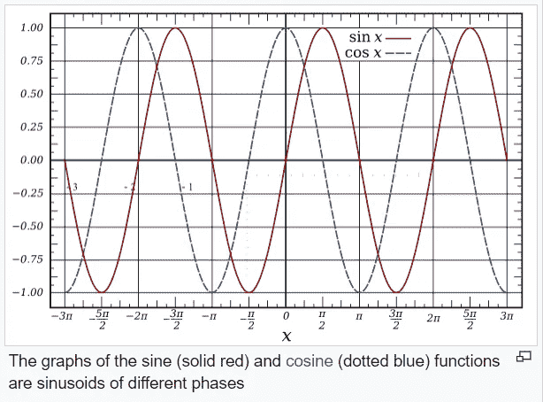
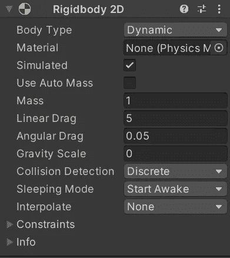

# 创造新的敌人类型:豪猪河豚第 2 部分-使用正弦波运动

> 原文：<https://levelup.gitconnected.com/creating-new-enemy-types-the-porcupine-blowfish-part-2-movement-using-a-sine-wave-7dc7e9df570b>

现在我的主要艺术资产已经准备好了，我可以开始把新的敌人河豚带入我的 Unity 游戏。我在这篇文章中的**目标**是让敌人河豚在屏幕上向左移动，同时使用*正弦波*上下移动。

在我深入研究代码之前，我需要通过将精灵带入场景视图、分配名称、标签和分层顺序来准备精灵。我还添加了类型 **Ridgidbody2D** 、 **CapsuleCollider2D** 和**敌人脚本**的组件。在检查器中将敌人脚本上的 **enemyID** 指定为 **3** 后，我将河豚拖到 prefabs 文件夹中，使其成为一个**预置**。

我的**产卵管理器**将需要这个新敌人的引用，所以我将**预置**拖到检查器中产卵管理器脚本的敌人数组中。这为这个从 3 号*(数组从零开始)*进来的敌人创建了一个新的*元素*。

是时候打开**敌班**开始工作了。我用一个脚本有多个敌人，所以我用一个 **enemyID** 变量来分解行为。为了这篇文章，我将只包括与新的 blowfish 敌人有关的大部分代码。

这是我实施运动的第一种方式。做起来很快，也不需要太多代码，但是它有它的限制。在 void **更新**我称之为**敌人运动**方法。忽略我的其他敌人的 if else 语句，我降落在 **3** 的 **enemyID** 上，这是新的河豚。这里我使用**变换。平移**用新的**矢量 3** 位置 *(X，Y，Z)* 移动敌人。 **X** 坐标赋值为 **-1** ，每更新一帧*(正 1 将敌人右移)*将敌人**向左**移动 **X 轴**上 **1** 的值。在 **Y** 空间中， **Mathf。Sin** 功能用来表示 Y 轴的移动。 **Y** 是 **X** 的 **Sin** ，所以 **Mathf。Sin** 用于在 Y 轴上上下移动。一个*正弦波*在*时间*内在 **1** 和 **-1** 的值之间移动，这些值作为 Y 轴*(上下)*上的更新坐标通过。 **Z** 空间得到一个零，因为这是一个 *2D 游戏*，我没有在 Z 轴上移动任何东西*(除了一些旋转)*。

虽然这样做很好，但问题是我想使用**速度**变量和**时间。DeltaTime** 给我向左的移动一个平滑的*帧速率独立的*运动。因为这些都混杂在一行代码中，所以除了以速度值向左移动敌人之外，速度值也是正弦波振幅的倍数。结果是大大增加了波浪的高度和深度*(振幅)*，超过了其默认值范围 **-1** 和 **1** 。

下面是上面代码的样子。这里可以看到正弦波相当大。

这是我选择的路线。它更长，但在提炼正弦波时允许更多的灵活性。在**启动**无效时，如果 **enemyID** 为 **3** *(blowfish)* ，我为 blowfish 启动一个**协程**。在 void **update** 中，调用 **EnemyMovement** 方法。**敌人移动**方法在四个敌人中的*三个*之间共享一个向左的移动。这样我就可以把 **enemyID** 等于**等于**等于 **3** 作为可选的*条件*进入 **if** 语句，让敌人向左移动。现在我有了*速度*变量和*增量时间*与我共享的敌人向左移动，并且独立于正弦波移动。

**协程**使用一个 **while 循环**，只要*isEnemyDead***bool**为 **false** 就会运行。为了保持 **Mathf。Sin** 从不断的*覆盖*我的移动*离开*在 *X* 上并且保持敌人在屏幕的中心，我需要*存储*和*缓存*在 *X* 轴上的*位置*。引入了一个名为 **currentPositionX** 的*局部* **浮动**变量，它被赋予游戏对象的*变换*在 *X* 轴上的当前位置，每帧更新一次。现在我可以使用**变换。位置**和一个**新矢量 3** 使用*正弦波*更新玩家在 **Y** 上的位置。 **Time.time** 是让正弦波随着时间运动的东西，因为它是一种*基于时间的运动*。 **currentPositionX** 变量确保向左移动确实发生。

下面是上面代码的样子。

现在我有空间来调整正弦波，我将添加一些方差。增加了两个**浮动变量**。**振幅**变量代表正弦波运动的**大小**，而**频率**代表波的**速度**。

在 void **start** 中，我*通过使用 **Random 来随机化***值的分配。范围，返回一个在声明的最小*和最大*之间的随机值。

导航回**协程**在 **while** 循环中，我创建了另一个浮点变量来存储 Y 轴上的移动 *(sinMovementY)* ，并将其值赋给 Mathf。正弦函数。**频率**乘以**时间**以增加波浪移动的*速率*，最后一切都乘以**振幅**，这将决定波浪有多大*。 **sinMovementY** 的局部变量现在可以放入下面 *Vector3* 移动的 **Y** 值赋值中。*

**

*这里是一些敌人河豚展示随机变化的新运动的剪辑。*

**

*为了更进一步，我需要在 void **start** 中存储一次 **Y 轴**的起始位置。这样我的敌人河豚就不会一直锁定在 **Y** 上的 **0** 作为起始坐标。 **startPositionY** 变量现在在正弦波运动之前输入，并且**添加了**到其中。*

**

*最后一步是固定**边界**。当敌人离开屏幕左侧时，它将*重新分配给屏幕右侧的*和 **Y** 上的**随机**位置。我现在可以使用先前存在的 **randomY** 变量来重新分配 **startingPositionY** 变量。*

**

*这里有一个河豚停留在不同的起始 Y 位置的剪辑。*

**

*我希望在我的下一篇文章中看到你，我会让这个河豚的敌人向玩家开火。感谢阅读！*