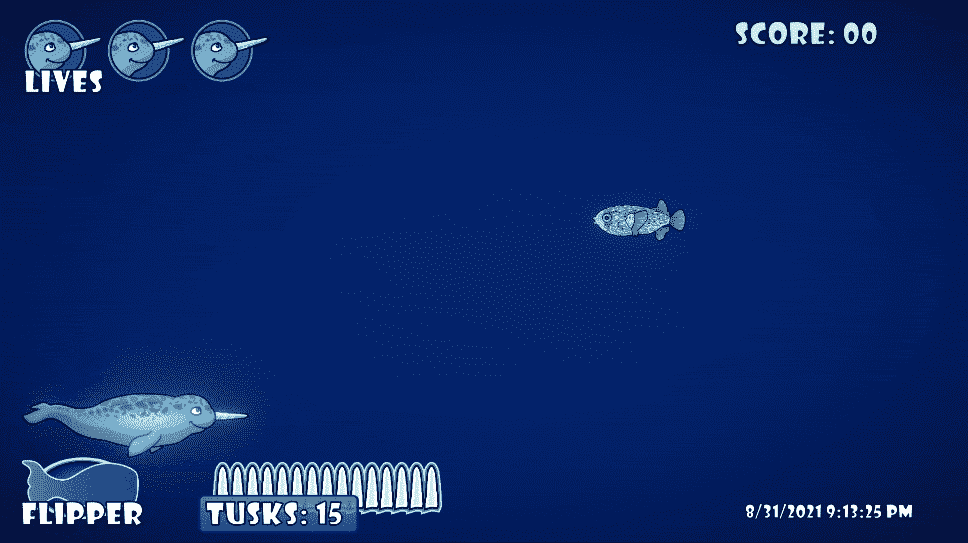
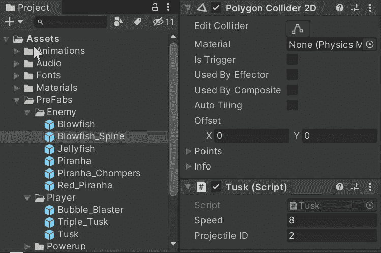
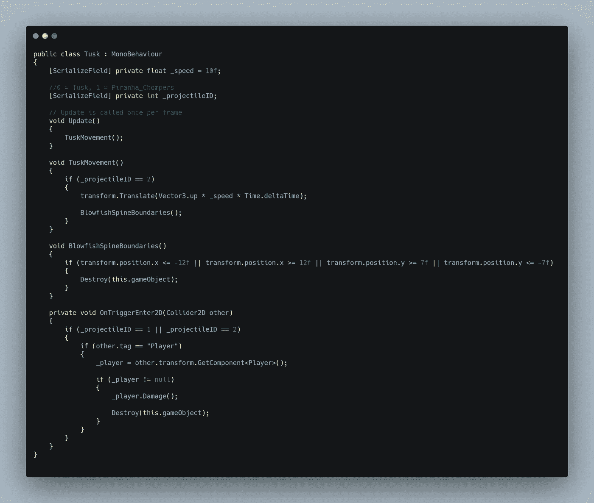
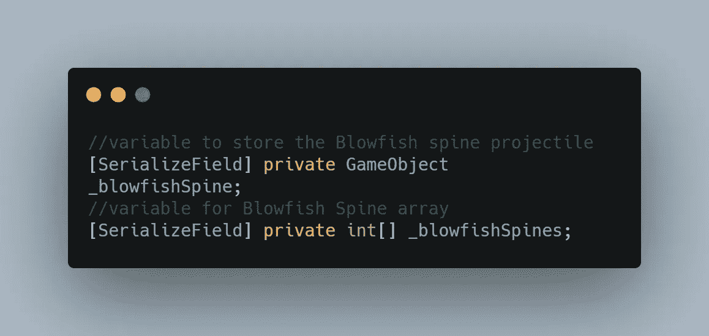
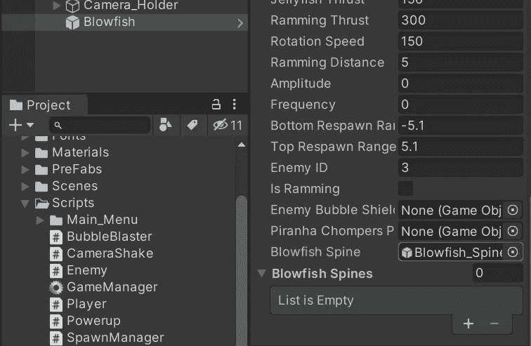
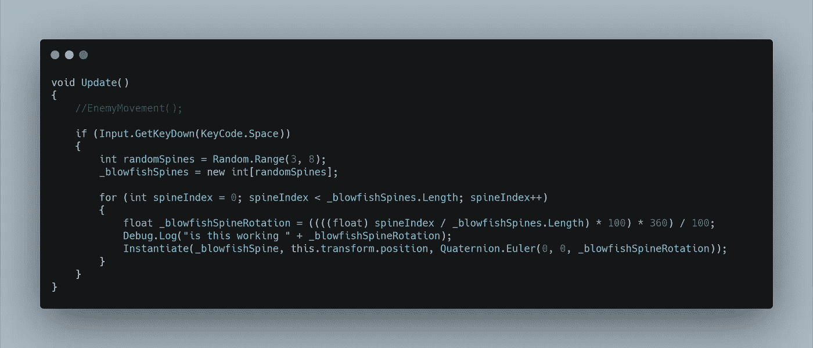
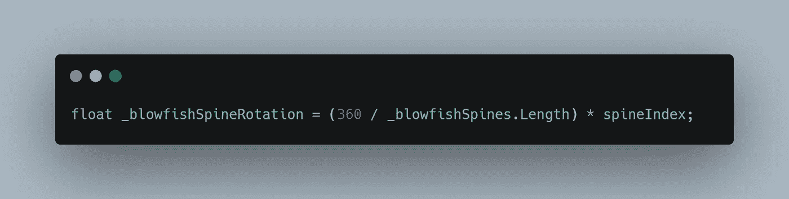
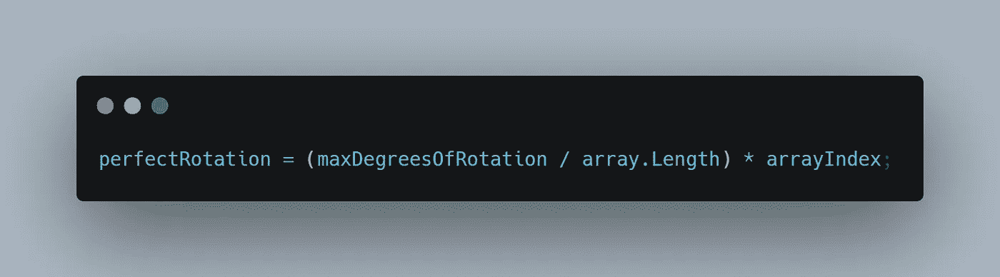

# 创造新的敌人类型:豪猪河豚第 3 部分-发射弹丸在完美的旋转

> 原文：<https://levelup.gitconnected.com/creating-new-enemy-types-the-porcupine-blowfish-part-3-firing-projectiles-in-perfect-rotation-e1a1755093b4>

这篇文章是个人的胜利。我心中有一个明确的目标，我不会把任何后备计划作为最终结果。我这篇文章的**目标**，是让敌人河豚发射一个**随机**数量的棘**弹丸**，同时给它们**等距旋转轴**围绕 **360 度**，这取决于**发射了多少弹丸**。我们开始吧！

最初，我只是想做一个从*中心点*向*各个方向*发射的*散布射击*武器。**计划 C** 是制作一个由空的父对象组成的预置，它将包含*预先旋转的*投射体预置。一旦父对象被实例化，射弹就会向各自的方向射出。我很高兴我最终没有选择这个方向，但是如果它对你的目标有用…那就去做吧！**方案 B** 是将物体实例化为围绕点的*圆，然后让它们*面朝外*远离点*(开火的敌人)*。我在搜索游戏教程以到达目的地时发现了这个解决方案。虽然这可能对我的目的有用，但我知道这不是我的初衷，如果做不到这一点，我个人就会放弃我最初的想法。让我们来看看我用**计划 A** 实际做了什么！*

我开始创建一个新的*河豚刺*抛射体，并把它作为精灵资产带入 Unity。我给的是一个 **PolygonCollider2D** 和一个共享弹丸**脚本** *(tusk)* ，才做成一个预置。因为我正在使用一个共享的抛射体脚本，所以我在*检查器*中给脊椎分配一个**抛射体 ID** 的 **2** 。

我需要做的第一件事是整理我在**长牙脚本**中的基本*动作*。河豚脊椎将沿**向上**移动，并且在实例化的每个脊椎的旋转改变后，该方向将保持为*向前*的方向。我还设置了一个边界，如果它以任何方向离开游戏视图，我就摧毁它。

在现在的**敌人等级**中，为散布射击增加了两个变量。一个用来存储**预置** *游戏对象*，另一个**整数**值用来存储一个空的**数组**来表示我想要发射多少个预置。

在 Visual Studio 中**保存**后，我可以在 inspector 中将**预置**分配给敌人**脚本**。

回到**敌人职业**，我使用 void **更新**来原型化这个特性。我正在使用*空格键*来触发敌人的火力特征，但是最终敌人会通过*协程*自己开火。首先，在射弹实例化之前需要做一些事情。引入一个名为 **randomSpines** 的局部变量来保存 **3** 和 **8 之间的随机值。** *(表头视频在 3 和 53 之间)。*这个**变量**将代表有多少射弹被实例化。空的**数组变量**随后被赋予随机掷骰的**值**。这样我每按一次*空格键*键，要发射的弹丸量就会发生变化。

然后，循环的**用于遍历数组。我引入了一个局部变量来存储将分配给每个抛射体*(blowfishSpineRotation)*的旋转，并为其分配*旋转算法*的**值**。我有一个**调试。之后立即记录**消息，这样我可以检查最终输出的数学结果。最后，随着 for 循环的执行，脊椎被实例化，并且旋转变量被放置在这个 2D 射击游戏的 Z 轴中，在一个四元数中。欧拉**。

我们来分析一下。脊椎索引号只是一个数值，从零开始，代表我想要实例化多少投射物。在这个例子中，我将使用 **4** ，因此目标将是按顺序将抛射体*向上*、*向左*、*向下*和*向右*。由于索引从零开始，方向看起来像这样*(上=索引 0，左=索引 1，下=索引 2，右=索引 3)* 。每个抛射体都需要一个合适的**旋转**，看起来应该是这样的。*(旋转= 0 =向上=索引 0，旋转 90 =向左=索引 1，旋转 180 =向下=索引 2，旋转 270 =向右=索引 3)。*如果你**将**索引号**除以**数组**的**长度**，你得到的是 **0** 和 **1** 之间的**分数**。让我们算一下。指数 **0** 除以 **4** = **0** 。太容易了。指数 **1** 除以 **4** = **0.25** 。然后 **2/4** = **0.5** 和 **3/4** = **0.75** 。你明白这是怎么回事了吗？在我的脑子里， **0.25** 和 **1** 的 **%** 就像 **90 度**和 **360** 一样，现在我只需要把**转换成**。进入下一步，例如将 **0.25** 乘以 **100** ，基本上*去掉了小数点*，使得当前值**为 25** 。然后， **25** 为*乘以 **360** *(最大旋转度数)*，使得**的值为 9000**。最后一招是用**9000**除以 **100** ( *我知道这看似多余但很管用！)*这给了我们 **90** 的回报！其他旋转以相同的方式工作。2/4 = 0.5 * 100 = 50 * 360 = 18000/100 =旋转 180 度。3/4 = 0.75 * 100 = 75 * 360 = 27,000 / 100 = 270.***

**重要提示:**我将 **int** 值相除，得到一个小于 **1** 的**分数**返回。如果我不将这个值强制转换为一个**float**((float)spine index)，小数将向下舍入，返回将始终为零。我的**浮点** *旋转变量*需要返回一个**匹配浮点** *数据类型*。

帮我解决这个问题。乘以然后除以 100 看起来确实有点不必要。我尝试从一个大的数字(360)开始，然后除以数组的长度(本例中为 4)。这给了我 90 的回报率，这是完美的，比我在上面做的更有效率。如果我用**指数**乘以 **90** ，我就会得到我想要的回报。90 * 0 = 0.90 * 1 = 90.90 * 2 = 180，90 * 3 = 270。不过我注意到，当像标题视频剪辑中那样通过给它喂大量弹丸来进行压力测试时，我在 360 度旋转的最后 15%左右得到了一个空白空间。我试着把所有的值都转换成 float，它至少在处理少量的投射时工作得很好。数学似乎是合理的，所以我将不得不进一步分解它，并找出为什么我得到一个错误的大数组长度的返回。现在我仍然使用第一个看起来多余的算法，因为它在高压力下工作得很好。

随意帮我完善这个算法。我认为这也不仅仅适用于 360 度旋转。这是我尽可能用一般的变量名写出的一般想法，希望能展示这里的思考过程。

感谢你和我一起阅读这篇关于抛体对称性的数学冒险。希望下次能见到你！