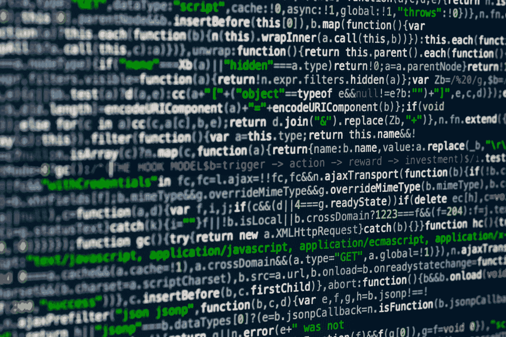

# 创建您的第一个 Python 程序

> 原文：<https://levelup.gitconnected.com/creating-our-first-python-program-2846bc192613>



马库斯·斯皮斯克在 [Unsplash](https://unsplash.com?utm_source=medium&utm_medium=referral) 上拍摄的照片

Python 是一种方便的语言，通常用于脚本编写、数据科学和 web 开发。

在本文中，我们将看看如何创建我们的第一个 Python 程序。

# 我们的第一个项目

我们可以创建一个程序，询问我们的姓名，然后显示带有我们姓名的问候语，如下所示:

```
print('What\'s your name?')
name=input()
print('Hello', name)
```

在上面的代码中，我们调用了`print`函数在终端中显示`What's your name?`消息。我们在`'`前有一个`\`，表示我们没有用单引号结束报价。

然后我们调用`input`函数来获得用键盘输入的值。

一旦我们按下 Enter 键，那么`name`变量将被分配给我们输入的内容。

然后我们显示`Hello`和之前输入的内容。

例如，如果我们输入`Joe`，屏幕上会显示`Hello Joe`。

如果我们想为年龄添加一个输入并显示它，我们可以将程序改写如下:

```
print('What\'s your name?')
name=input()
print('What\'s your age?')
age=input()
print('Hello', name, 'You are', str(int(float(age))), 'years old')
print('The length of your name is', str(len(name)))
```

在上面的代码中，我们添加了一个`age`输入:

```
age=input()
```

然后我们用`float`将输入的`age`转换成浮点，用`int`将其转换成整数，然后用`str`函数将其转换回字符串。

我们这样做是为了把小数四舍五入成整数。

然后我们用`print`用英语显示一切。

然后我们会得到这样的结果:

```
What's your name?
Joe
What's your age?
20.2
Hello Joe You are 20 years old
```

其中`Joe`和`20.2`是我们输入的。

# 我们计划的一部分

一个程序由多个部分组成。

注释是程序的一部分，作为解释我们想对程序做什么的文档。

Python 忽略注释，从`#`开始。

它还用于在运行程序进行调试之前临时删除一行。

Python 还会忽略注释后面的空行，我们可以添加更多的空行，让我们的程序更容易阅读。

## print()函数

`print`功能让我们在屏幕上打印字符串。我们可以用括号分隔字符串的各个部分。

我们通过以下方式完成了上述工作:

```
print('What\'s your name?')
```

并且:

```
print('What\'s your age?')
```

并且:

```
print('Hello', name, 'You are', str(int(float(age))), 'years old')
```

注意，我们传递给`print`函数的所有内容都必须是字符串。结束引号是字符串的分隔符。

我们可以通过不向`print`函数传递任何东西来打印一个空行。


[埃德·皮里彭科](https://unsplash.com/@edpylypenko?utm_source=medium&utm_medium=referral)在 [Unsplash](https://unsplash.com?utm_source=medium&utm_medium=referral) 上拍摄的照片

## input()函数

`input`功能让我们通过在屏幕上输入来接受用户的输入。

它返回一个字符串，其中包含被键入的内容。

我们用`name=input()`得到名字，然后传递给`print`函数打印出来。

## len()函数

`len`函数让我们通过传入一个字符串来获得字符串的长度。

在上面的例子中，我们有:

```
print('The length of your name is', str(len(name)))
```

获取`name`字符串的长度并打印出来。

所以对于`'Joe'`，它将是 3。

## str()、int()和 float()函数

`str`函数用于将任何非字符串表达式转换成字符串。

同样，`int`和`float`分别用于转换整数和浮点数。

例如，我们可以通过编写以下内容将浮点数转换为整数:

```
int(1.11)
```

那么我们得到 1。

如果我们试图转换不能转换成整数的东西，如下所示:

```
int('11.99')
```

我们将得到以下错误:

```
ValueError: invalid literal for int() with base 10: '99.99'
```

同样，我们可以将一些东西转换成浮点数，如下所示:

```
float('11.99')
```

然后我们得到返回的`11.99`。

我们可以将任何其他表达式传入函数，而不仅仅是字符串和数字。

# 结论

我们可以用`print`功能将字符串打印到屏幕上。它接受由括号分隔的任意数量的字符串。

为了从用户那里获得输入，我们可以使用`input`函数，该函数返回一个字符串，其中包含用户在按 enter 键后输入的任何内容。

要获得一个字符串的长度，我们可以使用`len`函数，它将我们想要获得长度的字符串作为参数。

为了将一些东西转换成字符串，我们使用了`str`函数。同样，我们用`float`函数转换成浮点数，用`int`函数转换成整数。

除了代码，我们还可以在 Python 程序中加入注释，这些注释会被 Python 解释器忽略。他们从一个`#`标志开始。