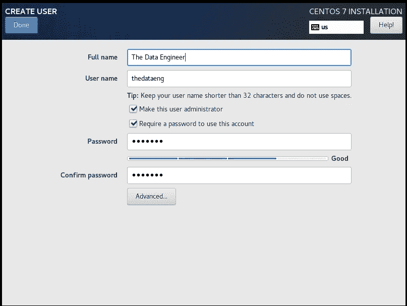
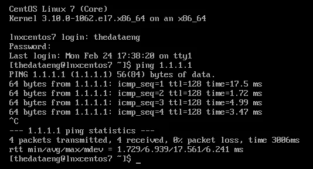
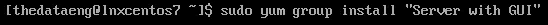
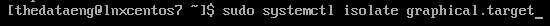
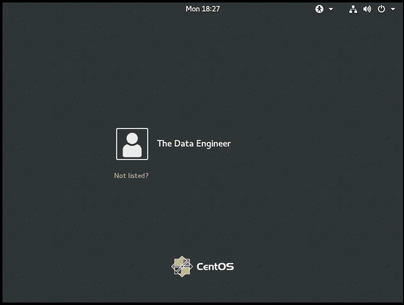
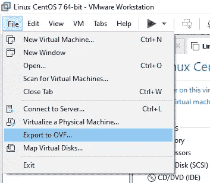

# 创建我们的测试虚拟机

> 原文：<https://levelup.gitconnected.com/creating-our-test-vms-5d3b239f665a>

## 为 Windows 和 Linux 环境创建基本虚拟机

在本出版物中，我们将制作 2 个虚拟机，一个使用 Windows (Server 2016，仅 180 天评估版)，另一个使用 Linux (CentOS 7)。

我这样做的原因是，有很多人不知道如何安装操作系统。这本指南将帮助他们了解如何去做。

我知道外面有很多指南。但是在这里，一旦我们进入下一章，如果我发现需要修改的地方，我可以跟踪并更新指南。

## 我可以从哪里下载操作系统映像来进行安装？

对于 **Windows** ，你可以从微软评估中心([链接](https://www.microsoft.com/es-es/evalcenter/))搜索正确的 ISO。在这里，您还可以找到许多其他评估工具。但是我们现在感兴趣的是 Windows 服务器 ISOs。

在这里，我们选择“查看全部”选项。

这里我们选择 ISO 图像。

一旦我们点击这里的继续按钮，我们将需要完成一些信息，然后微软将离开我们下载 ISO 映像。

对于 **Linux** ，我们去 CentOS 下载中心([链接](https://www.centos.org/download/))。由于 CentOS 的当前版本是 8，我们需要选择下载旧版本。然后选择 CentOS 7 镜子。

“点击这里”是一个好迹象。

在这里，我们点击 CentOS 7 版本的镜子。

一旦你点击镜像链接，你会看到可供下载的替代品。

我在这里的建议是使用 DVD-1908.iso 甚至最小的-1908.iso。

下载安装程序后，您就可以开始创建虚拟机了。

# 为我们的实验室创建虚拟机

在这两种情况下，我们的初始配置都是双核 CPU、8gb RAM 和一个 50 GB HDD (60 GB 用于 Windows VM 设置)。这将帮助我们毫无问题地安装操作系统，并且我们可以制作一个起始映像，以便在其他情况下重新部署以进行测试。

*注意:我将向您展示如何在 VMware 工具上设置虚拟机。您需要将这些设置转移到您首选的虚拟机管理程序。*

我们将走捷径…

选择“典型”设置(我们将在创建好一切后定制虚拟硬件)。

由于我们要创建 2 个虚拟机，因此我们将选择“稍后安装操作系统”选项。

Windows 的版本…

以及我们将要安装的 Linux 版本。

只是一个简单的虚拟机名称，没什么复杂的。

Linux 硬盘的建议大小是 20 GB，但我们将把它改为 50 GB。Windows Server 默认值为 60 GB，无需更改。

最后，我们看到一些设置是默认值(CPU、RAM、网络)。我们将在接下来的步骤中更改其中的一些。

在此预览中，我们看到创建了两个虚拟机。下一步是定制一些默认设置。

在这里，我们从默认设置中删除了声卡和打印机(对于我们将要做的事情，我们不需要它们)，然后我们将 RAM 的数量增加到 8 GB，并将 CPU 核心数增加到 2 (1 个处理器/ 2 个核心)。

设置页面的最终结果应该是这样的。

我们没有修改任何关于网络适配器的设置，也没有修改虚拟机的硬盘数量。由于这将是我们所有 Windows 和 Linux 测试的基础机器，我们将安装操作系统并导出机器以获得虚拟机的启动映像。

接下来的步骤是安装 Linux 和 Windows。

# 安装 Linux CentOS 7

安装 Linux 并不难。但是如果你在这里，你可能仍然需要一些帮助。这就是这篇文章存在的原因。

第一步是为安装选择正确的 ISO(显然是我们从 CentOS 推荐的镜像列表中下载的那个)。为此，我们需要编辑设置，选择 CD/DVD 设备，然后更改配置以选择我们从网上下载的 ISO。

选择后，启动虚拟机，然后选择安装操作系统。

一旦安装程序加载了所有东西，第一件事就是选择你的语言。

为了简单起见，我们将选择英语作为操作系统语言。

设置页面非常简单。在这里，我们要做的是设置网络信息，日期和时间设置，然后选择安装软件。

默认情况下，网络是关闭的。我们把它改成开。

VMware DHCP 服务器根据虚拟机设置分配 IP(目前，我们的网络适配器正在 NAT 配置中工作)。

我们编辑主机名和域，然后应用更改。

一旦我们点击了左上方的*完成*按钮，我们继续更改*日期&时间*设置。

我所在的地方是南美洲的中心。

在这个屏幕中，我们启用了网络时间，因此机器将始终保持时间同步(设置 NTP 服务器很好…我没有这样做)。

好吧…继续…

在软件选择页面，我们将选择*最小安装*，并启用一些插件。

通过这些设置，默认情况下，系统将在没有 GUI(只有控制台)的情况下工作。不用担心，我们将在安装完成后安装 GUI(但我们不会默认启用它，它将被禁用，如果需要，您将需要运行一个命令来启动桌面环境)。

继续安装操作系统之前的最后一步是选择分区配置。这次我们将保留默认的“*自动*”选项。

一旦完成，我们点击*完成*，然后，点击*开始安装*按钮。

在这个屏幕上，我们看到最后两个要定义的设置:*根密码*和*用户创建*。

对于根通道，选择一个您将来会记住的通道

我知道，这是用户的陈词滥调…

对于用户，我们选择使用户成为管理员的选项，并为帐户设置密码。

安装完成后，我们重新启动虚拟机。

一旦我们选择了内核并登录，我们就可以测试连通性了。

到目前为止一切正常。下一步是运行更新命令。

*注意:要运行该命令，用户需要是* ***root*** *或者拥有* ***sudo*** *权限。感谢选择让我们创建的用户成为管理员组的一部分，他有权运行****sudo****。*

该命令将列出需要更新的包，甚至是安装包(这可能是一个依赖项或类似的东西)。

你输入 *Yes* ，安装就会运行。

一切都安装得很好，没有问题，甚至我们同时得到了一个内核更新。因此，我们将再次重启系统。

新内核可用:)

本指南不会就此结束，因为正如我之前承诺的，我们将安装 GUI，以“按需”运行。

## 安装 GUI

安装 GUI 很简单，但是需要一些时间。您只需要运行命令来安装带有 GUI 组的*服务器:*

> sudo yum 集团安装“带 GUI 的服务器”

这需要一段时间…

一旦您键入 *Yes* ，GUI 组件及其依赖项将被安装。

默认情况下，此安装的 GUI 不会在启动时运行。如果您想运行它，只需键入以下命令:

> sudo system CTL isolate graphical . target

如果一切正常，您将在虚拟机上看到以下屏幕。

## 修复我们之前没有配置的 NTP

这是我的错…我不想再为此安装操作系统…所以我们将通过命令行安装和配置 NTP 客户端:)

首先，我们将安装 NTP 服务。

> sudo yum 安装 ntp

安装完成后，如果我们看到 ntp.conf 文件，就会看到 CentOS NTP 服务器池中的一些服务器。您可以在这里添加更多的服务器。您可以在 [NTP Pool 项目](https://www.ntppool.org/)站点中看到您所在地区的一些服务器列表。

因为我来自南美，所以我将把一些地区服务器添加到 ntp.conf 文件中。

为了编辑文件，我们运行下一个命令。

> sudo vim /etc/ntp.conf

然后，为了将这些行添加到文件中，我们按下键盘上的 *INS(ERT)* 键。我们用一个 *#* 符号将原始行标记为注释。

一旦我们完成了编辑，我们按下 Esc 键，为了保存更改，我们编写命令 *:wq(编写& Quit)。VIM 迷你教程结束-* 😉

更改之后，我们需要重新启动 NTP 守护程序。

为此，我们将运行下面的命令。

要启动 NTP 守护程序:

> sudo systemctl 启动 ntpd

要在启动时启用 NTP 守护程序:

> sudo systemctl 启用 ntpd

要检查 NTP 守护程序的状态:

> sudo 系统控制状态 ntpd

完成 NTP 配置后，我们将导出该虚拟机，为将来的实验创建基础映像。

## 导出虚拟机

对于此任务，您需要选择虚拟机，然后在菜单上选择*导出到 OVF* 。

这将显示一个*保存对话框*窗口。一旦你选择了路径，点击*保存*按钮，过程将开始。

*注意:记住卸载/取消选择我们用来进行安装的 ISO 映像，因为导出会尝试创建该映像的副本，作为运行 VM 所需的依赖项。*

当一切完成后，您将会在您选择的路径上看到文件。

好了，这对于 Linux 来说已经足够了，现在是时候安装 Windows Server VM 了。

# 正在安装 Windows Server 2016

在这一部分，我们将使用从微软评估中心下载的 Windows Server 2016 ISO 来创建一个虚拟机。

与上一节一样，我们选择虚拟机并编辑它们的设置，将 CD/DVD 虚拟设备与操作系统安装程序的 ISO 映像相关联。

启动虚拟机后，安装程序会提示您按键。一旦按下，安装程序将开始。

你需要在虚拟机内部点击并快速按键。

在这里，我们选择语言、格式和键盘分布，然后按下*下一个*按钮。

在这里，点击立即安装。

对于此安装，我们将选择具有桌面体验的标准评估。对于我们的使用来说，标准和数据中心之间的差异可以忽略不计。

在这里，我们“阅读”许可条款…😉

对于此安装，我们需要选择仅安装 Windows。

与 CentOS 安装一样，这里我们让操作系统自动对虚拟驱动器进行分区。

单击“下一步”后，安装过程将开始。

几分钟后…

最后一步是为虚拟机设置管理员密码。

确认通过后，我们将看到 Windows Server 2016 虚拟机的锁定屏幕。

Tadaaaaaaaaaaaaaaaaaaa！！！！！。

当您登录时，您将看到管理员控制面板，其中包含一些信息。我们将跳过这一部分，直接进入新控制面板上的一些设置。

与 Linux VM 一样，我们将系统配置为自动设置时间和时区。下一步是更新计算机名。

对于此更改，您需要重启电脑，但我们将选择稍后重启。

Linux 虚拟机会自动安装 Open VM 工具(与 VMware 产品兼容)，我们不需要额外的安装步骤。

但是对于 Windows，您需要在来宾操作系统上安装 VMware 工具，以使他与主机操作系统无缝协作。

安装 VMware 工具非常简单。在虚拟机运行的情况下，右键单击选项卡，并在菜单上检查安装组件的选项。

单击此选项后，驱动器将被装载并可在虚拟机内部访问。

在这里，我们双击 DVD 驱动器，安装程序将自动启动。

完整，因为我们不知道我们的虚拟机将来会在哪里结束。😄

下一个下一个下一个哦！现在正在安装。

一旦完成，我们重新启动系统。我们将看到如何使用工具中所有可用的屏幕空间来打开 VM。

对于此 Windows 安装，下一步是运行 Windows 更新。

一旦更新完成，您重新启动并检查一切正常，我们就关闭系统，并且，与 Linux VM 一样，我们将导出 VM 以拥有用于未来项目的基础映像。

## 将虚拟机导出到 OVF。

与 Linux 一样，关闭虚拟机，单击列表中的名称，然后在主菜单上，单击导出到 OVF。

一旦*保存对话框*出现，选择创建文件的最终路径，点击*保存*按钮。

当导出结束时，您将在您选择的位置看到文件。

这个虚拟机有点…重…

最后，一些结束语…

# 我们将对这些虚拟机做很多事情…说真的…

我创建了许多虚拟机来测试一些工具。最新的是要测试的虚拟机:

*   域控制器。
*   集群。
*   SQL Server。
*   PostgreSQL。
*   Cloudera Hadoop。

您也可以使用这些虚拟机来测试您想要的一切。

我今天没有展示最有用的技巧(快照)，但是一旦你了解了它，你就会爱上它…但是请记住，我们将看到的大多数技巧只适用于我们的测试实验室，我不鼓励你在生产环境中使用它们。不不不。

今天就这些了，下周见。