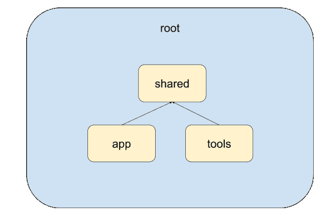
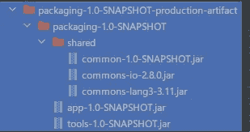

# 在多模块 Maven 项目中创建产品工件

> 原文：<https://levelup.gitconnected.com/creating-production-artifacts-in-a-multi-module-maven-project-28f940c1986c>

移动 JAR 文件不再令人沮丧

图片由 [Valdas Miskinis](https://pixabay.com/users/ValdasMiskinis-12049839/?utm_source=link-attribution&utm_medium=referral&utm_campaign=image&utm_content=4203677) 来自 [Pixabay](https://pixabay.com/?utm_source=link-attribution&utm_medium=referral&utm_campaign=image&utm_content=4203677)

如果您正在处理 Java 项目，您很可能必须处理 Maven。Maven 是一个项目管理工具，被用作大中型 Java 应用程序的行业标准。在这篇文章中，我将教你使用*汇编*插件创建*多模块* Maven 项目的生产工件。

# 初始项目结构

出于本文的目的，我将假设一个非常简单的 Maven 项目。我们将有 4 个模块:`root`，这是主要的(容器)模块，`common`，这是由其他模块使用，`app`，应用程序本身，`tools`。我们在这里没有写任何实际的代码，所以不要担心逻辑。以下是这些模块的依赖关系树:

# POM 文件

现在，我们需要为这些模块创建 POM 文件。首先是`root`模块:

这是将`common`、`app`和`tools`固定在一起的伞状模块。您可以在第 11-15 行看到它们的枚举。另一个重要的方面是 9 号线上的`pom`包装方式。它用于包含其他模块的模块。现在，`common`模块的 POM:

请立即注意 10 号线上的`jar`包装模式。由于这是一个独立的模块，它不需要`pom`模式，我们将构建一个 JAR 文件。在第 5-9 行，我们将模块定义为`root`的子模块，并在第 15-26 行添加了一些依赖项。

最后，这里是`app`和`tools`的 POM 文件:

这两个看起来几乎一样。它们都编译成 JAR 文件，并依赖于`common`(向您展示模块间的依赖解析)。

此时，您可以在`root`中运行`mvn package`，并为您的每个项目(在`<module name>/target`中)获得一个 JAR 文件。这非常好，但是大多数大型项目需要在产品工件方面进行更多的微调。这就是`assembly`插件要帮忙的地方。

# `maven-assembly-plugin`

`maven-assembly-plugin`用于将所有模块组装成一个实体，同时为构建的所有方面提供覆盖(一如既往，约定优于配置)。为了让它工作，我们需要在我们的项目中添加另一个模块，我们称之为`packaging`:

这也是一个标准的 POM 文件，带有`pom`打包模式(因为`packaging`模块不需要 JAR 文件)。现在，为了连接`maven-assembly-plugin`，在第 13 行添加以下代码:

这是很多的，所以我们一步一步来。首先，我们在第 4–6 行定义期望的插件坐标。然后，我们在第 10-13 行设置它在`package`构建阶段运行(当您运行`mvn package`时就会发生)。最后，我们将`assembly.xml`(在下一步中出现)文件指定为*装配描述符*。这实际上是插件的一个配置文件，描述了我们希望如何构建我们的工件。

最后，让我们添加`app`和`tools`模块作为`packaging`的依赖项，以确保 Maven 在`packaging`模块之前构建它们:

# 汇编描述符

*组装描述符*是一个 XML 文件，它指定了产品工件应该如何构建。在`packaging`模块文件夹中创建一个名为`assembly.xml`的文件:

这是一个相当大的文件，但我向您保证，那里没有任何混乱。首先，在第 3 行，我们为这个特定的程序集设置名称(在我们的例子中是`production-artifact`)。然后，在第 5 行我们将`format`设置为`dir`。这意味着产生的工件将是一个包含 JAR 文件的文件夹。或者，您可以将其改为`jar`，并获得一个包含所有资源和依赖项的大 jar 文件。在第 7-17 行，我们定义了依赖关系。我们说(第 9 行)不使用来自`packaging`模块本身的工件，(第 10 行)将依赖项放入`shared`文件夹，(第 11 行)将它们保存为 JAR 文件而不是解包，(第 12-15 行)将`app`和`tools`从依赖项列表中排除。

在第 18–30 行，我们定义了这个工件中包含的模块。在第 20 行，我们让插件发现由 maven 管理的所有模块，并且(第 22–23 行)只包括`app`和`tools`模块。我们在这里没有指定`common`，因为它将作为一个依赖项包含在`7-17`下。我这样做是为了向您展示如何使用 Maven 模块作为实现目标(可执行)或库(依赖)的手段。最后，在第 26-27 行，我们说保持工件为 JAR，不要直接在 JAR 文件中包含依赖关系。出于多种原因，它们被存储在单独的文件夹中:节省空间、减少启动时间、动态更新等等。

最后，您可以在 project root 中运行`mvn package`，并关注您宏伟的生产构建(在`packaging/target`下):

# 结束语

谢谢你的阅读，这是我第一次写关于 Java 的文章，希望你会喜欢。

# 资源

*   [专家文档](https://maven.apache.org/guides/index.html)
*   [Maven 回购(插件+ deps)](https://mvnrepository.com/)
*   [Maven 组装插件文档](http://maven.apache.org/plugins/maven-assembly-plugin/)