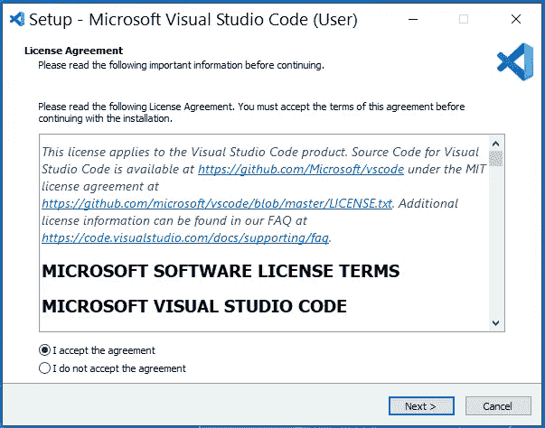
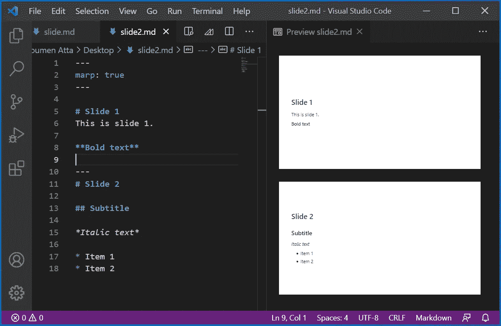

# 从 Markdown 创建专业演示

> 原文：<https://levelup.gitconnected.com/creating-professional-presentation-from-markdown-975c65211359>


在本教程中，我们将学习如何从 Markdown 文档创建专业演示文稿。使用 Markdown 创建好看的专业幻灯片非常容易，而且更省时。你不需要在幻灯片的设计和布局上花费时间。

我们将使用以下软件:

*   Visual Studio 代码(VS 代码)
*   VS 代码的 Marp

## 安装 VS 代码

VS Code 是自由软件，它被用作许多编程语言的源代码编辑器，例如 C、Python、Julia 等等。它由微软开发，可用于不同的操作系统，如 Windows、Linux 和 macOS。如果您的计算机上没有安装 VS 代码，那么您需要从这个[链接](https://code.visualstudio.com/download)下载它。您需要根据您的操作系统下载正确的安装程序。


**图 Visual Studio 代码下载页面**

下载的安装程序将引导您完成安装过程。安装过程非常简单，只需要点击几下。



**图 Visual Studio 代码安装程序**

记得选中“添加到路径”复选框。其他复选框是可选的。


成功安装 VS 代码后，当您启动软件时，您可以看到以下窗口:


**图 Visual Studio 代码:欢迎屏幕**

[](https://soumenatta.medium.com/membership) [## Soumen Atta 博士，博士-中等

### 阅读 Soumen Atta 博士关于培养基的文章。荷兰国家科学实验室博士后研究员

soumenatta.medium.com](https://soumenatta.medium.com/membership) 

## 为 VS 代码安装 Marp

现在，您需要向 VS 代码添加一个扩展。这里，我们将使用“Marp for VS Code”。点击 VS 代码左面板的“扩展”按钮(或者，可以按 Cntrl + Shift + X)，然后搜索“marp”。然后，您需要安装如下所示的扩展:


**图 VS 代码的 Marp】**

Marp 是降价展示生态系统。它为创建漂亮的幻灯片提供了很好的体验。我们只需要专注于编写 Markdown 文档中的内容，其他一切都由 Marp 处理。想了解更多关于 Marp 的信息，可以访问这个[链接](https://marp.app/)。

## 从 Markdown 创建幻灯片

首先，您需要打开一个文件，并用扩展名 md 保存它。例如，slide.md 可能是您的文件的名称。

在 Markdown 文件的顶部，您需要编写以下内容:

```
---marp: true---
```

这将启用降价演示生态系统。

现在，制作你的第一张幻灯片。例如，您可以编写如下所示的内容:

```
**# Slide 1**This is slide 1.****Bold text****
```

现在，创建另一张幻灯片。这张幻灯片的内容可能如下所示:

```
---**# Slide 2****## Subtitle****Italic text*** Item 1* Item 2
```

幻灯片的预览如下所示:



**图从 markdown 创建的幻灯片预览**

您可以在幻灯片中添加更多自定义内容。例如，您可以在减价文件的顶部添加以下内容:

```
---marp: truetheme: gaiacolor: #000colorSecondary: #333backgroundColor: #fffbackgroundImage: url('https://marp.app/assets/hero-background.jpg')paginate: false---
```

如果您设置 paginate: true，那么幻灯片编号将会出现。你可以选择是否显示幻灯片编号。

现在，您可以将创建的演示幻灯片导出为多种文件格式，如 PDF、HTML 和 PowerPoint 文档。

## 降价语法

如果你不熟悉 Markdown 语法，那么你可以通过这个[链接](https://en.wikipedia.org/wiki/Markdown)来学习它们。你也可以从这个[链接](https://www.markdownguide.org/assets/markdown-cheat-sheet.md)下载 Markdown 语法的快速参考。学习 Markdown 语法非常容易。

[](https://soumenatta.medium.com/subscribe) [## 每当 Soumen Atta 博士发表论文时，都可以收到电子邮件。

### 每当 Soumen Atta 博士发表论文时，都可以收到电子邮件。通过注册，您将创建一个中等帐户，如果您没有…

soumenatta.medium.com](https://soumenatta.medium.com/subscribe)