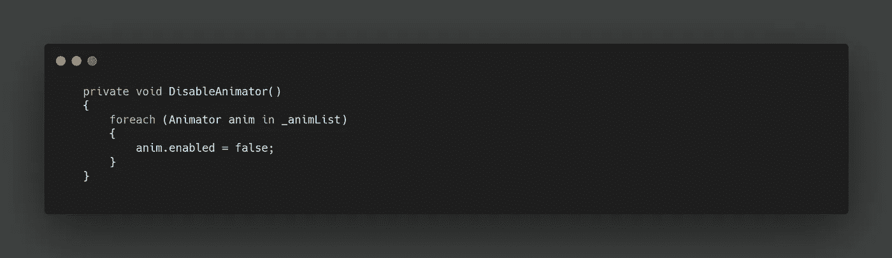
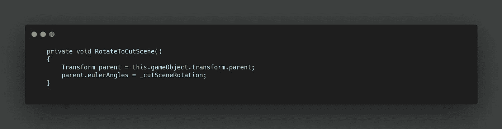

# 在 Unity 中创建安全摄像头

> 原文：<https://levelup.gitconnected.com/creating-security-cameras-in-unity-e2eafe1b1439>

在我们通过巡逻警卫后，我们面对着两个安全摄像头。这些物体由一个静态的支架臂、我们希望以摇摄方式旋转的摄像机本身以及一个将作为其检测方法的可视摄像机圆锥体组成。

让我们先来看看动画的旋转。我们只需要在从最小 Y 值到最大值的所需时间内插入关键帧。然后在我们的 **Animator 窗口**中，我们可以在 Animator 状态的两个实例之间创建一个无限循环，其中一个的速度设置为-1，因此它反向运行。

随着相机的动画，让我们看看创造检测。我们的相机视锥装有一个**网格碰撞器**，它允许我们将碰撞器设置为**网格渲染器的形状，**以达到最大的精确度。

为了使用**碰撞器**，我们需要为我们的安全摄像头创建一个新的**脚本**。每个摄像机都有自己的脚本实例，但是如果一个摄像机检测到玩家，我希望两个摄像机都启用捕捉行为。为此，我们可以创建一个**列表**来存储这个脚本的所有实例。使用**标签**我们可以找到场景中的所有摄像机镜头，将它们存储在一个数组中，然后**对每个镜头，**访问它们的脚本以存储在我们的**列表中。**

现在**触发回车，**如果**玩家**被检测到，我们可以在所有安全摄像机脚本上调用**玩家调用方法**。

**player caugh 方法**是 **public** ，作为一种简单地将 bool 设置为 true 的方法。

然后在我们的**更新方法**中，如果上述 bool 为真，我们可以启动一个**协程**来运行我们的相机行为。

这个**协程**立即将 bool 设置为 false，以防止调用多个实例。然后，我们运行两个方法，一个停止动画相机旋转，一个改变颜色。接下来，我们在激活过场动画游戏对象之前等待半秒钟。

这两个方法需要捕获它们所需组件的**列表**。

首先，**动画师**包含在不同的**游戏对象**上，所以我们需要运行另一个 **FindGameObjectsWithTag** 函数。然后**对于这些对象中的每一个**，我们可以得到**动画师**并将其添加到**列表中。**

完成后，我们可以简单地禁用**列表中的每个**动画制作人**。**

对于我们的**网格渲染器，**我们已经捕获了每个**相机圆锥体对象的**数组**，**，所以我们可以简单地追加获取**网格渲染器**并将其添加到**列表**中，旁边是我们获取**脚本的地方。**

要改变摄像机镜头的**颜色**，我们必须比标准的**颜色变化更深一点。这是因为我们的对象正在使用粒子着色器来创建适当的外观。在这个**着色器**中，我们想要改变的是**淡色，**因此，在设置颜色之前，我们需要传入这个**字符串值**。**

现在，当**玩家**被抓住时，使用静态红色摄像机，我们的过场动画不一定发生在正确的地方。为了解决这个问题，我在**检查器**中存储了一个 **Vector3** 可赋值，为我们的摄像机设置一个最终的旋转来处理过场动画。在我们的**更新方法中，这个方法将与**协程**一起被调用。**

我们可以简单地抓取脚本所在的摄像机圆锥体的父变换。然后我们可以将**欧拉角**设置为我们的**矢量 3 变量。**

