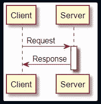
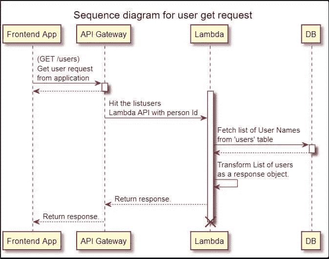
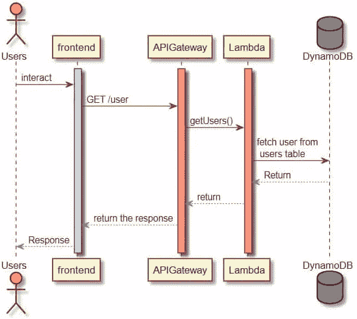

# 用 PlantUML 创建序列图

> 原文：<https://levelup.gitconnected.com/creating-sequence-diagrams-with-plantuml-558c83bd3eb1>


在这篇博客中，我将解释如何使用 PlantUML 创建序列图。你可能使用过不同的应用程序来创建序列图，比如画图工具、ppt、Google Slides、Draw.io 或者 Google Drawing tool。甚至我也使用了许多这样的工具来创建序列图。但是一旦我使用 Plantuml，它就解决了我所有与序列图相关的问题。使用这个工具，我们可以轻松地配置组件，如果我们想做任何修改，也可以连接它们，然后可以通过更改代码行而不是修改图表来轻松完成。但是在继续之前，让我们理解什么是序列图。

> 序列图是一种交互图，描述了一组项目如何交互以及以什么顺序交互。软件工程师和业务专家使用这些图表来更好地理解系统的需求。

PlantUML 是一个开源工具，允许用户仅使用文本生成图表。PlantUML 支持各种不同的软件开发相关格式，以及 JSON 和 YAML 文件的可视化，还有 UML 图。

关于 Plantuml 的讨论已经够多了，现在让我们跳到实际的事情上，看看如何使用 PlantUML 快速创建序列图。您可以使用 PlantUML 网站来创建代码和图表，也可以像 VSCode 一样将 PlantUML 插件安装到您的 IDE 中。我选择了第二个选项，在 VSCode 上安装了 PlantUML 插件。一旦您安装了插件，您就可以开始创建序列图，方法是使用。puml 扩展。要使用 PlanyUML 创建您的第一个序列图，您可以执行以下操作:

-创建一个名为 *intropuml.puml* 的文件，并在 VSCode 中打开。

-用 startuml 标记开始代码，并给出图的名称。请参考以下命令:

```
@startuml client-server
```

-这里我们想为客户机和服务器创建两个盒子来显示两者之间的交互。因此，首先我们需要添加这些参与者，请参考下面的命令:

```
participant Client
participant Server
```

*   现在，为了显示客户端和服务器之间的交互，我们可以使用箭头来表示它们，并且可以在冒号后面添加连接消息。我们可以使用 activate 为组件添加块，就像如果我们请求服务器，那么服务器应该激活。请参考以下代码:

```
Client -> Server : Request
activate Server
Server -> Client : Response
```

*   完成后，使用下面的命令结束 puml 脚本:

```
@enduml
```

为了总结上述命令，我们需要在 intropuml.puml 文件中编写以下内容:

```
@startuml client-serverparticipant Client
participant ServerClient -> Server : Request
activate Server
Server -> Client : Response@enduml
```

完成代码后，您可以通过在文件代码上单击右键后单击“预览当前图表”来显示图表。你也可以使用快捷键“ **Alt + D** ”来显示图表。在预览中，您可以看到下图:



现在看第二个例子，我们想展示前端应用程序、API 网关、Lambda 和数据库之间的交互。请参考以下代码:

```
@startuml get-user-listparticipant "Frontend App" as app
participant "API Gateway" as gateway
participant "Lambda" as lambda
title sequence diagram for user get requestapp -> gateway: (GET /users)\nGet user request \nfrom application
gateway -> lambda: Hit the listusers \nLambda API with person Id
lambda -> db: Fetch list of User Names \nfrom 'users' table
lambda -> lambda: Transform List of users \nas a response object.
gateway <-- lambda: Return response.
app <-- gateway: Return response.
destroy lambda@enduml
```

在上面的代码中，我们已经开始了 UML 代码，然后添加了前端应用程序、API 网关、Lambda 和 DB 的参与者。然后，我们将为该图添加标题“用户 get 请求的序列图”。在标题之后，我们可以看到组件之间的交互。我们可以用“↓”双点来描绘返回的虚线。通过预览上面的代码，我们可以得到下面的图像:



现在，让我们再举一个例子来理解一些格式化选项。请参考以下代码:

```
@startuml testinganuragactor Users #Yellow
activate frontend #LightBlue
activate APIGateway #LightCoral
activate Lambda #LightSalmonUsers -> frontend : interact
frontend -> APIGateway : GET /user
APIGateway-> Lambda : getUsers()
Lambda -> DynamoDB : fetch user from\n users table
DynamoDB -[#Gray]-> Lambda: Return
APIGateway <-[#Gray]- Lambda : return
APIGateway -[#Gray]-> frontend : return the response
frontend -[#Gray]-> Users : Response@enduml
```

在上面的代码中，我们使用了 actor，它也是一个用户。此外，通过提供颜色名称和激活码来配置不同组件的颜色。在交互过程中，线条的颜色也可以改变。通过预览上面的代码，我们可以得到下图:



这样我们就可以很容易地使用 PlantUML 库创建一个序列图。它节省了大量的时间，因为我们可以使用相同的代码，通过做一些小的改变，我们可以创建其他的图表。如果您有任何疑问或建议，请留下您的评论。

你也可以在推特上关注我:[https://twitter.com/anu4udilse](https://twitter.com/anu4udilse)

*如果你觉得这篇文章很有意思，那么你可以探索“* [*【掌握基巴纳 6.0】*](https://www.amazon.com/Mastering-Kibana-6-x-Visualize-histograms/dp/1788831039/ref=olp_product_details?_encoding=UTF8&me=)*”、“* [*基巴纳 7 快速入门指南*](https://www.amazon.com/Kibana-Quick-Start-Guide-Elasticsearch/dp/1789804035) *”、“* [*学习基巴纳 7*](https://www.amazon.com/Learning-Kibana-dashboards-visualization-capabilities-ebook/dp/B07V4SQR6T) *”、“* [*Elasticsearch 7 快速入门指南*](https://www.amazon.com/gp/product/1789803322?pf_rd_p=2d1ab404-3b11-4c97-b3db-48081e145e35)**书籍获取更多**

在 LinkedIn 上关注我:[www.linkedin.com/comm/mynetwork/discovery-see-all?use case = PEOPLE _ FOLLOWS&follow member = anubioinfo](http://www.linkedin.com/comm/mynetwork/discovery-see-all?usecase=PEOPLE_FOLLOWS&followMember=anubioinfo)

*最初发表于*[*【https://bqstack.com】*](https://bqstack.com/b/detail/217/Create-Sequence-Diagrams-using-PlantUML)*。*