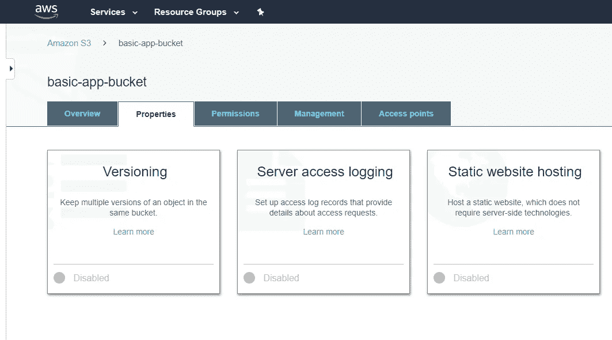

# 在 AWS 上创建无服务器 React 应用

> 原文：<https://levelup.gitconnected.com/creating-serverless-react-apps-on-aws-bd038ce76a81>


如果你在过去几年中一直是开发社区的一员，你可能已经厌倦了听到*无服务器*这个词。或者，你沉迷于这个概念，你想让**一切**都没有服务器。如果你在第一个阵营，你可能也会问自己，“WTF 无服务器到底是什么意思？没有服务器我怎么运行东西？”。我为你的提问感到骄傲，答案很简单。

无服务器并不真的意味着没有服务器的*，它真的只是意味着*不是你的服务器。*这是一种在云架构上部署应用的方式，不需要您以任何方式管理服务器。如果你仍然困惑，你不是一个人。我们仍然处于一个缓慢的过渡期，许多开发人员正在抵制学习新东西的观念。*

我不认为所有的东西都应该是无服务器的。但是，在许多情况下，切换到无服务器架构将会节省您的时间、金钱和许多麻烦。现在我们知道了什么和为什么，让我们看看如何做。

# 准备应用程序

因为我们生活在未来，所以让我们使用内置的 CRA 工具来引导一个新的 React 应用程序。运行以下命令:

```
npx create-react-app basicapp
```

现在，您应该有了一个非常基本的、名称恰当的应用程序。我们需要做的下一件事是安装 aws cli 工具，如果您还没有的话。不言而喻，如果你还没有 AWS 账户，你需要一个。

如果您使用的是 Ubuntu，您可以更新 apt，然后运行以下命令:

```
sudo apt-get install awscli
```

在 OSX 获得它的简单方法是通过 pip:

```
pip install awscli
```

使用这两种方法中的任何一种，您都可能无法获得该工具的最新版本，这取决于您的操作系统版本、pip 版本等。要从源代码安装最新版本(编写本文时为 v2)，请在您的终端中运行以下命令:

```
curl "https://awscli.amazonaws.com/awscli-exe-linux-x86_64.zip" -o "awscliv2.zip"
unzip awscliv2.zip
sudo ./aws/install
```

您可以将`-o`后的文件名更改为您想要的任何名称。这将下载最新的源代码，解压缩文件，然后运行安装程序。要验证一切正常，只需运行:

`aws --version`
或
`which aws`

如果您得到类似“命令未找到”的消息，或者什么都没有，您可以尝试关闭并重新启动您的终端，或者在深入故障诊断之前运行`bash --login`。

# AWS 的魔力


不是那种魔法

现在是时候访问老控制台，做一些点击左右。我们需要创建一个新的 s3 bucket，然后将其设置为静态 web 主机。有几个小问题，我们必须调整，使其反应兼容，但我们将在一分钟内达到这一点。我还将发布 awscli 命令，您可以在每一步之后使用控制台运行这些命令(以防您是这些人中的一员)。

首先，让我们创建一个桶:


确保你没有选中“阻止*所有*公共访问”框，所有的东西都被清除了。你可能会害怕这种想法，但这实际上是 AWS 推荐的。你可以在这里阅读更多关于[静态网站的推荐桶策略。](https://docs.aws.amazon.com/AmazonS3/latest/dev/WebsiteAccessPermissionsReqd.html)

要在命令行中创建新的存储桶，请执行以下操作:

```
aws s3api create-bucket --bucket basic-app-bucket --region us-east-1
```

这在 us-east-1 地区创建了 bucket“basic-app-bucket ”,而不是其他任何东西。下一步是将 bucket 更改为静态主机。AWS 通过控制台(和 cli)让这变得非常容易，只需点击几下鼠标。

首先，在您的存储桶列表中点击您的存储桶的名称(嘻嘻)。当您的存储桶被拉起后，单击 Properties 选项卡以获得类似如下的视图:



你的可能不会被裁剪

接下来，点击静态网站托管，让我们这样设置选项:


现在，对于其他类型的网站*而不是*内置在 React 中，错误文档不会与索引文档是同一个文件。但是，作为一个超级特殊的独角兽雪花，React 需要这个用于路由目的。实际上，这是因为 index.html 文件是应用程序构建后所有打包、精简的 Javascript 和静态资产的参考点。这就是我们现在需要的所有 AWS 和糟糕的解释。

哦，是的，下面是如何使用 awscli 将 bucket 切换到静态托管:

```
aws s3 website s3://basic-app-bucket/ --index-document index.html --error-document index.html
```

# 将您的应用推向云端

现在唯一要做的就是让它活起来。最简单的方法是构建您的项目`npm run build`，然后将构建内容复制到 S3。由于 React 在`package.json`中支持定制脚本指令，让我们创建一个特殊的部署脚本，这将使我们的生活变得更加容易。

打开`package.json`，将下面一行添加到“脚本”部分:

```
"deploy": "aws s3 sync build/ s3://basic-app-bucket",
```

这将添加一个新的`npm run`指令，我们可以使用它轻松地将构建文件夹的内容部署到我们指定的 S3 存储桶中。如果您决定在新项目中重用这些代码，只需确保更改存储桶名称以避免灾难。

因此，现在我们可以使用以下命令构建我们的应用程序并将其部署到 S3:

```
npm run build && npm run deploy
```

…神奇的 awscli 会将您所有令人惊叹的应用程序代码推送到云中，放在我们之前创建的桶中。这对于简单部署来说如何？要查看您的网站，您只需导航到我们之前在 S3 配置屏幕中看到的端点(不要用我的，在您阅读本文之前它就已经消失了):


您*应该*看到您漂亮的应用程序在这个地址运行。如果没有，检查您是否已经正确地设置了 bucket 访问策略，以及您的构建文件夹的内容是否确实进入了 bucket。此外，确保您已经正确设置了索引和错误文档。

# 后续步骤

因为本教程是关于用 React 和 awscli 部署到 S3 的，所以我不会深入到设置自定义域的过程中。为了让您走上正确的道路，您必须创建一个 CloudFront 发行版并在证书管理器中创建一个新的证书。然后，您将在 Route-53 中创建一个 CNAME 别名，指向您的 CloudFront 发行版。就这样，我就说这么多。

我希望本教程有所帮助，现在去建立一些惊人的，给我所有的信贷！

# 关于作者

*Andrew 是一名网络安全工程师和软件开发人员，擅长网络钓鱼模拟。当他不写文章时，你可以在* [*Twitter*](https://twitter.com/_drewlong/photo) *或*[*Linkedin*](https://www.linkedin.com/in/cdrewlong/)*上看到他。*