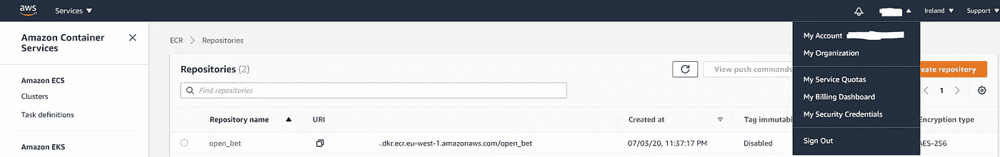

# 使用 Python、Docker 和 AWS ECS Fargate 第 2 部分创建 Twitch 亮点并每日发布到 Reddit

> 原文：<https://levelup.gitconnected.com/creating-twitch-highlights-and-posting-daily-to-reddit-with-python-docker-and-aws-ecs-fargate-c9127eeb72bd>


在这篇文章的第一部分中，我描述了一个 Python 项目，我们从 Twitch 获得热门视频，用 moviepy 编辑它们，然后发布到 Reddit。

在这篇文章中，我将描述如何将这个项目放在 AWS ECS Fargate 上，并每天自动将视频发布到 Reddit。如果您有一个希望按计划运行的项目，请不要看第 1 部分，直接看这篇文章。

## 先决条件

*   安装 [AWS 命令行界面](https://docs.aws.amazon.com/cli/latest/userguide/install-cliv2.html)。
*   注册一个[免费 AWS 账户](https://portal.aws.amazon.com/billing/signup#/start)。
*   安装[对接器](https://www.docker.com/)。

**大纲**

第 2 部分有 3 个步骤:

*   在 Docker 容器中本地运行代码
*   上传 Docker 容器到 ECS Fargate。
*   创建按计划运行的任务定义。

## 第 1 部分—码头工人

Docker 是一种集装箱服务。它让我们可以定义一台我们需要的小计算机，称为映像，然后我们可以将此映像放在云上，并根据需要在映像中运行任务。云服务通常根据你存储的图像大小收费，例如亚马逊弹性容器注册(ECR)，让你免费存储 1GB 的图像一个月，任何更大的图像他们都要收费。

用 Docker 文件定义 Docker 图像。在下面的 docker 文件中，我们从 python:3 映像中提取，因此我们不需要安装所有的 python 包，然后我们复制相关的文件，设置我们的工作目录并声明我们的环境变量。

最好使用 env 列表来管理我们的环境变量。这是因为当我们在本地运行 Dockerfile 时，我们不需要每次都传入变量。

要在 Docker 容器中运行我们的项目，我们需要运行两个命令， [Docker Build](https://docs.docker.com/engine/reference/commandline/build/) 和 [Docker Run](https://docs.docker.com/engine/reference/commandline/run/) 。

对于 Docker build，我们传入“-t”参数来标记我们的容器，我将我的容器命名为“videos”。告诉 docker 在当前目录中查找 docker 文件。

```
docker build -t videos .
```

这需要一段时间，但一旦完成，您应该能够运行以下命令，并看到您的脚本运行。

```
docker run --env-file env.list -it videos python main.py Docker
```

env 文件选项让我们传递 env 列表，优雅地定义所有的环境变量。

如果我们在这里没有使用 env 列表，那么每当我们想使用-e 选项运行脚本时，我们就必须键入每个环境变量。

“python main.py Docker”告诉 Docker 容器在容器中运行“python main.py”。

如果脚本无法运行，您可以运行以下命令来访问 Docker 映像。

```
docker run -it videos bash
```

在终端中运行以下两个命令，查看 main.py 是否正确运行。

```
cd code
python main.py
```

代码中的任何错误都应该显示出来。

## 第 2 部分——把图片放到亚马逊上

我们需要做的第一件事是在 [AWS 弹性容器注册表](https://aws.amazon.com/ecr/) (ECR)上创建一个存储库。这是一个让您存储 Docker 图像并在 AWS 弹性容器服务(ECS)中使用它们的服务。

要在 ECR 上创建一个新的存储库，可以使用以下命令。

```
aws ecr create-repository --repository-name reddit-video-maker
```

现在，如果我们转到 [ECR 页面](https://eu-west-1.console.aws.amazon.com/ecr/repositories?region=eu-west-1)，您应该会看到类似这样的内容。


我模糊掉的数字是我的账号，这很重要，因为我们需要它来提升我们的形象。你可以从你的图片中选择，或者你可以点击右上角的用户名，它会出现在我的帐户选项旁边。



要将您的映像推送到 ECR，请运行以下 3 个命令:

```
aws ecr get-login-password --region eu-west-1 | docker login --username AWS --password-stdin $YOUR_ACCOUNT_NUMBER.dkr.ecr.eu-west-1.amazonaws.comdocker tag reddit-video-maker:latest $YOUR_ACCOUNT_NUMBER.dkr.ecr.eu-west-1.amazonaws.com/reddit-video-maker:latestdocker push $YOUR_ACCOUNT_NUMBER.dkr.ecr.eu-west-1.amazonaws.com/reddit-video-maker:latest
```

如果我们点击存储库，我们应该会看到图像。


我们的图像现在在 AWS ECR 中，AWS ECS 可以访问。

## 第 3 部分—运行任务

[AWS ECS](https://aws.amazon.com/ecs/) 是一个提供大量服务的容器编排服务。我们只对 [AWS ECS Fargate](https://aws.amazon.com/fargate/) 感兴趣。这使我们能够分配我们的映像所需的资源，并实现预定的任务。我们需要分配资源的第一件事是在 ECS 上创建一个[集群](https://docs.aws.amazon.com/AmazonECS/latest/developerguide/clusters.html)，这是通过以下命令完成的。

```
aws ecs create-cluster --cluster-name cluster-1
```

如果您转到 AWS 上的 [ECS](https://eu-west-1.console.aws.amazon.com/ecs/home?region=eu-west-1#/clusters) 页面，您应该会看到类似这样的内容:


接下来我们需要做一个任务定义。这些需要一个如下所示的 JSON 文件。

任务和执行角色需要您的帐号。对于 Fargate，网络模式必须是 aws vpc。

在容器定义中，我们必须将命令定义为由逗号分隔的两个单独的字符串。AWS 会将其解读为

```
python main.py
```

该命令将在任务结束时运行。

family 标记是我们任务的名称。

CPU 和内存是我们需要分配给任务的资源。CPU 应该只有一半内存。在这个例子中，我给了这个任务最大的资源，因为视频处理是昂贵的，如果你正在做一些不太密集的事情或者乐意让视频花费更长的时间，你可以将 CPU 和内存设置得更低。

对于您想要创建的每个任务，您需要创建一个新的 JSON 文件。

您应该注意到，您不需要在 JSON 文件中定义希望该任务运行的集群，因为该任务可以在您定义的任何集群上运行。

要将任务定义推送到 AWS ECS，请将文件保存在当前目录中并运行

```
aws ecs register-task-definition --cli-input-json file://task1.json
```

要检查任务是否已成功注册，您可以使用以下命令:

```
aws ecs list-task-definitions
```

或者您可以使用 [AWS 控制台](https://eu-west-1.console.aws.amazon.com/ecs/home?region=eu-west-1#/taskDefinitions)导航到任务定义，您应该会看到它被列出:


要运行该任务，您需要知道您的子网 id 和安全组。要找到您的子网 id，请运行。

```
aws ec2 describe-subnets
```

您应该会看到类似这样的内容:


突出显示的字段 SubnetID 是您需要的数字。

对于安全组 ID，命令是:

```
aws ec2 describe-security-groups
```

它应该会返回这样的结果:


突出显示的“GroupID”字段正是我们所需要的。

要运行该任务，您可以使用以下命令。

```
aws ecs run-task --cluster cluster-1 --task-definition chess_weekly:1 --count 1 --launch-type FARGATE --network-configuration "awsvpcConfiguration={subnets=[$YOUR-SUBNET],securityGroups=[$YOUR-SECURITY-GROUP], assignPublicIp=ENABLED}"
```

要检查任务是否成功，您可以检查您的 Streamable 帐户，看看是否有任何内容已发布。

## 行程安排

我们需要做的最后一件事是安排任务。为此，我们需要创建一个规则，然后将其附加到我们的任务中。

要创建规则，您可以使用 cron 表达式或 rate 表达式。

```
aws events put-rule --schedule-expression "cron(0 12 * * ? *)" --name Dailyaws events put-rule --schedule-expression "rate(1 day)" --name Daily
```

这两者每天都会发布一次。要阅读更多关于 cron 表达式的内容，请查看 [AWS 文档](https://docs.aws.amazon.com/AmazonCloudWatch/latest/events/ScheduledEvents.html)。

要将规则附加到任务，请运行以下命令:

```
aws events put-targets --rule "Daily" --targets "Id"="1","Arn"="arn:aws:ecs:eu-west-1:$YOUR_ACCOUNT_ID:cluster/cluster-1","RoleArn"="arn:aws:iam::YOUR_ACCOUNT_ID:role/ecsTaskExecutionRole","EcsParameters"="{"TaskDefinitionArn"= "arn:aws:ecs:eu-west-1:$YOUR_ACCOUNT_ID:task-definition/test2:1","TaskCount"= "1", "LaunchType"=FARGATE}","NetworkConfiguration"={"awsvpcConfiguration"="{"Subnets"="YOUR-SUBNET-ID","SecurityGroups"="YOUR-SECURITY-GROUP","AssignPublicIp"="ENABLED"}"}"}"
```

如果你进入控制台中的[集群](https://eu-west-1.console.aws.amazon.com/ecs/home?region=eu-west-1#/clusters/cluster-1/scheduledTasks)并突出显示“预定任务”，你应该会看到这个。


这些视频现在将每天发布，为选定的子编辑生成内容。

以下是本教程中给出的命令列表

```
sudo docker build -t videos .sudo docker run --env-file env.list -it videos python main.py Dockeraws ecr get-login-password --region eu-west-1 | docker login --username AWS --password-stdin $YOUR_ACCOUNT_ID.dkr.ecr.eu-west-1.amazonaws.comdocker build -t reddit-video-maker .docker tag reddit-video-maker:latest $YOUR_ACCOUNT_ID.dkr.ecr.eu-west-1.amazonaws.com/reddit-video-maker:latestdocker push $YOUR_ACCOUNT_ID.dkr.ecr.eu-west-1.amazonaws.com/reddit-video-maker:latestaws ecs register-task-definition --cli-input-json file://task1.jsonaws ec2 describe-subnetsaws ec2 describe-security-groupsaws ecs run-task --cluster cluster-1 --task-definition chess_weekly:1 --count 1 --launch-type FARGATE --network-configuration "awsvpcConfiguration={subnets=[$YOUR-SUBNET],securityGroups=[$YOUR-SECURITY-GROUP], assignPublicIp=ENABLED}"aws events put-rule --schedule-expression "cron(0 12 * * ? *)" --name Dailyaws events put-rule --schedule-expression "rate(1 day)" --name Dailyaws events put-targets --rule "Daily" --targets "Id"="1","Arn"="arn:aws:ecs:eu-west-1:$YOUR_ACCOUNT_ID:cluster/cluster-1","RoleArn"="arn:aws:iam::YOUR_ACCOUNT_ID:role/ecsTaskExecutionRole","EcsParameters"="{"TaskDefinitionArn"= "arn:aws:ecs:eu-west-1:$YOUR_ACCOUNT_ID:task-definition/chess_weekly","TaskCount"= "1", "LaunchType"=FARGATE}","NetworkConfiguration"={"awsvpcConfiguration"="{"Subnets"="YOUR-SUBNET-ID","SecurityGroups"="YOUR-SECURITY-GROUP","AssignPublicIp"="ENABLED"}"}"}"
```

如果你觉得这篇文章有用，请随时在 LinkedIn 上与我联系。