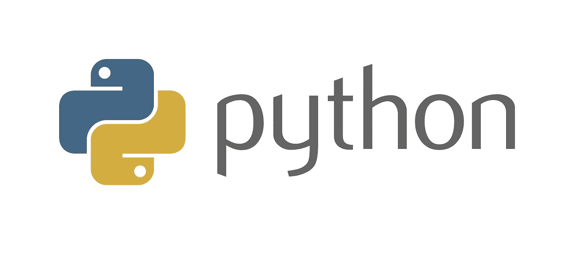
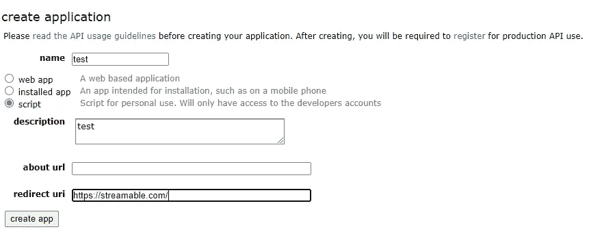
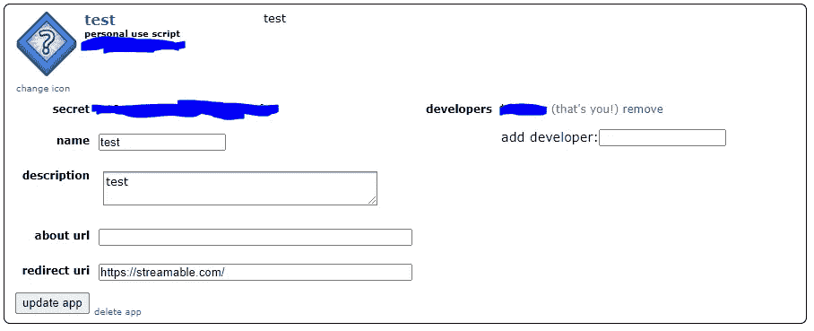

# 使用 Python、Docker 和 AWS ECS Fargate 第 1 部分创建 Twitch 亮点并每日发布到 Reddit

> 原文：<https://levelup.gitconnected.com/creating-twitch-highlights-and-posting-daily-to-reddit-with-python-docker-and-aws-ecs-fargate-c995fe036b4d>



## 该项目

在过去的几年里，Reddit 已经成长为世界上访问量排名第 15 位的网站，在我的祖国爱尔兰，它是 T2 访问量排名第三的网站，也是最大的社交网络。当制作新的视频游戏时，公司营销游戏的方式之一是制作一个子编辑，并尝试发布尽可能多的内容，以吸引潜在的买家。

与此同时，Twitch 已经增长到第 11 位，是目前领先的流媒体平台，即使是中等水平的流媒体每年也能赚到 6 位数的收入。聚集一批追随者可以带来一大笔横财。同样，streamers 实现这一点的方法之一是制作一个子漩涡，并试图让观众参与进来。

在本教程中，我们将制作一个 Python 脚本，自动将某个游戏或 Twitch 频道某个时间段的热门 Twitch 剪辑发布到 subreddit。

## 先决条件—第 1 部分

*   去 [Twitch API](https://dev.twitch.tv/docs/v5) 获取一个客户端 id。
*   创建一个[可流动的](https://streamable.com/)账户。
*   创建一个 [Reddit](http://reddit.com) 账户。

## 先决条件—第 2 部分

*   安装 [AWS 命令行界面(CLI)](https://docs.aws.amazon.com/cli/latest/userguide/install-cliv2.html) 。
*   注册一个[免费 AWS 账户](https://portal.aws.amazon.com/billing/signup#/start)。
*   安装[对接器](https://www.docker.com/)。

**概要**

这个项目有 6 个步骤:

*   拿夹子。
*   将剪辑连接成一个视频。
*   把视频上传到 Reddit。
*   在 Docker 上运行代码。
*   将 Docker 容器推送到 AWS 弹性容器注册表。
*   使用容器按计划运行 Fargate 任务。

我将在这篇文章中讲述前三步，在第二部分中讲述接下来的三步。

**获取夹子**

在之前的帖子中，我解释了如何使用 AWS Lambda 将趋势 Twitch 剪辑放入 S3 桶中，我们在那个项目中使用了 Twitch API，在这里也将这样做。

我们需要做的第一件事是导出我们的环境变量。

```
export number_of_videos=2
export mode=game
export key=chess
export twitch_id=YOUR_TWITCH_API_ID
export period=week
```

在这个例子中，我决定从热门游戏“国际象棋”中获取过去一周的前 2 个剪辑。如果你想得到一个标题中有空格的游戏，你需要使用“%20”而不是空格，例如，如果你想要“替罪羊”，你需要下面的命令。这是因为“%20”是表示空格的 HTML 代码。

```
export key=Fall%20Guys
```

当我们在 Fargate 上有这个代码时，我们将能够创建不同的任务定义并更改环境变量，所以如果我们不想请求象棋视频，而是想要请求一个通道剪辑(如 GMHikaru ),我们只需将模式和关键环境变量更改为以下内容。

```
export mode=channel
export key=gmhikaru
```

一旦我们有了 Twitch API 的客户端 id，我们将能够通过首先发送请求来获得剪辑的“slug ”,从而下载当天的趋势剪辑。鼻涕虫是 Twitch 使用的剪辑标题。有可能获得一个游戏或一个频道在一段时间内的剪辑，或者获得当前的趋势剪辑。欲了解更多信息，请查阅[文档](https://dev.twitch.tv/docs/v5/reference/clips)。

下面是一个实现，我们获取 slugs，然后检索该时间段最受欢迎的视频，放在/tmp/文件夹中以备后用，并返回一个视频路径列表。

**剪辑剪辑**

一旦我们在/tmp/文件夹中有了剪辑，我们需要将它们编辑成一个视频。这可以通过[电影库](https://zulko.github.io/moviepy/)来实现。要安装它，只需设置 python 环境并运行。

```
pip install moviepy
```

我们从前面的步骤中获取路径列表并初始化剪辑数组，我们将所有剪辑的大小调整为相同，以防止连接出现问题，连接，然后写入视频文件并返回视频文件的保存位置。

渲染视频可能需要很长时间，对于一个 2 分钟的视频，我花了 140 秒来渲染它，视频越长它会急剧增加。然而，当我在 AWS 上以最大设置运行这段代码时，只需要 30 秒。这是云计算的好处之一，它让任何人都可以用网络浏览器来使用高端电脑。

**上传视频**

我决定先将视频上传到 Streamable，然后再上传到 Reddit，而不是直接上传到 Reddit，因为他们有一个干净的 API，使用 Streamable 仪表板比构建我们自己的仪表板更容易跟踪我们的视频有多少浏览量。

我们将在这里使用两种不同的 API，两者都需要帐户，所以您需要将您的用户名和密码存储在环境变量中。

```
export streamable_username=YOUR_STREAMABLE_USERNAME
export streamable_password=YOUR_STREAMABLE_PASSWORD
export reddit_username=YOUR_REDDIT_USERNAME
export reddit_password=YOUR_REDDIT_PASSWORD
```

Streamable 的 Api 有一个干净的 python 库，我们将安装并使用它。

```
pip install pystreamable
```

我发现上传可能会挂起，让程序陷入无限循环。这是非常糟糕的，如果它发生在 AWS 上，因为它可能会导致我们的帐户上的大量费用。所以我实现了每十秒检查一次视频是否上传的逻辑，如果上传失败就结束程序。

Reddit 有点复杂，你需要获得一个 Reddit id 和 Reddit secret 才能发布到 Reddit。你需要去[https://www.reddit.com/prefs/apps](https://www.reddit.com/prefs/apps)点击“创建应用”。然后你需要填写这样一张表格。



然后，当你点击创建应用程序，你应该得到这样的屏幕。



个人使用脚本下面的字符串是您的 id，机密旁边的字符串是您的机密。

```
export reddit_secret=YOUR_REDDIT_SECRET
export reddit_id=YOUR_REDDIT_ID
```

Reddit 的 API 也有一个我们将使用的名为 Praw 的 python 库。

```
pip install praw
```

Praw 还需要一个用户代理，我们将使用 python 库“伪用户代理”在每次运行时生成一个唯一的用户代理，因为在 Reddit 上被发现自动化可能会导致禁令。

```
pip install fake-useragent
```

在写脚本之前，我们需要设置的最后一件事是我们发布的子 reddit。这是另一个环境变量，我们将在不同的任务定义中编辑，但现在，让它作为英雄联盟。

```
export subreddit=chess
```

我们要做的最后一件事是创建一个简单的 main 来运行这些方法。

感谢您阅读本文，在[第 2 部分](https://conor-aspell.medium.com/creating-twitch-highlights-and-posting-daily-to-reddit-with-python-docker-and-aws-ecs-fargate-c9127eeb72bd)中，我介绍了在 ECS Fargate 中按计划运行代码的过程。

如果你觉得这篇文章有用，请随时在 [LinkedIn](https://www.linkedin.com/in/conor-aspell/) 上联系我。