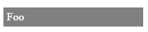
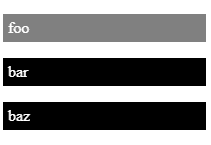

# 创建 Web 组件—模板和插槽

> 原文：<https://levelup.gitconnected.com/creating-web-components-templates-and-slots-bd6905a7092a>


[巴西托普诺](https://unsplash.com/@b620?utm_source=medium&utm_medium=referral)在 [Unsplash](https://unsplash.com?utm_source=medium&utm_medium=referral) 上拍摄的照片

随着 web 应用变得越来越复杂，我们需要某种方式将代码分成易于管理的块。为此，我们可以使用 Web 组件来创建可重用的 UI 块，以便在多个地方使用。

在本文中，我们将研究如何在 Web 组件中使用模板和插槽。

# 模板

我们可以使用`template`元素来添加没有在 DOM 中呈现的内容。这使我们可以通过编写以下 HTML 将它们合并到任何其他元素中:

```
<template>
  <p>Foo</p>
</template>
```

然后，我们可以编写以下 JavaScript 来将其合并到页面中:

```
const template = document.querySelector('template');
const templateContent = template.content;
document.body.appendChild(templateContent);
```

当我们加载页面时，我们应该在页面上看到“Foo”。当我们检查‘Foo’的代码时，应该会显示出`p`元素。这证实了标记不受`template`元素的影响。

# 在 Web 组件中使用模板

我们也可以在 Web 组件中使用它们。为了使用它，我们可以在 Web 组件的类中获取`template`元素，就像我们在 Web 组件外部所做的一样。

例如，我们可以写:

```
customElements.define('foo-paragraph',
  class extends HTMLElement {
    constructor() {
      super();
      let template = document.querySelector('template');
      let templateContent = template.content;
      const shadowRoot = this.attachShadow({
          mode: 'open'
        })
        .appendChild(templateContent.cloneNode(true));
    }
  })
```

在上面的代码中，我们获得了`template`元素和对`templateContent`的调用`cloneNode`，该调用将`template.content`作为获取模板内容的值。

然后我们调用`cloneNode`来克隆`template.content`节点的子节点以及节点本身。这由`cloneNode`函数调用的`true`参数指示。

最后，我们用`attachShadow`和`appendChild`方法将克隆的`templateContent`附加到 Web 组件的影子根中。

我们还可以在`template`元素中包含样式，这样我们就可以像处理 HTML 标记一样重用它。

例如，我们可以将`template`元素改为:

```
<template>
  <style>
    p {
      color: white;
      background-color: gray;
      padding: 5px;
    } </style>
  <p>Foo</p>
</template>
```

那么我们应该看到:



[zo Reeve](https://unsplash.com/@zoeeee_?utm_source=medium&utm_medium=referral)在 [Unsplash](https://unsplash.com?utm_source=medium&utm_medium=referral) 上的照片

# 时间

为了使我们的模板更加灵活，我们可以添加插槽来显示我们想要的内容，而不是静态内容。使用插槽，我们可以在 Web 组件的开始和结束标记之间传递内容。

它的支持比模板更有限。插槽可以用于 Chrome 53 或更高版本，Opera 从版本 40 开始，Firefox 从版本 59 开始，Edge 不支持。

例如，我们可以通过编写以下内容来添加一些插槽:

```
<template>
  <slot name="foo">Default text for foo</slot>
  <slot name="bar">Default text for bar</slot>
  <slot name="baz">Default text for baz</slot>
</template>
```

然后假设我们有和以前一样的代码来定义 JavaScript 中的`foo-paragraph`元素，我们可以如下使用它:

```
<foo-paragraph>
  <p slot='foo'>foo</p>
  <p slot='bar'>bar</p>
  <p slot='baz'>baz</p>
</foo-paragraph>
```

输出将是:

```
foobarbaz
```

如果我们省略了`foo-paragraph`标签中的元素，我们将得到默认文本:

```
Default text for foo Default text for bar Default text for baz
```

在上面的代码中，我们用`template`元素中的`name`属性来命名插槽，然后在我们的 Web 组件中，我们使用`slot`属性来填充我们定义的插槽。

我们可以像设计其他`template`元素一样设计它们。为了对它们进行样式化，我们通过使用选择器来选择要被样式化的元素，这些选择器用于我们将要填充到槽中的元素。

例如，我们可以写:

```
<template>
  <style>
    ::slotted(p) {
      padding: 5px;
      background-color: black;
      color: white;
    } ::slotted(p[slot='foo']) {
      background-color: gray;
    }
  </style>
  <slot name="foo">Default text for foo</slot>
  <slot name="bar">Default text for bar</slot>
  <slot name="baz">Default text for baz</slot>
</template><foo-paragraph>
  <p slot='foo'>foo</p>
  <p slot='bar'>bar</p>
  <p slot='baz'>baz</p>
</foo-paragraph>
```

`::slotted`伪元素表示已经放入 HTML 模板中的元素。因此，我们可以使用它来选择我们想要样式的槽元素。

在`::slotted`的参数中，我们可以传入我们想要样式化的元素，如果它们被传入槽中的话。这意味着只有传入的`p`元素才会应用样式。

`::slotted(p[slot=’foo’])`意味着带有`slot`属性值`foo`的`p`元素将被应用样式。

然后，在应用样式后，我们应该得到以下内容:



模板和插槽让我们创建可重用的组件，我们可以在 Web 组件中使用。元素在渲染过程中不会出现，所以我们可以把它们放在任何地方，并在任何 Web 组件中随意使用。

有了插槽，我们在创建 Web 组件时有了更多的灵活性，因为我们可以创建可以插入其他元素来填充插槽的组件。

在任何情况下，我们都可以随心所欲地对元素应用样式。我们有`::slotted`伪元素来将样式应用于插槽中的特定元素。