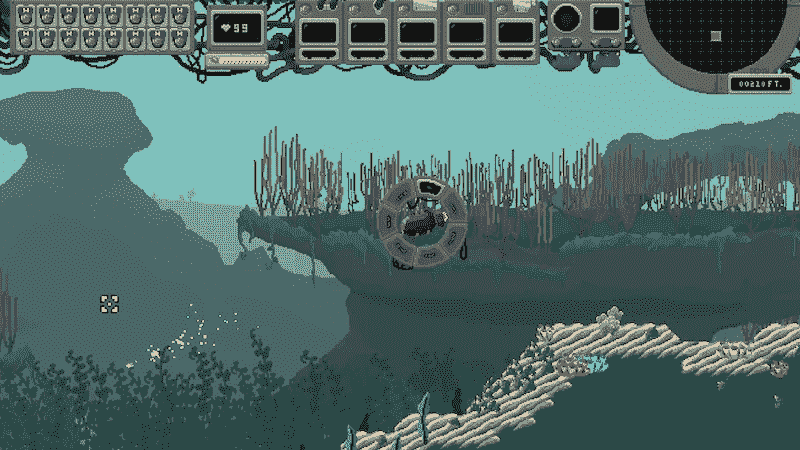
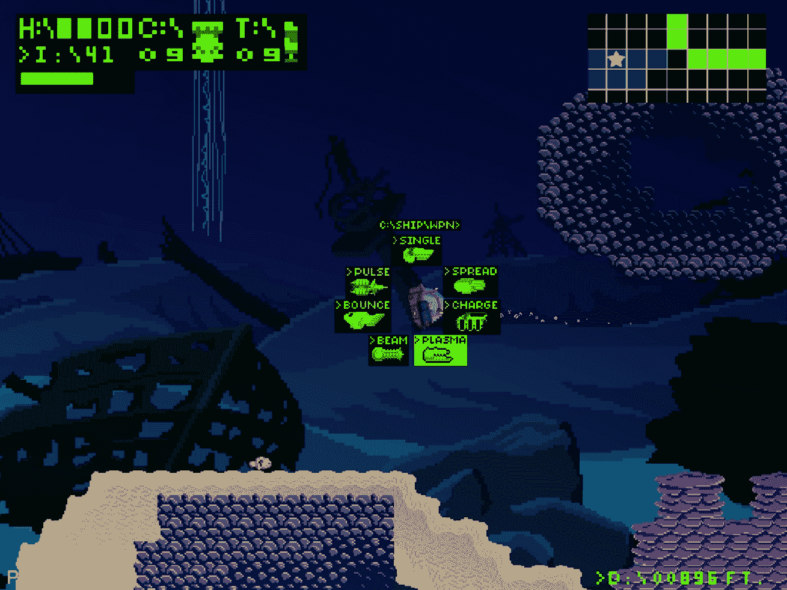
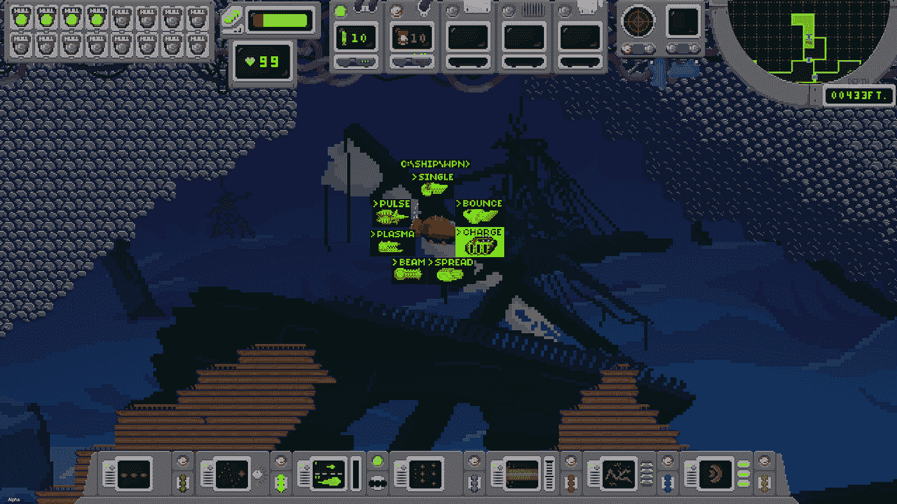
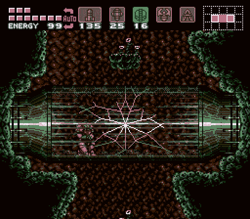
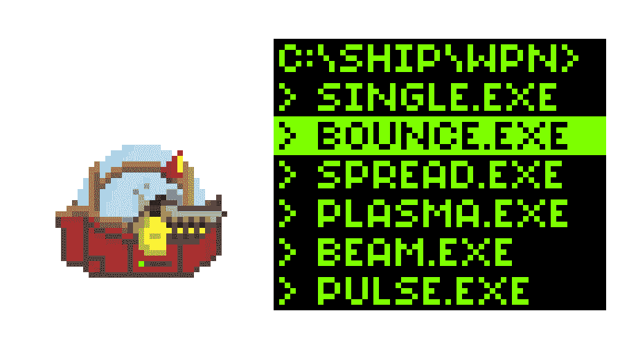
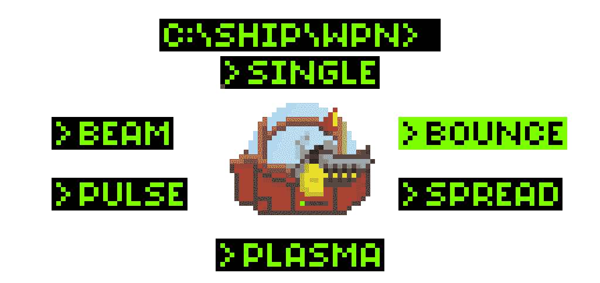
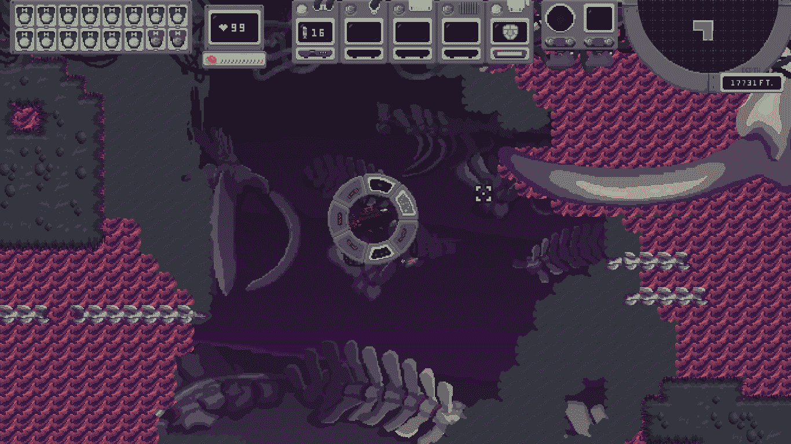

# 创建你的独立游戏的 HUD 是一个漫长的过程。以下是我们解决问题的方法:

> 原文：<https://levelup.gitconnected.com/creating-your-indie-games-hud-is-a-long-process-here-is-how-we-tackled-ours-5e8432aed40a>

我们目前的版本离我们开始的地方还有很长的路要走。

没有人喜欢谈论游戏的 HUD。

大多数时候，玩家甚至不会注意到它，除非它主动妨碍了他们的游戏体验。然而，大量的时间和工时都花在了制作上。创建一个 HUD 来传达游戏的基调和风格以及玩家需要的所有信息，而不妨碍他们的体验，这需要大量的时间、耐心和创造力。

所以就来说说吧。

[**深度理智**](https://store.steampowered.com/app/848080/Depths_of_Sanity/)**——我们的水下，metroidvania 的噩梦——刚刚进入** [**早期接入经过 3.5 年的发展**](https://store.steampowered.com/app/848080/Depths_of_Sanity/) **，**又花了整整一大堆的淬炼才到达那里。对我们的艺术家来说，最难的组件之一是 HUD，它在开发过程中经历了多次重新设计。

我们的游戏完全发生在水下，玩家角色 Abe 在游戏的大部分时间里驾驶着一艘潜艇(除了穿着潜水服的场景)。

我们的艺术家 Bennett 希望利用这一独特的概念来驱动我们 HUD 及其所有元素的外观和感觉，同时仍然快速简单地向玩家传达信息。

他是这样处理的:

# **平视显示器第 1 年—前 Alpha**

我做的第一个 HUD 被设计成看起来像一个旧的绿色单色显示器，就好像你在阅读潜艇屏幕上的信息一样。这个概念是为了让它看起来像是潜艇重要部分的“驾驶舱”视图，这是我们在它发展的过程中试图在各个版本中保持的东西。

我们最早的故事概念之一是把船上的电脑作为一个反派，所以我们提出了扰乱玩家的 HUD 作为其中一部分的想法。这个低保真度、几乎类似 DOS 的版本允许我们在许多方面扰乱播放器，允许计算机在 HUD 的文本中向你发送消息，并覆盖你看到的任何信息。

然而，我们最终脱离了那个故事的概念，并且延伸开来，这个 HUD，它在视觉上是沉闷的，在风格上比它应该有的更难阅读(特别是右上角的地图)。于是我又试了一次，用一个经典作为灵感。

# **平视显示器第二年—测试前**

第二次大改版从《超级银河战士》中大量借鉴，作为一个路标。目前的版本仍然很大程度上遵循这种格式，这有助于我集中和清理我们如何向玩家显示重要信息。

你肯定能从下面的超级银河战士图片中看到影响。

古老的超级银河战士。

我想做的事情之一是从一开始就有一个完整的 HUD，但许多指示器都不工作，例如空的墨盒插槽、关闭的开关等。我认为这将是一个很酷的方式来建立对游戏过程中什么样的武器和技能会填充它的预期。

这个深度版本在屏幕底部还有一个额外的 HUD，显示当前装备的主要武器。其中一些甚至有特殊的动画，可以在武器被使用时播放。

虽然从纯艺术的角度来看，我肯定喜欢这个 HUD，但我们最终还是离开了它。下半部分占用了太多的屏幕空间，相当繁忙，限制了玩家的视野，没有提供需要知道的信息。此外，它是一种多余的武器轮。

说到这个…

# **武器轮**

在 HUD 的第一个版本中，武器轮经历了多次视觉迭代。最初的概念是一个下拉菜单系统，就像你在电脑上找到并运行一个 DOS 程序。不可否认，我在风格上很喜欢它，但是实际使用起来太麻烦了。

理智占了上风，我们最终换成了轮子的形式，但我们仍然使用文字来选择武器，这既没有吸引力，也不符合飞船的外观演变。

早期版本的 Abe 的船在侧面有一门炮，并且炮会根据选择的武器而改变。在这个版本中，我们使用了这些武器的绿色轮廓，而不是武器轮 V3 的文字(你可以在本页顶部的第一个截图中看到这一点)。

然而，飞船的外观在开发过程中发生了巨大的变化，最终由于各种原因，我们删除了可见的武器变化。最后的变化是我们的早期访问平视显示器。

# **平视显示器和武器轮第 3 年—当前早期版本:**

今年，我们大大简化了 HUD 和武器轮。滚轮被配对成简单的图标，以帮助您确定您使用的是哪种武器(例如，在下面的截图中，我们使用“弹跳球”图标进行弹跳拍摄)。

整体平视显示器也有很多咬和塔克。最大的变化是我们剥掉了底部，腾出了空间，我们可以根据需要用于不同的目的，比如当你离开飞船时露出你的氧气表，或者给对话场景留出更多空间。

在顶部，我们为游戏中涉及热量的部分添加了一个温度计(以前的玩家对机械如何工作感到困惑)，扩展了边缘以实现更宽的显示，并移动了一些东西以更好地组织剩余的部分。

我对这个最终的妥协非常满意。这个最新的 HUD 给了这个游戏独特的感觉——保持了对你的重要器官有一个“驾驶舱”视图的想法——同时更有用和视觉上更有趣。

# **提前接入**

现在我们处于早期阶段，虽然团队对设计很满意，但我们仍在随着玩家玩游戏并给我们反馈而增加调整。这是一个非常有启发性的经历，玩家终于能够沉浸在游戏中几个小时，并帮助我们为最终的完整版本量身定制。

**如果您愿意帮助我们，** [**您可以在这里**](https://store.steampowered.com/app/848080/Depths_of_Sanity/) **获得您的早期访问副本。现在它包含了游戏的前三章(共六章)，第四章将在几个月后推出。**

感谢你的帮助，我们希望这能给你一点启示，告诉你如何设计一个适合你的独立游戏的 HUD。