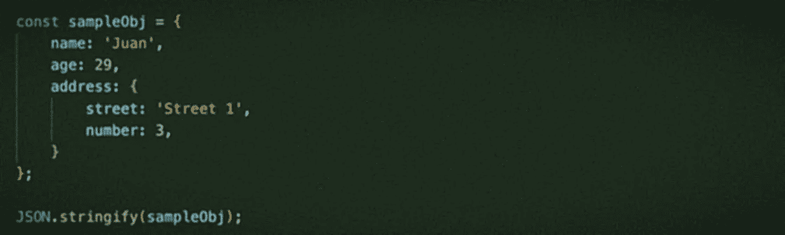

# 创建您自己的 JSON.stringify()的简化实现

> 原文：<https://levelup.gitconnected.com/creating-your-own-simplified-implementation-of-json-stringify-ed8e50b9144a>

您可能已经熟悉了函数`JSON.stringify`，它在比较对象、实现 RESTFUL APIs 或简单地深度克隆一个 javascript 对象时很有用(尽管不推荐)。

在本文中，我们将讨论如何创建我们自己的这种方法的简化版本，并学习如何一步一步地改进它的实现，随着我们的进步，涵盖越来越多的情况。



如果你不熟悉这个功能，我们来看看 [MDN](https://developer.mozilla.org/en-US/docs/Web/JavaScript/Reference/Global_Objects/JSON/stringify) 对此有什么说法:

> `**JSON.stringify()**`方法将 JavaScript 对象或值转换为 JSON 字符串，如果指定了 replacer 函数，则可选地替换值，或者如果指定了 replacer 数组，则可选地仅包含指定的属性。

它的语法可以写成这样:

```
JSON.stringify(value[, replacer[, space]])
```

其中“值”是我们要转换为字符串的对象或值。为了使本文更简单，我们可以省去另外两个参数。

# 测试数据

考虑这种情况:

```
const sampleObj = {
   "name": "Juan",
   "age": 29,
   "address": {
      "street": "Street 1",
      "number": 3
   }
}
```

如果我们将 origin JSON.stringify()函数应用于该对象，我们会得到以下结果:

```
{"name":"Juan","age":29,"address":{"street":"Street 1","number":3}}
```

如您所见，这相当简单。它给属性加上双引号，如果值是一个字符串，它也会加上双引号。对于这个特殊的例子，我们将只处理这三种数据类型:数字、字符串和对象。我们将省略函数、日期、未定义的值等等，只是为了简单起见，不过我建议你阅读一下`JSON.stringify`的文档，看看它是如何处理这些类型和其他类型的。

# 该功能

让我们从它开始:

```
function stringify(obj) {
    let objString = ''; // We add the opening curly brace
    objString += '{'; for (const key in obj) {
        const value = obj[key];

        objString += `"${key}":`;

        if (typeof obj[key] === 'object') {
            objString += `${stringify(value)}`;
        } else if (typeof value === 'string') {
            objString += `"${value}"`;
        } else if (typeof obj[key] === 'number') {
            objString += `${value}`;
        }

        // We add the comma
        objString += `,`;
    } // We add the closing curly brace
    objString += '}'; return objString;
}
```

正如你所看到的，我们正在做的是手动添加花括号，然后遍历对象中的每个键，根据它的类型，我们在打印双引号中的键后打印它的值。如果键包含一个对象，我们使用递归再次调用`stringify`函数并重复这个过程。

如果我们用我们的`sampleObj`执行那个函数，结果是这样的:

```
{"name":"Juan","age":29,"address":{"street":"Street 1","number":3,},}
```

这是一个好的开始，但是如果你仔细观察，你会发现所有尾随的逗号破坏了 JSON 字符串的美观。不好！

让我们试着解决这个问题:

```
function stringify(obj) {
    let objString = '';

    // We get the last key of this object
    const lastKey = Object.keys(obj).pop(); // We add the first curly brace
    objString += '{'; for (const key in obj) {
        const value = obj[key];

        objString += `"${key}":`;

        if (typeof obj[key] === 'object') {
            objString += `${stringify(value)}`;
        } else if (typeof value === 'string') {
            objString += `"${value}"`;
        } else if (typeof obj[key] === 'number') {
            objString += `${value}`;
        }

        // We add the comma
        if (key !== lastKey) {
            objString += ',';
        }
    } // We add the last curly brace
    objString += '}'; return objString;
}
```

哇，那很简单。我们只是获取对象的最后一个键，当迭代时，如果当前元素属于最后一个键，我们不加逗号。你能想到做这件事的更好的方法吗？这个就够了。

让我们再次使用我们的`sampleObj`来看看这个函数的结果:

```
{"name":"Juan","age":29,"address":{"street":"Street 1","number":3}}
```

不错！看起来现在已经完成了，但是…如果你发送一个字符串或者一个数字而不是一个对象，会发生什么呢？让我们看看`JSON.stringify`是如何表现的:

```
> JSON.stringify("test");
"test" > JSON.stringify(42);
42
```

如果我们用这些值执行我们的函数，我们会得到不同的输出，让我们看看:

```
> stringify("test");
{"0":"t","1":"e","2":"s","3":"t"}> stringify(42);
{}
```

让我们试着解决这个问题，我们需要在迭代对象之前检查类型。这是它看起来的样子:

```
function stringify(value) {
    const lastKey = Object.keys(value).pop();
    let objString = ''; if (typeof value === 'object') {
        // We add the first curly brace
        objString += '{'; for (const key in value) {
            objString += `"${key}":${stringify(value[key])}`;

            // We add the comma
            if (key !== lastKey) {
                objString += ',';
            }
        } // We add the last curly brace
        objString += '}';
    } else if (typeof value === 'string') {
        objString += `"${value}"`;
    } else if (typeof value === 'number') {
        objString += `${value}`;
    } return objString;
}
```

完成了。如您所见，我们将类型检查移到了当前对象的`for`迭代器之外。我们还将参数的名称从`obj`改为`value`，因为现在它也可以是字符串或数字。

让我们用一些例子来尝试一下:

```
> stringify("test");
"test"> stringify(42);
42> stringify(sampleObj)
{"name":"Juan","age":29,"address":{"street":"Street 1","number":3}}
```

看起来是这样的，它现在适用于简单的对象、数字和字符串，我们已经到了本文的结尾，但我将留下几个问题供您思考，并尝试实现您自己的解决方案:

# 循环引用问题

如果您熟悉序列化方法，您可能听说过“循环引用”或“无限循环”。当你试图序列化一个引用了另一个对象的对象，而这个对象又引用了第一个对象时，就会发生这种情况！听起来很疯狂？让我们看看。

```
const sampleObj = {
    name: 'Juan',
    age: 29,
    address: {
        street: 'Street 1',
        number: 3,
    }
};const objTwo = {
     name: 'Two',
     inside: sampleObj
};sampleObj.outside = objTwo;
```

如果我们现在试图将我们的`sampleObj`发送给我们的`stringify`函数，我们将得到一个错误。大多数浏览器会说:

```
Uncaught RangeError: Maximum call stack size exceeded
```

发生这种情况是因为我们在发现一个对象时使用了递归，因此这将创建一个无限循环。你能想到什么解决办法吗？你会怎么做？我们可能会在另一篇文章中讨论这个问题，但是如果您能提供这个问题的解决方案，或者甚至分享您自己的 stringify 函数，那就更好了。

# 后续步骤

*   解决循环引用问题。
*   添加对“布尔值”的支持。
*   添加对`Date`和其他实现`toJson()`功能的对象的支持。

# 结论

尽管大多数浏览器都支持`JSON.stringify`,但您最好尝试一下，看看本机方法是如何实现的。它可以帮助您理解幕后发生的事情，也许有一天您会改进一个现有的函数，您的代码会包含在下一个 EcmaScript 版本中，谁知道呢？

# 进一步阅读

*   [https://level up . git connected . com/all-you-need-to-know-about-JSON-and-its-usage-in-JavaScript-b 5181208966d](/all-you-need-to-know-about-json-and-its-usage-in-javascript-b5181208966d)
*   [https://level up . git connected . com/5-uses-of-JSON-stringify-JSON-parse-9b 79 CB 4d 9645](/5-uses-of-json-stringify-json-parse-9b79cb4d9645)