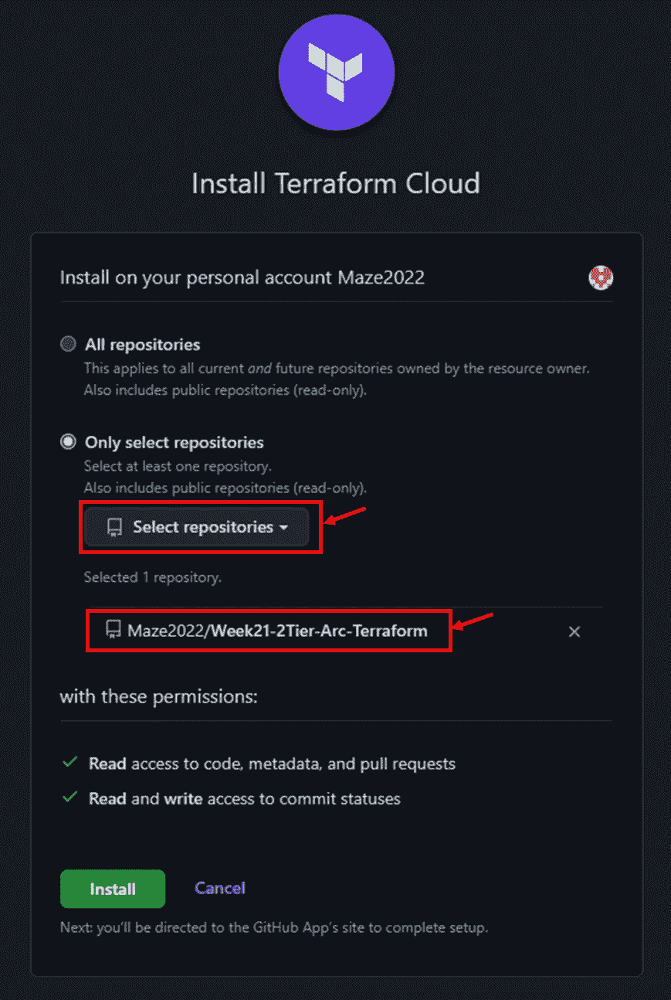

# 使用 Terraform Cloud CI/CD 创建高度可用的 2 层架构

> 原文：<https://levelup.gitconnected.com/creation-of-a-highly-available-2-tier-architecture-using-terraform-cloud-ci-cd-4ae7d8f9f783>

# **场景**

创建包含以下内容的高度可用的双层 AWS 体系结构:

1.  3 个公共子网
2.  3 个私有子网
3.  公共子网中的 1 台堡垒主机
4.  Web 服务器的自动扩展组(在专用子网中)
5.  面向 Internet 的应用程序负载平衡器，目标是 Web 服务器自动扩展组
6.  使用 Terraform Cloud 作为 CI/CD 工具进行部署，以检查您的构建。
7.  使用模块块便于使用和重复使用。

# **先决条件**

1.  地形云
2.  IAM 用户密钥
3.  地形登记处—【https://registry.terraform.io/ 

在之前的项目中，我们仅使用一个配置文件(main.tf)构建了一个 2 层架构。在本演练中，我们将更深入地使用模块来构建我们的代码，同时通过 Terraform Cloud 应用 CI/CD 管道

配置文件存储在我的 **GitHub repo** 中。参见 [**链接**](https://github.com/Maze2022/Week21-2Tier-Arc-Terraform)

**第一步:在配置文件中设置代码**

**根模块**

这里的配置文件是 main.tf、variables.tf、outputs.tf、terraform.tfvars、userdata.sh、状态文件以及子模块

**子模块**

**网络模块:**它由与根模块类似的配置文件组成，根模块明确用于启动 VPC、私有和公共子网、路由表、互联网和 NAT 网关等。 **outputs.tf** 文件输出一些在根模块 main.tf 中使用的参数

**负载平衡模块:**它由目标组和负载平衡资源块组成，将流量导向 webserver 自动扩展组

**计算模块:**它由启动模板和包含堡垒主机(公共子网)和 web 服务器(私有子网)的自动扩展组组成

负载平衡和计算模块块通过 outputs.tf 文件中声明的输出变量引用网络模块

**第二步:用 GitHub 配置 Terraform Cloud】**

现在我们已经设置了代码，我们将设置一个 Terraform 云帐户，登录并创建一个新的工作空间。

工作空间决定了 Terraform Cloud 如何组织基础架构。工作空间由地形配置、变量和当前地形状态组成。

现在我们必须选择一个工作流程。将使用 ***版本控制工作流*** ，因为我们打算从存储库触发 CI/CD 管道

接下来，我们将选择一个 ***版本控制提供者*** 。在这种情况下，我们使用 GitHub。点击 GitHub 下拉菜单，选择 GitHub.com**T5**

会弹出一个页面提示你授权 Terraform Cloud 访问你的 GitHub 账户。您需要禁用浏览器中的弹出窗口拦截器，因为这可能会阻止您继续操作

在下一页上，从下拉列表中选择您希望 Terraform cloud 连接到的存储库，然后点击 ***安装*** 按钮。您的存储库将填充到 Terraform 云环境中

我们将从这里继续创建一个 ***工作区*** *，名称为*****2-Tier-dev。****

**

*一旦创建了工作空间，我们将开始配置 ***工作空间变量。******access _ key、secret_key 和 region*** 将被设置为 ***环境变量。*** 由于某种原因，我遇到了变量错误，但我不得不使用 ***TF_VAR*** 前缀，它允许 Terraform 通过查找变量的值来读取环境变量*

*为了安全起见，记得将它们设置为 ***【敏感】****

****

**在 ***Providers.tf*** 文件中，为访问密钥、密钥和区域**定义的变量必须**与 Terraform Cloud 上的环境变量中定义的 ***密钥*** 名称相匹配。为了避免错误**

**接下来，我们将使用 ***backends.tf*** 文件设置后端配置。该文件定义了 Terraform 存储其状态文件的位置，并与 Terraform Cloud 集成，以允许执行远程操作**

****步骤 3:从 Terraform Cloud 部署配置****

**我们将从 ***排队计划*** 开始**

**您可以开始一个新的运行，这将对所有要创建的资源进行排队**

****

**完成后，您将看到下面的显示**

****

*****应用*** 阶段要求您手动确认并应用代码。这允许您在最终运行代码之前检查代码**

****

**点击 ***后确认&应用*** 按钮，我们将得到如下所示的显示**

****

**让我们到 AWS 控制台看看创建了什么**

*****VPC，公网和私网*****

****

*****堡垒主机和 web 服务器实例*****

****

****步骤 4:触发 CI/CD 管道****

**现在，我们将通过在配置文件中进行的更改触发 CI/CD 管道，并将其推送到 GitHub repo**

**让我们更改网络模块块中的私有和公共子网数量。我们每个人有 3 个，将把他们放在 4 个。**

****

**保存更改，然后运行 ***git add，git commit -m“测试 CI/CD”以及 git push*通过主分支将代码发送到 GitHub repo。**注意:**在生产环境中，代码将通过一个分支被推送到存储库，并在合并到主分支之前发起一个拉请求****

**在 Terraform Cloud 中，一个计划被排队，当它完成时，它会显示什么正在被创建，什么正在被更改**

****

**一旦应用了计划，它就会构建代码并显示完成情况，如下所示**

****

**前往 AWS 控制台查看我们所做的更改**

****

**太好了，我们创建了 4 个公共子网和 4 个私有子网**

****第四步:破坏资源****

**最后，我们将摧毁我们所有的资源。导航到您的工作区下的设置，向下滚动并点击 ***销毁和删除。*** 点击 ***队列销毁计划*****

****

**遵循提示并应用计划。**

**感谢您的阅读。**