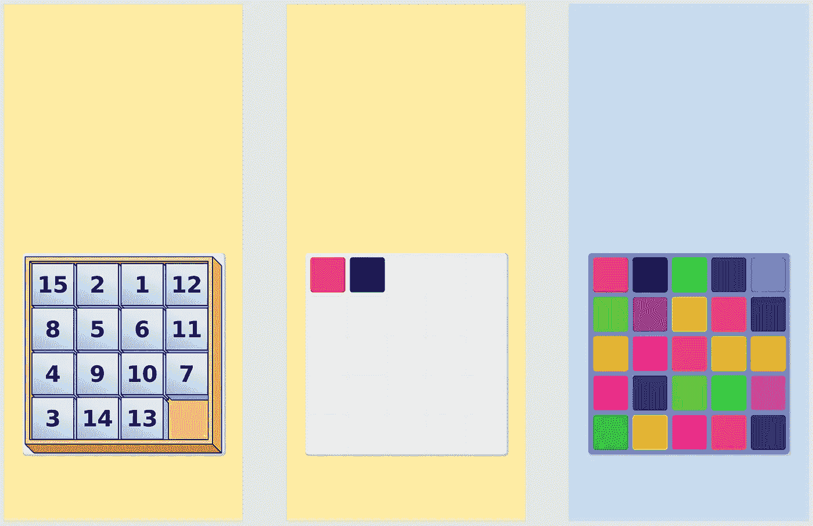
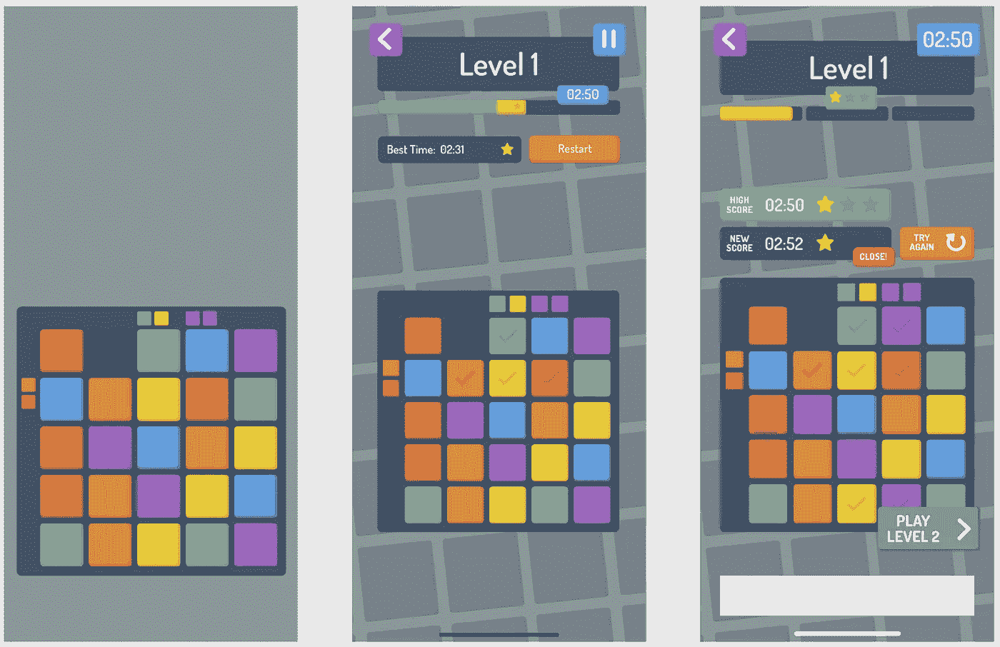
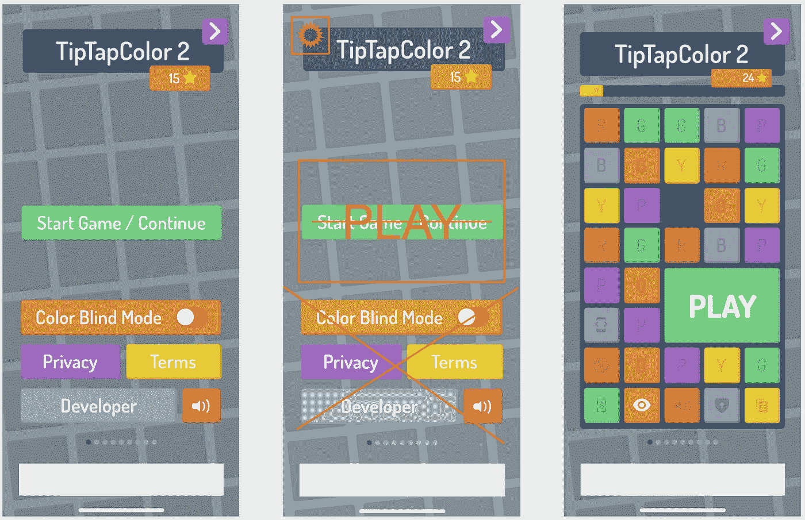
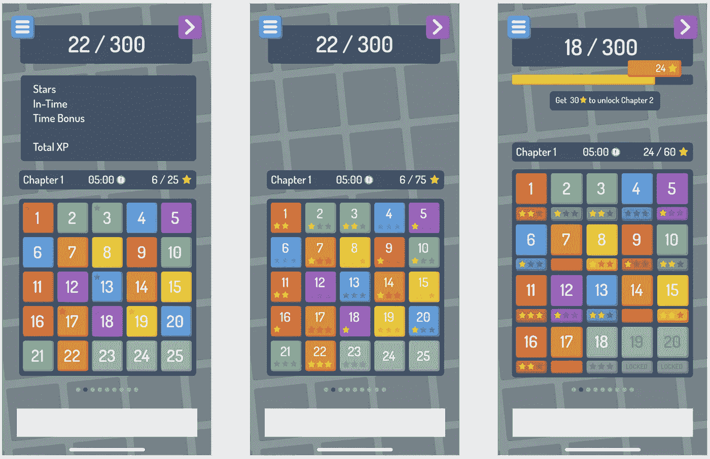
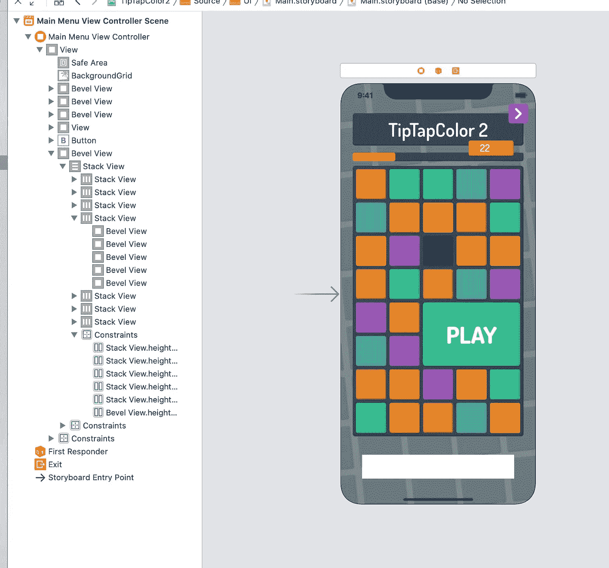
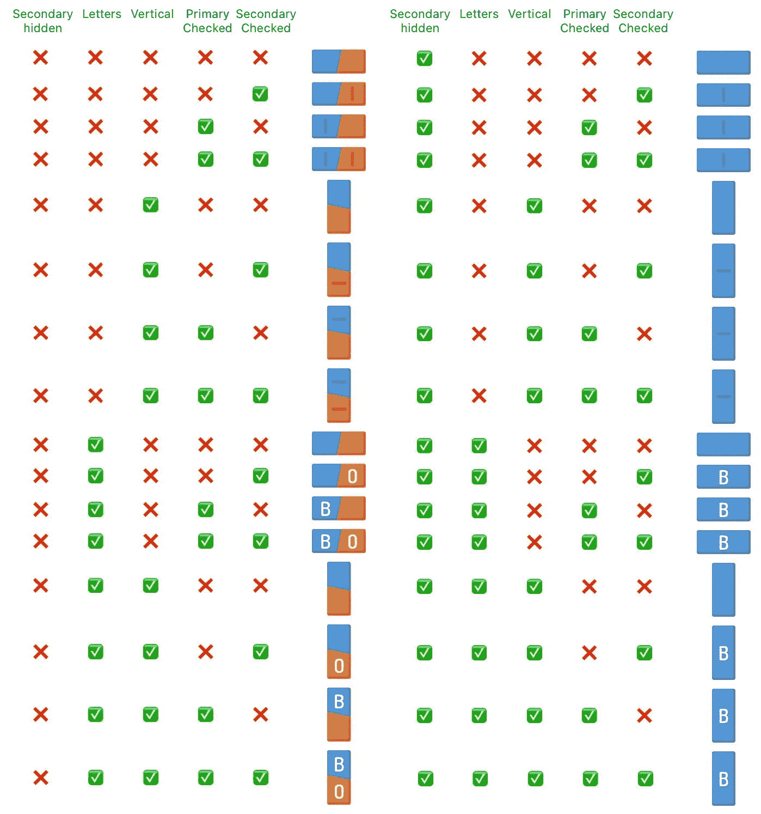
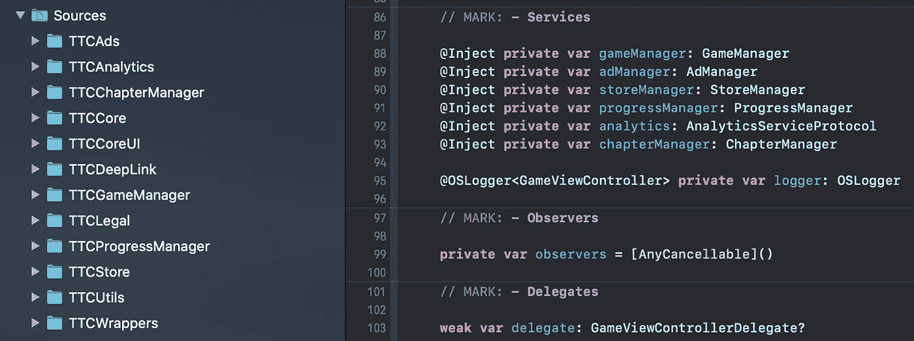

# 在 2 个月内制作一款 iOS 游戏

> 原文：<https://levelup.gitconnected.com/creation-of-tip-tap-color-2-6e7e1452538>

你好，在这篇文章中，我想给你一些关于我的商业伙伴 Julian (UX/UI 设计师)和我(iOS/macOS 软件开发者)如何在过去的两个月里创建我们的新益智游戏“TipTapColor 2”的见解，从一个想法开始，直到完成游戏。这不是我们的第一个 iOS 移动应用，但它是我们的第一个益智游戏。

去年早些时候，我参加了一个关于人工智能的入门课程(低级概念，如状态图等)。)和一个常用的例子是 8 字谜。

我们大多数人现在都知道这些滑动拼图，其中许多已经存在，仍然在 8 月中旬，我的合作伙伴 Julian 想测试他作为 UX/UI &概念设计师的经验，并在不到 2 周的时间内创建了一个完整的 24 个拼图的移动游戏，在一个丰富多彩的变体中！

我在项目中的角色非常简单:我在构思阶段提供反馈，因此完整的原型尽可能完整，游戏机制也考虑得足够周全，然后…我拿着 UI 原型，用咖啡机把自己锁在房间里，直到完成实际游戏的编程才出来(开玩笑，没锁门，还是得从冰箱里拿食物)。

在这幅图中，你可以看到一个想法(1)是如何变成一个简单的视图(2)并随着时间的推移而变化(3)。

几天后，他有了一个伟大的想法，为列和行设置颜色约束，必须满足这些约束才能真正赢得游戏(1)。核心游戏机制诞生了。

现在我们必须考虑如何挑战玩家，这样你才能继续玩下去(毕竟这是我们的目标)。首先，我们想到了一个随机模式，基本上从随机瓷砖和随机约束开始，但去了一个水平的概念，因为它会更直观的进展。

我们不想给玩家压力，所以完成一关的时间不会用完(2)。相反，如果你跑得快，你会得到更多的激励——你可以收集星星。(3)

我们的想法是直截了当的:想玩多少次就玩多少次，每次都变得更好，并为下一个级别获得足够的星星。

每个游戏都需要一个菜单，这很可能是新玩家看到的第一样东西。

这就是为什么我们的游戏必须是直观的，容易理解的，尽可能通用的(几乎不用语言，因为语言总是一个障碍)，而且很大一部分是针对色盲的可访问性(毕竟游戏是基于颜色的)。

第一个原型开始时是一个简单的定义选项和动作的屏幕(1)。我这边的一些最初反馈给我的印象是，对于一个新手来说这太难了(2)，经过多次迭代之后，我收到了一个干净的设计，有简单的选项，清晰的动作和一个集成的色盲模式(3)。一切都符合游戏的设计。干得好朱尔斯。

现在回到关卡设计，另一个问题出现了:给玩家一个挑战，他/她需要收集足够的星星来解锁即将到来的关卡。因此你需要重玩一关。但是，如果你总是需要在一个关卡中获得至少一颗星来解锁下一个，玩家可能会被卡住，这与我们的方法“具有挑战性但总是可玩的”相冲突。

因此，我们决定使用基于章节的方法。每一章由 20 个关卡组成，你可以轻松地一个接一个地玩，而不需要实际足够快才能得到一颗星。现在，如果你到达这一章的结尾，这是第一个挑战，它要求重放水平，直到你收集足够的星星通过。

这应该给足够的自由总是能够发挥更多的水平，但也给足够的理由足够快。

有那么一会儿，Julian 考虑使用一个基于经验的概念(1 ),但是很快就转换到了基于星星的概念(2)。几个设计迭代之后，一个全局进度条和一个统一的图块设计为用户提供了所有必要的信息。(3)

现在说说我的部分:实际编程。这很专业，但我会尽力让它易于理解:)

在软件项目中，早期决策具有最大的影响。在我的头脑风暴会议期间，我必须考虑可移植性、可伸缩性和时间管理。

我可以使用跨平台的 2D 游戏引擎，如 Unity、cocos2dx 甚至只是 SpriteKit，但我是原生 iOS/Swift 开发的专家，我们希望尽快创建一个工作游戏，因此决定只使用 iOS(目前)。

在这一点上，我也意识到游戏的任何部分都不是实时的:除了一个计时器，没有移动的物体。因此，我根本不需要一个实时的 2D 游戏引擎。

同样，在游戏引擎中设计 UI 也是一件痛苦的事情，尤其是用户交互和布局。所以我对自己说“为什么要重新发明一个按钮？所有的元素都非常简单，使用默认的元素并自定义它们”所以这就是为什么我选择了 basic UIKit。

对于可伸缩性(意味着随着时间的推移会有更多的功能)，我使用了在过去 7 年的 iOS 开发中自学的相同架构。稍后会详细介绍。

在图片中，你可以看到 Xcode 界面生成器的早期截图。在那种状态下，我几乎可以模拟那里的一切。

过了一会儿，数字元素增长了很多。幸运的是，我总是使用干净的结构，重用嵌套的组件。

例如，在此视图中，您可以看到许多平铺、按钮和指示器，它们看起来都非常相似。我通过创建一个自定义的图块 UI 元素来实现这一点，该元素允许配置参数，例如颜色或圆角半径，然后我修改了内置的按钮，以使用该图块作为背景。这种摇摆我仍然可以在界面构建器中继续构建。

当然，我必须创建一些自定义组件，例如这里的这个，我用来向玩家显示等级限制。

由于该组件可以配置五个以上的不同参数，因此可能会出现许多不同的状态。这个截图有点旧了，因为现在我正在进行一个自动化测试来验证这个行为。

正如我之前提到的，我使用了不同的技术来组织代码。其中之一是创建我可以重用的独立模块。这样，如果有必要，我可以添加或删除新功能。

一个用例是 iOS 14 应用程序剪辑支持。应用程序剪辑是完整应用程序的精简版，大小限制为 10 MB(我们的大约为 3.5MB)。

由于应用程序剪辑不需要应用程序商店，我甚至可以通过不包含它来轻松满足大小限制。

我不想太专业，但是对于你们这些书呆子(像我一样):在单独的模块中创建服务，使用协议松散绑定，使用依赖注入代替静态成员。此外，如果您使用 Swift 编程，请为每个类/协议/扩展名创建单独的文件，以便在必要时可以轻松地将代码移动到不同的包中。

这款游戏也可以在 iOS 应用商店上下载，我希望听到你的反馈:[https://apps.apple.com/app/apple-store/id1530593824?pt = 119253046&CT = Imgur&mt = 8](https://apps.apple.com/app/apple-store/id1530593824?pt=119253046&ct=Imgur&mt=8)

非常感谢您的阅读！如果你想了解更多，请在 [Twitter 上关注我:@](https://twitter.com/philprimes) philprimes，并给我发一个“Tip Tap Color 2 有这么多颜色！”