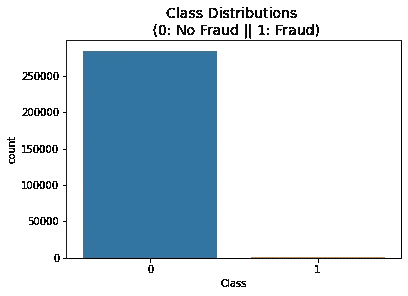
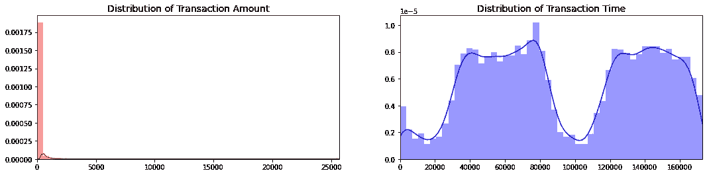
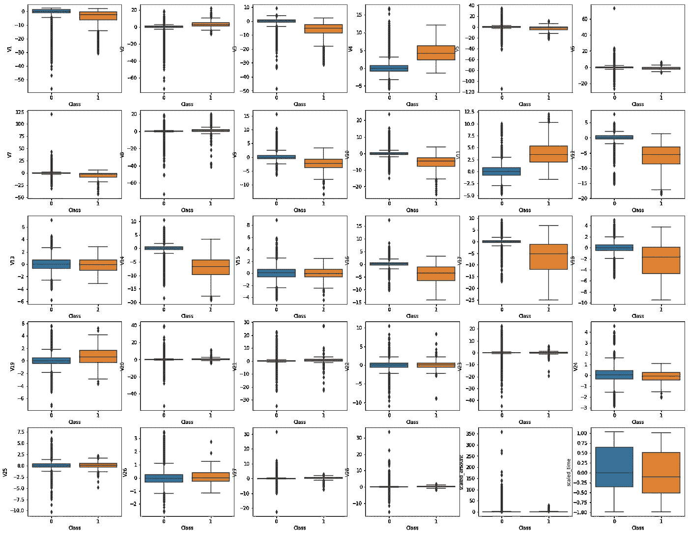
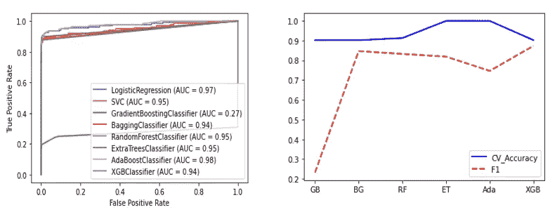
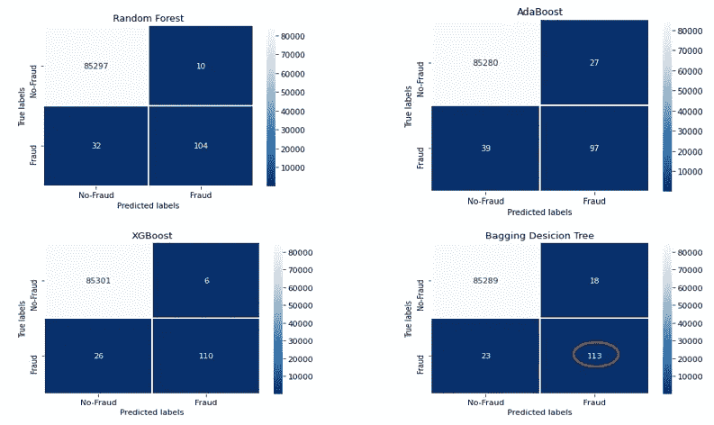

# 信用卡欺诈检测

> 原文：<https://levelup.gitconnected.com/credit-card-fraud-detection-2c81b286ff89>

## 机器学习算法的比较

欺诈检测是风险管理流程中防止欺诈再次发生的最重要步骤。大量的欺诈可能会损害收入和声誉。幸运的是，在欺诈发生之前就处理它是可能的。因此，我想研究机器学习算法在信用卡欺诈数据集上的性能。

该数据集包含欧洲持卡人在 2013 年 9 月的信用卡交易。该数据集显示了两天内发生的交易，其中 284，807 笔交易中存在 492 笔欺诈。数据集高度不平衡，欺诈占所有交易的 0.172%。

交易的欺诈分布

它只包含作为 PCA 变换结果的数字输入变量。由于保密问题，数据没有显示原始特征和关于数据的更多背景信息。数据集由 28 个部分组成。此外，交易时间和金额都是可用的。您可以看到交易金额和时间的分布。

我们可以使用下面的箱线图来检测特征的异常值。

特征的分布

有太多的异常值会导致高估。有许多方法可以消除数据集中的异常值。在这项研究中，为了剔除异常值，建议采用稳健的数据扩展方法。

**哪种分类方法最适合欺诈检测？**

最重要的部分是指定最方便的机器学习算法，因为存在不平衡的组(欺诈/非欺诈)。

*二元逻辑回归、支持向量机、梯度推进、Bagging 决策树、随机森林、额外树、AdaBoost、随机梯度推进、投票集成或 XGBoost？*

ROC 和分类结果

根据 AUC 结果，梯度增强具有最差的性能，因为其由于召回率而具有相当低的 AUC。这种方法可能会受到不平衡情况的影响。

除 CV 准确性结果外，AdaBoost 的 AUC 率最高。然而，它的 F1 成绩是最低的之一。这一结果表明，我们不能直接相信准确性的结果，因为我们的群体变量是不平衡的。因此，非常需要查看混淆矩阵来选择最佳算法。

有比 AdaBoost 算法更精确的预测，如随机森林、XGBoost 和 Bagging 决策树。XGBoost 和 Bagging 决策树具有较高的 CV 准确性、AUC 率和 F1 值。此外，他们往往更准确地预测欺诈案件。

如果研究的目的是预测真正的欺诈案例，混淆矩阵阐明了我们应该考虑的方向。简而言之，Bagging 决策树和 XGBoost 方法在欺诈检测方面具有优越的性能。这两种算法是欺诈预测的首选，无需任何过采样方法。