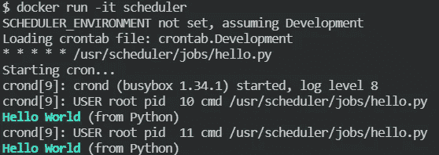

# Cron + Docker =你将创建的最简单的作业调度程序

> 原文：<https://levelup.gitconnected.com/cron-docker-the-easiest-job-scheduler-youll-ever-create-e1753eb5ea44>

## 最大功率和灵活性的两个组件。


照片由来自 [Pexels](https://www.pexels.com/photo/round-silver-colored-chronograph-watch-552598/?utm_content=attributionCopyText&utm_medium=referral&utm_source=pexels) 的 [Mat Brown](https://www.pexels.com/@mat-brown-150387?utm_content=attributionCopyText&utm_medium=referral&utm_source=pexels) 拍摄

在最近的一个项目中，我在寻找一种安排工作的方法。听起来很简单，对吧？不足为奇的是，即使没有数千个选择，也有数百个。

我有以下要求:

*   能够运行 Bash 和 Python 脚本。理想情况下，*其他一切*。
*   支持所有主要的日程安排模式:每天一次，每小时一次，每周五一次，情人节当天(但不是闰年或者我的感情状态是单身的时候)。你知道，标准的东西。
*   便携。
*   非常容易使用。

我们不需要仪表板或监控；这些都是工作中固有的。

我在做 Python 和。Net 核心在 Windows 10 机器上开发，并部署到运行 Linux Docker 容器的 HashiStack 环境中。因此便于携带。

在我看来，我想出的是我创建过的最简单的作业调度程序，而且我会一次又一次地回来使用它。

正如本文的标题一样，我们的解决方案有两个组件:Cron 和 Docker。

我首先简单介绍一下`cron`，它是调度器解决方案的核心。如果您已经知道`cron`，请随意跳到下一部分。

## **克朗**

如果你使用过任何版本的 Linux，你应该听说过`cron`命令。是一个简单明了的作业调度程序。它接受在一个`crontab`(是 *cron table* 的缩写)文件中定义的作业，该文件是一个“指定 shell 命令定期或按照给定的时间表运行的配置文件”(来源:[维基百科](https://en.wikipedia.org/wiki/Cron))。

关于`cron`和`crontab`的完整解释将会是一篇独立的文章(可能很快会有？)，所以我将满足于一个真正快速的入门和一个到各种备忘单的链接，这样你就不必记住我将要解释的任何东西。

一个极其简单的`crontab`文件可能如下所示:

上面会把“hello world”写到命令行，每天每一分钟。

唷！现在，您不再需要手动操作了。

行首的 5 颗星号(*)代表作业计划的不同时间部分。维基百科来拯救。

因此，第一个星号表示作业将运行的分钟(小时)。第二颗星表示小时。我想你明白了(这就是为什么他们说一张图胜过一千个字)。

几个简单的例子？当然可以！

上面的例子实际上只是关于使用`cron`的可能性的冰山一角。

对于懒人来说，或者对于`cron`来说，仅仅是务实的人来说， [crontab guru](https://crontab.guru/) 网站提供了一个很好的方式来轻松建立那些讨厌的日程模式。请务必查看页面底部的[示例部分](https://crontab.guru/examples.html)。

`cron`解决了我们的大部分需求。它支持运行任何类型的脚本，只要操作系统支持。它几乎支持你能想到的所有可能的调度模式(也许除了最后一种，但我不会感到惊讶)。它使用起来也非常简单，尤其是在 crontab guru 网站的帮助下。

剩下便携部分。为了充实这一点，当我说 *portable* 时，我的意思是它可以运行在我想要它运行的任何地方，而不必处理依赖关系，并且始终以完全相同的方式运行。我不想用一个命令在本地机器上运行它，而用另一个命令在生产环境中运行它。

这就是 Docker 的用武之地。

## **码头工人**

如果你还没听说过 Docker，那你可能在过去 5 年左右的时间里都在沉睡(Docker 第一版是 2013 年发布的，所以我给你一点懈怠)。我不想写一篇关于 Docker 的简短介绍，所以如果你需要的话，这里有一些资源:

*   docker Simplified:freeCodeCamp[上绝对初学者的实用指南。](https://www.freecodecamp.org/news/docker-simplified-96639a35ff36/)
*   docker-curriculum.com 的初学者 Docker 教程。
*   Docker.com 码头工人概述。

我们要做的是构建一个支持运行`cron`的 Docker 映像。我喜欢从零开始，把我需要的东西放在一起，所以我把我的容器基于 Alpine Linux。

这是一个相当简单的设置。我们安装所需的`bash`和`dos2unix`包。这个`bash`包是需要的(鼓点..)运行 Bash 脚本。您可能不需要`dos2unix`包，但是我经常遇到我的行尾和执行位出错的情况，所以我添加了一个对`dos2unix`的调用，以便一次性修复行尾和执行位。

然后，我们将需要的文件复制到容器映像中，并通过调用`start.sh`结束`Dockerfile`。

`start.sh`负责根据`SCHEDULER_ENVIRONMENT`环境变量加载正确的`crontab`文件。我们的每个环境都有一个`crontab`文件。

最后，我们添加一个简单的`crontab.Development`文件。

要构建 Docker 映像，运行`docker build -t scheduler .`

要运行 Docker 映像(在交互模式下，这样我们可以看到正在发生的事情)，运行`docker run -it scheduler`


运行调度程序

那行得通。酷毙了。但是它还不是特别有用。让我们对此进行扩展，这样我们就可以将任何脚本作为计划作业来运行。

## **添加工作岗位**

为了做到这一点，也为了让我们的解决方案井然有序，我们首先创建一个名为`jobs`的文件夹。这个文件夹将包含我们的脚本。当然，这些脚本需要复制到我们的 Docker 映像中。将下面一行添加到我们的`Dockerfile`，就在我们复制其他文件的地方:

并将`jobs`文件夹添加到我们的`dos2unix`呼叫中:

让我们创建一个非常简单的脚本作为计划作业运行:

并将`crontab.Development`文件改为每分钟调用这个脚本:

让我们构建映像并运行它:


运行脚本

## **添加 Python**

由于 Alpine 非常简单，所以添加对其他脚本语言(如 Python)的支持需要几个步骤。

首先，我们需要修改我们的`Dockerfile`来安装 Python。我们还将`.py`文件添加到我们的小脚本中，以修复行尾和执行位。

为了便于参考，这里是完整的`Dockerfile`:

我们的示例 Python 脚本将遵循相同的模式，但是更加令人愉快:

这是我们运行它时的样子:



运行 Python 脚本

作为一个题外话，`colorama`包是真棒。

## **在关闭时**

你有它！将`cron`的强大功能与 Docker 的可移植性结合起来，使我们能够创建一个超级轻量级、可移植且非常容易使用的调度程序。它可以在你想去的任何地方运行，也可以运行你扔给它的任何脚本。正如他们所说，可能性是无限的..

像往常一样，你可以在 GitHub 上找到本文[的完整源代码。](https://github.com/erikbrgr/scheduler)

感谢阅读，希望这篇文章对你有用。

编码快乐！

## **改进空间**

当编写任何类型的软件时，总有改进的空间。例如，您可以:

*   使用 Docker 卷，这样可以更容易地更新计划和/或作业。
*   创建执行日志文件，以便查看作业的输出。一种方法是将以下内容添加到`crontab`文件中的每个作业行:

```
* * * * * echo 'hello world' 2>&1 | tee -a /var/log/cron.log
#                            ^^^^^^^^^^^^^^^^^^^^^^^^^^^^^^^
```

这将把`stderr` (2)和`stdout` (1)的输出写入文件`/var/log/cron.log`。

本文中的所有代码片段都是使用 [gistbuilder](/create-beautiful-embedded-code-without-the-hassle-of-creating-github-gists-fe6ce2fa0109) 创建的，这是我专门为此编写的一个漂亮的小程序。

如果你喜欢这篇文章，查看我的[编程和技术](https://medium.com/@erikbrgr/list/programming-and-tech-e5fbfbb64b1b)列表，获取更多的技术文章。

或者，为了支持我和其他成千上万的作家，你可以通过[这个链接](https://erikbrgr.medium.com/membership)报名 Medium。如果你这样做，我会得到一小笔佣金，而你可以访问 Medium 上的每一篇文章。谢谢！